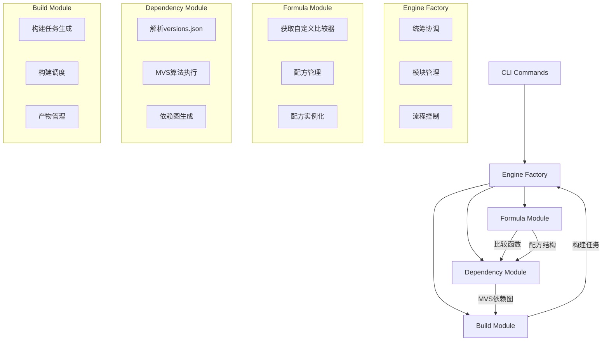

# LLAR 项目开发记录

## 项目背景

LLAR (LL Archive) 是一个多语言资产包管理系统，支持通过XGO Classfile编写配方，实现包的构建、依赖管理和分发。

## MVP代码分析结果

### 当前架构问题
- **模块边界模糊**: `ixgo`、`build`、`deps` 三个模块存在紧密耦合
- **职责重叠**: `build.go`调用`deps.BuildList`，而deps又需要ixgo的comparator
- **循环依赖风险**: ixgo依赖deps包路径，build依赖ixgo和deps

### MVP目录结构
```
llar-mvp/
├── cmd/                    # CLI命令行接口
├── internal/
│   ├── ixgo/              # XGO解释器和配方加载
│   ├── mvs/               # Go MVS算法实现
│   ├── deps/              # 依赖管理
│   └── build/             # 构建执行
├── pkgs/                  # FormulaApp工具类
└── formula.go             # FormulaApp基类
```

## 重构设计方案（工厂模式架构）

### 四模块工厂架构



### 重构后目录结构

```
llar/
├── cmd/                    # CLI命令行接口
├── internal/
│   ├── engine/             # 工厂模块 - 统筹协调
│   │   ├── factory.go      # 核心工厂实现
│   │   ├── coordinator.go  # 模块协调器
│   │   └── context.go      # 执行上下文管理
│   ├── formula/            # 配方模块
│   │   ├── manager.go      # 配方管理器
│   │   ├── comparator.go   # 自定义比较器管理
│   │   └── instance.go     # 配方实例化
│   ├── dependency/         # 依赖管理模块
│   │   ├── resolver.go     # MVS依赖解析
│   │   ├── parser.go       # versions.json解析
│   │   └── graph.go        # 依赖图构建
│   ├── build/              # 构建模块
│   │   ├── planner.go      # 构建任务规划
│   │   ├── executor.go     # 构建执行器
│   │   └── artifact.go     # 产物管理
│   └── ixgo/               # ixgo适配层
└── formula.go             # FormulaApp基类
```

### 模块职责划分

**Engine Factory（工厂模块）**
- 作为总控制器，负责统筹协调各模块
- 管理模块间的依赖关系和数据传递
- 控制整体构建流程和生命周期管理
- 提供统一的外部接口

**Formula Module（配方模块）**
- **功能1**: 获取自定义比较方式
  - 输入: PackageName
  - 输出: 版本比较函数
- **功能2**: 配方管理
  - 输入: PackageName + PackageVersion
  - 输出: 配方结构（含配方实例和方法）

**Dependency Module（依赖管理模块）**
- 输入: versions.json文件 + 比较函数
- 输出: MVS依赖图（Buildlist, Require）
- 实现Go MVS算法进行依赖解析

**Build Module（构建模块）**
- 输入: MVS依赖图
- 输出: 构建任务
- 负责构建任务的生成、调度和执行

### 模块依赖关系

```
Build Module --> Dependency Module --> Formula Module
        ↑                                    ↑
        └───────────── Engine Factory ────────┘
```

## 核心接口设计

### Engine Factory
```go
type Factory interface {
    Initialize() error
    Build(packageName string, version string) (BuildResult, error)
    Shutdown() error

    Formula() Formula
    Dependency() Dependency
    Builder() Builder
}
```

### Formula Module
```go
type Formula interface {
    // 获取自定义比较方式
    Comparator(packageName string) (VersionComparator, error)

    // 配方管理
    Load(packageName string, version string) (FormulaStruct, error)
}

type FormulaStruct struct {
    Instance    FormulaInstance
    Methods     FormulaMethods
    Metadata    FormulaMetadata
}

type VersionComparator func(v1, v2 string) int
```

### Dependency Module
```go
type Dependency interface {
    // 输入: versions.json + 比较函数，输出: MVS依赖图
    Resolve(versionsFile string, comparators map[string]VersionComparator) (Graph, error)

    // MVS核心方法
    BuildList(target PackageVersion) ([]PackageVersion, error)
    Require(pkg PackageVersion) ([]PackageVersion, error)
}

type Graph struct {
    BuildList   []PackageVersion
    RequireMap  map[string][]PackageVersion
    Dependencies DependencyGraph
}
```

### Build Module
```go
type Builder interface {
    // 输入: MVS依赖图，输出: 构建任务
    Plan(graph Graph) ([]Task, error)
    Execute(tasks []Task) (BuildResult, error)
}

type Task struct {
    Package     PackageVersion
    Formula     FormulaStruct
    Dependencies []PackageVersion
    BuildFunc   func() (BuildArtifact, error)
}
```

## 数据流向

1. CLI → Factory: 触发Build()
2. Factory → Formula: 获取比较器和配方结构
3. Factory → Dependency: 传入versions.json和比较器，获取MVS依赖图
4. Factory → Builder: 传入依赖图，生成构建任务
5. Factory → Builder: 执行构建任务，返回结果

## 文档状态

- ✅ 产品设计文档: `/docs/product-design-complete.md`
- ✅ 技术设计文档: `/docs/technical-design-complete.md`
- ✅ ixgo模块文档: `/docs/ixgo-design.md`
- ✅ MVP代码分析和重构建议

## 下一步工作

1. 基于interface设计实现Core Engine模块
2. 重构现有MVP代码到新架构
3. 实现各层interface的具体实现
4. 添加单元测试验证模块解耦效果