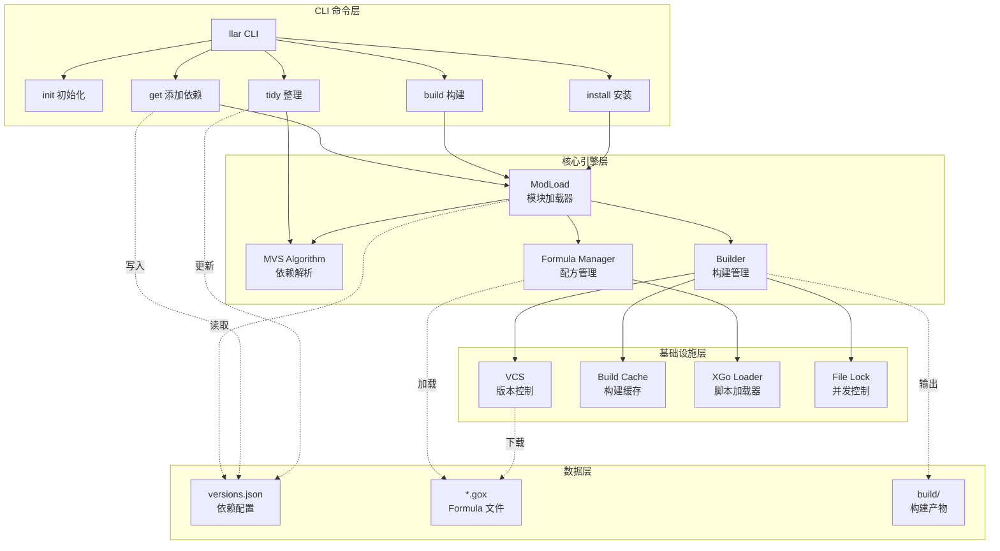
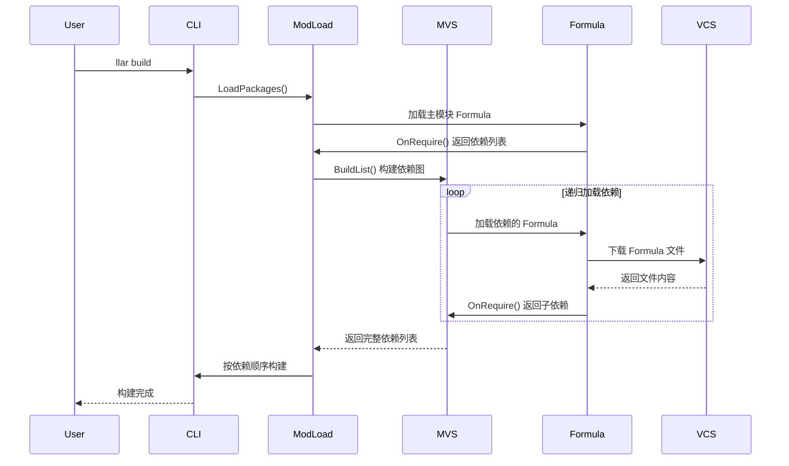
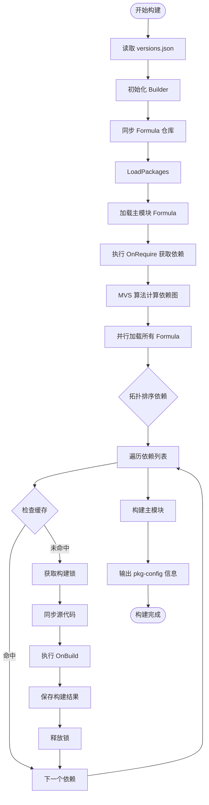
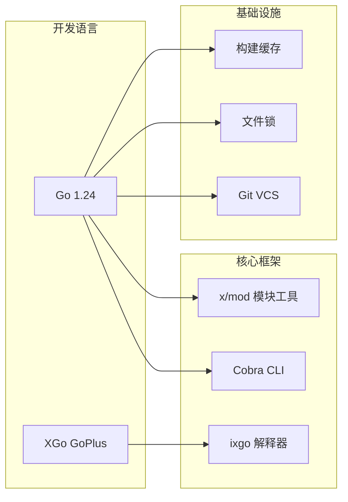
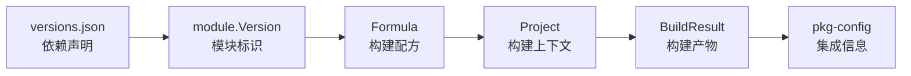

# LLAR 项目展示文档

<p align="center">
  
</p>

<p align="center"><strong>Cloud-based Package Manager for Native Libraries</strong></p>

---

## 📋 项目概述

**LLAR** 是一个专为 C/C++ 等原生语言设计的云端包管理服务，旨在解决原生库依赖管理复杂、构建配置困难的痛点。

### 核心价值

- **简化依赖管理**：类似 Go modules 的依赖声明方式，一个命令即可添加和构建依赖
- **自动化构建**：通过 Formula（构建配方）自动下载源码并完成构建
- **版本一致性**：采用 MVS 算法确保依赖版本的可重现性
- **跨平台支持**：统一的构建抽象，支持 Linux、macOS、Windows

---

## 🎯 核心特性

### 1. Minimal Version Selection (MVS)
借鉴 Go modules 的依赖解析算法，确保：
- 可预测的依赖版本选择
- 避免依赖地狱
- 构建结果可重现

### 2. Formula 构建系统
使用 XGo 语言编写的构建配方：
- 声明式依赖定义
- 灵活的构建逻辑
- 支持多版本适配

### 3. 智能缓存机制
- 构建结果缓存
- Formula 缓存
- 多进程安全锁

### 4. 版本控制集成
- 自动从 GitHub 拉取源码
- 基于 Git Tag 的版本管理
- 支持版本约束

---

## 🏗️ 系统架构

### 整体架构图



### 依赖解析流程



### 构建流程



---

## 💻 技术架构

### 核心模块

| 模块 | 职责 | 关键技术 |
|------|------|----------|
| **modload** | 模块加载与依赖解析 | MVS 算法、并行加载 |
| **mvs** | 最小版本选择算法 | 图算法、版本比较 |
| **build** | 构建系统 | 缓存机制、文件锁 |
| **formula** | 构建配方管理 | XGo 脚本、AST 解析 |
| **vcs** | 版本控制 | Git 集成 |
| **loader** | 脚本加载器 | XGo 解释器 (ixgo) |

### 技术栈



---

## 📊 关键数据流



---

## 🚀 使用示例

### 初始化项目
```bash
llar init
```

### 添加依赖
```bash
llar get github.com/example/libfoo@v1.2.3
```

### 构建项目
```bash
llar build
```

### 安装单个包
```bash
llar install github.com/example/libbar@latest
```

### 整理依赖
```bash
llar tidy
```

---

## 📈 项目状态

### 当前进度
- ✅ 核心 MVS 算法实现
- ✅ Formula 系统设计
- ✅ 基础 CLI 命令
- ✅ 构建缓存机制
- 🚧 构建器功能增强（当前分支：feat/builder）

### 已实现功能
- Minimal Version Selection 依赖解析
- XGo 语言编写的 Formula 系统
- 多进程安全的构建机制
- Git 版本控制集成
- 智能构建缓存
- pkg-config 信息生成

---

## 🎁 核心优势

### 1. 开发效率提升
- 一行命令添加依赖，无需手动配置
- 自动化构建流程，减少人工干预
- 智能缓存机制，加速重复构建

### 2. 版本管理可靠
- MVS 算法确保依赖版本一致性
- 避免版本冲突和依赖地狱
- 构建结果可重现

### 3. 扩展性强
- Formula 系统支持灵活的构建逻辑
- 插件化的 VCS 接口
- 自定义版本比较器

### 4. 跨平台兼容
- 统一的构建抽象
- 支持 Linux、macOS、Windows
- 构建矩阵支持多平台配置

---

## 📚 相关文档

- [Formula 开发指南](doc/formula.md)
- [项目 README](README.md)

---

<p align="center">
  <em>让原生库依赖管理像 Go modules 一样简单</em>
</p>
