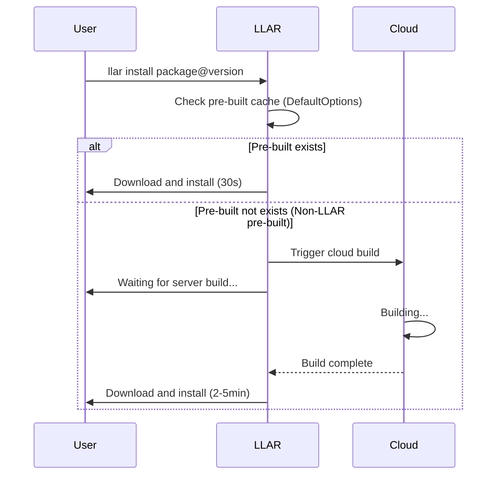
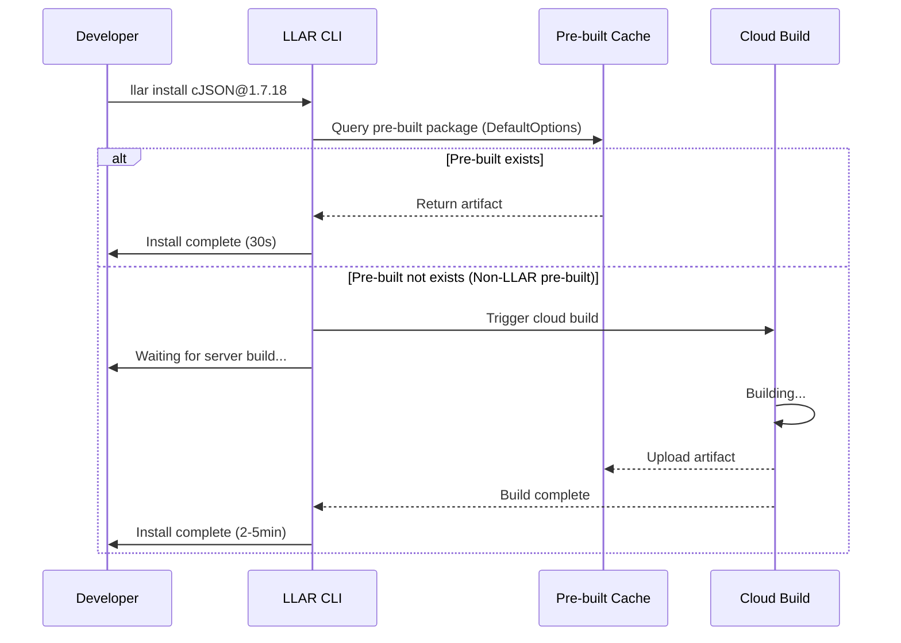
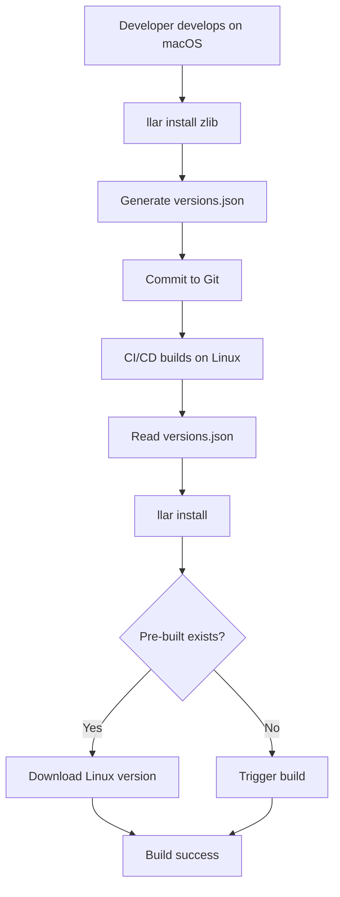
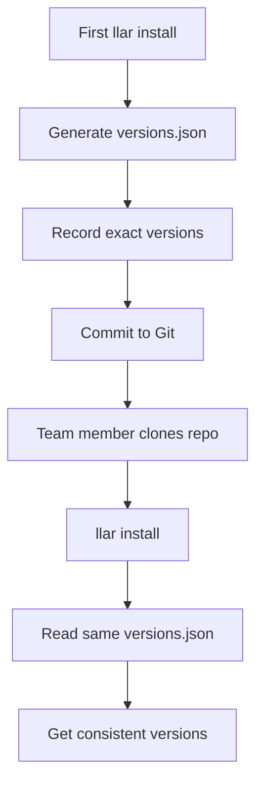
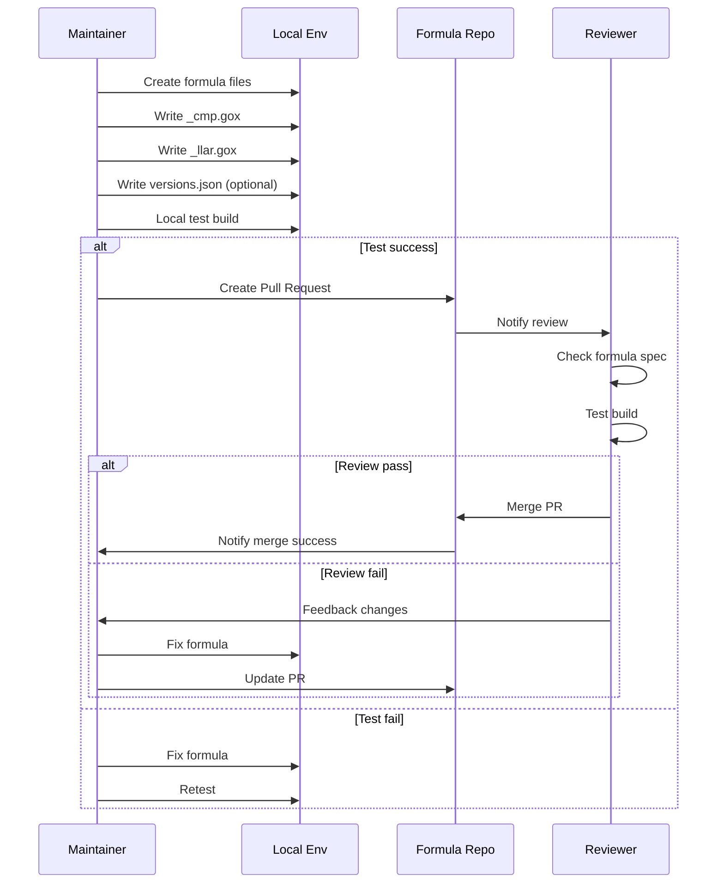
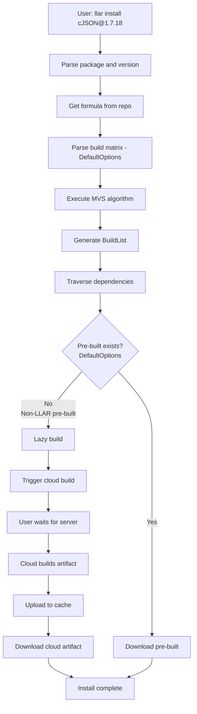
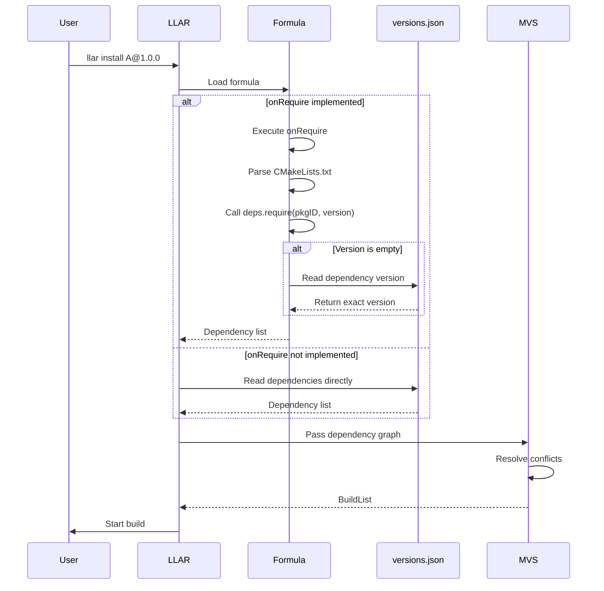
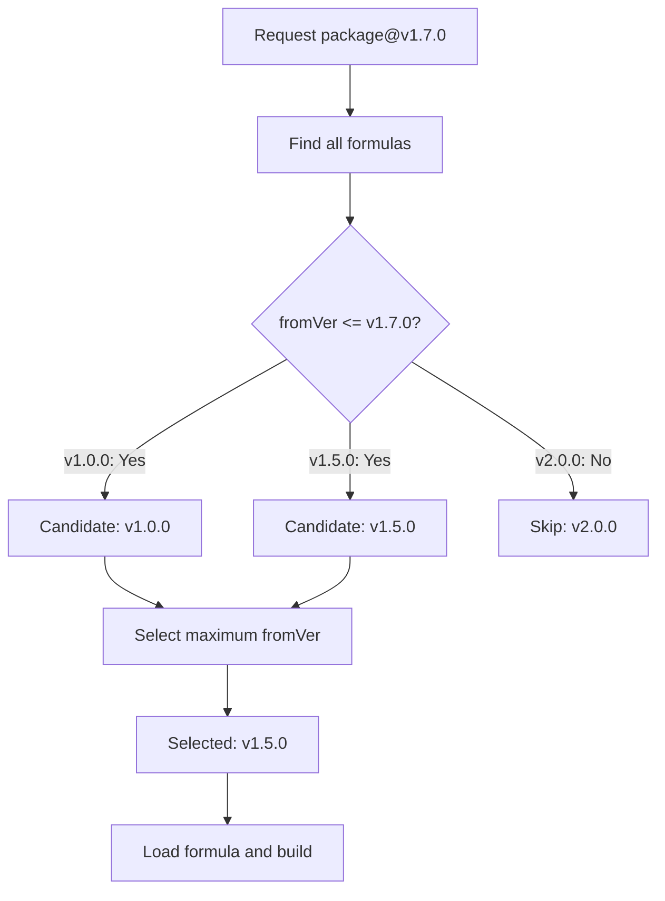

# LLAR Product Design

## 1. Product Background

### 1.1 Core Problem

In modular compilation languages (C/C++, Python, WASM), developers face:

**Problem Scenario**:
- Different libraries have numerous optional compilation configurations and combinations
- Changing a configuration or platform requires rebuilding all libraries from scratch
- Repeated builds are meaningless and waste time

**Existing Solutions' Shortcomings**:

Package managers like Homebrew, Conan, and APT provide "pre-built" packages, but:
- To save space, they don't build all possible configurations
- "Universal" pre-built artifacts often don't meet user needs
- Users still need to build locally in most cases, wasting time
- Developers repeatedly build the same artifacts, extremely wasteful

**LLAR's Approach**:
- Builds DefaultOptions matrix by default (common configurations)
- Non-default options trigger server lazy build (on demand)
- Users wait for server build, artifacts are cached and shared globally
- No local build for missing packages, reducing user burden

### 1.2 Design Goals

**LLAR's Positioning**:

LLAR is dedicated to creating a package manager that:
- Has complete pre-built artifact management (provides online build management for pre-built packages)
- Provides convenient build configuration
- Balances artifact management and build configuration

**Core Advantages vs Existing Package Managers**:

1. **Automatic Dependency Conflict Resolution** - Borrowing Go's dependency management philosophy
   - Industry Pain Point: Conan/pip report errors on version conflicts, requiring manual override
   - LLAR Solution: Uses Go's MVS algorithm to automatically calculate version combinations
   - User Value: No "dependency hell", just run `llar install`

2. **Lazy Build Mechanism** - Server builds on demand
   - Industry Pain Point: Conan/Nix can only build locally when missing packages
   - LLAR Solution: LLAR builds DefaultOptions by default; non-LLAR pre-built triggers server build, user waits
   - User Value: First time may wait, but artifacts are shared globally, no repeated waste

3. **Smart Formulas** - Automatic dependency parsing
   - Industry Pain Point: Conan/Homebrew formulas require manual dependency maintenance
   - LLAR Solution: `onRequire` automatically extracts dependencies from CMakeLists.txt
   - Maintainer Value: Low maintenance cost, low contribution barrier, fast ecosystem growth

## 2. Basic Concepts

### 2.1 Package

A package is an independent library unit in LLAR.

**Package Components**:
- **Build Formula**: How to build this package (written in XGo Classfile)
- **Build Matrix**: Different build configurations (os, arch, lang, etc.)
- **Version Management**: Version list automatically from VCS (GitHub/GitLab)

### 2.2 Formula

Formula defines how to build a package using XGo Classfile syntax.

**Formula Files**:
```
{{owner}}/{{repo}}/
├── {{repo}}_cmp.gox      # version comparison function
├── versions.json         # dependency lookup table (optional)
└── {{repo}}_llar.gox     # formula main file
```

**Formula Structure**:
```go
id "owner/repo"              // module id
fromVer "v1.0.0"             // starting version for this formula

onRequire (proj, deps) => {  // parse dependencies (optional)
    cmake := proj.readFile("CMakeLists.txt")
    matches := findDeps(cmake)

    for m in matches {
        deps.require(pkgID(m.Name), m.Version)
    }
}

onBuild (proj, out) => {     // execute build
    cmake "-DBUILD_SHARED_LIBS=OFF", "-DCMAKE_INSTALL_PREFIX=" + out.dir, "."
    cmake "--build", "."
    cmake "--install", "."

    out.setLinkFlags("-I" + out.dir + "/include", "-L" + out.dir + "/lib", "-lmylib")
}
```

**Callbacks**:
- `onRequire`: Extract dependencies from source code (optional)
- `onBuild`: Execute build and set link flags

### 2.3 Build Matrix

Build matrix represents all possible build configurations for a package.

**Matrix Structure**:
```go
{
    "require": {
        "os": ["linux", "darwin"],
        "arch": ["x86_64", "arm64"],
        "lang": ["c"]
    },
    "options": {
        "tests": ["ON", "OFF"]
    }
}
```

**Key Features**:
- `require`: Propagates to dependencies
- `options`: Local to current package only
- Combination format: `x86_64-c-linux|testsON`
- Cartesian product generates all combinations

**DefaultOptions**:
- LLAR only builds DefaultOptions matrix by default (not all options combinations)
- DefaultOptions typically includes: `require` parameters only, with default `options` values
- Non-default options trigger lazy build (server builds on demand)

### 2.4 Lazy Build

When pre-built package doesn't exist, LLAR uses lazy build mechanism.

**Default Build Strategy**:
- LLAR only builds DefaultOptions matrix by default, not all options combinations
- Only non-LLAR pre-built packages use lazy build

**Lazy Build Workflow**:


**Key Points**:
- User waits for server to complete build (no local build)
- Server build result is cached for future use
- Build artifacts are shared globally

### 2.5 Version Management

**Version Retrieval**: Automatically from VCS (GitHub/GitLab), no manual maintenance.

**Version Comparison**: Defined in `{{repo}}_cmp.gox`:
```go
compareVer (v1, v2) => {
    // return: -1 (v1 < v2), 0 (v1 == v2), 1 (v1 > v2)
    return semverCompare(v1, v2)
}
```

**Version Selection**: Uses MVS (Minimal Version Selection) algorithm.

### 2.6 versions.json

Optional dependency lookup table (similar to go.mod), used when `onRequire` cannot parse dependencies.

**Format**:
```json
{
    "versions": {
        "v1.0.0": [],
        "v1.10.0": [
            {"name": "madler/zlib", "version": "1.2.13"},
            {"name": "skvadrik/re2c", "version": "2.0.3"}
        ]
    }
}
```

- Keys: Exact package versions
- Values: Dependency arrays (preserves order)
- Fallback when `onRequire` fails or dependency has no version

## 3. User Stories

### 3.1 Developer: Quick Install Dependencies

**As** a developer
**I want** to quickly install project dependencies
**So that** I can save build time and focus on business development

**Workflow**:


**Acceptance Criteria**:
- Pre-built exists (DefaultOptions): Complete in 30s
- Pre-built not exists: Trigger server build, user waits
- Server build completes: Upload to cache and download
- Build artifacts are shared globally for future use

### 3.2 Developer: Cross-Platform Build

**As** a developer
**I want** to use same dependency configuration across platforms (Linux/macOS/Windows)
**So that** I can simplify cross-platform development

**Workflow**:


**Acceptance Criteria**:
- versions.json is cross-platform (no platform-specific info)
- LLAR automatically selects corresponding pre-built for current platform
- Same configuration produces consistent dependency tree across platforms

### 3.3 Developer: Manage Dependency Versions

**As** a developer
**I want** to lock dependency versions
**So that** team members have consistent builds

**Workflow**:


**Acceptance Criteria**:
- First build generates versions.json
- versions.json records exact dependency versions
- Team members get consistent builds using same versions.json

### 3.4 Maintainer: Submit New Formula

**As** a formula maintainer
**I want** to submit formula for new library
**So that** community users can use this library

**Workflow**:


**Acceptance Criteria**:
- Formula directory structure follows spec
- _cmp.gox implements compareVer
- _llar.gox implements necessary callbacks
- Local test build succeeds
- Pass PR review

### 3.5 Maintainer: Use onRequire to Reduce Maintenance

**As** a formula maintainer
**I want** to implement onRequire to auto-parse dependencies
**So that** I can auto-track upstream changes without manually maintaining versions.json

**Scenario Comparison**:

**Manual maintenance (versions.json)**:
```json
{
    "versions": {
        "v1.11.0": [
            {"name": "skvadrik/re2c", "version": "2.0.3"}
        ]
    }
}
```
- Problem: Need manual update when upstream changes version
- Maintenance cost: High

**Auto-parse (onRequire)**:
```go
onRequire (proj, deps) => {
    cmake := proj.readFile("CMakeLists.txt")
    // find_package(re2c 2.0 REQUIRED) -> auto parse
    matches := findDeps(cmake)

    for m in matches {
        deps.require(pkgID(m.Name), m.Version)
    }
}
```
- Advantage: Auto-tracks upstream CMakeLists.txt changes
- Maintenance cost: Low

**Acceptance Criteria**:
- onRequire can read build system files
- Auto-parse dependency names and versions
- Fallback to versions.json when parse fails

## 4. Core Workflow

### 4.1 Package Install Flow



### 4.2 Dependency Resolution Flow



### 4.3 Formula Selection Flow



## 5. Technical Design

### 5.1 Formula Execution Flow

**Dependency Resolution Phase** (top-down, breadth-first):
```
App (onRequire) → Parse dependencies
  ↓
HTTP Library (onRequire) → Parse dependencies
  ↓
OpenSSL (onRequire) → Parse dependencies
```

**Build Phase** (BuildList order, topological sort):
```
OpenSSL (onBuild) → Build
  ↓
HTTP Library (onBuild) → Build (can access OpenSSL artifact)
  ↓
App (onBuild) → Build (can access HTTP + OpenSSL artifacts)
```

### 5.2 Static Linking (Recommended)

**Design Rationale**: LLAR recommends static libraries (`.a` files) for:
- Complete isolation from system environment
- Build reproducibility
- No version conflicts
- Portability

**Build Requirements**:
```go
onBuild (proj, out) => {
    // Disable shared libraries
    cmake "-DBUILD_SHARED_LIBS=OFF", "."

    // Set link flags
    out.setLinkFlags("-L" + out.dir + "/lib", "-lmylib")
}
```

**Note**: Dynamic library support design is under development.

## 6. Design Advantages

### 6.1 vs Conan

| Feature | LLAR | Conan |
|---------|------|-------|
| Dependency Conflicts | Auto (MVS) | Manual override |
| Missing Package | Server build (user waits) | Local only |
| Formula Maintenance | Auto (onRequire) | Manual |
| Version Management | Simple (versions.json) | Complex (conanfile.py + conan.lock) |
| Default Build | DefaultOptions only | All configurations |

### 6.2 vs Homebrew

| Feature | LLAR | Homebrew |
|---------|------|----------|
| Configuration Coverage | DefaultOptions + lazy build | Limited |
| Cross-platform | Yes | macOS/Linux only |
| Dependency Resolution | MVS | Manual |
| Formula Intelligence | onRequire auto-parse | Manual maintenance |
| Missing Package | Server build | Not available |

### 6.3 vs Nix

| Feature | LLAR | Nix |
|---------|------|-----|
| Learning Curve | Low (XGo) | High (Nix expressions) |
| Missing Package | Server build (user waits) | Local only |
| Build Speed | Fast (server + cache) | Slow (local only) |
| Configuration | Simple (DefaultOptions) | Complex |
| Default Build | DefaultOptions only | All configurations |

## 7. References

- [formula.md](formula.md) - Formula specification
- [formula-version-design.md](../docs/formula-version-design.md) - Formula version adaptation
- [mvs-algorithm-design.md](../docs/mvs-algorithm-design.md) - MVS algorithm
- [version-range-design.md](../docs/version-range-design.md) - Version range
- [matrix.md](../docs/matrix.md) - Build matrix
