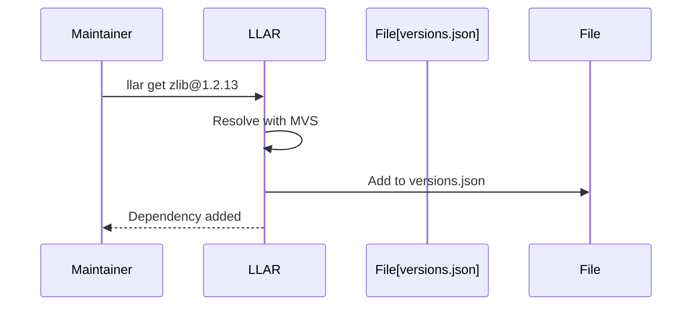

# LLAR Product Design

## 1. Product Background

### 1.1 Core Problem

In modular compilation languages (C/C++, Python, WASM), developers face:

**Problem Scenario**:
- Different libraries have numerous optional compilation configurations and combinations
- Changing a configuration or platform requires rebuilding all libraries from scratch
- Repeated builds are meaningless and waste time

**Existing Solutions' Shortcomings**:

Package managers like Homebrew, Conan, and APT provide "pre-built" packages, but:
- To save space, they don't build all possible configurations
- "Universal" pre-built artifacts often don't meet user needs
- Users still need to build locally in most cases, wasting time
- Developers repeatedly build the same artifacts, extremely wasteful

**LLAR's Approach**:
- Builds DefaultOptions matrix by default (common configurations)
- Non-default options trigger server lazy build (on demand)
- Users wait for server build, artifacts are cached and shared globally
- No local build for missing packages, reducing user burden

### 1.2 Design Goals

**LLAR's Positioning**:

LLAR is dedicated to creating a package manager that:
- Has complete pre-built artifact management (provides online build management for pre-built packages)
- Provides convenient build configuration
- Balances artifact management and build configuration

**Core Advantages vs Existing Package Managers**:

1. **Automatic Dependency Conflict Resolution** - Borrowing Go's dependency management philosophy
   - Industry Pain Point: Conan/pip report errors on version conflicts, requiring manual override
   - LLAR Solution: Uses Go's MVS algorithm to automatically calculate version combinations
   - User Value: No "dependency hell", just run `llar install`

2. **Lazy Build Mechanism** - Server builds on demand
   - Industry Pain Point: Conan/Nix can only build locally when missing packages
   - LLAR Solution: LLAR builds DefaultOptions by default; non-LLAR pre-built triggers server build, user waits
   - User Value: First time may wait, but artifacts are shared globally, no repeated waste

3. **Smart Formulas** - Automatic dependency parsing
   - Industry Pain Point: Conan/Homebrew formulas require manual dependency maintenance
   - LLAR Solution: `onRequire` automatically extracts dependencies from CMakeLists.txt
   - Maintainer Value: Low maintenance cost, low contribution barrier, fast ecosystem growth

## 2. Basic Concepts

### 2.1 Package

A package represents a complete source library (e.g., `DaveGamble/cJSON`), containing:
- **Formula**: Build instructions
- **Matrix**: Supported configurations (os/arch/options)
- **Versions**: Auto-retrieved from GitHub/GitLab
- **Dependencies**: Required packages

### 2.2 Formula

Formula defines how to build a package across versions and platforms.

**Structure**: `{{repo}}_cmp.gox` (version comparison) + `versions.json` (deps fallback) + `{{repo}}_llar.gox` (build logic)

**Execution Flow**:


### 2.3 Build Matrix

Matrix uses Cartesian product to generate all build combinations.

**Components**:
- **Require** (propagates to deps): os, arch, lang
- **Options** (local only): zlib, ssl, debug
- **DefaultOptions** (pre-built): Default option values

**Example**: `2 os × 2 arch × 1 lang = 4 require combinations`, `2 zlib × 2 ssl × 2 debug = 8 option combinations`
- **Full matrix**: 4 × 8 = 32 total combinations
- **Default matrix**: 4 × 1 = 4 pre-built combinations (e.g., `x86_64-c-linux|zlibOFF-sslOFF-debugOFF`)

**Propagation**: Require propagates to all deps, Options only to packages that declare them.

### 2.4 Lazy Build

**Current Implementation (v0.x)**: When pre-built artifact doesn't exist, users build locally.


**Future Plan (v1.0+)**: Server lazy build will be implemented.


**Benefits of Future Lazy Build**:
- No local build: Users wait for server instead
- Shared cache: Once built, available to all users globally
- DefaultOptions pre-built, non-default built on-demand

### 2.5 Version Management

**Auto-retrieval**: Versions fetched from GitHub/GitLab tags (e.g., v1.0.0, v1.7.18, v2.0.0)

**Formula Selection**: Select formula with max `fromVer <= target version`
- Example: Installing v1.7.18 → selects formula with fromVer=v1.5.0 (not v2.0.0)

**MVS Conflict Resolution**: When HTTP lib requires zlib ≥ 1.2.0 and Image lib requires zlib ≥ 1.2.8 → auto-select zlib 1.2.8

### 2.6 Dependency Management

**Two-tier resolution**:
1. **onRequire** (automatic): Parse CMakeLists.txt → extract dependencies
2. **versions.json** (fallback): Manual lookup table when parsing fails or version unspecified

**Example**: `ninja@1.11.0` → onRequire finds "need re2c" (no version) → fallback to `versions.json: v1.11.0 → re2c@2.0.3`

## 3. User Stories

### 3.1 Developer: Quick Install Dependencies

**As** a developer
**I want** to quickly install project dependencies
**So that** I can save build time and focus on business development

**Workflow**:


**Acceptance Criteria**:
- Pre-built exists (DefaultOptions): Complete in 30s
- Pre-built not exists: Trigger server build, user waits
- Server build completes: Upload to cache and download
- Build artifacts are shared globally for future use

### 3.2 Developer: Consistent Dependency Versions

**As** a developer
**I want** LLAR to use exact dependency versions from formula
**So that** builds are reproducible and consistent

**Workflow**:


**Acceptance Criteria**:
- versions.json maintained by formula maintainer
- Users read versions.json from formula repository
- Same formula version = same dependency versions
- Users cannot modify versions.json

### 3.3 Developer: List Available Versions

**As** a developer
**I want** to list all available versions of a package
**So that** I can choose the right version

**Command**: `llar list <package>`

**Acceptance Criteria**:
- Display all versions sorted by time (newest first)
- Auto-fetch from GitHub/GitLab tags
- Support `--json` output format

### 3.4 Developer: View Package Information

**As** a developer
**I want** to view detailed package build information
**So that** I can understand dependencies and build configuration

**Command**: `llar info <package>[@version]`

**Acceptance Criteria**:
- Display package metadata (version, matrix, build time)
- Show dependencies and link flags
- Support `--json` output format

### 3.5 Developer: Search Packages

**As** a developer
**I want** to search packages by keyword
**So that** I can find libraries I need

**Command**: `llar search <keyword>`

**Acceptance Criteria**:
- Search by package name and description
- Display matching packages with descriptions
- Support `--json` output format

### 3.6 Maintainer: Submit New Formula

**As** a formula maintainer
**I want** to submit formula for new library
**So that** community users can use this library

**Workflow**:


**Acceptance Criteria**:
- Formula directory structure follows spec
- _cmp.gox implements compareVer
- _llar.gox implements necessary callbacks
- Local test build succeeds
- Pass PR review

### 3.7 Maintainer: Use onRequire to Reduce Maintenance

**As** a formula maintainer
**I want** to implement onRequire to auto-parse dependencies
**So that** I can auto-track upstream changes without manually maintaining versions.json

**Scenario Comparison**:

**Manual maintenance (versions.json)**:
```json
{
    "versions": {
        "v1.11.0": [
            {"name": "skvadrik/re2c", "version": "2.0.3"}
        ]
    }
}
```
- Problem: Need manual update when upstream changes version
- Maintenance cost: High

**Auto-parse (onRequire)**:
```go
onRequire (proj, deps) => {
    cmake := proj.readFile("CMakeLists.txt")
    // find_package(re2c 2.0 REQUIRED) -> auto parse
    matches := findDeps(cmake)

    for m in matches {
        deps.require(pkgID(m.Name), m.Version)
    }
}
```
- Advantage: Auto-tracks upstream CMakeLists.txt changes
- Maintenance cost: Low

**Acceptance Criteria**:
- onRequire can read build system files
- Auto-parse dependency names and versions
- Fallback to versions.json when parse fails

### 3.8 Maintainer: Initialize Formula Project

**As** a formula maintainer
**I want** to initialize a formula project
**So that** I can start writing formula for a package

**Command**: `llar init`

**Acceptance Criteria**:
- Create `versions.json` file
- Initialize with empty dependency list
- Ready to use `llar get` to add dependencies

### 3.9 Maintainer: Add Formula Dependency

**As** a formula maintainer
**I want** to add dependencies to formula's versions.json
**So that** I can declare package dependencies

**Command**: `llar get <package>[@version]`

**Workflow**:


**Acceptance Criteria**:
- Add dependency to `versions.json`
- Resolve version conflicts with MVS
- Record exact version

### 3.10 Maintainer: Clean Up Formula Dependencies

**As** a formula maintainer
**I want** to clean up unused dependencies in versions.json
**So that** I can keep formula configuration tidy

**Command**: `llar tidy`

**Acceptance Criteria**:
- Remove unused entries from `versions.json`
- Keep only actively used dependencies
- Preserve dependency order

## 4. Core Workflow

### 4.1 Package Install Flow


### 4.2 Dependency Resolution Flow


### 4.3 Formula Selection Flow


## 5. Technical Design

### 5.1 Formula Execution Flow

**Dependency Resolution Phase** (top-down, breadth-first):
```
App (onRequire) → Parse dependencies
  ↓
HTTP Library (onRequire) → Parse dependencies
  ↓
OpenSSL (onRequire) → Parse dependencies
```

**Build Phase** (BuildList order, topological sort):
```
OpenSSL (onBuild) → Build
  ↓
HTTP Library (onBuild) → Build (can access OpenSSL artifact)
  ↓
App (onBuild) → Build (can access HTTP + OpenSSL artifacts)
```

### 5.2 Static Linking (Recommended)

**Design Rationale**: LLAR recommends static libraries (`.a` files) for:
- Complete isolation from system environment
- Build reproducibility
- No version conflicts
- Portability

**Build Requirements**:
```go
onBuild (proj, out) => {
    // Disable shared libraries
    cmake "-DBUILD_SHARED_LIBS=OFF", "."

    // Set link flags
    out.setLinkFlags("-L" + out.dir + "/lib", "-lmylib")
}
```

**Note**: Dynamic library support design is under development.

## 6. Design Advantages

### 6.1 vs Conan

| Feature | LLAR | Conan |
|---------|------|-------|
| Dependency Conflicts | Auto (MVS) | Manual override |
| Missing Package | Server build (user waits) | Local only |
| Formula Maintenance | Auto (onRequire) | Manual |
| Version Management | Simple (versions.json) | Complex (conanfile.py + conan.lock) |
| Default Build | DefaultOptions only | All configurations |

### 6.2 vs Homebrew

| Feature | LLAR | Homebrew |
|---------|------|----------|
| Configuration Coverage | DefaultOptions + lazy build | Limited |
| Cross-platform | Yes | macOS/Linux only |
| Dependency Resolution | MVS | Manual |
| Formula Intelligence | onRequire auto-parse | Manual maintenance |
| Missing Package | Server build | Not available |

### 6.3 vs Nix

| Feature | LLAR | Nix |
|---------|------|-----|
| Learning Curve | Low (XGo) | High (Nix expressions) |
| Missing Package | Server build (user waits) | Local only |
| Build Speed | Fast (server + cache) | Slow (local only) |
| Configuration | Simple (DefaultOptions) | Complex |
| Default Build | DefaultOptions only | All configurations |

## 7. References

- [formula.md](formula.md) - Formula specification
- [formula-version-design.md](../docs/formula-version-design.md) - Formula version adaptation
- [mvs-algorithm-design.md](../docs/mvs-algorithm-design.md) - MVS algorithm
- [version-range-design.md](../docs/version-range-design.md) - Version range
- [matrix.md](../docs/matrix.md) - Build matrix
