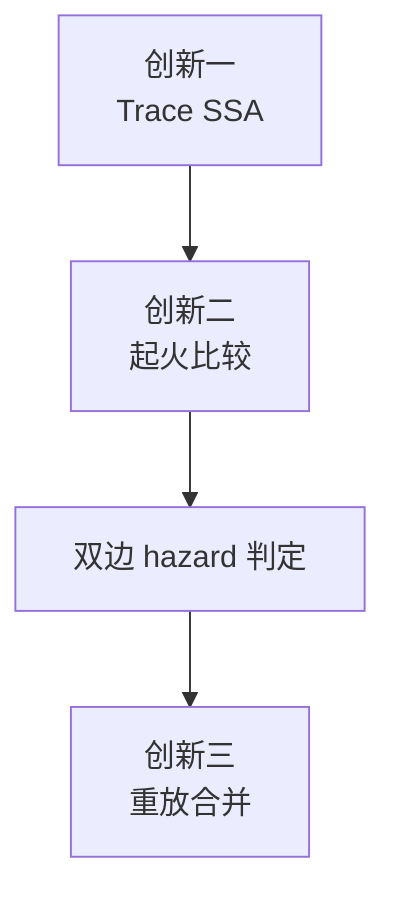

# LLAR Evaluator 设计稿：三段式教材版

## 1. 文档定位

这份文档不是实现说明，不是代码迁移计划，也不是测试产品说明。

这份文档只定义 evaluator 的核心算法设计，目标是回答下面这个问题：

> 在黑盒构建条件下，如何只凭 trace、路径内容证据和有限的产物证据，保守地判断哪些 option 组合必须真实执行，哪些可以被证明为可跳过。

本文的写法刻意采用教材式结构：

1. 先讲总览
2. 再讲三项核心创新
3. 再讲对象定义
4. 再讲单图构造
5. 再讲 baseline 对 singleton 的单边分析
6. 最后讲双边判定与重放合并

如果一个工程师或一个 AI 从零实现 evaluator，应该先读完第 2 章，再按第 6 到第 10 章的顺序实现。

---

## 2. 总览：evaluator 的三项核心创新

这套 evaluator 的核心不止一个点，而是三段式创新链条：

1. `Trace SSA`
2. `起火比较`
3. `重放合并`

这三者不是并列的 feature，而是一条前后相接的推理链。



### 2.1 创新一：Trace SSA

Trace SSA 解决的问题是：

> 怎么把黑盒构建 trace 从“命令列表”升级成“路径状态传播图”。

它的核心思想是：

- 每次路径写入都产生新的路径状态版本
- 每次路径读取都绑定到 reaching-def
- 传播分析不再基于“路径有没有出现”，而是基于“状态从哪里定义、流向哪里”

Trace SSA 解决的是**表示问题**。

### 2.2 创新二：起火比较

起火比较解决的问题是：

> option 的变化到底是从哪里开始点火的，哪些是直接变化，哪些只是被上游带着变化。

它不直接比较“两张图哪里不一样”，而是先做 baseline 对 singleton 的单边分析，抽出：

- `MutationRoot`
- `SeedDef`
- `Need`
- `Flow`
- `Frontier`

起火比较解决的是**归因问题**。

### 2.3 创新三：重放合并

重放合并解决的问题是：

> 当两个 option 在图上看起来共享上游根时，哪些共享传播应当判死，哪些共享传播可以被提升到 replay root 上吸收。

它的核心思想不是“强行 merge 文件”，而是：

- 识别最近、清晰、可参数化的 replay root
- 在 root 处合并参数差异
- 只重放最小必要子图

重放合并解决的是**可吸收冲突的证明问题**。

### 2.4 三项创新各自回答什么

把三者放在一起，可以得到一个非常清晰的职责划分：

- `Trace SSA` 回答：状态图怎么建
- `起火比较` 回答：变化从哪里开始，传播到哪里
- `重放合并` 回答：共享传播能否在更高层被吸收

缺任何一个，这套 evaluator 都不完整：

- 没有 Trace SSA，就没有可靠的状态化传播模型
- 没有起火比较，就分不清直接变化和传播变化
- 没有重放合并，就会把一切共享根传播都过早判成死碰撞

### 2.5 本文后续章节怎么对应三项创新

后面各章和这三项创新的关系如下：

- 第 6 章讲 `Trace SSA` 单图构造
- 第 7 章到第 9 章讲 `起火比较`
- 第 11 章讲 `重放合并`

也就是说：

> 本文不是单纯讲 SSA，而是在讲“Trace SSA -> 起火比较 -> 重放合并”这一整条 evaluator 核心方法链。

---

## 3. 先看一个贯穿全文的最小例子

后面的定义都围绕这组最小例子解释。

### 3.1 Baseline

```text
E1: cc -c server.c -o server.o
E2: cc -c utils.c  -o utils.o
E3: cc server.o utils.o -o app
```

### 3.2 打开 option A

`A` 会开启代码生成：

```text
EA1: protoc api.proto -> api.h api.c
EA2: cc -c server.c -o server.o
EA3: cc -c api.c    -o api.o
EA4: cc server.o utils.o api.o -o app
```

注意：

- `EA2` 现在可能会读 `api.h`
- `EA4` 现在会读 `api.o`

### 3.3 打开 option B

`B` 会改变日志宏：

```text
EB1: cc -DLOG_ON -c utils.c -o utils.o
EB2: cc server.o utils.o -o app
```

### 3.4 我们真正想知道什么

读者在心里一直带着下面五个问题即可：

1. `A` 的直接起火点是 `EA1/EA3`，还是连 `EA2` 也算
2. `A` 的传播是否会波及 `server.o`、`app`
3. `B` 的传播是否会污染 `A` 的前提
4. 两边是否只在最终 `app` 上汇聚
5. 如果只在 `app` 上汇聚，这是不是一个可以后移处理的相遇

后面所有算法，都是为了把这五个问题机械化。

---

## 4. 问题边界

在进入算法之前，先把边界讲死。

### 4.1 本文要解决什么

本文只解决：

- 执行节点级 trace 的状态化建模
- baseline 对 singleton 的单边影响提取
- singleton pair 的双边 hazard 判定
- 共享 replay root 的可吸收性判定框架

### 4.2 本文不解决什么

本文不解决：

- 源码语义分析
- ABI 静态证明
- 目录枚举语义恢复
- 用户测试语义推断
- 高阶组合递归认证

### 4.3 为什么边界必须先写死

因为 evaluator 最大的风险不是“不会分析”，而是“分析得太像自己很懂”。

这份设计要求：

> 没有观测到的能力，就明确承认缺口，不允许伪精确。

---

## 5. 输入模型与基本术语

### 5.1 原始观测记录 `ExecRecord`

最小输入单位是执行级记录：

```text
ExecRecord {
  Argv
  Cwd
  Env?
  Inputs[]
  Changes[]
  Parent?
  Sequence?
}
```

含义：

- `Argv`：实际执行命令
- `Cwd`：工作目录
- `Inputs[]`：该命令显式读过的路径
- `Changes[]`：该命令显式写出、改名、删除、创建过的路径
- `Parent?`：父子进程关系证据
- `Sequence?`：顺序证据

### 5.2 作用域 `Scope`

每个样本都需要作用域根：

```text
Scope {
  SourceRoot
  BuildRoot
  OutputRoot
  KeepRoots?
}
```

`Scope` 的唯一作用是：

> 把样本私有绝对路径归一化到统一路径空间。

### 5.3 内容证据 `InputDigests`

对 build-root 关键路径，需要内容摘要：

```text
InputDigests[path] = digest
```

这是后面判定“路径是否真的变化”的硬证据。

### 5.4 `StablePath`

所有分析都基于 stable path，而不是原始绝对路径。

例如：

```text
/tmp/build-1234/server.o
-> $BUILD/server.o
```

一个路径只有满足以下条件时，才算 stable：

1. 不依赖随机临时目录名
2. 不依赖样本私有绝对根
3. 在不同样本里能映射到同一个逻辑键

### 5.5 `ExecNode`

SSA 图中的执行节点记为 `E`。

它是不透明的黑盒执行事实，只携带：

- `argv`
- `cwd`
- `read paths`
- `write paths`
- 顺序证据

`ExecNode` 不是：

- compile 节点
- link 节点
- install 节点
- configure 节点

这些语义标签如果需要，只能作为后续旁路标签出现。

### 5.6 `PathState`

路径状态版本记为：

```text
P(path, n)
```

含义是：

> 路径 `path` 在第 `n` 次定义之后的状态。

如果路径被删除，则定义：

```text
P(path, n, tombstone=true)
```

它表示：

> 当前构建状态下，这个路径不存在。

需要牢记：

1. `n` 是该路径自己的局部定义编号
2. `n` 不是全局时间
3. 跨图比较时不能直接比较 `n`

### 5.7 `StateClass`

跨图比较时，不能直接比较本地图里的状态编号，所以要引入状态类键：

```text
StateClass = (StablePath, Tombstone)
```

图内传播用精确状态对象。  
跨图比较用 `StateClass`。

---

## 6. 创新一：Trace SSA 单图构造

现在进入第一项核心创新：Trace SSA 本身怎么构建。

### 6.1 最终图的形状

Trace SSA 是一张二分图，只允许两类核心边：

- `P -> E`：读取
- `E -> P`：写入

也就是：

```text
PathState -> ExecNode -> PathState
```

为什么不需要显式 join 节点？

因为多个来源的汇合天然发生在执行节点的多输入边上，例如：

```text
P(server.o,1) -> E(link) <- P(utils.o,1)
```

汇合已经在读取节点本身表达出来，不需要再造一类核心对象。

### 6.2 正确顺序：先构造单图，再谈差分

实现者最容易犯的错误是：

> 一开始就想 baseline 和 singleton 怎么比。

这是错的。

正确顺序是：

1. 先把单个样本构造成完整的 Path-SSA
2. 再定义 baseline 与 singleton 的节点对应
3. 再从对应关系中提取单边影响
4. 最后才做双边 hazard

所以这里先只讲“单图怎么建”。

### 6.3 第 0 步：观测归一化

输入：原始 `ExecRecord[]`  
输出：`NormalizedExecNode[]`

目标：

> 把原始 trace 变成一组稳定、可比较的执行节点观测。

必须做四件事：

1. 路径 canonicalization
2. `cwd/env/argv` 规范化
3. 作用域 token 化
4. 去掉纯瞬时噪音路径

#### 6.3.1 路径 canonicalization

把样本私有路径映射成 stable path：

```text
/private/tmp/build-abc123/libfoo.a
-> $BUILD/libfoo.a
```

后面 baseline 与 singleton 的一切比较，都建立在这个统一路径空间之上。

#### 6.3.2 `argv` 规范化

`argv` 规范化的目标不是理解语义，而是去掉不稳定 token，例如：

- 绝对根路径
- 临时 build 目录
- 随机后缀

禁止在这一步做：

- compile/link/install 分类
- 业务启发式语义推理

#### 6.3.3 读写集合规范化

归一化后，每个节点至少应变成：

```text
NormalizedExecNode {
  Id
  Argv
  Cwd
  ReadPaths[]
  WritePaths[]
  DeletePaths[]
  Parent?
  Sequence?
}
```

删除路径应单独保留，不要混入普通写集合。

#### 6.3.4 归一化阶段绝对不能做什么

不能在归一化阶段做：

- `MutationRoot` 判定
- `Need / Flow / Frontier` 提取
- pair hazard 判定
- 角色归类

因为这些都依赖后面的 SSA 结构。

#### 6.3.5 归一化伪代码

```text
NormalizeTrace(records, scope):
  nodes = []
  for each record in records:
    node = new NormalizedExecNode
    node.Argv = NormalizeArgv(record.Argv, scope)
    node.Cwd  = NormalizePath(record.Cwd, scope)
    node.ReadPaths   = NormalizePaths(record.Inputs, scope)
    node.WritePaths  = NormalizeWrittenPaths(record.Changes, scope)
    node.DeletePaths = NormalizeDeletedPaths(record.Changes, scope)
    node.Parent   = record.Parent
    node.Sequence = record.Sequence
    node = RemoveEphemeralNoise(node)
    nodes.append(node)
  return nodes
```

### 6.4 第 1 步：建立保守因果偏序

真实构建往往不是全局串行的，所以不能假设一个全局线性时间。

正确做法是建立：

> **保守因果偏序。**

#### 6.4.1 可比较

如果当前证据足以证明：

```text
E1 一定先于 E2
```

则 `E1` 与 `E2` 可比较。

#### 6.4.2 不可比较

如果当前证据不足以决定：

```text
E1 在 E2 前
还是
E2 在 E1 前
```

那它们就是不可比较的。

绝不能强行猜顺序。

#### 6.4.3 允许使用哪些先后证据

一个实现可以使用：

1. 同一逻辑执行流中的顺序
2. 显式事件序号
3. 父子进程的包围关系
4. 已观测到的 def-use 证据

只要证据不足，就保持不可比较。

#### 6.4.4 为什么偏序不是可选项

如果偷懒用 total order：

- 会把并发定义错误排出先后
- 会错误绑定读取
- 会把本应保留 ambiguity 的情况误判成确定传播

这会直接破坏 soundness。

#### 6.4.5 偏序接口

实现层最好提供一个基础谓词：

```text
CausallyBefore(E1, E2) -> bool
```

它的含义是：

> 当前证据足以证明 `E1` 一定发生在 `E2` 之前。

### 6.5 第 2 步：为每条路径生成状态版本

现在我们已经有：

- 归一化执行节点
- 保守因果偏序

下一步是把“路径被写过”变成“路径状态被定义”。

#### 6.5.1 初始状态 `P(path,0)`

只要一条路径被读取，但在图内还没有任何先行定义，就为它引入：

```text
P(path, 0)
```

它表示：

> 构建开始前外部世界提供的基线状态。

没有这一步，源文件、系统头、已有 build-root 文件的读取都没有合法来源。

#### 6.5.2 普通写入产生新状态

如果执行节点 `E` 写了路径 `p`，则定义：

```text
E -> P(p, next)
```

其中 `next` 是路径 `p` 的下一个局部编号。

#### 6.5.3 删除产生 tombstone

如果执行节点删除了路径 `p`，则定义：

```text
E -> P(p, next, tombstone=true)
```

删除不是特殊例外，而是一种正式状态。

#### 6.5.4 同一节点对同一路径多次底层写怎么办

在执行节点级 SSA 里：

> 把它们折叠成该节点对该路径的一个最终定义。

因为我们分析的是执行节点级 trace，不是 syscall 级 SSA。

#### 6.5.5 版本号不是时间戳

再次强调：

```text
P(path, 2)
```

里的 `2` 只说明：

- 这是该路径的第三个局部定义身份

它不说明：

- 它在全局时间上一定比别的路径的 `1` 晚

跨路径、跨图都不能直接拿版本号大小比较先后。

#### 6.5.6 版本生成伪代码

```text
CreateStateVersions(nodes):
  nextVersion[path] = 0
  defsByNode = {}
  for each node in nodes:
    defs = []
    for each path in node.WritePaths:
      nextVersion[path] += 1
      defs.append(P(path, nextVersion[path], tombstone=false))
    for each path in node.DeletePaths:
      nextVersion[path] += 1
      defs.append(P(path, nextVersion[path], tombstone=true))
    defsByNode[node] = defs
  return defsByNode
```

### 6.6 第 3 步：把每个读取绑定到 reaching-def

这一步是 Trace SSA 的核心。

写入版本化只是第一半；真正重要的是：

> 每一次读取，到底依赖哪一个路径状态版本。

#### 6.6.1 读取绑定问题

给定执行节点 `E` 读取路径 `p`，我们要计算：

```text
ReachDef(p, E)
```

它是这样一个集合：

- 定义的是同一路径 `p`
- 对 `E` 因果可达
- 在所有可达定义中属于“最近的一层”

#### 6.6.2 什么叫“最近”

这里的“最近”不是 wall clock 最近，而是偏序意义上的 maximal defs：

> 在所有先于 `E` 的路径定义中，选择那些不存在另一个更晚且仍然先于 `E` 的定义。

如果 maximal def 只有一个，则读取是确定的。

如果 maximal def 有多个且互相不可比较，则读取是 ambiguous。

#### 6.6.3 什么情况下会出现 ambiguity

例如：

- 两个并发命令都写了同一路径
- 一个后续命令读取它
- 但当前证据不足以决定读取实际看到哪个版本

这时不能“挑一个更像的”，必须保留整个候选集合。

#### 6.6.4 如果路径没有任何先行定义

那该读取绑定到：

```text
P(path, 0)
```

也就是外部初始状态。

#### 6.6.5 读取绑定算法

对每个 `(E, p)`：

1. 找出所有定义 `D`，满足：
   - `D.Path == p`
   - `Writer(D)` 因果上先于 `E`

2. 在这些定义里取 maximal defs：
   - 若 `D1` 先于 `D2`，则 `D1` 不是 maximal

3. 如果 maximal 集为空：
   - 使用 `P(path,0)`

4. 如果 maximal 集只有一个：
   - 读取确定绑定到该状态

5. 如果 maximal 集有多个：
   - 记录 ambiguity

#### 6.6.6 读取绑定伪代码

```text
BindRead(path, reader, allDefs, order):
  candidates = []
  for each def in allDefs[path]:
    if order.CausallyBefore(def.Writer, reader):
      candidates.append(def)

  maximal = []
  for each d in candidates:
    dominated = false
    for each e in candidates:
      if d != e and order.CausallyBefore(d.Writer, e.Writer):
        dominated = true
        break
    if not dominated:
      maximal.append(d)

  if maximal is empty:
    return { InitialState(path) }, ambiguous=false
  if size(maximal) == 1:
    return maximal, ambiguous=false
  return maximal, ambiguous=true
```

### 6.7 第 4 步：建立 def-use 与 use-def 索引

有了图还不够，后面传播分析至少还需要四类索引：

1. `DefsByPath[path] -> PathState[]`
2. `UsersByState[state] -> ExecNode[]`
3. `DefsByExec[node] -> PathState[]`
4. `ReadsByExec[node] -> PathStateSet[]`

后面的 `Flow / Need / Frontier` 全部建立在这些索引之上。

### 6.8 第 5 步：角色投影

核心图建好之后，才允许叠加旁路标签。

这一步的作用是隔离主线分析域与噪音子图。

#### 6.8.1 为什么角色不是核心图对象

因为角色分类是启发式，而 SSA 核心图必须是证据驱动的。

正确顺序是：

1. 先建无语义核心图
2. 再叠加 `tooling / probe / mainline / delivery`

#### 6.8.2 角色投影至少需要哪些角色

第一版至少要有：

1. `tooling`
2. `probe`
3. `mainline`
4. `delivery`

#### 6.8.3 角色投影只负责两件事

1. 把 configure / probe / tooling 小岛从主线分析域中剥离
2. 标出哪些路径属于最终允许汇聚的 merge surface

到这里为止，我们只完成了：

> 单个样本的 Path-SSA 构造。

---

## 7. 创新二：起火比较

现在开始第二项核心创新：起火比较。

起火比较的核心不是“两张图的结构差分”，而是：

> 先找 option 的最小直接起火点，再区分直接变化和传播变化。

### 7.1 为什么不能直接做图差分

如果直接比较 baseline 图和 singleton 图：

- 你会看到大量节点“看起来都不一样”
- 但你分不清哪些是 option 直接造成的
- 哪些只是因为上游状态变了，被动重跑的

起火比较就是用来解决这个归因问题的。

### 7.2 第 6 步：baseline 与 singleton 的节点对应

要找 `MutationRoot`，必须先定义：

> 两张图里的哪些执行节点是在“对应同一个构建位点”。

#### 7.2.1 为什么要先做节点对应

因为我们要区分：

1. option 直接引入或直接改写的节点
2. 只是被上游状态带着变化的节点

#### 7.2.2 两种键

建议为每个节点准备两种键。

##### `ExactKey`

用于判断“这两个节点是不是完全一样”，应至少包含：

- 规范化后的 `argv`
- 规范化后的 `cwd`
- 稳定写路径集合
- 稳定读路径集合
- 对 build-root 关键读取路径的 digest token

##### `ShapeKey`

用于判断“这两个节点是不是同一个构建位点，但内容可能不同”，应至少包含：

- 规范化后的 `argv skeleton`
- 规范化后的 `cwd`
- 稳定写路径集合

#### 7.2.3 对应算法

推荐按两轮做：

1. 先用 `ExactKey` 做精确匹配
2. 再对剩余节点用 `ShapeKey` 做结构匹配

若 `ShapeKey` 下仍存在多对多歧义，不要强配，直接保守留下 unmatched。

#### 7.2.4 对应结果的三种类型

对 singleton 一侧节点，最终只落入三类：

1. `ExactMatched`
2. `StructureMatched`
3. `Unmatched`

含义分别是：

- `ExactMatched`：可以视为未变
- `StructureMatched`：像同一个位点，但可能发生了直接变化或传播变化
- `Unmatched`：singleton 新增节点

### 7.3 第 7 步：提取 `MutationRoot`

现在终于可以定义：

> 哪些 singleton 节点是 option 的直接起火点。

#### 7.3.1 候选变化节点

候选变化节点包括：

1. 所有 `Unmatched` 节点
2. 所有 `StructureMatched` 且结构骨架发生直接变化的节点

这里的结构骨架变化至少包括：

- `argv skeleton` 变化
- `cwd` 变化
- 稳定写路径集合变化
- 外部稳定读路径集合变化

#### 7.3.2 哪些不算 root

如果一个 `StructureMatched` 节点满足：

- 结构骨架没变
- 唯一变化只是它读取到的上游状态版本变了

那么它不是 `MutationRoot`，它只是传播路径上的被动节点。

#### 7.3.3 最小根过滤

候选变化节点还要再过一层“最小根过滤”。

如果候选节点 `E2` 的所有直接变化，都已经可以由另一个候选节点 `E1` 定义出的变化状态解释，并且 `E1` 在传播上先于 `E2`，那么 `E2` 不应再被提升为 root。

也就是说：

> root 必须是最小直接起火点，而不是所有被点燃的节点。

### 7.4 第 8 步：提取 `SeedDef`

`SeedDef(X)` 定义为：

> `MutationRoot(X)` 直接定义出的、相对 baseline 真正变化的状态版本集合。

#### 7.4.1 什么叫“真正变化”

一个路径不能仅因为：

- 被重写过
- 出现在 write 集里
- 触发了下游重编

就进入 `SeedDef`。

它必须满足：

> 相对 baseline，这个路径的内容或存在性真的发生了变化。

#### 7.4.2 build-root 路径必须优先用 digest 判定

规则是：

1. digest 与 baseline 相同：不是真实变化
2. digest 与 baseline 不同：是真实变化
3. 路径被删除：tombstone 也是真实变化

绝不能把“动作重跑过”等价为“路径内容已变”。

### 7.5 第 9 步：提取 `Flow`

`Flow(X)` 定义为：

> 从 `SeedDef(X)` 出发，经由 `def -> use -> downstream def` 传播后，所有被影响到的状态版本集合。

传播有两种跳：

1. `def -> use`
2. `use -> downstream def`

`SeedDef` 是起火点，`Flow` 是火势范围，两者不能混。

### 7.6 第 10 步：提取 `Need`

`Need(X)` 定义为：

> `MutationRoot(X)` 及其传播闭包成立所需、但不由该闭包内部定义的外部状态集合。

它来自两类地方：

1. 根节点的直接外部输入
2. 下游受影响节点中新引入的外部输入

实现时必须遵守两条规则：

1. 对有 baseline 对应位点的节点，只保留 singleton 相对 baseline 新出现的外部依赖
2. 纯 delivery / install-only 节点的读取不能机械计入 `Need`

### 7.7 第 11 步：提取 `Frontier`

`Frontier(X)` 不是“所有下游混合节点”，而是：

> `Flow(X)` 第一次与分析域内外部状态发生混合消费的最小边界执行节点集合。

先定义：

1. `ReachState(X)`：从 `SeedDef(X)` 可达的全部状态
2. `ReachExec(X)`：在同一传播闭包中可达的全部执行节点
3. `TrackedExternal(X)`：不属于 `ReachState(X)`、但仍在分析域内的外部状态

若某执行节点：

1. 读取至少一个来自 `ReachState(X)` 的状态
2. 同时还读取至少一个来自 `TrackedExternal(X)` 的状态

则它属于 `MixedExec(X)`。

`Frontier(X)` 则是 `MixedExec(X)` 中的最小元集合。

---

## 8. 单边分析的完整结果

把第 7 章合起来，一个 singleton 的单边分析最终产出：

```text
ImpactProfile {
  MutationRoot
  SeedDef
  Need
  Flow
  Frontier
  Ambiguous
}
```

到这里，第二项创新“起火比较”才算真正完成。

---

## 9. 双边 hazard 判定

现在才进入 pair 级别的判定。

### 9.1 跨图比较时比较什么

不能直接比较两个 singleton 图里的本地版本号。

跨图比较必须投影到：

```text
StateClass = (StablePath, Tombstone)
```

必要时再结合 surface 信息。

### 9.2 第一类冒险：WAW

如果：

- `SeedDef(A)` 与 `SeedDef(B)` 都为同一路径产生了新状态
- 且该路径不属于允许的 merge surface

那么这是硬碰撞。

公式：

```text
SeedClass(A) ∩ SeedClass(B) ≠ ∅
且交集不在允许面上
```

### 9.3 第二类冒险：RAW

如果：

- `A` 的传播进入 `B` 的前提
或
- `B` 的传播进入 `A` 的前提

则表示一边改写了另一边的起火条件。

公式：

```text
FlowClass(A) ∩ NeedClass(B) ≠ ∅
或
FlowClass(B) ∩ NeedClass(A) ≠ ∅
```

只要任一成立，就是硬碰撞。

### 9.4 第三类冒险：共享传播面

如果：

```text
FlowClass(A) ∩ FlowClass(B) ≠ ∅
```

不能立刻判死，必须继续区分：

1. 交集只落在 merge surface 上  
   可以后移到后续层处理

2. 交集落在 merge surface 之外  
   Stage 2 直接判硬碰撞

### 9.5 第四类冒险：不可消解歧义

如果任一侧存在 critical ambiguity，且它会影响：

- `MutationRoot`
- `SeedDef`
- `Need / Flow`

则必须保守回退。

### 9.6 Pair 输出

最终，Stage 2 至少给出：

```text
PairAssessment {
  Orthogonal
  HardHazards[]
  Ambiguous
  SharedSurface[]
}
```

其中：

- `Orthogonal = true` 表示允许继续进入后续层
- `SharedSurface[]` 记录那些被允许后移处理的汇聚面

---

## 10. 回到最小例子

现在回到第 3 章的例子，重新走一遍。

### 10.1 对 option A

`A` 的直接根更像是：

- `protoc api.proto -> api.h, api.c`
- `cc api.c -> api.o`

而：

- `cc server.c -> server.o`

如果它只是因为多读了 `api.h` 而重编，那么它更像传播节点，不是直接根。

于是：

```text
SeedDef(A) ≈ { api.h, api.c, api.o }
Flow(A)    ≈ { api.h, api.c, api.o, server.o, app }
Need(A)    ≈ { api.proto }
```

### 10.2 对 option B

`B` 的直接根是：

- `cc -DLOG_ON utils.c -> utils.o`

于是：

```text
SeedDef(B) ≈ { utils.o }
Flow(B)    ≈ { utils.o, app }
Need(B)    ≈ { utils.c }
```

### 10.3 Pair 判定

先看 WAW：

```text
Seed(A) ∩ Seed(B) = ∅
```

再看 RAW：

```text
Flow(A) ∩ Need(B) = ∅
Flow(B) ∩ Need(A) = ∅
```

再看共享传播：

```text
Flow(A) ∩ Flow(B) = { app }
```

如果 `app` 属于 merge surface，那么 Stage 2 允许通过。

这就是整套模型在最小例子上的工作方式。

---

## 11. 创新三：重放合并

现在回到第 2 章提到的第三项创新。

前两项创新解决的是：

- 图怎么建
- 起火怎么比
- hazard 怎么判

但它们还没有回答一个更难的问题：

> 如果两个 option 共享同一个上游 replay root，这种共享传播究竟应该判死，还是应该提升到 root 层吸收。

这就是重放合并的职责。

### 11.1 为什么重放合并是独立创新

如果没有重放合并，系统往往只能在两个极端之间摇摆：

1. 过早判死  
   只要看到共享根传播，就一律当硬碰撞

2. 过度乐观  
   只要最终输出能 merge，就忽略共享上游根

这两个极端都不对。

重放合并提供的是第三条路：

> 把冲突提升到 replay root 这一层处理，而不是在中间传播面直接拍死，或在最终产物面强行掩盖。

### 11.2 重放合并到底做什么

重放合并不是简单的文件 merge，而是：

1. 找到最近、清晰、可参数化的 replay root
2. 合并左右 option 在 root 上的参数差异
3. 只重放最小必要子图
4. 用重放结果吸收那部分共享传播

### 11.3 它和前两项创新怎么衔接

三者的关系是：

- `Trace SSA` 提供状态化图模型
- `起火比较` 提供 `MutationRoot / SeedDef / Need / Flow / Frontier`
- `重放合并` 只消费其中一部分边界信息：
  - 哪些共享传播来自同一个 replay root
  - 哪些 frontier 是混合且可最小重放的

### 11.4 哪些共享传播才值得进入重放合并

至少应满足：

1. replay root 清晰且唯一
2. 参数差异落在可合并域
3. 共享传播集中在有限 frontier
4. 不是整库级共享核心对象脏化

换句话说：

> 重放合并不是“补救一切冲突”，而是“吸收那类本质上发生在 replay root 参数层的共享传播”。

### 11.5 为什么总览里必须提它

因为如果总览里不把它立成单独章节，读者会误以为 evaluator 只有：

- Trace SSA
- hazard 判定

然后自然得出一个错误结论：

> 只要图上共享传播，就只能硬判碰撞。

而这恰恰漏掉了 evaluator 的第三项创新。

---

## 12. 这份模型明确不做什么

好的教材稿不仅要告诉实现者做什么，也要告诉他不要做什么。

### 12.1 不做目录集合语义

如果 trace 没有稳定目录枚举证据：

- 不要发明 `D(dir)` 之类目录集合状态
- 不要自动把读 `dir/x` 解释成读整个目录

否则会制造伪精确。

### 12.2 不做动作语义分类

不要让 SSA 核心图依赖：

- compile
- link
- install
- configure

这类内建动作类型。

需要角色标签时，在图外叠加。

### 12.3 不把“动作重跑”当“路径已变”

一条路径只有在：

- 内容真的变了
或
- 存在性真的变了

时，才能进入 `SeedDef`。

仅仅因为命令重跑过，绝不能推出“路径一定变化”。

### 12.4 不把重放合并提前塞进单图构造

Trace SSA 和起火比较必须先独立成立。

不能在：

- 路径版本化
- reaching-def
- `MutationRoot / SeedDef / Need / Flow / Frontier`

这些基础定义里，提前混入 replay 规则。

因为那会把基础分析层重新污染成策略层。

---

## 13. 推荐实现顺序

如果有人要按本文从零实现，推荐严格按下面顺序来：

1. 先实现 stable path 归一化
2. 再实现单样本 Path-SSA 构图
3. 再实现 reaching-def 与 ambiguity
4. 再实现 baseline/singleton 节点对应
5. 再实现 `MutationRoot`
6. 再实现 `SeedDef / Flow / Need / Frontier`
7. 再实现 pair hazard
8. 最后再实现重放合并

不要一开始就直接写 pair 判定，更不要一开始就写 replay。

因为：

- pair 判定只是单边分析之上的薄壳
- replay 又只是 hazard 之上的更高层吸收逻辑

---

## 14. 最后一段伪代码：完整单边分析与双边判定

把整条主线压缩成伪代码，就是：

```text
AnalyzeSingleton(baseSample, probeSample):
  baseObs  = NormalizeTrace(baseSample.Trace,  baseSample.Scope)
  probeObs = NormalizeTrace(probeSample.Trace, probeSample.Scope)

  baseSSA  = BuildPathSSA(baseObs)
  probeSSA = BuildPathSSA(probeObs)

  baseSSA  = ProjectRoles(baseSSA)
  probeSSA = ProjectRoles(probeSSA)

  pairs = MatchNodes(baseSSA.ExecNodes, probeSSA.ExecNodes)

  roots = ExtractMutationRoots(baseSSA, probeSSA, pairs)
  seed  = ExtractSeedDefs(baseSSA, probeSSA, roots, probeSample.InputDigests)
  flow  = ComputeFlow(probeSSA, seed)
  need  = ComputeNeed(baseSSA, probeSSA, pairs, roots, flow)
  front = ComputeFrontier(probeSSA, flow)

  return {
    MutationRoot = roots,
    SeedDef      = seed,
    Flow         = flow,
    Need         = need,
    Frontier     = front
  }
```

双边判定则只是：

```text
AssessPair(profileA, profileB, mergeSurface):
  if WAW(profileA.SeedDef, profileB.SeedDef, mergeSurface):
    return HardCollision
  if RAW(profileA.Flow, profileB.Need):
    return HardCollision
  if RAW(profileB.Flow, profileA.Need):
    return HardCollision
  if SharedFlowOutsideSurface(profileA.Flow, profileB.Flow, mergeSurface):
    return HardCollision
  if profileA.Ambiguous or profileB.Ambiguous:
    return Ambiguous
  return Orthogonal
```

而重放合并则建立在它之后：

```text
ReplayMerge(pairAssessment, profiles, replayCandidates):
  if pairAssessment is HardCollision and not root-share-absorbable:
    return Reject
  root = SelectReplayRoot(replayCandidates)
  mergedParams = MergeRootParams(root.left, root.right)
  frontier = SelectMinimalMixedFrontier(root)
  return Replay(root, mergedParams, frontier)
```

---

## 15. 一句话总结

> LLAR evaluator 的核心不是“看两组命令差了什么”，而是先用 Trace SSA 把黑盒构建提升成路径状态传播图，再用起火比较把直接变化和传播变化剥开，最后把一部分共享 replay root 的冲突交给重放合并吸收。只有把这三项创新同时立住，整套算法才成立。
