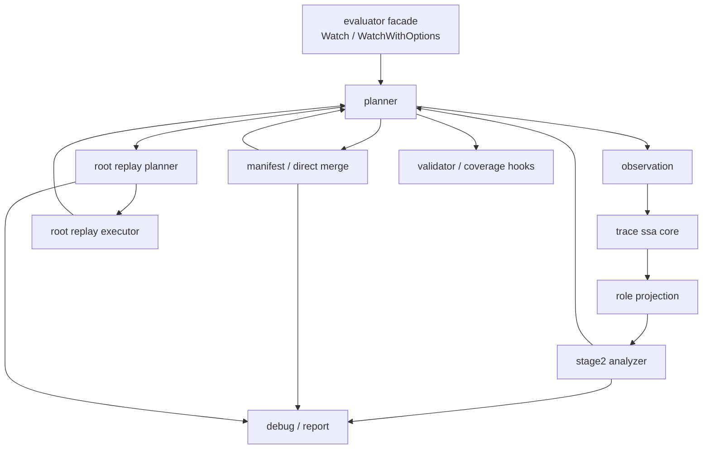

# LLAR Evaluator 重构方案：以 Trace SSA 为中心的彻底收口

## 1. 目标

这份方案解决的不是“再修几个 case”，而是把当前 `internal/evaluator/` 从反复叠补丁后的混层状态，收口成一套可以继续演进的分层架构。

推荐目标只有一个：

> **把 Trace SSA 明确成 Stage 2 的唯一核心 IR，把 planner / synthesis / validator 从当前混层里彻底剥离。**

这不是抽象洁癖，而是为了停止以下几类反复返工：

- Stage 2 规则散落在 `evaluator.go`、`impact.go`、`graph.go`、`debug.go`
- Stage 3 的 direct merge / root replay 和 planner 决策缠在一起
- `Watch` 与 `WatchWithOptions` 走出两套不同的证据链
- debug helper 混进生产主路径，导致职责边界持续漂移

---

## 2. 当前问题，不靠感觉，先看代码分布

当前 `internal/evaluator/` 的大文件已经直接说明混层问题：

- `evaluator.go`: 1158 行  
  同时承担 public facade、singleton 采样、碰撞判定、component planner、Stage 3 hook 编排。

- `replay.go`: 1045 行  
  同时承担 replay root 扫描、argv/env 参数合并、工作区 clone、build-root 准备、命令执行。

- `debug.go`: 857 行  
  里面不仅有调试输出，还有生产路径依赖的 `matchActionFingerprints`。

- `impact.go`: 802 行  
  同时承担 baseline/probe 对齐、mutation root 分类、Path-SSA 构建、传播分析、`Need/FS` 提取。

- `graph_roles.go`: 708 行  
  角色启发式单独很大，但它的输入和输出边界没有被 Trace SSA 核心层明确隔开。

- `graph.go`: 605 行  
  同时承担 raw graph 构建、action kind 分类、fingerprint/structure key 生成、路径噪音策略。

- `graph_input.go`: 487 行  
  负责事件折叠与 record 归一化，但当前没有被正式定义成“Stage 2 观测层”。

这几个文件的共同问题不是“代码长”，而是：

1. 核心 IR 没有独立所有权  
   `Path-SSA` 逻辑在 `impact.go`，matching 在 `debug.go`，graph identity 在 `graph.go`，planner 却又直接吃这些内部结构。

2. planner 和分析器互相穿透  
   `evaluator.go` 既知道 Stage 2 profile 细节，也知道 Stage 3 synthesis 细节，还直接决定 pair/component 组合。

3. 生产逻辑和调试逻辑没有硬边界  
   例如 `matchActionFingerprints` 在 `debug.go`，但它是 `analyzeImpactWithEvidence` 的正式依赖。

4. Stage 3 没有内部再分层  
   replay root 识别、参数合并、工作目录 materialize、执行策略全挤在 `replay.go`。

---

## 3. 重构原则

这次重构建议遵守四条硬原则：

### 3.1 保留一个 facade，拆内部，不先拆 API

对外仍保留：

- `Watch`
- `WatchWithOptions`

第一阶段不先改外部调用面，而是先把内部职责切开。  
否则会先把调用层打散，再在一堆移动的接口上继续加补丁。

### 3.2 Trace SSA 是 Stage 2 的唯一正式 IR

Stage 2 不再允许同时存在：

- 一套“graph/path 集合”主逻辑
- 一套“SSA”补充逻辑

应改成：

- 观测归一化 -> Path-SSA -> 角色投影 -> impact/hazard 摘要 -> planner 消费摘要

planner 不再直接理解 Path-SSA 内部结构。

### 3.3 Stage 3 拆成 merge、replay-plan、replay-exec 三段

当前 `replay.go` 最大的问题不是功能多，而是没有中间边界。  
重构后必须拆成：

- root 识别与对齐
- 参数域合并
- replay 工作区 materialize 与执行

这样才能分别测试，也才能让 planner 只依赖 synthesis 结果，而不是依赖 replay 内部启发式。

### 3.4 debug/report 只能做旁路，不得承载生产算法

调试输出和 explain/report 可以依赖生产数据结构。  
生产路径不能反过来依赖 debug 文件里的实现。

---

## 4. 目标架构



这张图要表达三个硬边界：

1. planner 只消费摘要结果  
   不直接操作 SSA 细节，不直接执行 merge/replay。

2. Stage 2 只负责构建正交证明  
   不碰 output tree，不碰 validator。

3. synthesis 是独立子系统  
   direct merge 和 root replay 都是 Stage 3 的实现路径，不是 planner 的内嵌细节。

---

## 5. 目标模块边界

### 5.1 `facade`

保留在 `internal/evaluator` 根包：

- `Watch`
- `WatchWithOptions`
- `ProbeResult`
- `WatchOptions`

职责：

- 组织入口参数
- 调用 planner
- 维持对外兼容 API

不再承担：

- Stage 2 profile 计算
- pair 碰撞算法
- synthesis 细节编排

### 5.2 `observation`

来源：

- 当前 `graph_input.go`
- 当前 `graph.go` 里的路径 canonicalization、scope token 归一化、原始观测建图入口

职责：

- 把 `Trace/Events` 归一化成稳定执行观测
- 保留 `argv/cwd/env/inputs/changes/parent` 等黑盒证据
- 提供 build-root digest 证据入口

不负责：

- `tooling/probe/mainline` 判定
- hazard 分析
- planner 决策

### 5.3 `ssa`

来源：

- 当前 `impact.go` 的 `pathSSA`、`pathSSADef`、`pathSSARead`
- 当前 `impact.go` 的 `causalOrder`
- 当前 `impact.go` 的 `reachingDefsForRead`

职责：

- Path-SSA 图对象
- 路径状态版本
- tombstone
- 保守因果偏序
- reaching-def / def-use / use-def

不负责：

- option mutation root 识别
- `Need/FS` 业务摘要
- planner / merge / replay

### 5.4 `role`

来源：

- 当前 `graph_roles.go`
- 当前 `graph.go` / `evaluator.go` 里零散的 `probe/tooling/delivery` 判定

职责：

- 在 SSA 图或其执行节点视图上叠加旁路角色标签
- 生成主线投影与允许面标签

不负责：

- 修改 SSA 核心对象定义
- 直接决定 pair 是否可跳过

### 5.5 `stage2`

来源：

- 当前 `impact.go`
- 当前 `evaluator.go` 的 `optionProfile` / `profilesCollide`
- 当前 `debug.go` 里实为生产逻辑的 matching 代码

职责：

- baseline/probe 对齐
- mutation root 识别
- `SeedDef/Need/Flow/Frontier` 提取
- RAW / WAW / merge-surface hazard 判定
- 输出统一的 `ImpactProfile`

不负责：

- 物化输出目录
- root replay
- 最终执行矩阵展开

### 5.6 `synth`

来源：

- 当前 `manifest.go`
- 当前 `merge.go`
- 当前 `synthesis.go`
- 当前 `replay.go`

职责：

- output manifest diff / materialization
- direct merge
- root replay plan
- root replay exec
- 统一输出 `SynthesisResult`

内部再拆成三个子模块：

1. `synth/merge`
2. `synth/replayplan`
3. `synth/replayexec`

### 5.7 `planner`

来源：

- 当前 `evaluator.go` 的 component 生成、pair 连接、`validatedCollisionComponents`

职责：

- 调度 baseline / singleton probe
- 汇总 Stage 2 / Stage 3 / Stage 4 结果
- 构造最终需要物理执行的 combos

不负责：

- 自己实现 Stage 2 算法
- 自己实现 merge/replay

### 5.8 `report`

来源：

- 当前 `debug.go`
- 当前 `report.go`

职责：

- explain
- trace / graph / synthesis 调试输出
- human-readable 诊断

要求：

- 不得再被生产路径反向依赖

---

## 6. 当前文件到目标模块的映射

| 当前文件 | 当前问题 | 目标归属 |
| --- | --- | --- |
| `evaluator.go` | facade、planner、Stage 2/3 编排混在一起 | `facade` + `planner` |
| `graph_input.go` | 已承担观测归一化，但没有正式层级 | `observation` |
| `graph.go` | raw graph、identity、噪音策略混在一起 | `observation` + 少量 `stage2` 辅助 |
| `graph_roles.go` | 角色层独立但未被正式定义 | `role` |
| `impact.go` | SSA core 与 impact summary 混在一起 | `ssa` + `stage2` |
| `debug.go` | debug 与生产 helper 混在一起 | `report` + 抽走生产逻辑 |
| `manifest.go` | manifest 逻辑相对纯 | `synth/merge` |
| `merge.go` | direct merge 相对纯，但与 planner 边界需拉直 | `synth/merge` |
| `synthesis.go` | orchestration 过薄但决策顺序错误风险高 | `synth` |
| `replay.go` | replay plan / exec / workspace 操作全耦合 | `synth/replayplan` + `synth/replayexec` |

---

## 7. 推荐迁移顺序

推荐走 **两阶段、七步**，而不是一次性大搬家。

### 阶段一：先切职责，不切 import 面

#### 第 1 步：冻结语义边界

先补测试，不先搬代码。至少锁住：

- sqlite `json1` digest no-op 这类 Stage 2 证据规则
- Stage 2 hard collision 与 Stage 3 synthesis 的边界
- replay 准入和失败回退规则
- plain `Watch` 与 `WatchWithOptions` 的预期差异

目标不是让老代码变漂亮，而是防止重构期间语义继续漂。

#### 第 2 步：把 `evaluator.go` 缩成 facade + planner

先迁出：

- `optionProfile`
- pair/component 构图
- `validatedCollisionComponents`
- `sampleUnit` 相关展开逻辑

完成标准：

- `evaluator.go` 只剩入口 API、参数组装和极少量 glue

#### 第 3 步：抽出 `observation`

把：

- `buildObservationFromProbe`
- event 折叠
- record normalizer
- scope/path canonicalization

统一收进观测层。  
这一步做完后，Stage 2 不再直接面对原始 `Trace/Event`。

#### 第 4 步：抽出 `ssa`

把：

- `pathSSA`
- `causalOrder`
- `reachingDefsForRead`
- def-use helpers

从 `impact.go` 移到独立核心层。  
`stage2` 从此只消费 SSA API，不再自己拼内部结构。

### 阶段二：再切 planner / synthesis 的硬边界

#### 第 5 步：重写 `stage2`

在 `ssa + role` 之上重建：

- mutation root 识别
- `SeedDef/Need/Flow/Frontier`
- hazard assessment
- `ImpactProfile`

同时把 `debug.go` 里的生产 helper 挪走。  
完成后，planner 只认识 `ImpactProfile`，不认识底层 graph/SSA 细节。

#### 第 6 步：拆 `synth`

按下面顺序拆：

1. 先把 `manifest + direct merge` 独立出来
2. 再把 replay root 扫描和 argv/env merge 拆成 `replayplan`
3. 最后把 clone/build-root/exec 拆成 `replayexec`

这一步必须同时修正文档与实现边界：

- Stage 2 hard collision 是否允许被 softening，取决于 `root replay`
- direct merge 不能再越权修改 Stage 2 语义
- replay 候选规划和 replay 执行结果要分开表达

#### 第 7 步：统一 planner 证据链

最终 planner 只允许有一套主流程：

```text
baseline + singletons
-> Stage 2 summary
-> Stage 3 synthesis certification
-> Stage 4 validator
-> execution graph
```

`Watch` 可以保留简化策略，但不能再绕开这条正式证据链，至少不能在 pair 判定上走完全不同的语义。

---

## 8. 这次重构里最应该删掉的东西

不是所有代码都值得迁移。有三类东西应该主动删除，而不是原样搬运：

### 8.1 debug 文件里的生产 helper

例如：

- `matchActionFingerprints`

这类函数必须迁回 `stage2` 或 `observation`。  
`debug.go` 只保留 explain 和 dump。

### 8.2 planner 对底层 graph 细节的直连

planner 不应再直接碰：

- raw graph indexes
- path writer/reader sets
- role 判定细节

否则拆了文件也还是同一个泥团。

### 8.3 `replay.go` 里的大一统过程函数

像“扫描 root -> 合并参数 -> clone 目录 -> 准备 build root -> 执行命令 -> 汇总结果”这种大流程，必须拆成多个可测步骤。  
否则 replay 还会继续成为新的补丁黑洞。

---

## 9. 完成标准

这次重构完成，不看“是否换了很多文件”，只看下面几个标准：

1. `evaluator.go` 收缩成薄 facade  
   不再承载 Stage 2/3 主算法。

2. Stage 2 有唯一正式 IR  
   即 Trace SSA，而不是 graph/path set/SSA 三套并存。

3. planner 只消费摘要  
   不再理解 SSA 内部细节，不再操作 output tree。

4. debug/report 不再承载生产算法  
   生产路径从依赖上与 `debug.go` 断开。

5. replay plan 与 replay exec 分离  
   允许单测只验证 replay 规划，不必真的跑命令。

6. `Watch` 与 `WatchWithOptions` 共享同一条正式证据链  
   差异只能体现在策略钩子和认证级别上，不能体现在核心语义上。

---

## 10. 推荐落地方式

推荐先做：

1. 文档补齐  
   先把 Trace SSA 在总设计里的位置写死。

2. 测试补齐  
   先把要保留的语义钉住。

3. 语义拆分  
   先在同一个 Go package 内按模块拆文件。

4. 再评估是否升成子包  
   只有当边界稳定后，再把 `ssa`、`stage2`、`synth` 等提升成子包。

这是更稳的路线。  
如果一开始就跨包大搬家，当前这些混层会直接变成跨包耦合，后面更难收。
