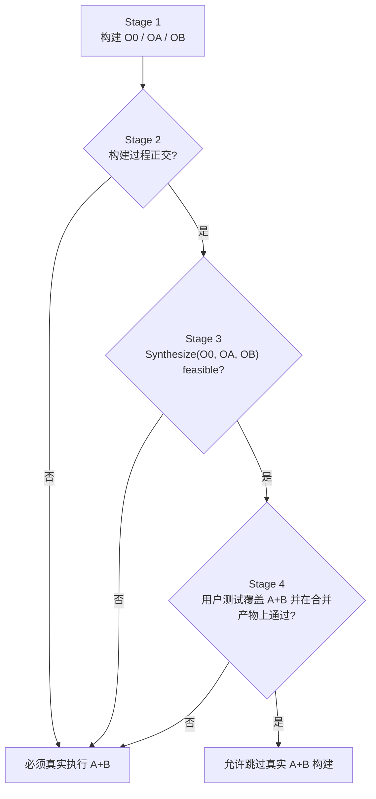
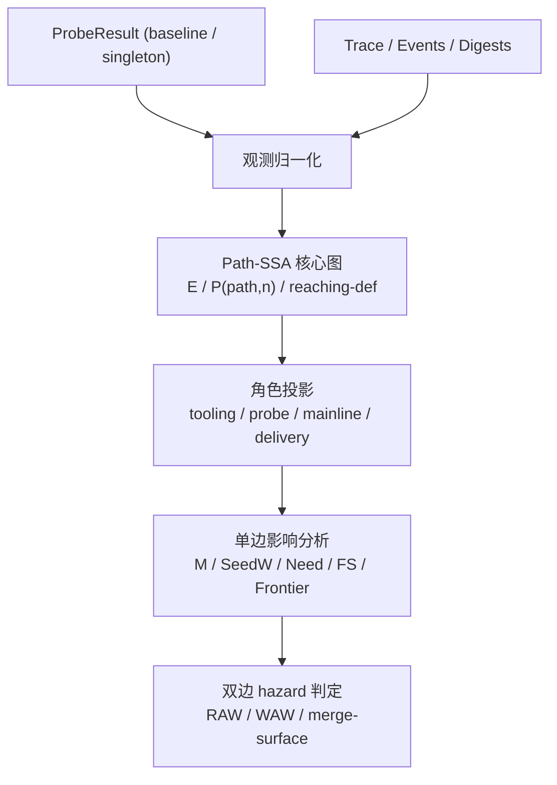

# LLAR 矩阵降维设计方案：以正交证明、产物合并与测试覆盖为证据链

## 1. 设计目标

LLAR 要解决的不是“把所有 options 组合都跑完”，而是在黑盒条件下，**保守地减少必须物理执行的组合数**。

本文只讨论最核心的一步：当两个选项 `A` 和 `B` 同时出现时，系统在什么条件下可以安全跳过真实的 `A+B` 组合构建。

本方案不依赖源码语义分析，不尝试静态理解 ABI，也不假设特定语言工具链。系统只使用三类可观测证据：

1. 构建过程证据：trace 形成的稳定路径依赖图，以及基于它提取的 `M(X) / Need(X) / FS(X)` 单边影响摘要
2. 产物证据：输出目录 manifest 与三方合并结果
3. 语义证据：用户为 `A+B` 组合显式编写并声明覆盖的测试

---

## 2. 核心结论

如果要跳过真实的 `Build(A+B)`，必须同时满足下面三个条件：

1. `A` 与 `B` 在构建过程中被证明正交
2. `A` 与 `B` 的产物相对 baseline 可以被自动合并并物化
3. 用户测试明确覆盖 `A+B` 组合，并且该测试在合并产物上通过

换句话说，系统最终放行的不是“图上看起来没撞”，而是下面这条完整证据链：

```text
单项构建可观测
    -> 构建过程正交
    -> 产物三方合并可自动完成
    -> A+B 组合测试在合并产物上通过
    -> 才允许跳过真实的 A+B 组合构建
```

这三层证据缺一不可：

- 只有图上正交，不足以证明最终产物可组合
- 只有产物能 merge，不足以证明组合语义正确
- 只有用户测试，不足以证明可以跳过真实构建过程

---

## 3. 基本记号

对同一个 baseline 环境，定义四个构建结果：

- `O0 = Build(Ø)`：默认选项或 baseline 组合
- `OA = Build(A)`：只打开选项 `A`
- `OB = Build(B)`：只打开选项 `B`
- `OAB = Build(A+B)`：同时打开 `A` 和 `B`

系统真正想验证的是下面这个理想关系：

```text
如果 A 与 B 在构建过程上正交，
那么理想的组合产物应满足：

OAB == Merge(O0, OA, OB)
```

这里的 `Merge(O0, OA, OB)` 不是抽象概念，而是对应 `internal/evaluator/merge.go` 的三方合并语义：

- `O0` 是 base
- `OA` 是 left
- `OB` 是 right

如果三方合并无法自动物化 merged result，系统就不能声称 `A+B` 可以被安全跳过。

---

## 4. 总体流程



这个流程的关键点是：

- Stage 2 解决“构建过程有没有耦合”
- Stage 3 解决“最终产物能不能被直接合成，或被受限 replay 合成”
- Stage 4 解决“组合语义有没有被用户真正测试”

---

## 5. Stage 1：单项构建采样

### 5.1 目标

对每个候选选项，先拿到它相对于 baseline 的单变量变化，而不是直接跑大笛卡尔积。

### 5.2 输入与输出

输入：

- baseline 组合 `Ø`
- 单项组合 `A`
- 单项组合 `B`

输出：

- `O0 / OA / OB` 的 trace 记录
- 基于 trace 构建的 action graph
- 输出目录的 `OutputManifest`
- 相对 baseline 的 `output diff`

### 5.3 设计理由

矩阵降维的最小可信单位不是“猜测哪个选项可能独立”，而是“先把每个单项选项在真实构建里的影响量采出来”。没有这一步，后面的正交分析和产物合并都没有证据基础。

---

## 6. Stage 2：构建过程正交证明

Stage 2 只回答一个问题：

> `A` 和 `B` 在构建链路里是不是互相干扰？

这里只看构建过程，不看最终测试语义。

### 6.1 核心思路：单边影响分析，而不是双边差分图对比

Stage 2 不再把问题建模成：

```text
先得到 Δ(A) 图 和 Δ(B) 图
再去做两张差分图的结构对比
```

这条路会自然滑向节点对齐、锚点、错序、语义归属等复杂问题。

本方案改用更保守的单边分析模型：

1. 每个 option 先各自相对 baseline 做影响分析
2. 分别提取它的直接变更源与前向波及区
3. 最后只判断两边是否存在依赖干涉，以及它们的交集是否只落在允许合并的汇聚面

也就是说，Stage 2 的核心不是“图对图匹配”，而是：

```text
单边影响分析
    -> 双边干涉判定
    -> 仅允许在 merge surface 上汇聚
```

### 6.2 基础抽象

对任意单项 option `X`，系统只定义四个对象：

- `M(X)`：直接变更源（mutation sources）
- `SeedW(X)`：由 `M(X)` 直接写出的稳定路径集合
- `Need(X)`：`M(X)` 为了成立而读取的稳定前提路径集合
- `FS(X)`：从 `SeedW(X)` 出发，在稳定路径依赖图上的前向波及闭包（forward slice）

这里要强调两点：

1. `M(X)` 不是“所有变了的记录”，而是最小的直接起火点
2. `FS(X)` 才负责覆盖那些“命令本身没改，但因为上游输入变化而被带着重跑”的节点和路径

因此，Stage 2 要回答的不是：

```text
A 和 B 的差分图怎么精确配准？
```

而是：

```text
A 从哪里开始产生直接变更？
A 的影响沿依赖传播到了哪里？
这些影响是否在中途干涉了 B 的直接变更前提？
如果两边最终相遇，相遇点是否属于允许交给 Stage 3 的 merge surface？
```

### 6.3 稳定路径依赖图

Stage 2 的坐标系是稳定路径，而不是动作语义类型。

系统只使用 trace 中原始可观测的：

- `Inputs`
- `Changes`
- `Cwd`
- `Argv`

来构造稳定路径依赖图：

- 节点不按 compile、link、archive 之类的语义分类
- 每条 trace record 只被视为一个普通的读写 tuple
- 边由“某条稳定路径被写出后，又被后续记录读取”来定义

这里的“稳定路径”是：

- 保留工作区、构建目录、最终输出中的持久路径
- 过滤纯 tmp 噪音和只造成观测抖动的瞬时路径
- 不因为并发时序变化而改变身份

因此，Stage 2 仍然是图分析，但它分析的是：

```text
路径依赖图
```

而不是：

```text
动作语义图
```

这里还需要补一条此前文档里缺失、但实现和重构都必须对齐的约束：

> **Stage 2 的证明对象仍然是稳定路径，但它在工程实现上的正式核心 IR 应是 Trace SSA V5，而不是直接在坍缩 action graph 上做路径集合启发式。**

也就是说：

- 从证明语义上，Stage 2 依然围绕稳定路径、`M/SeedW/Need/FS` 和 hazard 判定展开
- 从内部表示上，应该先把 trace 归一化成执行节点 `E` 与路径状态版本 `P(path, n)` 组成的 Path-SSA
- `Need/FS/frontier/hazard` 都应从这张 SSA 图上导出，而不是作为独立的 ad-hoc BFS 逻辑散落在 planner 里

`doc/llar-trace-ssa-v5-design.md` 定义的是这层正式 IR；本文定义的是它在矩阵降维总证据链里的职责边界。

### 6.3.1 Trace SSA 在 Stage 2 中的位置

Stage 2 的正确实现流水线应该是：



这条流水线里，四层职责不能混：

1. 观测归一化层  
   只负责把 `Trace/Events` 变成稳定的执行节点观测，做路径 canonicalization、scope token 归一化、父子进程折叠。

2. Path-SSA 核心层  
   只负责构造 `E -> P -> E` 的路径状态版本图、reaching-def、tombstone 与保守因果偏序。

3. 角色投影层  
   只负责在 SSA 图上叠加 `tooling/probe/mainline/delivery` 等旁路标签；标签不是核心图对象本体。

4. Impact / Hazard 层  
   只负责把 baseline 与 singleton 的 SSA 差异压成 `M/SeedW/Need/FS/Frontier`，并据此做双边干涉判定。

### 6.3.2 本文与 Trace SSA 文档的关系

两份文档的分工应明确写死：

- `llar-matrix-reduction-design.md` 负责定义 Stage 1/2/3/4 的总证据链，以及 planner 在什么条件下允许跳过真实 `A+B`
- `llar-trace-ssa-v5-design.md` 负责定义 Stage 2 的正式内部模型、核心对象与数据流算法

因此：

- Stage 2 的算法、IR 和边界，以 Trace SSA 文档为准
- 跳过组合所需的总放行条件，以本文为准
- Stage 3/4 不能回写成 Stage 2 的核心图语义；它们只能消费 Stage 2 的摘要结果

换句话说，Trace SSA 不是“另一个平行方案”，而是本文 Stage 2 的正式实现模型。

### 6.4 如何提取 `M(X)` 与 `FS(X)`

对 `OX` 相对 `O0` 的单边分析，系统按下面的顺序工作。

#### 6.4.1 先找直接变更源 `M(X)`

把 `OX` 与 `O0` 比较时，系统首先要区分两类变化：

1. option 直接引入的新记录或直接改写过的记录
2. 因为上游路径变了，被动重跑的记录

只有第 1 类进入 `M(X)`。

文档上的定义是：

> 如果一条记录在 `OX` 中是新增的，或者它自身的结构骨架已经变化，并且这种变化不能仅由某条已经受影响的上游路径解释，那么它属于 `M(X)`。

这里的“结构骨架”只允许依赖黑盒可观测项，例如：

- 归一化后的 `Argv`
- `Cwd`
- 稳定读路径集合
- 稳定写路径集合

本方案不要求系统识别“这是不是编译”“这是不是链接”，也不引入 compile/link/archive 语义分类器。

#### 6.4.2 再取 `SeedW(X)` 与 `Need(X)`

一旦 `M(X)` 确定下来，就投影出两类路径：

- `SeedW(X)`：这些直接变更源写出的稳定路径
- `Need(X)`：这些直接变更源依赖的稳定前提路径，以及从 `SeedW(X)` 向前传播时、由下游受影响动作新引入的外部稳定依赖

这一步的意义是把“记录层的直接变更”压成“路径层的可比较对象”。

这里有两个实现约束需要写死：

- `SeedW/Need/FS` 一律存成 scope-canonical 路径键（例如 `$BUILD/...`、`$INSTALL/...`），不能直接保留每个 combo 私有的临时根路径。
- “被重写但内容与 base 相同”的路径不能进入 `SeedW(X)`；否则像 `trace_options.h` 这类由 configure 反复改写、但内容未变的 build-root 文件会制造伪碰撞。
- 对 build-root 中间产物，不能再把“动作重跑过”当成“内容一定变了”。Stage 2 必须优先使用 trace 观测到的 build-root 路径 digest 证据（`Inputs + Changes` 的并集）来判断 `_build/*` 路径是否真的变化；否则像 `expat_config.h` 变化触发重编、但 `xmlparse.c.o` / `libexpat.a` 内容实际未变的 case，会被错误传播成整库硬碰撞。
- `Need(X)` 不能机械地把所有下游 reader 的输入都收进来；对于与 base 有同一路径输出基线的下游动作，只应保留“相对 base 新出现的外部依赖”，否则像最终链接动作里本来就存在的兄弟输入会制造伪干涉。
- `Need(X)` 里的“下游受影响动作”只限非 delivery / install-only reader；安装复制这类动作会重新读共享库、头文件和 install 控制文件，但它们不构成上游 feature 的真实组合前提，不能反向污染 `Need(X)`。
- configure / probe 子图里的自检噪音不进入 impact 域；判定依据不是固定工具或固定目录名，而是“两重 tooling 识别”：
  - 第一重先标出显式 tooling / configure action。
  - 第二重再从这些 action 出发，提升由其派生出来、读集封闭在 control-plane / probe-island 内、且不依赖仓库内真实源码输入的 probe 子动作。这里不能只看“是否直接被 tooling 启动”，还要接受一种更弱但必要的证据：如果某个 `gmake/cc/ld` generic 动作的 `cwd` 已经落在 probe/control-plane 子树里，且它的读写没有逃逸到主线，那么它也属于 probe island，必须整体吸进 tooling；否则像 CMake `try_compile` 这种隔着一层 generic wrapper 的自检小岛会漏回 impact 域。
  只有当一条路径的所有 writer / reader 都落在这类 probe / tooling 子图里，且没有非 tooling 主线消费时，它才会被视为噪音；这类路径既不能作为 `SeedW(X)`，也不能沿 `FS(X)` 传播，否则会把原本只共享 configure root 的宏开关误连成一个全互撞分量。

这一条是后面真实 case 校正出来的，不是抽象上的洁癖。

### 6.4.2.1 一个真实误判：`api + cli`

`traceoptions` 这个真实样本里：

- `api-on` 会改 `trace_options.h`
- `trace_options.h` 会波及 `core.o`
- `core.o` 会进一步波及 `libtracecore.a`
- `cli-on` 会新增 `tracecli`
- `tracecli` 的链接动作会读取 `libtracecore.a`

如果 `Need(cli)` 只记录 mutation root 的直接输入，那么它只能看到：

```text
Need(cli) = { cli.c, trace.h }
```

此时即使：

```text
FS(api) = { trace_options.h, core.o, libtracecore.a, ... }
```

也会因为：

```text
FS(api) ∩ Need(cli) = ∅
```

而把 `api` 和 `cli` 误判成图上正交。

但真实依赖关系并不是这样。`cli` 的新增最终要靠 `tracecli` 的链接动作成立，而那个链接动作对 `libtracecore.a` 有新的外部依赖。因此这里真正应该被记录的是：

```text
Need(cli) = { cli.c, trace.h, libtracecore.a }
```

这样才会得到：

```text
FS(api) ∩ Need(cli) = { libtracecore.a }
```

从而在 Stage 2 直接判碰撞。

### 6.4.2.2 为什么不能把所有下游输入都塞进 `Need(X)`

反过来，如果把所有受影响下游动作的输入都机械塞进 `Need(X)`，又会制造新的伪干涉。

还是看一个最小例子：

- `api` 通过 `protoc` 新增了 `api.c/api.h`
- `server.o` 因为读到新的 `api.h` 被波及重编
- 最终链接动作从：

```text
cc server.o utils.o -o app.exe
```

变成：

```text
cc server.o utils.o api.o -o app.exe
```

这里真正新增的外部依赖是：

```text
api.o
```

而不是：

```text
utils.o
```

因为 `utils.o` 在 base 的同一个 `app.exe` 链接动作里本来就已经存在。  
如果把 `utils.o` 也放进 `Need(api)`，那任何会波及 `utils.o` 的另一边 option 都会被错误判成干涉。

因此实现上必须再加一层基线对齐：

- 如果某个受影响下游动作在 base 中有“同一路径输出”的唯一 writer
- 就用那个 base writer 的读集作为 baseline
- 只把 probe 相对 base **新出现的外部依赖** 记入 `Need(X)`
- 同时跳过纯 delivery / install-only reader 的读集

也就是说，`Need(X)` 的正确语义不是：

```text
所有下游动作读过的东西
```

而是：

```text
direct root prerequisites
+ downstream newly introduced external dependencies
- baseline-existing sibling inputs
```

#### 6.4.3 最后算前向波及区 `FS(X)`

从 `SeedW(X)` 出发，沿稳定路径依赖图做前向闭包，得到：

```text
FS(X) = 所有会因为 SeedW(X) 的变化而被影响到的稳定路径集合
```

`FS(X)` 既包含：

- 直接新增或改写产生的路径

也包含：

- 因为上游输入变化而被带着重跑的下游路径

因此，`FS(X)` 不是“起火点”，而是“火势范围”。

### 6.5 双边干涉判定

拿到 `A` 和 `B` 的单边分析结果后，Stage 2 只做三条判定。

#### 6.5.1 第一定律：直接变更源不能撞在一起

如果两边的直接变更源在路径层立刻发生重叠，就说明它们在同一个局部位点上同时点火。

路径层可以写成：

```text
SeedW(A) ∩ SeedW(B) = ∅
```

如果这里非空，Stage 2 直接判碰撞。

#### 6.5.2 第二定律：一边的波及区不能污染另一边的前提

如果 `A` 的前向波及区已经进入 `B` 的直接变更前提，说明 `B` 的“起火条件”本身被 `A` 改写了；反之亦然。

判定式为：

```text
FS(A) ∩ Need(B) = ∅
FS(B) ∩ Need(A) = ∅
```

只要任一非空，就说明两边存在依赖干涉，Stage 2 必须判碰撞。

#### 6.5.3 第三定律：允许汇聚，但只能汇聚到 merge surface

两边的波及区不要求完全不相交。

下面这种情况是允许的：

- `A` 和 `B` 在中途没有依赖干涉
- 但它们最终都汇聚到了某个允许交给 Stage 3 的输出面

因此，`FS(A) ∩ FS(B)` 非空并不自动判撞。只有当交集落在 merge surface 之外，才算碰撞。

文档中把 merge surface 定义为：

- 最终输出 manifest 中的稳定输出路径
- 以及与 Stage 3 三方合并同级的 metadata surface

也就是说：

- 中途传播路径上的交集：Stage 2 直接拦截
- 最终汇聚面上的交集：允许交给 Stage 3 判断能否 clean merge

### 6.6 一个最小例子

假设 baseline `O0` 是：

```text
gcc -c server.c -o server.o
gcc -c utils.c  -o utils.o
gcc server.o utils.o -o app.exe
```

单开 `A` 后，引入 protobuf 代码生成：

```text
protoc api.proto -> api.c, api.h
gcc -c server.c -o server.o
gcc -c api.c    -o api.o
gcc server.o utils.o api.o -o app.exe
```

在这个模型里：

- `M(A)` 的最小直接变更源是新增的 protobuf 生成与新增的 `api.c -> api.o` 编译
- `SeedW(A) = { api.c, api.h, api.o }`
- `Need(A) = { api.proto }`
- `FS(A) = { api.c, api.h, api.o, server.o, app.exe }`

其中：

- `server.o` 虽然发生了变化，但它不是 `M(A)`，而是因为读到了新的 `api.h` 被波及
- `app.exe` 也属于最终波及结果，而不是独立的起火点

单开 `B` 后，打开日志宏：

```text
gcc -DLOG_ON -c utils.c -o utils.o
gcc server.o utils.o -o app.exe
```

则：

- `M(B)` 是被直接改写的 `utils.c -> utils.o`
- `SeedW(B) = { utils.o }`
- `Need(B) = { utils.c }`
- `FS(B) = { utils.o, app.exe }`

现在套用三条判定：

1. `SeedW(A) ∩ SeedW(B) = ∅`
2. `FS(A) ∩ Need(B) = ∅`
3. `FS(B) ∩ Need(A) = ∅`
4. `FS(A) ∩ FS(B) = { app.exe }`

前 3 条都通过，说明两边没有中途依赖干涉。

第 4 条虽然有交集，但交集只落在最终输出 `app.exe` 上，因此它属于 merge surface，允许进入 Stage 3。

如果 Stage 3 发现 `app.exe` 是无法三方合并的二进制，就在那里回退真实执行；Stage 2 不需要提前把这种“最终汇聚但尚未证明不可合并”的场景判死。

### 6.7 Stage 2 的结论

Stage 2 的职责被明确收窄为：

> 证明 `A` 与 `B` 在构建传播链路中没有中途依赖干涉，并且它们的交集只可能出现在允许交给 Stage 3 的汇聚面上。

因此，Stage 2 通过的含义不是“`A+B` 一定成立”，而只是：

- 两边没有在中途互相污染对方的直接变更前提
- 如果存在汇聚，汇聚只发生在 merge surface

这仍然只是前置条件，而不是最终放行条件。

---

## 7. Stage 3：产物合成验证（Merge or Root Replay）

这是本方案区别于“只靠双图判定”的核心增强。

### 7.1 核心思想

如果 Stage 2 已经证明 `A` 和 `B` 构建正交，那么系统对最终产物应当有一个更强的期望：

```text
理想的 A+B 产物
==
把 OA 和 OB 相对 O0 的变化做受限合成后的结果
```

因此，Stage 3 不再停留在“图上可推导”，而是把这个推导落到产物层：

```text
SynthesizedAB = Synthesize(O0, OA, OB)
```

这里的 `Synthesize` 不是单一操作，而是两条受限路径：

1. `direct merge`：只对已有显式组合算子的产物面直接做三方合并
2. `root replay`：对无法直接 merge、但 root 清晰且参数域简单的生成器/构建根，做参数合并与最小必要重放

只要 `SynthesizedAB` 不能被自动生成并物化，`A+B` 就不能被认证为可跳过组合。

### 7.2 为什么 merge 是必要的

图上正交解决的是“过程看起来没撞”，但真实系统里还存在另一类问题：

- 两边最终都改了同一份普通文本配置，但可以自动三方合并
- 两边都改了同一份生成器产物，但冲突真正发生在上游参数域，应该回到 root 做受限 replay
- 两边都改了同一个 archive，但成员级别互不冲突
- 两边 metadata 都变化了，但 flag 追加顺序仍然可收敛
- 或者反过来，图上看似没明显传播冲突，但最终产物层面无法收敛

这些都只能在产物层回答，不能只靠构建过程回答。

### 7.3 Stage 3 的两条合成路径

Stage 3 不再被理解成“只有 `merge.go` 一条路”，而是：

#### 7.3.1 Direct Merge

`internal/evaluator/merge.go` 继续负责那些已经有显式组合算子的产物面：

- metadata 仍然做三方合并
- 普通文本文件仍然走 three-way merge
- archive 仍然走 member 级别 merge

但这里要明确一个边界：

> `config.h`、`expat_config.h` 这类生成器产物，不应再被视为“优先靠文本 merge 解决”的对象。

如果它们的冲突来自上游 generator/configure 参数，那么它们应优先进入 replay 路径，而不是把“同行冲突但语义可能可并”的问题硬塞给文本 merge。

#### 7.3.2 Root Replay

对于 direct merge 做不到、但满足 replay 准入条件的产物，Stage 3 允许走 root replay：

- 先识别变化路径最近、且可参数化的 replay root
- 再把 `A` 与 `B` 相对 `O0` 的 root 参数差异做组合
- 最后只重放真正同时依赖 A/B 信息的 mixed frontier

这条路径的目标不是替代全量 `Build(A+B)`，而是：

```text
只重放最小必要子图
```

也就是说，Stage 3 的目标从“纯 merge”扩展成：

```text
能 direct merge 的先 merge
不能 direct merge 但 root replay 成本足够低的，走受限 replay
其余情况全部回退
```

### 7.4 `merge.go` 在这里的职责

`internal/evaluator/merge.go` 提供的不是“简单目录拼接”，而是相对 base 的三方合并：

- metadata 必须可合并
- 每个输出路径必须可合并
- 普通文本文件走 three-way merge
- archive 走 member 级别 merge
- 无法自动合并并物化的变化必须降级为 `needs-rebuild`

最终它会重新生成 merged tree，并重算 manifest。

因此，Stage 3 的 direct merge 认证条件不是“目录里没重名文件”，而是：

1. `MergeOutputTrees(O0, OA, OB)` 返回 `merged`
2. merged tree 可以被重新 materialize
3. merged manifest 是稳定可计算的

如果 direct merge 失败，系统还可以进一步尝试 root replay；只有两条路径都失败，系统才必须回退到真实的 `A+B` 组合执行。

### 7.5 Stage 3 的含义

Stage 3 验证的是：

> `A` 与 `B` 的产物变化是否满足“相对 baseline 可交换，并且能通过 direct merge 或受限 replay 被物化成候选组合产物”。

这一步通过后，系统才有资格进入最后的测试覆盖判定。

### 7.6 `WatchWithOptions` 的执行图如何使用 Stage 3

带 `ValidateSynthesizedPair` 的 `WatchWithOptions` 不能再简单地沿用 “Stage 2 hard collision component -> 全部展开” 这一套规则。否则像 Expat 这类 case 会出现：

- Stage 2 从 `expat_config.h -> xmlparse/xmlrole/xmltok -> libexpat.a` 看到大面积共享传播
- 但其中一部分共享传播其实正是同一个 replay root 可以吸收的传播面
- 如果仍按 Stage 2 硬边直接展开，就会把本来能被 Stage 3 消化掉的 pair 也强行加入执行矩阵

因此，`WatchWithOptions` 在有 synthesis validator 时，实际采用的是：

```text
baseline + singletons
-> 对 singleton pairs 逐个执行 Stage 3 synthesis + Stage 4 validator
-> 只有 synthesis 失败或 validator 失败的 pair 才形成执行图硬边
-> 再从这些“失败 pair”构造 component combos
```

这里还有一个重要边界：

> 只有 `root replay` 才允许软化 Stage 2 的硬碰撞；`direct merge` 虽然可以验证产物可合成，但不能反过来修改 Stage 2 的硬碰撞语义。

也就是说：

- `direct merge` 只负责跳过本来就允许进入验证路径的 pair
- `root replay` 才负责吸收“图上看似共享 configure-root 传播、但实际上可由 replay root 合成”的那类重叠

---

## 8. Stage 4：用户测试覆盖 `A+B` 组合

这是最终放行条件，不是附属建议。

### 8.1 为什么系统不能替代用户测试

前面三步最多证明：

- 构建过程没有观察到耦合
- 产物可以线性合并

但系统仍然不知道：

- `A+B` 的运行时行为是不是符合公式作者预期
- `A+B` 的接口、插件加载、功能联动是否正确
- `A+B` 是否满足包真正承诺给外部用户的语义

这些只能由用户写测试来承担。

### 8.2 测试要求

如果想跳过真实的 `A+B` 构建，用户必须提供明确覆盖 `A+B` 的测试。

这里的“覆盖”不是模糊语义，而应满足：

1. 测试声明自己验证的是 `A+B` 组合能力
2. 测试执行目标是 Stage 3 合成后得到的 `SynthesizedAB`
3. 测试断言的是组合语义，而不是只重复测 `A` 或只重复测 `B`

### 8.3 放行规则

只有当下面三件事同时成立时，`A+B` 才能从真实执行矩阵中移除：

1. Stage 2 正交通过
2. Stage 3 合成通过
3. Stage 4 的 `A+B` 组合测试在 `SynthesizedAB` 上通过

否则：

- 没有覆盖测试：不能跳过
- 有覆盖测试但失败：不能跳过
- 有覆盖测试但无法在 merge 产物上运行：不能跳过

系统的保守回退策略是：**真实执行 `A+B` 组合**。

---

## 9. 决策规则

对于任意候选组合 `A+B`，使用下面的判定：

```text
Skip(A+B) 当且仅当：

OrthogonalBuild(A, B)
&& FeasibleSynthesis(O0, OA, OB)
&& TestCovered(A+B)
&& TestPass(SynthesizedAB)
```

否则：

```text
Execute(A+B)
```

这一定义有两个重要性质：

1. 它是保守的：任何一步证据不足，都不会误跳过真实组合
2. 它是分层的：构建证明、产物验证、语义测试分别承担不同责任

---

## 10. 模块边界

为了避免架构污染，这个方案需要严格区分五类职责：

### 10.1 Probe / Observation 层

职责：

- 采集单项构建 trace
- 归一化 `Trace/Events`
- 提供 digest、manifest、scope 等观测证据

不负责：

- Stage 2 hazard 判定
- 最终产物合并

### 10.2 Trace SSA / Impact 层

职责：

- 构造 Path-SSA 核心图
- 在 SSA 图上叠加 `tooling/probe/mainline/delivery` 角色
- 计算 `M/SeedW/Need/FS/Frontier`
- 给出 Stage 2 的 RAW / WAW / merge-surface 干涉结论

不负责：

- 决定最终执行矩阵
- 直接操作输出目录或执行 replay
- 推断用户测试语义

### 10.3 Manifest / Synthesis 层

职责：

- 计算输出目录 manifest
- 先尝试 direct merge
- 在满足准入条件时规划并执行受限 replay
- 给出 `merged`、`replayed` 或 `needs-rebuild` 的产物级结论

不负责：

- 推断用户要测试什么功能
- 解释 option 的业务语义

### 10.4 Test Coverage 层

职责：

- 接受 `SynthesizedAB`
- 运行用户显式声明覆盖 `A+B` 的测试
- 给出语义验证结果

不负责：

- 判断构建链路正交
- 改写 merge 规则

### 10.5 Planner 层

职责：

- 汇总 Stage 2 / 3 / 4 的结果
- 决定 `A+B` 是跳过还是进入真实执行矩阵

不负责：

- 自己实现 Stage 2 图算法
- 自己执行 direct merge / root replay
- 自己定义用户测试覆盖语义

这样划分的目的很明确：

- 观测层只解决“证据如何稳定落盘与归一化”
- Trace SSA / impact 只解决“构建是否正交”
- synthesis 只解决“产物是否可被直接合成，或被受限 replay 合成”
- 测试只解决“组合语义是否被证明”
- planner 只负责汇总证据并下执行决策

任何一层都不应该越权替代另一层。

---

## 11. MVP 范围

MVP 只做一件事：

> 基于 baseline 与单项构建结果，为二元组合 `A+B` 发放“可跳过真实组合构建”的认证。

暂不在本文解决：

- 三元及更高阶组合的递归推导
- 跨 package 传播后的全局认证
- 语言级 ABI 静态分析
- 用户未声明组合测试时的自动语义推断

先把二元组合的证据链做硬，再考虑更高维度。

---

## 12. Root Replay 准入规则

前面的主证据链在 Stage 3 已经扩展为：

```text
Stage 2 正交
    -> Stage 3 产物合成（direct merge 或 root replay）
    -> Stage 4 组合测试
```

也就是说，文档当前主线不再是“只有纯 merge 一条路”，而是：

- 能 direct merge 的先 merge
- direct merge 做不到时，再判断是否允许进入 root replay
- 两条路径都不成立时，回退真实组合构建

但在真实库日志里，还存在一类比纯 merge 更强、比全量 `Build(A+B)` 更便宜的中间路径：

> 在 Stage 2 已经证明两边没有中途依赖干涉后，不对全图 replay，而只对极少数可参数化的 root 做参数合并与最小必要重放。

### 12.1 核心思路

root replay 不再追求“完全不执行任何构建动作”，而是把目标改成：

```text
避免全量 A+B 构建
```

具体做法是：

1. 用 Stage 2 的单边影响分析先证明 `A` 与 `B` 无坏干涉
2. 把变化路径聚类到少数几个最近、且可参数化的 replay root
3. 只对真正同时依赖 A/B 信息的 mixed frontier 节点做参数合并和最小重放
4. 其余节点直接复用 `O0 / OA / OB` 的现成产物

这里最重要的复杂度控制点是：

- 不追每个产物到最终源码源头
- 不重放整张图
- 只重放 mixed frontier

### 12.2 何时允许进入 root replay

root replay 不是无条件路径，必须同时满足下面条件：

1. Stage 2 已经通过  
   也就是：
   - `SeedW(A) ∩ SeedW(B) = ∅`
   - `FS(A) ∩ Need(B) = ∅`
   - `FS(B) ∩ Need(A) = ∅`
   - 汇聚只落在允许面上

2. root 身份清晰且唯一  
   也就是变化路径能够稳定归类到一个最近 producer root，而不是多个难以区分的 writer。

3. 参数差异落在简单可合并域  
   第一版只考虑：
   - `-DKEY=VALUE`
   - `--key=value`
   - `KEY=VALUE`
   - append-only 选择参数，例如 `--with-foo`

4. root 的下游 fanout 足够窄  
   也就是变化主要落在独立 target 或有限子图，而不是把整个核心库和大面积共享对象全部打脏。

当前第一版实现会用一组保守阈值近似这个条件，例如：

- changed replay root 的数量不能过多
- selected replay frontier root 的数量不能过多
- selected writes 只按最终 materialized / delivery surface 计数，而不是把 configure/build root 的全部中间写路径都算进去
- replay 执行前总是清空并重建目标 build root，避免基线 clone 中遗留的 `CMakeCache.txt`、对象文件或中间缓存污染 replay
- selected frontier 写出的稳定路径数量不能过多

这些阈值的作用是控制 replay 成本，而不是定义语义边界。  
因此它们必须允许中等规模的 `configure -> build -> install` root 继续进入 replay；如果阈值过紧，系统会把 Expat 这类本应由 root replay 吸收的 pair 重新打回 Stage 2 硬碰撞。

一旦超过阈值，系统直接判定 replay frontier 过宽并回退，不继续尝试 replay。

任何一项不满足，都不应该进入 replay，而应直接回到当前主路径：

```text
merge 做不到
    -> needs-rebuild
```

### 12.3 真实库样本给出的边界

这个扩展不是凭空猜测，而是受真实公式和现有 E2E 日志约束出来的。

#### 12.3.1 适合 replay 的样本：Boost

`boost` 的 option materialization 是典型 additive root：

- `./b2 ... --with-timer`
- `./b2 ... --with-program_options`

对应公式见：

- [internal/build/testdata/formulas/boostorg/boost/1.0.0/Boost_llar.gox](/Users/haolan/project/llar/internal/build/testdata/formulas/boostorg/boost/1.0.0/Boost_llar.gox)

对应真实日志见：

- [TestE2E_Watch_RealOptionClassification_BoostProgramOptionsTimer-trace-1773765899771102586.log](/Users/haolan/project/llar/.llar-e2e-logs/TestE2E_Watch_RealOptionClassification_BoostProgramOptionsTimer-trace-1773765899771102586.log)
- [TestE2E_Watch_RealOptionClassification_BoostProgramOptionsTimer-graph-1773765899602612419.log](/Users/haolan/project/llar/.llar-e2e-logs/TestE2E_Watch_RealOptionClassification_BoostProgramOptionsTimer-graph-1773765899602612419.log)

它们的特点是：

- root 明确
- 参数域简单
- 下游主要落到独立子库 `libboost_timer.a`、`libboost_program_options.a`

这类样本非常适合 root replay。

#### 12.3.2 不适合 replay 的样本：OpenSSL

`openssl` 的两个 option 都打在同一个全局 `Configure` 根上：

- `asm` 变成 `no-asm`
- `zlib` 变成 `zlib --with-zlib-include=... --with-zlib-lib=...`

对应公式见：

- [internal/build/testdata/formulas/openssl/openssl/1.0.0/Openssl_llar.gox](/Users/haolan/project/llar/internal/build/testdata/formulas/openssl/openssl/1.0.0/Openssl_llar.gox)

对应真实日志见：

- [TestE2E_Watch_RealOptionClassification_OpenSSLAsmZlib-trace-1773760725033344052.log](/Users/haolan/project/llar/.llar-e2e-logs/TestE2E_Watch_RealOptionClassification_OpenSSLAsmZlib-trace-1773760725033344052.log)
- [TestE2E_Watch_RealOptionClassification_OpenSSLAsmZlib-graph-1773760724477037093.log](/Users/haolan/project/llar/.llar-e2e-logs/TestE2E_Watch_RealOptionClassification_OpenSSLAsmZlib-graph-1773760724477037093.log)

这些日志表明：

- root 虽然清晰，但它是全局 root
- 一旦参数变化，就会打脏 `/configdata.pm`、`/crypto/`、`/ssl/`、`/providers/legacy` 等大片共享核心路径
- 下游 frontier 非常宽，接近整库重建

因此 OpenSSL 不适合作为“低复杂度、低成本”的 replay 样本。

#### 12.3.3 边界型样本：Expat

`expat` 也是单个 CMake configure root，但它的变化会快速穿过 `_build/expat_config.h`，落到核心对象：

- `xmlparse.c.o`
- `xmlrole.c.o`
- `xmltok.c.o`
- `libexpat.a`

对应公式见：

- [internal/build/testdata/formulas/libexpat/libexpat/1.0.0/Expat_llar.gox](/Users/haolan/project/llar/internal/build/testdata/formulas/libexpat/libexpat/1.0.0/Expat_llar.gox)

对应真实日志见：

- [TestE2E_Watch_RealOptionClassification_ExpatCoreMacros-trace-1773832965108811509.log](/Users/haolan/project/llar/.llar-e2e-logs/TestE2E_Watch_RealOptionClassification_ExpatCoreMacros-trace-1773832965108811509.log)
- [TestE2E_Watch_RealOptionClassification_ExpatCoreMacros-graph-1773832965103237217.log](/Users/haolan/project/llar/.llar-e2e-logs/TestE2E_Watch_RealOptionClassification_ExpatCoreMacros-graph-1773832965103237217.log)

它说明：

- root replay 不能只看“root 是否统一”
- 还必须看这个 root 是否把共享核心对象大面积打脏

Expat 因此属于边界型样本：技术上可以 replay，但收益未必好。

### 12.4 实现前提与边界

如果要把这条路径真正落到实现，这一层至少还需要补两个能力：

1. 更窄的 replay root identity  
   当前 `structureKey` 更适合 Stage 2 diff，不适合 replay root 归类。

2. 更完整的命令输入观测  
   当前 trace 记录只有：
   - `Argv`
   - `Cwd`
   - `Inputs`
   - `Changes`

   见 [internal/trace/trace.go](/Users/haolan/project/llar/internal/trace/trace.go)。  
   如果某些关键参数只通过环境变量传递，单靠现有 trace 还不足以做安全 replay。

因此，本文把 replay 明确定义成：

> Stage 3 的正式第二合成路径，
> 但它只适用于 root 清晰、参数域简单、fanout 窄的库；
> 在工程实现上可以分期落地，不要求与 direct merge 同时完成。

---

## 13. 最终结论

LLAR 的矩阵降维不能只靠“图上没撞”就放行。

真正可落地的放行条件必须是四段式：

1. 先构建 `A` 和 `B` 的单项样本
2. 再证明它们在构建过程中正交
3. 再证明它们的产物相对 baseline 可以被 direct merge 或受限 replay 自动物化
4. 最后要求用户提供并运行覆盖 `A+B` 的组合测试

只有这样，`跳过 A+B` 才不是拍脑袋的启发式，而是一条完整、保守、可审计的证据链。
