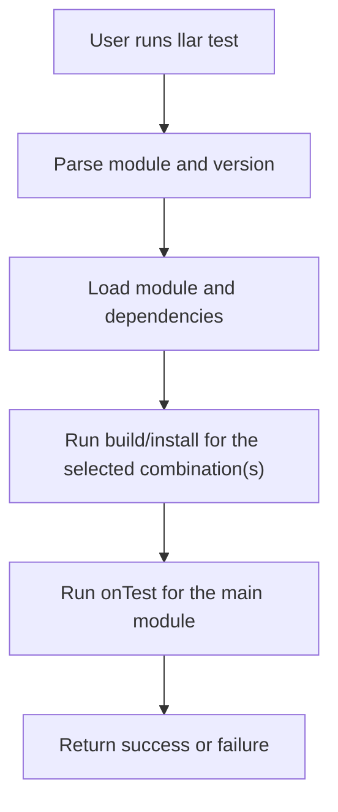

# LLAR Test Product Design

## 1. Document Scope

This document defines the base product semantics of `llar test`. It aims to answer three questions:

- Why LLAR needs a dedicated test command.
- How Formula authors should describe artifact verification through `onTest`.
- What stable behavior users should expect when running `llar test`.

This document does not cover matrix orthogonality, collision analysis, or automatic reduction strategies inside `--auto`. Those topics should live in a separate design document for test plan generation.

## 2. Background

`llar make` answers the question "can this package be built", but that is not the same as "is the delivered artifact usable".

For a package manager, a successful build is still not enough. At minimum, the system must also answer questions like:

- Can the installed executable start?
- Can the installed library be linked or loaded by a minimal consumer?
- Do the installed headers, config files, and runtime layout satisfy the most basic usage path?

Without a unified verification entry point, these checks are scattered across external scripts, CI jobs, or tribal knowledge, and cannot become a first-class product capability of LLAR.

Therefore, LLAR needs a first-class testing entry point that:

- Lets Formula authors describe minimal usability verification.
- Lets users run verification through one consistent command.
- Lets future automatic test planning reuse the same verification logic.

## 3. Product Goals

The goals of `llar test` are:

1. Verify minimal artifact usability after build and installation complete.
2. Provide a unified, stable, language-agnostic verification hook for Formula.
3. Make testing part of the official LLAR workflow instead of an external side script.
4. Provide a single final verification entry point for more advanced test planning features in the future.

## 4. Non-Goals

In its first stage, `llar test` does not attempt to solve the following:

- It does not design matrix reduction strategies.
- It does not replace full functional test suites or upstream test mirrors.
- It does not promise performance, stress, benchmark, or long-run stability validation.
- It does not attempt to understand language semantics, ABI rules, or source-level internals.

In other words, `llar test` focuses on "is this installed result minimally usable from a consumer perspective", not "has the project passed complete acceptance testing".

## 5. Core Concepts

### 5.1 `onBuild`

`onBuild` is responsible for building and installing artifacts. It answers the question "how do we produce the deliverable".

### 5.2 `onTest`

`onTest` is responsible for verifying the artifact after the build completes. It answers the question "has the deliverable reached minimal usability".

`onTest` does not participate in test plan generation or matrix analysis. It is the final verification action itself.

### 5.3 Matrix Combination

Testing always runs on one concrete matrix combination. For base `llar test`, the system only needs one concrete combination and then executes:

- `build`
- `install`
- `onTest`

Questions like "which combination should be selected" or "should the number of combinations be reduced" belong to another layer and are outside the scope of this document.

## 6. Users and Use Cases

### 6.1 Formula Authors

Formula authors implement `onTest` in the formula to describe minimal verification actions, for example:

- Compile a minimal example and link it against the installed library.
- Invoke an installed executable and check its return behavior.
- Load an installed extension module through an interpreter.

### 6.2 Package Maintainers

Package maintainers use `llar test` to verify that a module version is actually deliverable, not merely that the build script did not fail.

### 6.3 CI and Automation Systems

CI can use `llar test` as the standard verification step. Even if LLAR later adds `--auto` or other planning mechanisms, the final real verification step should still be `onTest`.

## 7. External Product Semantics

### 7.1 Command Entry

The base commands are:

```bash
llar test [module@version]
llar test --full [module@version]
```

At the command-semantics level, `llar test` is responsible for:

- Parsing the target module.
- Loading the module and its dependencies.
- Selecting which option combinations need verification.
- Building and installing for each selected combination.
- Running `onTest` after the main module build completes for each combination.

### 7.2 Success Semantics

`llar test` is considered successful only when all of the following are true:

1. Dependencies and the target module complete their builds successfully.
2. The target module is installed successfully.
3. If `onTest` is defined, `onTest` succeeds.

This means:

- If the build fails, the test fails.
- If `onTest` fails, the test fails.

### 7.3 Default Behavior When `onTest` Is Missing

The current implementation allows a Formula to omit `onTest`. In that case:

- `llar test` still performs the build.
- No extra artifact verification step is executed.

This is a compatibility behavior in the current stage. It should not be treated as the long-term ideal product shape. A later design can decide whether a missing `onTest` should become a warning or a stricter requirement.

### 7.4 Matrix Selection

At the product-design level, `llar test` has two explicit modes on the option axis:

- Without `--full`, it runs only the test combination that corresponds to the default options.
- With `--full`, it expands and runs the full matrix.

The key distinction is:

- Plain `llar test` answers whether the default delivery configuration is usable.
- `llar test --full` answers whether every declared option combination is actually verified.

The current implementation does not fully match this product semantics yet. Implementation progress should be tracked in the implementation-status document.

### 7.5 Output and Failure Model

From a product perspective, `llar test` must provide at least the following behavior:

- Return exit code zero on success.
- Return a non-zero exit code on failure.
- Treat both build failure and `onTest` failure as test failure.

The current implementation also provides the following additional behavior:

- `--verbose` enables more detailed build and test logs.
- If the build produces metadata, that metadata is printed at the end of the command.

## 8. Formula Interface Design

### 8.1 Interface Shape

Formula provides verification logic through `onTest`:

```gox
onTest (ctx, proj, out) => {
    installDir, err := ctx.outputDir()
    if err != nil {
        out.addErr err
        return
    }

    combo := ctx.currentMatrix()
    _ = installDir
    _ = combo
    _ = proj
}
```

The recommended direction is for `onTest` to keep the same parameter shape as `onBuild`:

- `ctx` provides the context that is actually needed in the test stage.
- `proj` provides project and dependency information, plus access to project-side files when needed.
- `out` is used to report test-stage errors or additional results.

### 8.2 Design Principles for `onTest`

`onTest` should follow these principles:

1. Verify from the consumer perspective instead of repeating the build process.
2. Prefer a minimal verification loop instead of long-running or resource-heavy integration tests.
3. Prefer installed artifact paths over temporary build-directory internals.
4. Report failures explicitly and avoid silent false positives.

### 8.3 Context Capabilities

The available `ctx` / `proj` capabilities can be understood directly as these interfaces:

```gox
installDir, err := ctx.outputDir()
depDir, err := ctx.outputDir(dep)
combo := ctx.currentMatrix()
result, ok := ctx.buildResult(dep)
data, err := proj.readFile("testdata/case.txt")
```

They correspond to:

- The current module's install output directory.
- The output directory of a specific dependency module.
- The currently active matrix combination.
- Optional dependency build results and metadata.
- Access to test resources or config files stored inside the project.

These capabilities are already enough for most "minimal consumer verification" scenarios.

## 9. Execution Model

The base execution flow of `llar test` can be described as:



There are two key boundaries here:

- `onTest` runs only after the main module build completes.
- `onTest` is part of the verification stage, not an extension of the build stage.

## 10. Boundary with `--auto`

The relationship among `llar test`, `llar test --full`, and `llar test --auto` should be defined as:

- `llar test` is the default-configuration verification mode.
- `llar test --full` is the exhaustive full-matrix verification mode.
- `llar test --auto` is an extended capability that adds test plan generation on top of them.

No matter what matrix analysis strategy automatic mode uses in the future, it should not change the following base contract:

- The final real verification entry point remains `onTest`.
- The way authors write `onTest` should not be dictated by a specific reduction algorithm.
- Users should be able to understand the basic behavior of `llar test` without understanding automatic analysis internals.

## 11. Known Constraints in the First Stage

Based on the current implementation, the first stage explicitly accepts the following constraints:

- The `default options` and `--full` semantics are already part of the design, but the implementation is not fully aligned yet.
- The internal strategy of `--auto` is outside the scope of this document.
- `--auto` does not currently support local patterns.
- `--trace-dump` is a debugging feature for automatic mode, not part of the base product semantics.

These are not defect statements. They are boundary statements: first make the stable verification entry point solid, then evolve the more complex test planning logic separately.

## 12. Future Discussion Topics

This document does not make decisions on these topics yet, but they should be discussed later:

- Whether missing `onTest` should produce a warning or a stricter requirement.
- Whether the command should emit a more structured test report.

## 13. Conclusion

`llar test` is not fundamentally a matrix analysis tool. It is LLAR's unified deliverable verification entry point.

It should first define one simple but critical thing clearly:

- Formula authors use `onTest` to describe minimal usability verification.
- Users run `llar test` to execute build plus verification for one concrete combination.

Only after this base product boundary is clear should automatic reduction, collision analysis, and orthogonality deduction be allowed to evolve without polluting the core semantics of testing.
