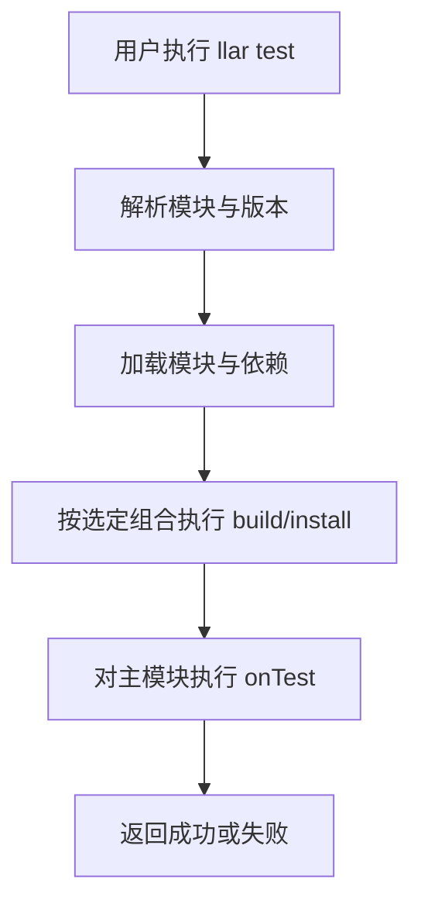

# LLAR Test 产品设计

## 1. 文档定位

本文定义 `llar test` 的基础产品语义，目标是回答三个问题：

- LLAR 为什么需要一个独立的测试命令。
- Formula 作者应如何通过 `onTest` 描述产物验证。
- 用户执行 `llar test` 时，系统应提供什么稳定行为。

本文不讨论矩阵正交、碰撞分析、自动缩减策略等 `--auto` 内部算法。这些内容应单独放在测试计划生成的专题设计中。

## 2. 问题背景

`llar make` 解决的是“能不能把包构建出来”，但这还不等于“交付物已经可用”。

对包管理器来说，构建成功之后至少还需要回答下面这些问题：

- 安装出的二进制能否启动。
- 安装出的库能否被最小消费者链接或加载。
- 安装后的头文件、配置文件和运行时布局是否满足最基本使用方式。

如果没有一个统一的验证入口，这些检查就会散落在外部脚本、CI job 或人工经验里，无法成为 LLAR 的正式产品能力。

因此，LLAR 需要一个一等公民的测试入口：

- 让 Formula 作者描述“最小可用性验证”。
- 让用户用统一命令执行验证。
- 让未来的自动测试计划仍然复用同一套验证逻辑。

## 3. 产品目标

`llar test` 的目标是：

1. 在包构建并安装完成后，对交付物执行最小可用性验证。
2. 为 Formula 提供统一、稳定、语言无关的验证钩子。
3. 让测试成为 LLAR 正式工作流的一部分，而不是外部附加脚本。
4. 为后续更复杂的测试计划生成能力提供统一的最终验证入口。

## 4. 非目标

`llar test` 在第一阶段不解决以下问题：

- 不负责做矩阵缩减策略设计。
- 不负责做全量功能测试或上游测试套件镜像。
- 不承诺覆盖性能、压力、基准或长期稳定性验证。
- 不试图理解语言语义、ABI 规则或源码内部结构。

换句话说，`llar test` 关注的是“消费者视角下，这个安装结果最起码能不能用”，而不是“是否已经完成完整项目验收”。

## 5. 核心概念

### 5.1 `onBuild`

`onBuild` 负责构建和安装产物。它回答的是“如何产出交付物”。

### 5.2 `onTest`

`onTest` 负责在构建完成后验证交付物。它回答的是“交付物是否达到最小可用状态”。

`onTest` 不参与测试计划生成，也不参与矩阵分析。它是最终验证动作本身。

### 5.3 矩阵组合

测试始终发生在某一个确定的矩阵组合上。对基础 `llar test` 而言，系统只需要拿到一个确定组合，然后执行：

- `build`
- `install`
- `onTest`

至于“该选哪个组合”“要不要减少组合数”，属于另一层能力，不属于本文主题。

## 6. 用户与使用场景

### 6.1 Formula 作者

Formula 作者在配方中实现 `onTest`，描述最小验证动作，例如：

- 编译一个最小示例并链接安装后的库。
- 调用安装出的可执行文件并检查返回值。
- 用解释器加载安装出的扩展模块。

### 6.2 包维护者

包维护者使用 `llar test` 验证某个模块版本是否真的可交付，而不仅仅是“构建脚本没报错”。

### 6.3 CI 或自动化系统

CI 可以把 `llar test` 作为标准验证步骤。未来即使引入 `--auto` 或其他测试计划机制，最终真正执行的验证仍应落到 `onTest`。

## 7. 对外产品语义

### 7.1 命令入口

基础命令为：

```bash
llar test [module@version]
llar test --full [module@version]
```

从命令职责上，`llar test` 需要：

- 解析目标模块。
- 加载模块及依赖。
- 选择需要验证的 option 组合。
- 对每个被选中的组合执行构建与安装。
- 在每个组合的主模块构建完成后执行 `onTest`。

### 7.2 成功语义

当以下条件同时满足时，`llar test` 视为成功：

1. 依赖和目标模块能成功完成构建。
2. 目标模块安装完成。
3. 若定义了 `onTest`，则 `onTest` 执行成功。

这意味着：

- 构建失败，测试失败。
- `onTest` 失败，测试失败。

### 7.3 `onTest` 缺省行为

当前实现允许 Formula 不定义 `onTest`。在这种情况下：

- `llar test` 仍会执行构建。
- 不会有额外的产物验证步骤。

这是当前兼容性行为，不代表长期最优产品形态。后续可以单独讨论是否要把“缺失 `onTest`”提升为 warning 或更严格约束。

### 7.4 矩阵选择

在产品设计上，`llar test` 在 option 维度上有两种明确模式：

- 未指定 `--full` 时，只运行 default options 对应的测试组合。
- 指定 `--full` 时，展开并运行全矩阵测试。

这条语义的重点是：

- 普通 `llar test` 面向“默认交付配置是否可用”。
- `llar test --full` 面向“所有声明的 option 组合都要被真实验证”。

当前实现尚未完全对齐这条产品语义，具体落地进度应以实现状态文档为准。

### 7.5 输出与失败方式

从产品角度，`llar test` 至少应提供以下行为：

- 成功时返回零退出码。
- 失败时返回非零退出码。
- 将构建失败和 `onTest` 失败统一视为测试失败。

当前实现还具备以下附加行为：

- `--verbose` 打开后会输出更详细的 build/test 日志。
- 若 build 产出了 metadata，会在命令结束时输出该 metadata。

## 8. Formula 接口设计

### 8.1 接口形式

Formula 通过 `onTest` 提供验证逻辑：

```gox
onTest (ctx, proj, out) => {
    installDir, err := ctx.outputDir()
    if err != nil {
        out.addErr err
        return
    }

    combo := ctx.currentMatrix()
    _ = installDir
    _ = combo
    _ = proj
}
```

这里建议 `onTest` 保持与 `onBuild` 一致的参数形态：

- `ctx` 提供测试阶段真正需要的上下文。
- `proj` 提供项目与依赖相关信息，以及项目侧文件访问能力。
- `out` 用于报告测试阶段错误或附加结果。

### 8.2 `onTest` 的设计原则

`onTest` 应遵循以下原则：

1. 从消费者视角验证，而不是重复构建过程。
2. 尽量验证最小闭环，不写成长时间、重资源的集成测试。
3. 优先使用安装后的产物路径，而不是临时构建目录内部细节。
4. 对失败给出明确错误，避免“silent false positive”。

### 8.3 上下文能力

当前 `ctx` / `proj` 的可用能力可以直接理解为这些接口：

```gox
installDir, err := ctx.outputDir()
depDir, err := ctx.outputDir(dep)
combo := ctx.currentMatrix()
result, ok := ctx.buildResult(dep)
data, err := proj.readFile("testdata/case.txt")
```

它们分别对应：

- 当前模块的安装输出目录。
- 指定依赖模块的输出目录。
- 当前生效的矩阵组合。
- 可选的依赖构建结果与元信息。
- 项目内测试资源或配置文件的读取能力。

这些能力已经足够覆盖大多数“最小消费者验证”场景。

## 9. 执行模型

基础 `llar test` 的产品执行流可以描述为：



这里有两个关键边界：

- `onTest` 只在主模块构建完成后执行。
- `onTest` 是验证阶段，不是构建阶段的延伸。

## 10. 与 `--auto` 的边界

`llar test`、`llar test --full` 和 `llar test --auto` 的关系应被定义为：

- `llar test` 是默认配置验证模式。
- `llar test --full` 是全矩阵穷举验证模式。
- `llar test --auto` 是在此基础上增加“测试计划生成”的扩展能力。

无论自动模式将来使用何种矩阵分析策略，都不应改变以下基础契约：

- 最终真实验证入口仍然是 `onTest`。
- `onTest` 的编写方式不应被特定缩减算法绑架。
- 用户可以不理解自动分析细节，仍然理解 `llar test` 的基本行为。

## 11. 第一阶段已知约束

基于当前实现，第一阶段需要明确接受以下约束：

- `llar test` 的 default options / `--full` 语义已经进入设计，但当前实现尚未完全补齐。
- `--auto` 的内部策略不属于本文范围。
- `--auto` 当前还不支持本地 pattern。
- `--trace-dump` 是自动模式调试能力，不属于基础产品语义。

这些约束不是缺陷定义，而是产品边界定义：先把“稳定的验证入口”做实，再把“复杂的测试计划生成”单独演进。

## 12. 后续演进问题

本文暂不做决策，但建议后续继续讨论：

- 是否要对缺失 `onTest` 给出 warning 或更严格要求。
- 是否要输出更结构化的测试报告。

## 13. 结论

`llar test` 的产品本质不是“矩阵分析工具”，而是 LLAR 的统一交付验证入口。

它要先稳定定义一件简单但关键的事情：

- Formula 作者用 `onTest` 描述最小可用性验证。
- 用户用 `llar test` 执行一次确定组合上的 build + verify。

只有把这个基础产品边界写清楚，后续自动缩减、碰撞分析、正交推导等能力才不会反过来污染最核心的测试语义。
