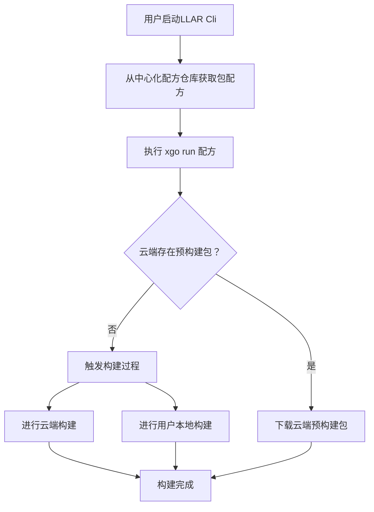
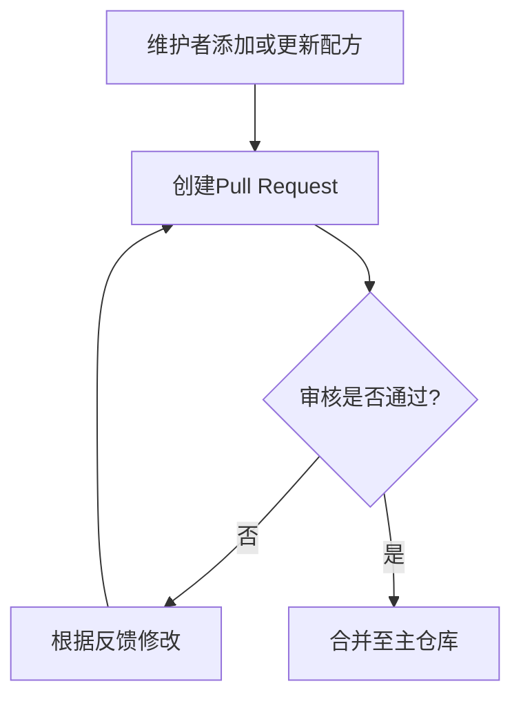

# 背景
在C/C++开发中，我们经常会遇到这样一类问题：不同的库或者Module存在大量可选编译配置，以及有大量编译组合，通常更换一个配置或者换个构建平台，我们只能重头把这些库构建一遍。

这样行为其实相当浪费时间，因为这样重复的构建往往是没有意义的。

于是为了节约时间，有许多包管理器都提出了“预构建”包选项，例如著名的 Homebrew，Conan和APT等。

然而这些包管理器，为了节省空间，往往不对所有可能的选项进行构建，依然要用户本地构建。

同时，我们注意到，不只有C/C++存在这类问题，例如Python，WASM也有对应的问题。

为了解决上述包管理器的问题，和提升XGO用户编译体验，LLAR诞生了

LLAR 名称来源是：`LL` + `AR`，AR为Archive缩写，C/C++的库打包后称为Archive，`LL`意思是它为`LLGo`类似的编译器设计，只不过它可以独立于`LLGo`

# 竞品调研
**Conan**: 通过 `Recipe` 定义包信息，根据环境设置查询远程仓库，优先下载预构建的二进制包，缺失时自动从源码构建，同时缓存结果供后续重用。而Recipe则使用Python进行编写。

**Homebrew**: 通过名为 `Formula` 的 Ruby 脚本来定义软件的编译规则与依赖关系；在用户执行安装命令时，它会优先从`Bottles`（预编译的二进制包）直接下载安装以提升效率，若没有对应平台的Bottles则自动在本地从源码编译。

**Xmake**: 类似于 `Conan` 和 `Homebrew`，只不过在二者基础上添加了多种自定义源，它可以从Conan或者VCPkgs下载包并进行安装

# 机会与意义
现有包管理工具无法预构建巨量的构建产物，多数都采取了云端预构建与用户自构建结合做法，即当不存在预构建产物时就要求用户自行构建。

这样做法对于用户体验而言，是极其失败的，因为：
1. 由于用户不同需求，产生的构建产物无法被满足，多数情况下，所谓“通用”的预构建产物形同虚设，举个例子，macOS x86_64平台经常缺少预构建包，这通常是因为大多数包管理器认为这个平台用户不够多而将其忽略
2. 反复构建相同产物，极其浪费时间，这些产物可以被云端缓存起来

LLAR 是第一个尝试完全解决预构建产物问题的平台

# 需求
1. 满足一个包多种构建产物带来的巨额产物云构建，存储需求
2. 提供一种规范化，标准化的包构建，管理方案

# 基本概念
## 包 Package
我们将LLAR一个独立的库单位称之为包，之所以称之为包，是因为其包含以下几部分：
1. 构建信息
2. 版本信息

而构建信息又包含以下两部分：
1. 构建配方
2. 构建矩阵

## 构建配方 Formula
构建配方，用于告诉构建者该包如何完成构建。

## 构建矩阵 Build Matrix
构建矩阵，由于一个包可能只存在一种配方，但是这一种配方因为外部需求的变化会导致多种产物，为了代表这类变化，我们使用一个构建矩阵表达

## 惰性构建 Lazy Compilation
由于我们出发点基于一个包存在巨额构建产物前提之下，因此不可能一次性就能完成所有构建产物的构建。我们提出了“惰性编译”方案以缓解这一点，
“惰性构建”并不是类似于常见包管理预构建和用户构建结合，而是：不存在的预构建包，用户和云端并发构建，构建完毕则无需用户构建，直接拉取云端缓存。

见：
https://github.com/goplus/llar/issues/5

## 中心化配方管理仓库 Formula Repository
配方仓库用于存放和管理构建配方，一般来说是基于GitHub之类的git协议管理平台

见：
https://github.com/goplus/llar/issues/6

# 用户故事
## 用户画像
目标用户：使用模块拆分编译类语言（如C/C++），且对编译速度有追求的用户

## 用户
用户可以：
- 安装包到本地：通过 `LLAR Cli` 从中心化配方管理仓库获得需要包的配方，并通过`xgo run`执行配方，使用“惰性构建”设计，如果云端不存在预构建包，则触发云端和用户本地构建，否则直接下载云端预构建包
- 获取包的相关信息，如构建信息，版本信息
- 仅下载预构建包
- 仅下载包源码

其流程图如下：

## 维护者
维护者可以（通过Pull Request）：
- 提交相关配方至中心化配方管理仓库
- 更新中心化配方管理仓库的配方

流程图如下：

