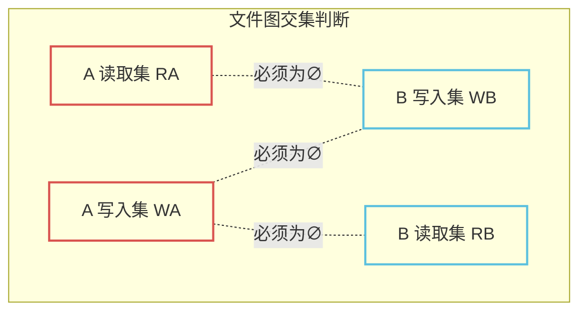
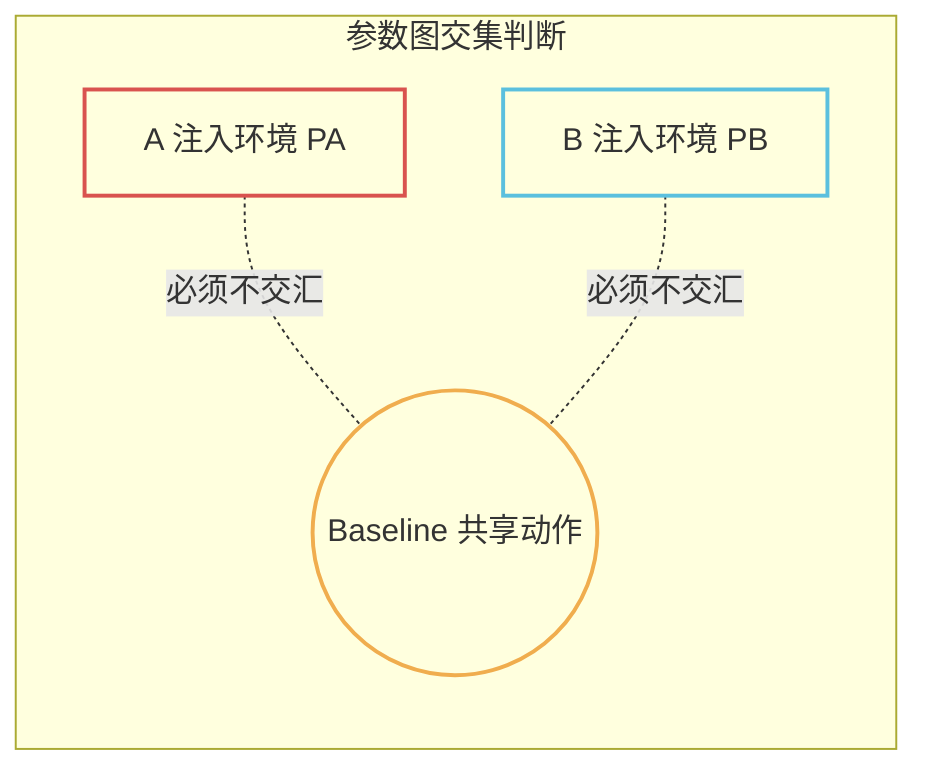
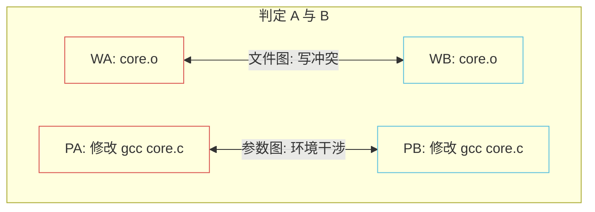
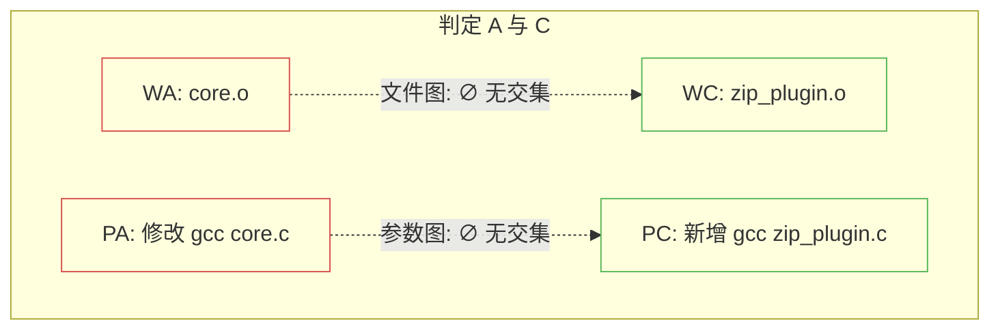

# LLAR 测试系统：基于双图模型的大矩阵降维提案 (MVP阶段)

## 1. 背景与目标

LLAR 作为一个云端、多语言的包管理器，目前正处于 MVP（最小可行性产品）阶段。在验证构建配方（Formula）时，我们面临着**大矩阵（Build Matrix）测试**的挑战：当一个底层库有几十个配置选项时，全量组合测试（笛卡尔积）在算力上是不可能的，而随机抽样又无法保证包管理器的绝对可靠性。

**本方案目标**：提出一套适用于 LLAR MVP 阶段的**矩阵降维策略**。在把 Package 视为“黑盒”（不解析代码语法）的前提下，通过引入**“文件变化图”**和**“参数变化图”**（双图模型），从物理和环境两个层面证明选项之间的正交性。一旦证明正交，即可安全跳过组合测试，从而将指数级爆炸的测试量坍缩为线性级。

---

## 2. 核心推导逻辑：为什么能跳过组合测试？

大矩阵降维的理论基石是**“正交性推导（Orthogonality Deduction）”**。

如果我们要跳过“选项 A + 选项 B”的组合测试，我们必须在数学和物理上证明：**A 和 B 互不干涉**。为了在黑盒下完成这个证明，系统会收集 A 和 B 各自单开时的构建动作，并把它们放进两张图里求“交集”。

### 2.1 视图一：文件变化图 (防物理传播与覆盖)
我们提取选项 A 和 B 的读写动作：
- $W_A, W_B$: 各自写入的文件集合（中间件、最终产物）。
- $R_A, R_B$: 各自读取的文件集合（源码、头文件）。

**文件图正交证明**：
如果同时满足以下三个条件（交集为空）：
1. **无覆盖**：$W_A \cap W_B = \emptyset$ (A 和 B 没有修改同一个文件)
2. **A 不传给 B**：$W_A \cap R_B = \emptyset$ (B 没有读取 A 产生的文件)
3. **B 不传给 A**：$R_A \cap W_B = \emptyset$ (A 没有读取 B 产生的文件)
则判定：A 和 B 在物理流水线上是**文件正交**的。

### 2.2 视图二：参数变化图 (防宏污染与环境联动)
有些时候，A 和 B 没碰同一个文件，但它们往同一个编译命令里塞了不同的参数（比如 A 塞了 `-DA`，B 塞了 `-DB`）。如果不拦住，这种“共享动作”极易引发 C 语言结构体大小改变等隐性崩溃（`struct S` 联动陷阱）。

- $P_A, P_B$: 各自修改了哪些**Baseline 已经存在的共享原子动作**（例如原本就有的 `gcc core.c`）。

**参数图正交证明**：
- 如果 $P_A \cap P_B = \emptyset$ (A 和 B 没有试图修改同一个核心动作的环境)。
则判定：A 和 B 在逻辑环境上是**参数正交**的。

### 2.3 降维结论推导
**推导定理**：
如果 `文件图交集 == ∅` **且** `参数图交集 == ∅`，说明选项 A 和选项 B 就像在两条完全隔离的流水线上运行。
既然它们物理不碰头，环境不污染，那么把它们组合在一起（A+B），其结果必然等于 A 产物加 B 产物的简单合并。**因此，只要单测 A 通过，单测 B 通过，我们就能确定性地跳过 A+B 的组合测试。**

---

## 3. Step-by-Step 实战演练：双图推导过程

假设网络库 `LibNet` 有三个选项：**A (HTTP2)**, **B (IPV6)**, **C (ZLIB 独立插件)**。

### 第一步：探测记录 ($O(N)$ 扫描)
系统分别单开 A, B, C，记录它们的动作指纹。

```mermaid
graph TD
    subgraph OptionC ["选项 C (ZLIB) 的动作图"]
        C_Action1["gcc -c zip_plugin.c"]
        C_Read1("读: zip_plugin.c") -.-> C_Action1
        C_Action1 -.-> C_Write1("写: zip_plugin.o")
    end

    subgraph OptionB ["选项 B (IPV6) 的动作图"]
        B_Action1["gcc -DB -c core.c"]
        B_Read1("读: core.c") -.-> B_Action1
        B_Action1 -.-> B_Write1("写: core.o")
    end

    subgraph OptionA ["选项 A (HTTP2) 的动作图"]
        A_Action1["gcc -DA -c core.c"]
        A_Read1("读: core.c") -.-> A_Action1
        A_Action1 -.-> A_Write1("写: core.o")
    end

    style A_Action1 fill:none,stroke:#d9534f,stroke-width:2px
    style B_Action1 fill:none,stroke:#5bc0de,stroke-width:2px
    style C_Action1 fill:none,stroke:#5cb85c,stroke-width:2px
```

*   **A (HTTP2)**：修改了共享动作 `gcc -c core.c`（加了参数 `-DA`），产出了 `core.o`。
*   **B (IPV6)**：修改了共享动作 `gcc -c core.c`（加了参数 `-DB`），产出了 `core.o`。
*   **C (ZLIB)**：新增了全新动作 `gcc -c zip_plugin.c`，产出了独立的 `zip_plugin.o`。

### 第二步：双图求交与降维决策

现在，系统通过计算文件图和参数图的交集，来决定哪些组合必须测试，哪些可以安全跳过。

#### 决策 1：A 与 B 是否正交？（发生碰撞）

*   **查文件图**：$W_A$ 包含 `core.o`，$W_B$ 包含 `core.o`。$W_A \cap W_B \neq \emptyset$。**发生写冲突。**
*   **查参数图**：$P_A$ 包含了 `gcc core.c`，$P_B$ 也包含了 `gcc core.c`。$P_A \cap P_B \neq \emptyset$。**发生环境干涉。**
*   **结论**：A 与 B 双图均有交集。系统判定它们发生**“碰撞 (Collision)”**，**不能跳过组合测试**。CI 必须硬扛跑完 `A+B`。

#### 决策 2：A 与 C 是否正交？（完美放行）

*   **查文件图**：$W_A$ 是 `core.o`，$W_C$ 是 `zip_plugin.o`，无写冲突（最终的 `ld` 属于仅合并动作，已被系统降噪）。C 没有读 A 的输出，反之亦然。$W_A \cap W_C = \emptyset$，$W_A \cap R_C = \emptyset$。
*   **查参数图**：$P_A$ 修改了 `core.c` 的环境，$P_C$ 仅仅是给自己的新文件 `zip_plugin.c` 配了环境，没有修改任何共享主干动作。$P_A \cap P_C = \emptyset$。
*   **结论**：A 与 C 双图交集全部为空！系统完成证明，判定它们**“完全正交”**。**安全跳过 `A+C` 组合测试。**

---

## 4. MVP 阶段的工程噪音过滤

理想的空集很难在真实工程（如 CMake/Boost）中出现。为了保证降维策略在 MVP 阶段的实用性，系统引入了过滤机制以消除“伪交集”：

1. **降噪 Install 拷贝（解开 Boost 假死锁）**
   如果 A 和 B 都拷贝了 `include/common.h` 到最终目录，文件图会产生 $W_A \cap W_B \neq \emptyset$。
   **规则**：对于纯 `copy`/`install` 且没有任何后续动作读取它的叶子节点，系统将其从文件图的干涉计算中强行剥离。
2. **剔除构建账本（解开 CMake 假死锁）**
   不论改什么，CMake 必写 `CMakeCache.txt`。
   **规则**：建立系统黑名单，强行剔除这类仅仅是构建工具私有账本的写入记录，不让它们污染求交集的过程。

---

## 5. 远期防线：产物终极核对

尽管双图推导在逻辑上很完美，但在黑盒模式下，为了防范极端魔法（比如隐式全局状态），系统在最终交付时仍需一道防线。

- **兜底校验**：当云端决定放行被判定为正交的组合 `A+C` 时，它会检查 `A+C` 产出的安装目录指纹。如果发现它**不等于**单开 A 加上单开 C 的逻辑合并（即出现了非线性的文件或哈希突变），系统立刻熔断，判定隐性联动发生，强制补跑测试。
