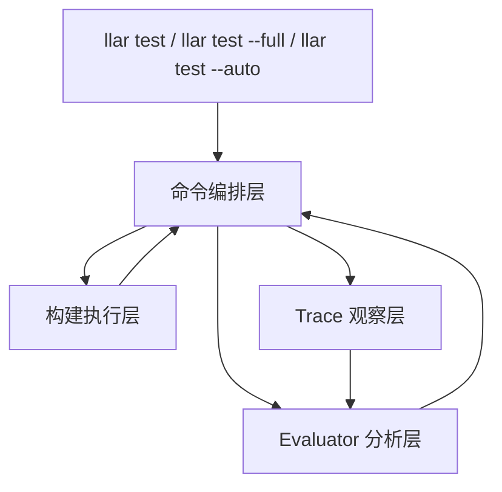
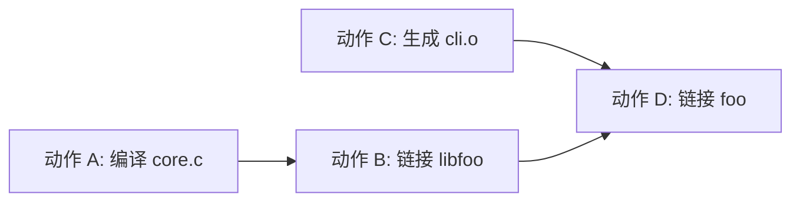
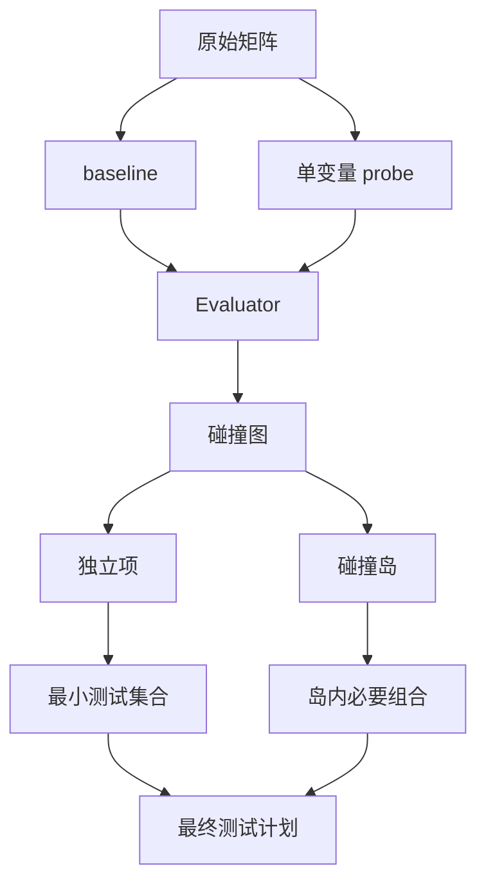
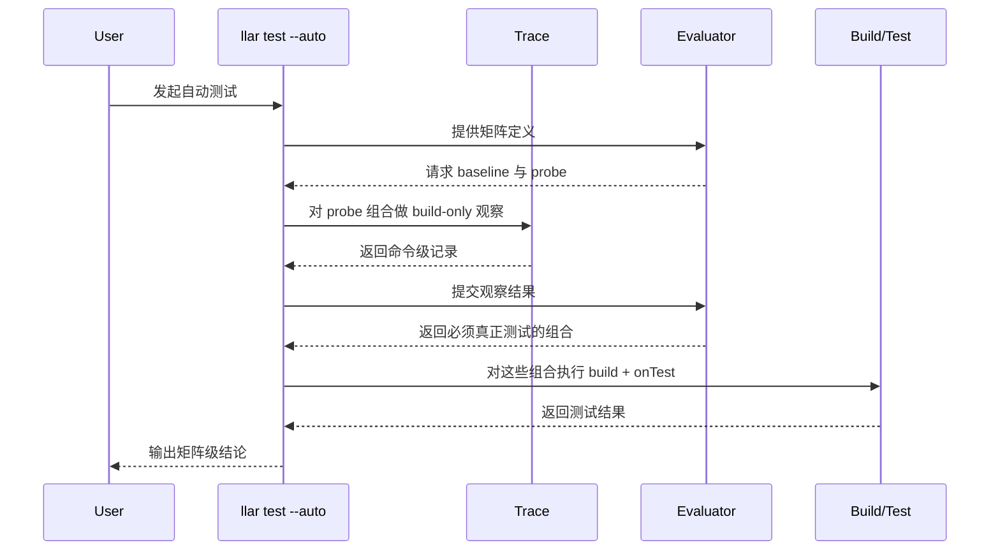
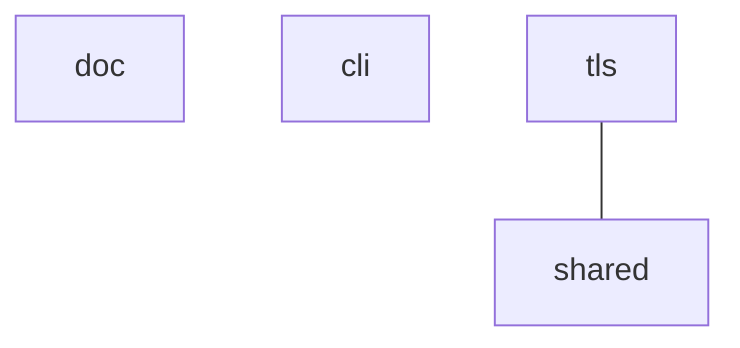

# LLAR 测试系统设计稿

## 1. 背景

LLAR 是一个全云端、多语言、黑盒式的包管理器。它不理解源码语义，只负责按 Formula 调度构建命令，并产出可交付结果。

这使测试系统面临一个典型矛盾：

- 包的配置矩阵可能极大，无法做全量物理测试。
- 包管理器又不能依赖随机抽样来放行未充分验证的组合。
- 系统还必须保持语言无关，不能把某一种语言的 ABI 或运行时规则提升为平台基础设施。

因此，LLAR 需要的不是“更聪明的抽样”，而是一套基于黑盒可观察证据的、保守的、可自动缩减矩阵的测试体系。

## 2. 设计目标

本设计面向以下目标：

1. 在大规模构建矩阵下，自动缩减必须物理执行的测试组合。
2. 缩减依据来自可观察证据，而不是随机抽样或经验假设。
3. 保持对 C/C++、Python 扩展、Go、纯二进制解压分发等场景的统一适用性。
4. 保持 Formula DSL 稳定，不把分析复杂度转移给配方作者。
5. 将“构建”和“验证”区分为两个清晰阶段，但保持统一的用户入口。

## 3. 核心思想

系统的核心判断不是“这个包属于什么语言”，而是：

- 一个 option 变化后，会影响哪些构建动作。
- 这些影响是否会与其他 option 的影响发生碰撞。
- 如果不会碰撞，是否可以只测试代表性组合。
- 如果会碰撞，就必须在对应碰撞岛内部展开必要组合。

这里的“碰撞”不是源码级冲突，而是黑盒层面的构建影响重叠。

## 4. 用户模型

### 4.1 Formula 侧

Formula 通过 `onTest` 描述产物验证逻辑。

`onTest` 的目标不是参与构建，而是从消费者视角验证已安装产物的最小可用性，例如：

- 二进制是否能启动。
- 动态库是否能被最小程序链接并运行。
- 解释型扩展是否能被加载。

### 4.2 命令侧

系统对外提供三个测试入口：

- `llar test`
- `llar test --full`
- `llar test --auto`

其中：

- `llar test` 默认面向 default options 组合，执行构建并验证产物。
- `llar test --full` 面向整个显式矩阵，执行全量真实测试。
- `llar test --auto` 面向整个配置空间，自动判断必须执行哪些组合，并只对这些组合运行真正的验证。

## 5. 系统模型

整个测试系统由四个角色构成：

- 命令编排层：负责组织测试流程。
- 构建执行层：负责执行构建和产物验证。
- Trace 观察层：负责观察单个组合的 `build-only` 行为。
- Evaluator 分析层：负责根据观察结果缩减矩阵。

### 5.1 模块关系

### 5.2 职责边界

命令编排层负责：

- 解析目标模块和矩阵。
- 选择 default、full 或 auto 模式。
- 调用 evaluator 获得测试计划。
- 执行最终需要验证的组合。

构建执行层负责：

- 执行 Formula 的构建逻辑。
- 安装产物。
- 运行 `onTest`。

Trace 观察层负责：

- 在 `build-only` 条件下观察构建命令。
- 归纳出命令级记录。

Evaluator 分析层负责：

- 选择 baseline 和 probe。
- 归一化观察记录。
- 分析不同 option 的影响面。
- 输出必须真正执行测试的组合。

## 6. Trace 观察模型

自动模式下，系统不会先执行所有组合的 `onTest`。它会先观察一小组代表性构建。

Trace 观察层只关心四类事实：

- 命令是什么。
- 命令在哪个目录执行。
- 命令读取了哪些路径。
- 命令修改了哪些路径。

这一步只观察 `build-only`，不执行 `onTest`。原因是自动分析的目标是识别 option 对构建过程的影响，而不是先做功能验证。

## 7. 归一化

如果不做归一化，同一条逻辑构建动作会因为临时目录、随机文件名、工作目录差异而被误判为不同动作。

因此 evaluator 在分析前需要对 trace 记录做归一化。归一化遵循两条原则：

1. 只消除噪声，不消除真实配置差异。
2. 先做通用归一化，再做命令族归一化。

通用归一化处理：

- 临时目录。
- 工作空间根路径。
- 构建输出根路径。
- 随机后缀。

命令族归一化处理：

- 编译器与链接器命令。
- `cmake`、`ninja`、`make` 等构建系统命令。
- `python -m ...`、`pip` 等解释器入口命令。
- 其他可识别的通用工具链命令。

归一化的目标不是理解语言语义，而是把“同一个逻辑动作”重新对齐。

## 8. 动作图与碰撞分析

### 8.1 动作图

在 evaluator 看来，一条经过归一化的命令记录可以视作一个构建动作。

如果某个动作修改了路径 `X`，后续另一个动作读取了路径 `X`，则这两个动作之间存在依赖。

由此可以得到一个构建动作图。

动作图回答的问题是：

- 一个 option 改变后，最先影响了哪些动作。
- 这些影响会沿着依赖关系继续传播到哪些动作和产物。

### 8.2 影响面

每个 option 相对 baseline 都会形成自己的影响面。

影响面不仅包含“直接变化的动作”，也包含这些变化通过动作图向下游传播后触及的动作和产物。

### 8.3 碰撞

如果两个 option 的影响面发生重叠，则认为这两个 option 发生碰撞。

碰撞意味着：

- 不能仅凭两个单变量 probe 的结果推导它们的组合。
- 必须把它们放入同一个碰撞岛中处理。

如果两个 option 的影响面互不相交，则它们可视为正交。

## 9. 矩阵缩减策略

系统不直接全量展开矩阵，而是采用如下策略：

1. 选择 baseline。
2. 对每个 option 做单变量 probe。
3. 观察每个 option 相对 baseline 的影响面。
4. 根据碰撞关系构造碰撞图。
5. 将碰撞图划分为若干连通分量。
6. 对每个连通分量单独决定需要测试的组合。

### 9.1 直观含义

- 单独的独立项，只需要最小覆盖。
- 发生碰撞的一组项，必须在组内展开必要组合。

这意味着：

- 系统不会承诺“任何矩阵都能降到线性”。
- 系统只会把真正正交的部分降下来。
- 对无法证明正交的部分，系统保持保守。

### 9.2 缩减示意

## 10. 自动模式工作流

自动模式的目标不是“把所有组合跑一遍”，而是“对整个配置空间给出测试结论”。

工作流如下：

这里有一个关键边界：

- probe 阶段只负责观察。
- verify 阶段才真正执行 `onTest`。

## 11. 示例

假设一个包有四个 option：

- `tls`
- `shared`
- `cli`
- `doc`

总组合数是 16。

系统先选择以下 probe：

- baseline
- `tls=on`
- `shared=on`
- `cli=on`
- `doc=on`

若观察到：

- `doc` 只影响文档生成相关动作。
- `cli` 只影响命令行工具构建相关动作。
- `tls` 改动主库编译与链接。
- `shared` 也改动主库编译与链接。

则 evaluator 会形成如下碰撞结构：

由此得到三个岛：

- `{doc}`
- `{cli}`
- `{tls, shared}`

最终测试计划可以缩减为：

- baseline
- `doc=on`
- `cli=on`
- `tls/shared` 岛内部的必要组合

因此，系统不需要对全部 16 个组合都执行 `onTest`。

### 11.1 真实项目观测备注

上述例子表达的是**理想化碰撞结构**，不是当前实现对所有项目都已经具备的识别能力。

在一轮 Linux 实证中，我们用真实 CMake 项目 `libarchive/libarchive@v3.8.2` 测了 6 个 option：

- 工具类：`ENABLE_TAR`、`ENABLE_CPIO`、`ENABLE_CAT`
- 核心能力类：`ENABLE_ACL`、`ENABLE_ZLIB`、`ENABLE_ZSTD`

矩阵总规模是 `64`，baseline 为六项全关。当前 evaluator 的结果是：

- 必测组合数：`64`
- 缩减比例：`0%`
- 6 个 option 在当前 trace 模型下全部落入同一个碰撞岛

但如果直接比较最终安装产物，可以看到另一层事实：

- `ENABLE_TAR`、`ENABLE_CPIO`、`ENABLE_CAT`
  - 主要只是新增各自的可执行文件和 man page
  - `libarchive.a`、`libarchive.so*` 与 baseline 保持一致
- `ENABLE_ACL`、`ENABLE_ZLIB`、`ENABLE_ZSTD`
  - 会直接改变 `libarchive.a`、`libarchive.so*`
  - 并改变 `libarchive.pc` 的依赖语义

这说明：

- “工具类 option 可能形成可跳过测试候选”这一判断，在真实项目里是能观察到的。
- 但当前实现在正式诊断测试中，确实观察到了这些 option 会很早卷入共享路径：
  - `git index-pack`
  - `CMakeScratch` 下的 `ninja`/`ld`/`as`
  - `_build/.ninja_*`
  - `_build/CMakeFiles/CMakeTmp/*`
  - `_build/config.h`
  - `_build/libarchive/CMakeFiles/archive*.o.d`
- 而且在额外的定向正式测试中，并没有抓到“未匹配的 `cmake -S` configure action”，因此当前证据只能支持“共享 build graph 很早就把这些 option 并岛”，不能支持把原因简化成某一条单独 configure 命令。

因此，本设计文档里关于“独立项可最小覆盖”的描述，应理解为**目标语义**，不是当前实现已经在所有真实项目上稳定达成的效果。

## 12. 设计取舍

本设计选择的是“保守缩减”，而不是“激进推断”。

这意味着：

- 如果系统能证明正交，就缩减测试量。
- 如果系统不能证明正交，就扩大测试范围。

这种取舍的直接结果是：

- 可能会多跑一些测试。
- 但不会为了追求缩减率而对不确定组合做乐观放行。

## 13. 非目标

本设计明确不以以下路线作为核心方案：

- 随机抽样或 pairwise 覆盖作为放行依据。
- 基于特定语言 ABI、符号表或调试信息的分析。
- 依赖特定语言运行时改造的执行模型。
- 将矩阵缩减责任主要转移给 Formula 作者。

这些路线要么不满足黑盒要求，要么无法为未观察组合提供工程上足够稳妥的结论。

## 14. 结论

LLAR 测试系统的核心，不是追求“全量物理执行”，而是在黑盒、多语言和大矩阵约束下，通过构建动作观察、归一化、碰撞分析和保守缩减，找出真正必须执行的测试组合。

它的价值在于：

- 保持语言无关。
- 保持接口稳定。
- 在大矩阵下维持工程可执行性。
- 对无法证明安全的情况保持保守。
