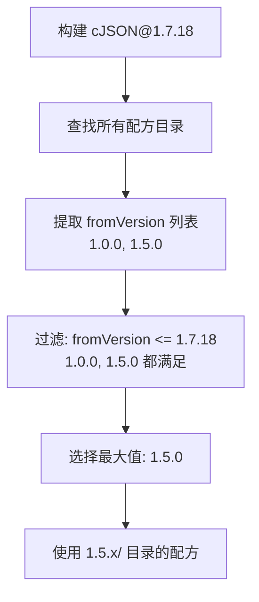
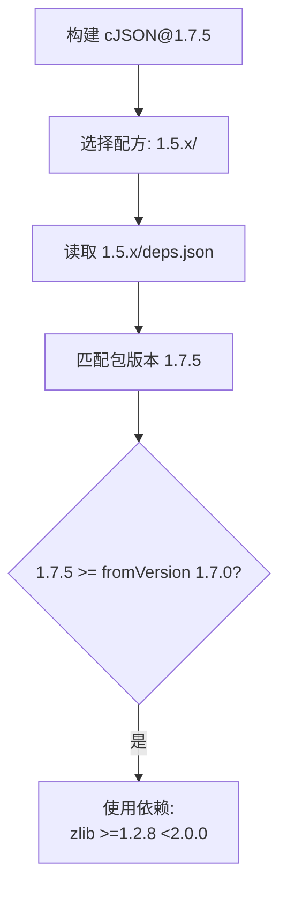
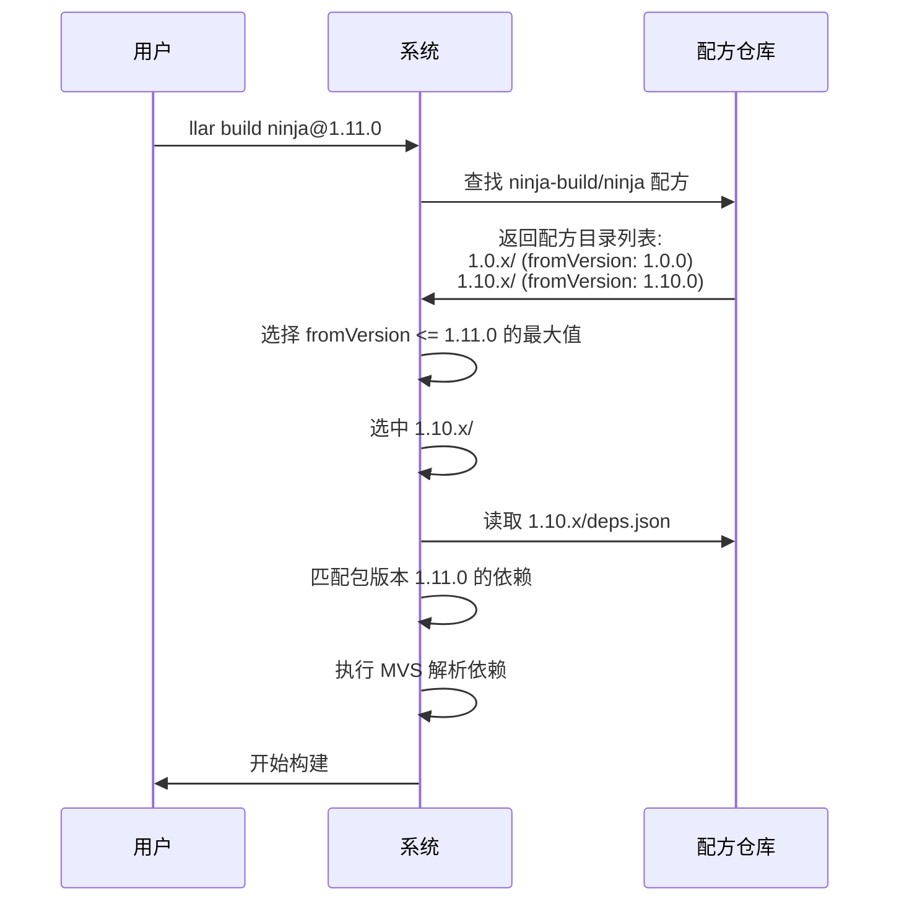
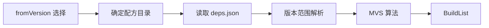

# LLAR 配方版本适配设计

## 1. 概述

本文档定义配方如何适配不同版本的上游包。

**核心概念**：
- **配方没有独立版本号** - 配方代码通过 git commit 管理
- **fromVersion 是包版本匹配规则** - 用于选择能处理特定包版本的配方

## 2. 问题背景

上游包的不同版本可能有不同的：
- 构建系统（如从 Makefile 迁移到 CMake）
- 依赖要求（如新版本需要更高版本的依赖）
- 源码结构（如目录布局变化）

因此需要不同的配方来处理不同版本范围的包。

## 3. fromVersion 机制

### 3.1 定义

`fromVersion` 表示配方能处理的**包版本起始点**。

```
fromVersion: 1.5.0
含义: 该配方能处理 >= 1.5.0 的包版本（直到下一个配方接管）
```

### 3.2 目录结构

```
DaveGamble/
└── cJSON/
    ├── _version.gox              # 版本管理（所有版本共用）
    ├── 1.0.x/                    # fromVersion: 1.0.0
    │   ├── formula.gox
    │   └── deps.json
    └── 1.5.x/                    # fromVersion: 1.5.0
        ├── formula.gox
        └── deps.json
```

**目录命名规范**：
- 目录名与 fromVersion 对应
- 使用通配符表示版本范围（如 `1.0.x`、`2.x`）

### 3.3 选择算法

**原则**：选择 `fromVersion <= 目标版本` 的最大 fromVersion 对应的配方



**示例**：

| 目标包版本 | 可选 fromVersion | 选中配方 |
|-----------|-----------------|---------|
| 1.0.5     | 1.0.0           | 1.0.x/  |
| 1.4.9     | 1.0.0           | 1.0.x/  |
| 1.5.0     | 1.0.0, 1.5.0    | 1.5.x/  |
| 1.7.18    | 1.0.0, 1.5.0    | 1.5.x/  |
| 2.0.0     | 1.0.0, 1.5.0    | 1.5.x/  |

## 4. deps.json 中的版本范围

### 4.1 结构

每个配方目录有自己的 deps.json，定义该配方支持的包版本及其依赖：

```json
{
    "name": "DaveGamble/cJSON",
    "deps": {
        "1.5.0": [{
            "name": "madler/zlib",
            "version": ">=1.2.1 <1.3.0"
        }],
        "1.7.0": [{
            "name": "madler/zlib",
            "version": ">=1.2.8 <2.0.0"
        }]
    }
}
```

**说明**：
- `deps` 的 key 是 **fromVersion**（单一版本号），表示从该版本开始使用此依赖配置
- 查询时选择 `fromVersion <= 目标版本` 的最大 fromVersion

### 4.2 依赖匹配流程



## 5. 配方代码版本管理

### 5.1 使用 Git Commit

配方代码本身**没有独立版本号**，通过 git commit 管理：

```
配方仓库
├── commit abc123: 修复 cJSON 构建脚本
├── commit def456: 添加 cJSON 2.x 支持
└── commit ghi789: 更新 zlib 依赖范围
```

### 5.2 为什么不需要配方版本号

1. **变更频率低** - 配方通常稳定，不像上游包频繁发版
2. **Git 足够** - commit hash 提供精确的版本标识
3. **简化设计** - 避免引入额外的版本维度

## 6. 完整示例

### 6.1 场景：构建 ninja@1.11.0



### 6.2 配方目录结构

```
ninja-build/
└── ninja/
    ├── _version.gox
    ├── 1.0.x/
    │   ├── formula.gox       # 旧构建系统
    │   └── deps.json
    └── 1.10.x/
        ├── formula.gox       # 新构建系统（CMake）
        └── deps.json
```

## 7. 与其他模块的关系



## 8. 参考

- [version-range-design.md](version-range-design.md) - 版本范围设计
- [mvs-algorithm-design.md](mvs-algorithm-design.md) - MVS 算法
