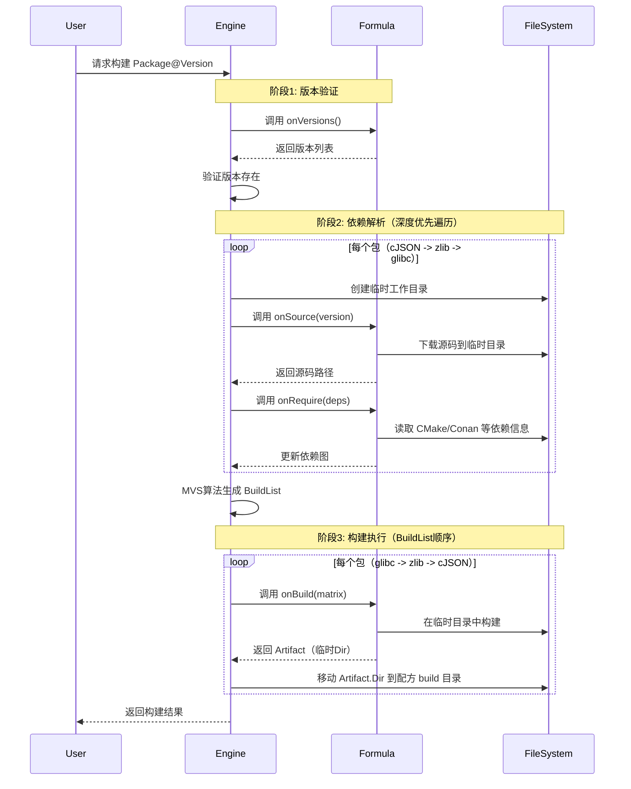
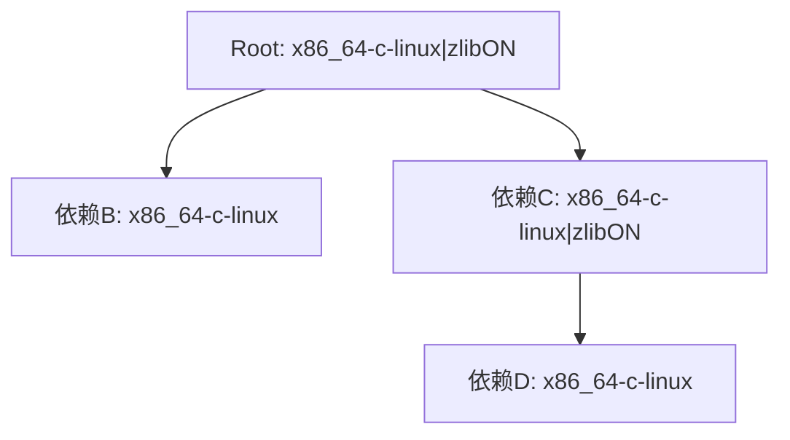
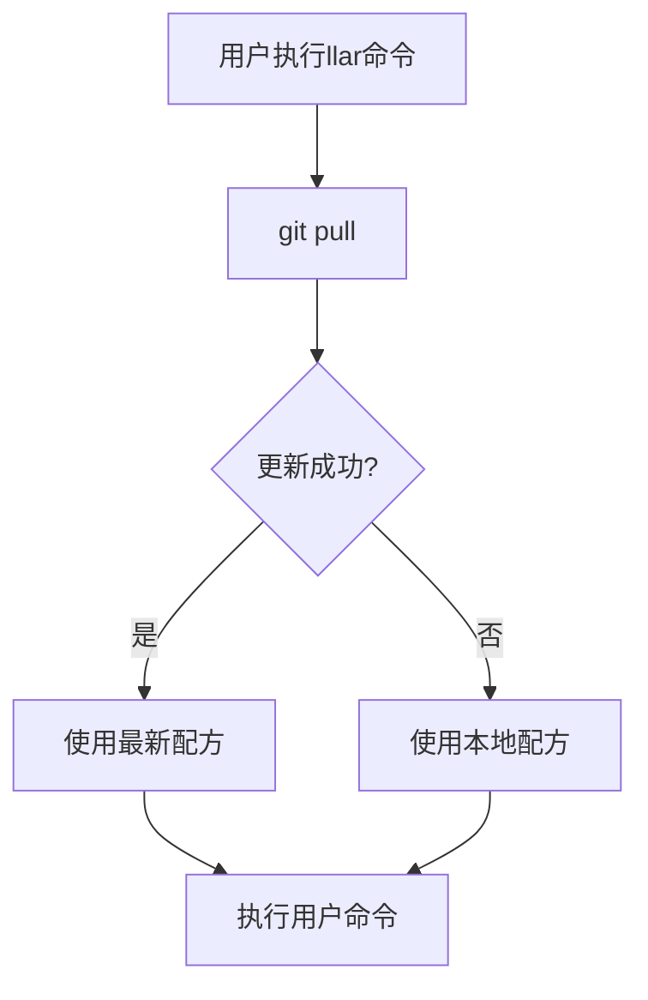
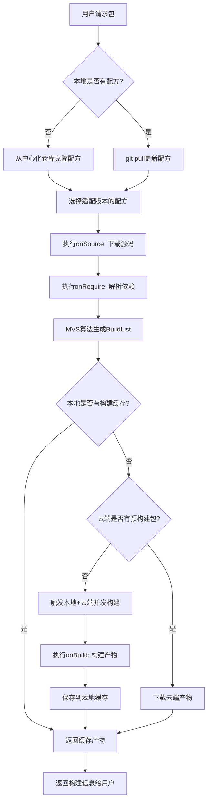

# LLAR 配方设计文档

## 1. 配方基本概念

### 1.1 什么是配方（Formula）

配方（Formula）是LLAR系统中的核心概念，用于告诉构建者如何完成包的构建。配方采用 XGO Classfile 语言编写，提供了一种声明式的方式来描述包的构建过程。

**配方的作用**：
- 定义包的基本信息（名称、版本、描述、主页）
- 声明构建矩阵（build matrix）
- 实现源码下载逻辑
- 实现依赖管理逻辑
- 实现构建执行逻辑

### 1.2 为什么选择 XGO Classfile？

XGO Classfile 具有一切构建脚本需要的特性：

1. **系统命令调用**: XGO Classfile GSH 提供了调用 Bash 命令来完成编译和IO操作的功能
2. **抽象机制**: 基本上每个文件都是建立在抽象之上的，对于一般的抽象机制非常便捷
3. **语法简单**: 提供了极其丰富的 builtin 函数和极其简单语法集
4. **低心智负担**: 提供抽象和低开发心智均衡，特别的错误处理机制解决 Go 的 `if err != nil` 问题
5. **后端切换**: 提供便捷后端切换机制，允许引入 `LLGo` 进行跨语言处理

## 2. 配方文件结构

### 2.1 目录规范

#### 基本结构

```
{{owner}}/
└── {{repo}}/
    ├── versions.json                        # 依赖管理文件（必需）
    ├── {{repo}}_version.gox                 # 版本管理（onVersions + compare）
    ├── go.mod                               # Go依赖（可选）
    ├── go.sum                               # Go依赖（可选）
    └── {{repo名称首字母大写}}_llar.gox      # 配方文件（必需）
```

#### 多版本支持

当库的不同版本需要不同的构建配方时，可以按版本组织：

```
{{owner}}/
└── {{repo}}/
    ├── versions.json                        # 依赖管理文件（必需，放在根目录）
    ├── {{repo}}_version.gox                 # 版本管理（onVersions + compare，放在根目录）
    ├── go.mod                               # Go依赖（可选，放在根目录）
    ├── go.sum                               # Go依赖（可选，放在根目录）
    ├── 1.x/
    │   └── {{repo名称首字母大写}}_llar.gox
    └── 2.x/
        └── {{repo名称首字母大写}}_llar.gox
```

**注意**：
- 目录名称（如 `1.x`, `2.x`）应该与配方中的 `fromVersion` 保持一致
- `versions.json` 和 `_version.gox` 必须放在包的根目录下
- `go.mod` 和 `go.sum` 也必须放在包的根目录下

### 2.2 文件命名规范

**配方文件** (`_llar.gox`):
- 格式: `{{repo名称首字母大写}}_llar.gox`
- 示例: `DaveGamble/cJSON` → `CJSON_llar.gox`

**版本管理文件** (`_version.gox`):
- 格式: `{{repo}}_version.gox`
- 示例: `DaveGamble/cJSON` → `cJSON_version.gox`

**依赖管理文件**:
- 固定名称: `versions.json`

### 2.3 完整示例

**示例：DaveGamble/cJSON**

```
DaveGamble/
└── cJSON/
    ├── versions.json
    ├── cJSON_version.gox
    ├── go.mod
    ├── go.sum
    ├── 1.x/
    │   └── CJSON_llar.gox
    └── 2.x/
        └── CJSON_llar.gox
```

## 3. FormulaApp 基础设计

### 3.1 FormulaPackage 接口

```go
type FormulaApp struct {
    gsh.App
}

type FormulaPackage interface {
    // FormulaApp基类实现

    // 返回当前配方所在目录
    Dir() fs.FS

    // 上一个产物信息
    LastArtifact() *Artifact

    // 返回当前PackageName
    PackageName__0() string

    // 必填，声明当前LLAR Package Name，格式为：owner/repo
    PackageName__1(name string)

    // 返回当前描述
    Desc__0() string

    // 可选，添加Package描述
    Desc__1(desc string)

    // 返回当前Package Homepage URL
    Homepage__0() string

    // 可选，添加Package Homepage URL
    Homepage__1(homepage string)

    // 返回当前Package的构建矩阵
    Matrix__0() matrix.Matrix

    // 声明Package的构建矩阵
    Matrix__1(mrx matrix.Matrix)

    // 返回当前Package的版本
    Version() version.Version

    // 声明该Formula能够处理的起始版本号
    FromVersion(v string)

    // 自定义依赖管理回调
    OnRequire(fn func(deps.Graph))

    // 声明构建回调
    OnBuild(fn func() (*Artifact, error))

    // 提供该Package源码下载方法，并要求维护者实现相关源码验证逻辑
    OnSource(fn func(ver version.Version) (sourceDir string, err error))

    // 返回当前配方所有可用版本
    OnVersions(fn func() []version.Version)
}
```

## 4. 配方回调函数详解

### 4.1 onSource - 源码下载

**功能**: 定义包的源码获取方式，并实现源码验证逻辑

**签名**: `onSource ver => { ... }`

**能力**：
- 指定源码下载地址（从 GitHub releases、官方网站或其他源下载）
- 实现源码验证（使用 Hash 校验确保源码完整性和安全性）
- 支持多种下载方式（HTTP/HTTPS下载、Git克隆、本地文件等）

**执行时机**: 在每个包的 `onRequire` **之前**执行

**执行环境**:
- 会切换到一个**临时工作目录**
- 源码下载到该临时目录
- 临时目录结构：`{{TempDir}}/{{PackageName}}/{{Version}}/source/`

**示例**：
```javascript
onSource ver => {
    // 从GitHub下载特定版本源码
    sourceDir := download("https://github.com/DaveGamble/cJSON/archive/v${ver.Version}.tar.gz")!

    // Hash校验确保源码未被篡改
    err := hashDirAndCompare(sourceDir, "aaaabbbbccccddddeee")

    return sourceDir, err
}
```

### 4.2 onVersions - 版本列表管理

**功能**: 返回该包所有可用的版本列表

**签名**: `onVersions => { ... }`

**能力**：
- 自动获取版本信息（从 GitHub tags、官方 API 或其他源）
- 版本过滤和转换（将上游版本格式转换为 LLAR 标准格式）
- 支持多种版本源（GitHub、GitLab、官方网站、自定义 API 等）

**执行时机**: 仅在 `llar list` 命令时被调用

**示例**：
```javascript
onVersions => {
    // 从GitHub获取所有tags
    tags := fetchTagsFromGitHub("DaveGamble/cJSON")!

    // 转换为版本列表（过滤出符合v1.x.x格式的版本）
    return githubTagsToVersion("v1", tags)
}
```

### 4.3 onRequire - 自定义依赖管理

**功能**: 动态定义包的依赖关系，支持从第三方构建系统读取依赖信息

**签名**: `onRequire deps => { ... }`

**能力**：
- 覆盖静态依赖配置（动态修改 versions.json 中的依赖关系）
- 集成第三方构建系统（从 Conan、Ninja、CMake 等工具读取依赖信息）
- 动态依赖解析（根据构建矩阵、版本等条件动态调整依赖）

**执行时机**: 在 `onSource` **之后**执行（因为需要读取源码中的构建系统文件）

**执行顺序**: 按照依赖树的**深度优先遍历顺序**
- 示例：假设 `cJSON` 依赖 `zlib`，`zlib` 依赖 `glibc`，则遍历顺序为 `cJSON -> zlib -> glibc`

**应用场景**：
- 包已有成熟的依赖管理工具（如 Conan、vcpkg）
- 依赖关系需要根据构建配置动态变化
- 需要与现有构建系统集成

**示例**：
```javascript
onRequire deps => {
    // 从Ninja构建文件读取依赖图
    graph := readDepsFromNinja()?

    // 遍历依赖图并更新到LLAR依赖系统
    graph.visit((parent, dep) => {
        deps.require(parent, dep)
    })

    // 强制替换依赖版本（类似 go.mod 的 replace）
    deps.replace("madler/zlib", "1.2.13")
}
```

**deps.Graph 接口**：
```go
type Graph interface {
    // 修改 packageName 的依赖为 deps
    Require(packageName string, deps []Dependency)

    // 获取版本为 version 的 packageName 的依赖
    RequiredBy(packageName string, version version.Version) ([]Dependency, bool)

    // 强制替换依赖包的版本（类似 go.mod 的 replace）
    Replace(packageName string, version string)
}
```

### 4.4 onBuild - 构建执行

**功能**: 定义包的具体构建步骤和产物输出

**签名**: `onBuild matrix => { ... }`

**能力**：
- 执行构建命令（调用 CMake、Make、编译器等构建工具）
- 处理构建矩阵（根据不同的构建配置执行不同的构建逻辑）
- 生成构建产物（返回包含头文件、库文件、链接参数等信息的 Artifact 结构）

**执行时机**: 所有依赖解析完成后，按照 MVS **BuildList 顺序**（拓扑排序，从底层依赖到上层）

**执行顺序**: BuildList 顺序（必须先构建底层依赖）
- 示例：假设 `cJSON` 依赖 `zlib`，`zlib` 依赖 `glibc`，则 BuildList 顺序为 `glibc -> zlib -> cJSON`

**执行环境**:
- 复用 `onSource` 下载的源码（同一个临时目录）
- 构建在临时目录中进行
- 返回的 `Artifact.Dir` 会被**移动**到最终的配方 build 目录：
  `{{UserCacheDir}}/.llar/formulas/{{owner}}/{{repo}}/build/{{Version}}/{{Matrix}}/`

**应用场景**：
- 执行跨平台构建（Linux、macOS、Windows）
- 处理多种工具链（GCC、Clang、MSVC）
- 生成不同类型的产物（静态库、动态库、Header-Only）

**示例**：
```javascript
onBuild matrix => {
    args := []

    // 根据构建矩阵选择工具链
    if matrix["toolchain"].contains "clang" {
        args <- "-DTOOLCHAIN=clang"
    }

    // 根据架构设置编译参数
    if matrix["arch"] == "arm64" {
        args <- "-DARCH=ARM64"
    }

    args <- "."

    // 执行CMake配置和构建
    cmake args
    cmake "--build" "."

    // 返回构建产物信息
    return {
        Info: {
            BuildResults: [
                {LDFlags, "-L/path/to/lib -lcjson"},
                {CFlags, "-I/path/to/include"},
            ]
        }
    }, nil
}
```

## 5. 回调函数调用流程

### 5.1 完整调用时序



### 5.2 目录变化示例

**onSource 执行时（临时目录）**：
```
/tmp/llar-build-xxx/
└── DaveGamble/
    └── cJSON/
        └── 1.7.18/
            └── source/
                ├── CMakeLists.txt
                ├── cJSON.c
                └── cJSON.h
```

**onBuild 执行后（最终目录）**：
```
{{UserCacheDir}}/.llar/formulas/DaveGamble/cJSON/build/1.7.18/x86_64-c-darwin/
├── .cache.json
├── include/
│   └── cjson/
│       └── cJSON.h
└── lib/
    ├── libcjson.a
    └── pkgconfig/
        └── cjson.pc
```

## 6. 构建产物设计

### 6.1 Artifact 结构

**BasicFormula 接口定义**：
```go
type BasicFormula interface {
    // 返回当前PackageName
    PackageName__0() string
    // 声明当前LLAR Package Name，格式为：owner/repo
    PackageName__1(name string)
    // 返回当前描述
    Desc__0() string
    // 添加Package描述
    Desc__1(desc string)
    // 返回当前Package Homepage URL
    Homepage__0() string
    // 添加Package Homepage URL
    Homepage__1(homepage string)
    // 返回当前Package的构建矩阵
    Matrix__0() matrix.Matrix
    // 声明Package的构建矩阵
    Matrix__1(mrx matrix.Matrix)
    // 返回当前Package的版本
    Version() version.Version
}
```

**运行时结构**（配方中使用）：
```go
type Artifact struct {
    BasicFormula // 嵌入接口，包含包名、版本、矩阵等信息，构建时期自动填入
    Dir  string // 产物输出目录，必填
    Prev *Artifact // 上一个构建产物信息，选填，构建时期自动填入
    Link func(compileArgs []string) []string // 链接回调函数，必填
}
```

**持久化结构**（.cache.json 中存储）：
```go
type ArtifactCache struct {
    PackageName    string            `json:"packageName"`
    Version        string            `json:"version"`
    Matrix         string            `json:"matrix"`
    MatrixDetails  map[string]string `json:"matrixDetails"`
    BuildTime      string            `json:"buildTime"`
    BuildDuration  string            `json:"buildDuration"`
    Outputs        struct {
        Dir       string `json:"dir"`
        LinkArgs  string `json:"linkArgs"` // 通过 Link() 回调生成
    } `json:"outputs"`
    SourceHash     string `json:"sourceHash"`
    FormulaHash    string `json:"formulaHash"`
}
```

**说明**：
- `Artifact` 是运行时结构，`BasicFormula` 接口提供包的元信息
- `Link` 是动态函数，用于在运行时生成链接参数
- `ArtifactCache` 是序列化结构，`linkArgs` 是预先计算好的字符串
- 构建完成后，调用 `Link([]string{})` 生成 `linkArgs` 并保存到 `.cache.json`

### 6.2 链接回调链机制

构建信息由构建列表从上往下传递，每构建完一个产物，会自动将回调函数进行连接：

```
B.Link() -> A.Link()
```

最终形成回调链条：
```
N.Link() -> ... -> B.Link() -> A.Link()
```

最终调用：
```
N.Link([]string{}) // 结果: -Innn ... -Ibbb -Iaaa
```

### 6.3 构建输出结构

一般 C/C++ 语言输出：
```
project/
├── include/         // 头文件
├── lib/             // 库文件
│   └── pkgconfig/   // PC文件
└── bin/             // 可执行二进制（可选）
```

## 7. 版本管理设计

### 7.1 版本结构

```go
type PackageVersion {
    Version string  // 原版本号，保持上游格式
}
```

### 7.2 版本比较机制

**默认比较算法**：
LLAR 使用 GNU Coreutils 的 `sort -V` 算法（来源于 Debian 版本比较），这是一种尽可能通用的版本比较算法。

**自定义比较**：
对于有特殊版本规则的包，维护者可以通过 `_version.gox` 文件提供自定义比较逻辑。

### 7.3 自定义版本比较

#### 背景

由于 C/C++ 并无明确版本规范，GNU 的算法仅仅是竭尽所能去比较（Best Effort），并不适合所有情况。

#### 文件位置

版本管理文件必须存在于当前包根目录下：

```
DaveGamble/
└── cJSON/
    ├── versions.json        # 依赖管理文件（放在根目录）
    ├── cJSON_version.gox    # 版本管理（onVersions + compare）
    ├── go.mod
    ├── go.sum
    ├── 1.x/
    │   └── cJSON_llar.gox
    └── 2.x/
        └── cJSON_llar.gox
```

#### 接口定义

```go
type ComparableVersion interface {
    // 当 a > b，返回 1, a == b, 返回 0， a < b，返回 -1
    Compare(comparator func (a, b PackageVersion) int)
}
```

#### 比较示例

```javascript
import (
    semver "github.com/Masterminds/semver/v3"
)

compare (a, b) => {
    v1 := semver.NewVersion(a.Ver)!
    v2 := semver.NewVersion(b.Ver)!
    return v1.Compare(v2)
}
```

### 7.4 配方版本选择

#### 选择流程

用户需要 `DaveGamble/cJSON` 的 1.7.18 版本时：


#### 选择算法

假设目录结构：
```
DaveGamble/
└── cJSON/
    ├── versions.json
    ├── cJSON_version.gox
    ├── go.mod
    ├── go.sum
    ├── 1.0.x/                    # fromVersion: 1.0.0
    │   └── CJSON_llar.gox
    ├── 1.5.x/                    # fromVersion: 1.5.0
    │   └── CJSON_llar.gox
    └── 2.x/                      # fromVersion: 2.0.0
        └── CJSON_llar.gox
```

选择过程：
1. 遍历所有配方目录
2. 找到所有 `fromVersion <= 目标版本` 的配方
3. 选择其中 `fromVersion` 最大的配方

## 8. 依赖管理设计

### 8.1 versions.json 格式

```json
{
    "name": "DaveGamble/cJSON",
    "deps": {
        "1.0.0": [{
            "name": "madler/zlib",
            "version": "1.2.1"
        }],
        "1.2.0": [{
            "name": "madler/zlib",
            "version": "1.2.3"
        }]
    },
    "replace": {
        "1.0.0": {
            "madler/zlib": "1.2.13"
        }
    }
}
```

**说明**：
- `deps` 对象的 key 值（如 `"1.0.0"`, `"1.2.0"`）表示 `fromVersion`，即**从该版本开始**使用对应的依赖配置
- 查询某个版本的依赖时，会选择小于等于该版本的最大 `fromVersion` 对应的依赖列表
- 例如：查询版本 `1.1.5` 时，会使用 `fromVersion = "1.0.0"` 的依赖配置；查询版本 `1.5.0` 时，会使用 `fromVersion = "1.2.0"` 的依赖配置
- `replace` 对象（可选）也按 `fromVersion` 组织，用于强制替换依赖版本

### 8.2 结构化定义

```go
type Dependency struct {
    PackageName string `json:"name"`
    Version     string `json:"version"`
}

type PackageDependencies struct {
    PackageName  string                       `json:"name"`
    Dependencies map[string][]Dependency      `json:"deps"`    // key: fromVersion, value: 依赖列表
    Replace      map[string]map[string]string `json:"replace"` // key: fromVersion, value: {packageName: version}
}
```

### 8.3 依赖声明方式

#### 静态依赖（通过 versions.json）

在 `versions.json` 中声明依赖关系，这是最常见的方式。

#### 动态依赖（通过 onRequire 回调）

```javascript
onRequire deps => {
    // 从Ninja构建文件读取依赖图
    graph := readDepsFromNinja()?

    // 更新LLAR依赖系统
    graph.visit((parent, dep) => {
        deps.require(parent, dep)
    })

    // 强制替换依赖版本（类似 go.mod 的 replace）
    deps.replace("madler/zlib", "1.2.13")
}
```

**应用场景**：
- 包已有成熟的依赖管理工具（如 Conan、vcpkg、CMake）
- 依赖关系需要根据构建配置动态变化
- 需要与现有构建系统集成

## 9. 构建矩阵设计

### 9.1 基本概念

构建矩阵用于表达一个包在不同构建配置下的所有可能产物组合。

矩阵由两部分组成：
- **require**：必需的编译参数，会向下传播给依赖包（类似 Conan 的 settings）
- **options**：可选的编译参数，仅限于当前包，不向下传播（类似 Conan 的 options）

### 9.2 矩阵结构

```json
{
    "matrix": {
        "require": {
            "arch": ["x86_64", "arm64"],
            "lang": ["c", "cpp"],
            "os": ["linux", "darwin"]
        },
        "options": {
            "zlib": ["zlibON", "zlibOFF"]
        }
    }
}
```

**结构化定义**：
```go
type PackageMatrix struct {
    Require map[string][]string `json:"require"`
    Options map[string][]string `json:"options"`
}
```

### 9.3 必需字段

- **arch**：编译平台（如 x86_64, arm64）
- **lang**：包的语言（如 c, cpp, py）

### 9.4 可选字段

- **os**：操作系统（如 linux, darwin, windows）
- **toolchain**：工具链（如 gcc, clang, msvc）

### 9.5 矩阵组合表示

矩阵组合通过按字母排序的 key 值，用 `-` 连接：
- `require` 组合：`x86_64-c-linux`
- 加上 `options`：`x86_64-c-linux|zlibON`

**示例**：上述矩阵将产生以下组合：
```
x86_64-c-linux
x86_64-c-darwin
arm64-c-linux
arm64-c-darwin
x86_64-cpp-linux
x86_64-cpp-darwin
arm64-cpp-linux
arm64-cpp-darwin
```

如果包含 options 字段，每个组合会进一步扩展：
```
x86_64-c-linux|zlibON
x86_64-c-linux|zlibOFF
...
```

### 9.6 矩阵传播规则



**说明**：
- `require` 字段必须向下传播，所有依赖包的 `require` 必须是入口包的交集
- `options` 字段仅在声明了该 option 的包中生效
- 如果依赖包的 `require` 不是入口包的交集，系统会终止并报错

## 10. 配方存储与管理

### 10.1 本地存储位置

**配方存放目录**：`{{UserCacheDir}}/.llar/formulas/`

该目录通过 Git VCS 进行管理，LLAR 自动处理所有 Git 操作。

**跨平台路径**：

| 平台 | UserCacheDir | 完整路径示例 |
|------|--------------|--------------|
| macOS | `~/Library/Caches` | `/Users/user/Library/Caches/.llar/` |
| Linux | `~/.cache` | `/home/user/.cache/.llar/` |
| Windows | `%LocalAppData%` | `C:\Users\user\AppData\Local\.llar\` |

### 10.2 配方目录结构

```
{{UserCacheDir}}/.llar/
└── formulas/                    # 配方Git仓库（LLAR自动管理）
    ├── .git/                    # Git版本控制
    ├── DaveGamble/
    │   └── cJSON/
    │       ├── versions.json    # 依赖管理文件
    │       ├── cJSON_version.gox # 版本管理（onVersions + compare）
    │       ├── go.mod
    │       ├── go.sum
    │       ├── 1.x/
    │       │   └── CJSON_llar.gox
    │       └── 2.x/
    │           └── CJSON_llar.gox
    └── madler/
        └── zlib/
            ├── versions.json
            └── ZLIB_llar.gox
```

### 10.3 产物存储结构

**位置**：`{{UserCacheDir}}/.llar/formulas/{{owner}}/{{repo}}/build/{{Version}}/{{Matrix}}/`

**目录结构**：
```
{{UserCacheDir}}/.llar/formulas/DaveGamble/cJSON/build/
├── 1.7.18/                      # 版本号目录
│   ├── x86_64-c-darwin/         # 矩阵组合1
│   │   ├── .cache.json          # 构建缓存信息
│   │   ├── include/
│   │   │   └── cjson/
│   │   │       └── cJSON.h
│   │   └── lib/
│   │       ├── libcjson.a
│   │       └── pkgconfig/
│   │           └── cjson.pc
│   ├── arm64-c-darwin/          # 矩阵组合2
│   │   ├── .cache.json
│   │   ├── include/
│   │   └── lib/
│   └── x86_64-c-linux/          # 矩阵组合3
│       ├── .cache.json
│       ├── include/
│       └── lib/
└── 1.7.17/
    └── x86_64-c-darwin/
        ├── .cache.json
        ├── include/
        └── lib/
```

### 10.4 配方自动更新

LLAR 自动管理配方仓库的 Git 操作，用户无需手动执行任何 Git 命令。

**初始化**（首次运行时自动执行）：
```bash
# LLAR自动克隆中心化配方仓库
git clone https://github.com/llar-community/formulas.git {{UserCacheDir}}/.llar/formulas
```

**自动更新**：
每次执行 llar 命令时，LLAR 会自动执行 `git pull` 更新配方仓库。

**更新流程**：


## 11. 完整配方示例

### 11.1 基本配方示例

`CJSON_llar.gox` (DaveGamble/cJSON):

```javascript
// 声明相关信息

// 当前配方仅兼容1.0.0后的版本
fromVersion "1.0.0"

// 当前Package Name
packageName "DaveGamble/cJSON"

// Package 描述
desc "Ultralightweight JSON parser in ANSI C"

// Package 主页
homepage "https://github.com/DaveGamble/cJSON"

// 声明构建矩阵
matrix {
    Require: {
        "os": ["linux", "darwin"],
        "arch": ["amd64", "arm64"]
    },
    Options: {
        "zlib": ["zlibON", "zlibOFF"]
    }
}

// 构建回调
onBuild => {
    args := []

    if matrix.require["lang"] == "c" {
        args <- "-DTOOLCHAIN=clang"
    }

    args <- "."

    cmake args
    cmake "--build" "."

    return {
        Info: {
            BuildResults: [
                {LDFlags, "/xxx/cjson.so"},
                {Custom, "-Map t.map"},
            ]
        }
    }, nil
}

// 源码下载回调
onSource ver => {
    sourceDir := download("https://github.com/DaveGamble/cJSON/releases/tag/v${ver.Version}")!

    err := hashDirAndCompare(sourceDir, "aaaabbbbccccddddeee")

    return sourceDir, err
}

// 版本列表回调
onVersions => {
    tags := fetchTagsFromGitHub("DaveGamble/cJSON")!
    return githubTagsToVersion("v1", tags)
}
```

### 11.2 版本管理文件示例

`cJSON_version.gox`:

```javascript
import (
    semver "github.com/Masterminds/semver/v3"
)

// onVersions 回调 - 获取所有可用版本
onVersions => {
    return fetchGitHubTags("DaveGamble/cJSON")
}

// compare 回调 - 自定义版本比较
compare (a, b) => {
    echo "a: ${a.Ver} b: ${b.Ver}"
    v1 := semver.NewVersion(a.Ver)!
    v2 := semver.NewVersion(b.Ver)!
    return v1.Compare(v2)
}
```

## 12. 配方编写最佳实践

### 12.1 源码验证

**总是使用 Hash 校验**：
```javascript
onSource ver => {
    sourceDir := download("https://github.com/owner/repo/archive/v${ver.Version}.tar.gz")!

    // 使用 SHA256 校验
    err := hashDirAndCompare(sourceDir, "预期的hash值")

    return sourceDir, err
}
```

### 12.2 构建矩阵处理

**根据矩阵参数条件编译**：
```javascript
onBuild matrix => {
    args := []

    // 处理架构
    if matrix["arch"] == "arm64" {
        args <- "-DARCH=ARM64"
    }

    // 处理工具链
    if matrix["toolchain"] == "clang" {
        args <- "-DCMAKE_C_COMPILER=clang"
    }

    // 处理可选配置
    if matrix["zlib"] == "zlibON" {
        args <- "-DWITH_ZLIB=ON"
    }

    cmake args
    cmake "--build" "."

    return artifact, nil
}
```

### 12.3 错误处理

**使用 `!` 操作符处理错误**：
```javascript
onSource ver => {
    // 下载失败会自动返回错误
    sourceDir := download("https://...")!

    // Hash 校验失败会自动返回错误
    err := hashDirAndCompare(sourceDir, "hash")

    return sourceDir, err
}
```

### 12.4 版本管理

**遵循 fromVersion 规范**：
- 使用通配符版本号作为目录名（如 `1.x`, `2.x`）
- 在配方中明确声明 `fromVersion`
- 确保版本覆盖范围连续无间隙

## 13. 配方生命周期

### 13.1 完整生命周期



### 13.2 关键阶段说明

1. **配方获取阶段**：自动从中心化仓库克隆或更新配方
2. **版本选择阶段**：根据 `fromVersion` 选择适配的配方
3. **依赖解析阶段**：按深度优先遍历顺序执行 `onSource` 和 `onRequire`
4. **构建执行阶段**：按 BuildList 拓扑顺序执行 `onBuild`
5. **产物缓存阶段**：将构建产物移动到最终位置并生成缓存信息

---

*本文档整理自 LLAR 产品设计文档和技术设计文档，专注于配方系统的设计和实现。*
