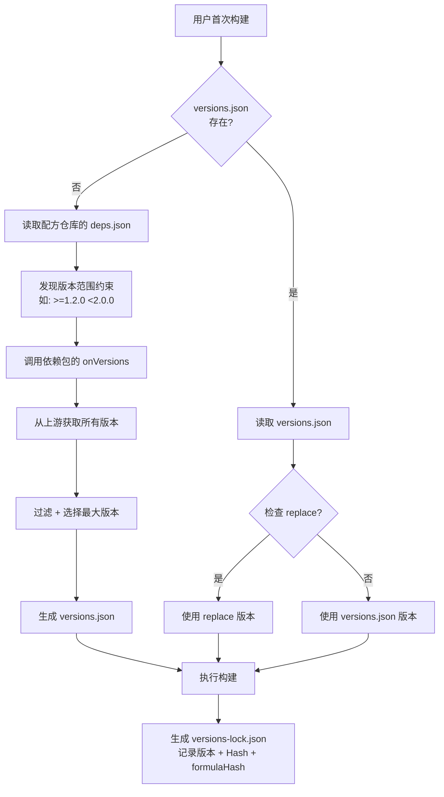
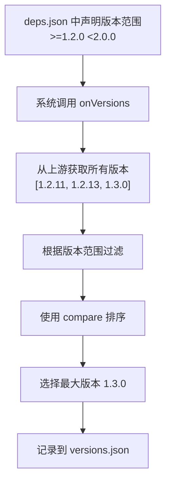
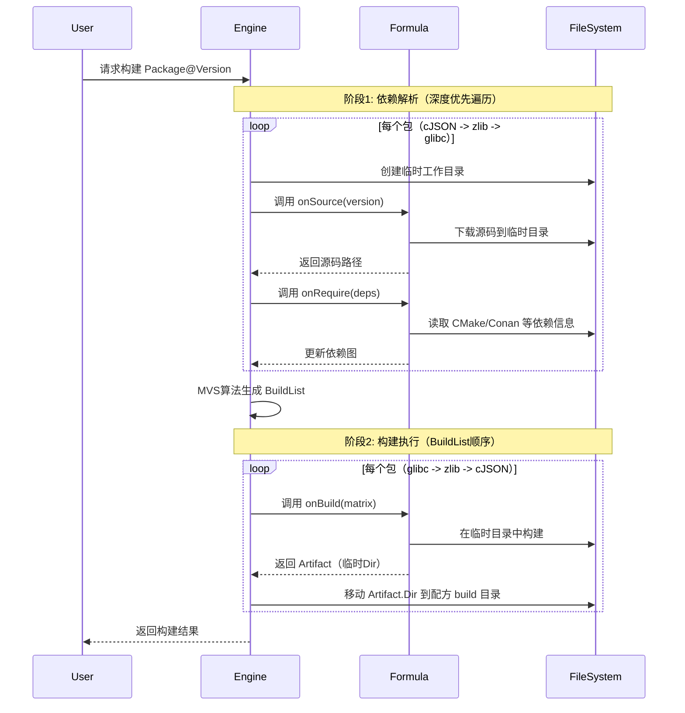
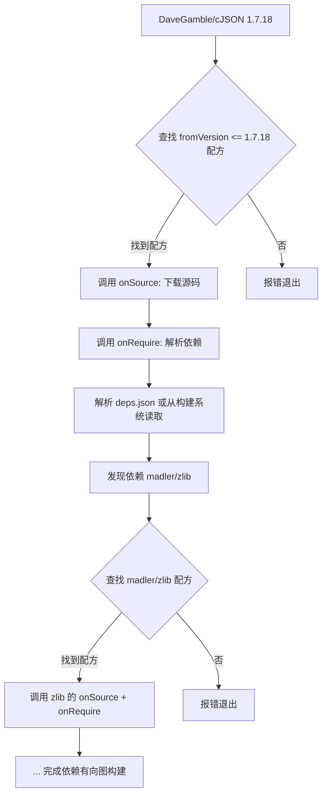
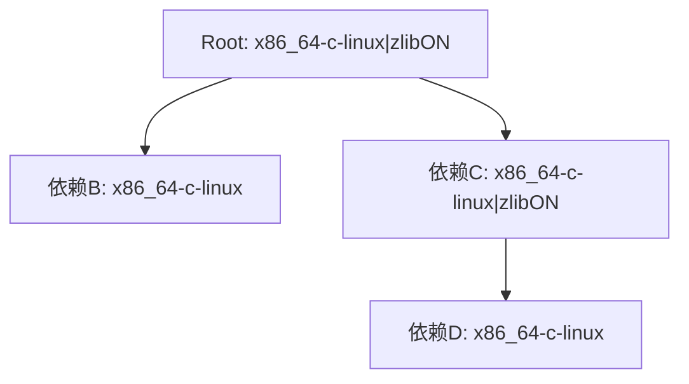
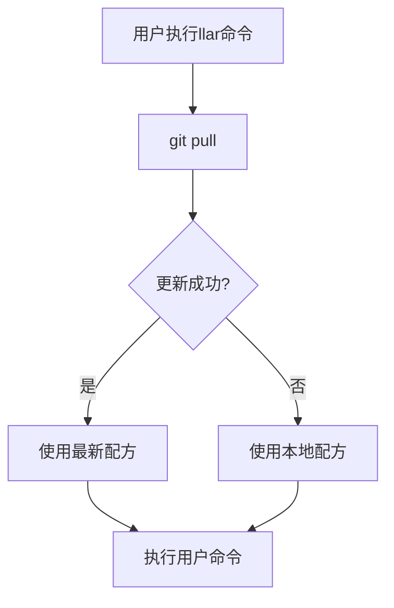
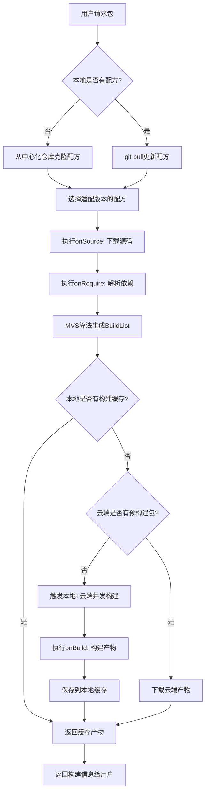

# LLAR 配方设计文档

## 1. 配方基本概念

### 1.1 什么是配方（Formula）

配方（Formula）是LLAR系统中的核心概念，用于告诉构建者如何完成包的构建。配方采用 XGO Classfile 语言编写，提供了一种声明式的方式来描述包的构建过程。

**配方的作用**：
- 定义包的基本信息（名称、版本、描述、主页）
- 声明构建矩阵（build matrix）
- 实现源码下载逻辑
- 实现依赖管理逻辑
- 实现构建执行逻辑

### 1.2 为什么选择 XGO Classfile？

XGO Classfile 具有一切构建脚本需要的特性：

1. **系统命令调用**: XGO Classfile GSH 提供了调用 Bash 命令来完成编译和IO操作的功能
2. **抽象机制**: 基本上每个文件都是建立在抽象之上的，对于一般的抽象机制非常便捷
3. **语法简单**: 提供了极其丰富的 builtin 函数和极其简单语法集
4. **低心智负担**: 提供抽象和低开发心智均衡，特别的错误处理机制解决 Go 的 `if err != nil` 问题
5. **后端切换**: 提供便捷后端切换机制，允许引入 `LLGo` 进行跨语言处理

## 2. 配方文件结构

### 2.1 目录规范

#### 基本结构

```
{{owner}}/
└── {{repo}}/
    ├── deps.json                            # 依赖管理文件（必需，版本范围约束）
    ├── {{repo}}_version.gox                 # 版本管理文件（必需，onVersions + compare）
    ├── go.mod                               # Go依赖（可选）
    ├── go.sum                               # Go依赖（可选）
    └── {{repo}}_llar.gox                    # 配方文件（必需）
```

#### 多版本支持

当库的不同版本需要不同的构建配方时，可以按版本组织：

```
{{owner}}/
└── {{repo}}/
    ├── deps.json                            # 依赖管理文件（必需，放在根目录）
    ├── {{repo}}_version.gox                 # 版本管理文件（必需，放在根目录）
    ├── go.mod                               # Go依赖（可选，放在根目录）
    ├── go.sum                               # Go依赖（可选，放在根目录）
    ├── 1.x/
    │   └── {{repo}}_llar.gox                # 配方文件
    └── 2.x/
        └── {{repo}}_llar.gox                # 配方文件
```

**注意**：
- 目录名称（如 `1.x`, `2.x`）应该与配方中的 `fromVersion` 保持一致
- `deps.json` 和 `{{repo}}_version.gox` 必须放在包的根目录下，由所有版本的配方共享
- `go.mod` 和 `go.sum` 也必须放在包的根目录下

### 2.2 文件命名规范

**配方文件**:
- 格式: `{{repo}}_llar.gox`
- 示例: `DaveGamble/cJSON` → `cjson_llar.gox`
- 说明: 使用 repo 名称（小写）+ `_llar.gox` 后缀

**版本管理文件**:
- 格式: `{{repo}}_version.gox`
- 示例: `DaveGamble/cJSON` → `cjson_version.gox`
- 说明: 使用 repo 名称（小写）+ `_version.gox` 后缀

**依赖管理文件**:
- 固定名称: `deps.json`
- 所有包统一使用此名称

### 2.3 完整示例

**示例：DaveGamble/cJSON**

```
DaveGamble/
└── cJSON/
    ├── deps.json          # 依赖管理文件（版本范围约束）
    ├── cjson_version.gox  # 版本管理文件（onVersions + compare）
    ├── go.mod             # Go 模块文件（可选）
    ├── go.sum             # Go 校验文件（可选）
    ├── 1.x/
    │   └── cjson_llar.gox # 配方文件（处理 1.x 版本）
    └── 2.x/
        └── cjson_llar.gox # 配方文件（处理 2.x 版本）
```

## 3. FormulaApp 基础设计

### 3.1 FormulaApp 基类

FormulaApp 是所有配方 Classfile 的基类，继承自 `gsh.App`，提供了配方编写所需的所有基础能力。

```go
type FormulaApp struct {
    gsh.App

    lastArtifact        *Artifact
    internalTempDir     fs.FS
    internalPackageName string
    internalDesc        string
    internalHomepage    string

    currentMatrix  matrix.Matrix
    declaredMatrix matrix.Matrix

    currentVersion      version.Version
    internalFromVersion version.Version

    onRequireFn func(deps.Graph)
    onBuildFn   func() (result *Artifact, err error)
    onSourceFn  func(ver version.Version) (sourceDir string, err error)
    onVersionFn func() []version.Version
}
```

### 3.2 FormulaApp 方法说明

#### 基础信息管理

```go
// 返回当前配方所在目录
func (f *FormulaApp) Dir() fs.FS

// 上一个产物信息（用于链接回调链）
func (f *FormulaApp) LastArtifact() *Artifact

// PackageName - 支持重载
func (f *FormulaApp) PackageName__0() string        // 返回当前PackageName
func (f *FormulaApp) PackageName__1(name string)    // 声明PackageName（格式：owner/repo）

// Desc - 支持重载
func (f *FormulaApp) Desc__0() string               // 返回当前描述
func (f *FormulaApp) Desc__1(desc string)           // 设置Package描述

// Homepage - 支持重载
func (f *FormulaApp) Homepage__0() string           // 返回当前Homepage URL
func (f *FormulaApp) Homepage__1(homepage string)   // 设置Homepage URL

// Matrix - 支持重载
func (f *FormulaApp) Matrix__0() matrix.Matrix      // 返回当前构建矩阵
func (f *FormulaApp) Matrix__1(mrx matrix.Matrix)   // 声明构建矩阵

// Version - 返回当前包的版本
func (f *FormulaApp) Version() version.Version

// FromVersion - 声明该配方能够处理的起始版本号
func (f *FormulaApp) FromVersion(v string)
```

#### 回调注册方法

XGO Classfile 的 `onXxx` 事件处理器在 Go 层面通过回调注册实现：

```go
// OnSource - 注册源码下载回调
// 参数: func(ver version.Version) (sourceDir string, err error)
func (f *FormulaApp) OnSource(fn func(ver version.Version) (sourceDir string, err error))

// OnRequire - 注册依赖管理回调
// 参数: func(deps.Graph)
func (f *FormulaApp) OnRequire(fn func(deps.Graph))

// OnBuild - 注册构建回调
// 参数: func() (*Artifact, error)
func (f *FormulaApp) OnBuild(fn func() (*Artifact, error))
```

### 3.3 XGO Classfile 中的使用

在 XGO Classfile 中，FormulaApp 的方法可以通过 XGO 的**自动属性**特性简化调用：

```javascript
// 在 XGO Classfile 中

// 声明包名（调用 PackageName__1）
packageName "DaveGamble/cJSON"

// 访问包名（调用 PackageName__0，通过自动属性简化）
echo packageName  // 自动调用 PackageName__0()

// 声明版本起始点
fromVersion "1.0.0"

// 事件处理器（自动注册为回调函数）
onSource ver => {
    // 实现源码下载逻辑
}

onRequire deps => {
    // 实现依赖管理逻辑（可选）
}

onBuild => {
    // 实现构建逻辑
}
```

## 4. 三层版本管理架构

LLAR 采用三层版本管理架构，分离配方仓库（只读）和用户项目（可修改）的职责。

### 4.1 架构概览

| 文件 | 位置 | 权限 | 维护者 | 版本约束 | 上传远程 | 类比 |
|------|------|------|--------|----------|----------|------|
| **deps.json** | 配方仓库 | 只读 | 配方维护者 | 大范围（>=1.0 <2.0） | 是 | - |
| **versions.json** | 用户本地 | 可修改 | 用户 | 确切版本（1.2.3） | 否（.gitignore） | go.mod |
| **versions-lock.json** | 用户本地 | 自动生成 | 系统 | 精确版本 + Hash | 否（.gitignore） | go.sum |

### 4.2 三层职责说明

**deps.json（配方仓库，只读）**:
- 配方维护者编写，用户只读，无法修改
- 使用**版本范围约束**（如 `>=1.2.0 <2.0.0`），减少维护工作量
- 当上游包发布新版本时，无需更新配方，系统自动选择最新版本
- 与配方代码一起版本控制

**versions.json（用户本地，可修改）**:
- 首次构建时从 deps.json 解析生成，记录**精确版本号**
- 用户可修改，支持 `replace` 字段强制替换依赖版本
- 不上传到远程仓库（添加到 .gitignore）
- 类似 Go 的 go.mod

**versions-lock.json（用户本地，自动生成）**:
- 构建完成后自动生成或更新
- 记录精确版本 + sourceHash + **formulaHash**（配方 git commit hash）
- 确保构建可重现：通过 formulaHash 还原配方快照
- 不上传到远程仓库（添加到 .gitignore）
- 类似 Go 的 go.sum

### 4.3 版本选择优先级

当系统解析依赖时，按以下优先级选择版本：

1. **优先级最高**: versions.json 的 `replace` 字段
2. **优先级中等**: versions.json 中记录的确切版本
3. **优先级最低**: deps.json 的版本范围解析（调用 onVersions）

### 4.4 工作流程



### 4.5 示例场景

**场景：配方更新不及时，系统自动选择最新版本**

**配方仓库的 deps.json**（配方维护者编写）:
```json
{
    "name": "DaveGamble/cJSON",
    "deps": {
        "1.0.0": [{
            "name": "madler/zlib",
            "version": ">=1.2.0 <2.0.0"
        }]
    }
}
```

**用户首次构建时**:
1. 系统读取 deps.json 的版本范围 `>=1.2.0 <2.0.0`
2. 调用 zlib 的 `onVersions` 获取所有可用版本
3. 获取到 `[1.2.11, 1.2.13, 1.3.0]`
4. 自动选择最大版本 `1.3.0`
5. 生成 **versions.json**:

```json
{
    "name": "DaveGamble/cJSON",
    "versions": {
        "1.7.18": [
            {
                "name": "madler/zlib",
                "version": "1.3.0"
            }
        ]
    }
}
```

6. 构建完成后生成 **versions-lock.json**:

```json
{
    "name": "DaveGamble/cJSON",
    "versions": {
        "1.7.18": [
            {
                "name": "madler/zlib",
                "version": "1.3.0",
                "sourceHash": "b095afb551dd4efb...",
                "formulaHash": "abc123def456"
            }
        ]
    }
}
```

**结果**：用户无需等待配方维护者更新，即可自动使用 zlib 1.3.0

## 5. 配方回调函数详解

### 5.1 onVersions - 版本列表获取

**功能**: 从上游获取所有可用版本列表，供版本范围解析使用

**文件位置**: `{{repo}}_version.gox`（轻量级，独立加载）

**调用时机**:
- 版本范围解析阶段（首次构建，生成 versions.json 时）
- 用户查询可用版本时
- `versionsOf()` 函数内部调用

**签名**: `onVersions => { ... }`

**返回值**: `[]string` - 版本号列表

**示例**：
```javascript
// ninja_version.gox - 版本管理文件

// 从 GitHub 获取所有 tags
onVersions => {
    return fetchGitHubTags("ninja-build/ninja")
}

// 自定义版本比较（可选）
compare (v1, v2) => {
    // 返回: < 0 (v1 < v2), = 0 (v1 = v2), > 0 (v1 > v2)
    // 如不实现，使用默认 GNU sort -V
}
```

**工作流程**：


### 5.2 onSource - 源码下载

**功能**: 定义包的源码获取方式，并实现源码验证逻辑

**签名**: `onSource ver => { ... }`

**能力**：
- 指定源码下载地址（从 GitHub releases、官方网站或其他源下载）
- 实现源码验证（使用 Hash 校验确保源码完整性和安全性）
- 支持多种下载方式（HTTP/HTTPS下载、Git克隆、本地文件等）

**执行时机**: 在每个包的 `onRequire` **之前**执行

**执行环境**:
- 会切换到一个**临时工作目录**
- 源码下载到该临时目录
- 临时目录结构：`{{TempDir}}/{{PackageName}}/{{Version}}/source/`

**示例**：
```javascript
onSource ver => {
    // 从GitHub下载特定版本源码
    sourceDir := download("https://github.com/DaveGamble/cJSON/archive/v${ver.Version}.tar.gz")!

    // Hash校验确保源码未被篡改
    err := hashDirAndCompare(sourceDir, "aaaabbbbccccddddeee")

    return sourceDir, err
}
```

### 5.3 onRequire - 自定义依赖管理（可选）

**功能**: 从源码中的构建系统文件（如 CMakeLists.txt）动态解析依赖关系

**文件位置**: `{{repo}}_llar.gox`（仅在构建时加载）

**是否必需**: **可选**。如果未实现，系统会回退到使用 deps.json

**签名**: `onRequire deps => { ... }`

**能力**：
- 从第三方构建系统读取依赖信息（CMake、Conan、Meson 等）
- 动态解析依赖并转换为精确版本
- 避免在 deps.json 中手动维护依赖关系

**执行时机**: 在 `onSource` **之后**执行（因为需要读取源码中的构建系统文件）

**执行顺序**: 按照依赖树的**深度优先遍历顺序**
- 示例：假设 `cJSON` 依赖 `zlib`，`zlib` 依赖 `glibc`，则遍历顺序为 `cJSON -> zlib -> glibc`

**应用场景**：
- 上游包使用 CMake/Conan/Meson 等构建系统，包含依赖信息
- 依赖关系经常变化，手动维护 deps.json 成本高
- 希望自动跟随上游依赖更新

**系统提供的接口**：

1. **resolve(libraryName string) string**: 将库名转换为完整的 packageName
   ```javascript
   packageName := resolve("re2c")  // 输出: "skvadrik/re2c"
   ```

2. **versionsOf(packageName string) VersionList**: 获取指定包的版本列表
   ```javascript
   versionList := versionsOf("skvadrik/re2c")  // 内部加载 re2c_version.gox 并调用 onVersions
   ```

3. **versionList.filter(constraint string) VersionList**: 根据版本约束过滤版本
   ```javascript
   filtered := versionList.filter(">=2.0")  // 内部调用 compare 方法
   ```

4. **versionList.max**: XGo 自动属性，获取最大版本
   ```javascript
   maxVersion := filtered.max  // 自动调用 .Max() 方法
   ```

5. **readFile(path string) string**: 读取文件内容
   ```javascript
   cmake := readFile("CMakeLists.txt")?
   ```

6. **deps.require(packageName, dependencies)**: 填入依赖到依赖图
   ```javascript
   deps.require("ninja-build/ninja", [{
       name: packageName,
       version: selectedVersion
   }])
   ```

**示例：Ninja 包的 onRequire**：
```javascript
// ninja_llar.gox - 配方文件

onRequire deps => {
    // 1. 读取 CMakeLists.txt（onSource 已下载）
    cmake := readFile("CMakeLists.txt")?

    // 2. 解析依赖声明
    if cmake.contains("find_package(re2c 2.0") {
        // 3. 解析库名为完整 packageName
        packageName := resolve("re2c")  // "skvadrik/re2c"

        // 4. 获取版本列表、过滤并选择最大版本
        selectedVersion := versionsOf(packageName).filter(">=2.0").max

        // 5. 填入精确版本
        deps.require("ninja-build/ninja", [{
            name: packageName,
            version: selectedVersion
        }])
    }
}
```

**配方之间的隔离**：
- Classfile 之间不直接依赖
- 通过 `versionsOf()` 获取其他包的版本信息
- 通过 `resolve()` 将库名转换为 packageName

**onRequire 内部的版本处理**：
- deps.json 使用版本范围（如 `>=1.2.0 <2.0.0`）
- onRequire 内部需要转换为精确版本
- 通过 `versionsOf().filter().max` 完成转换

**何时使用 onRequire**：
- ✅ 适合：上游包有标准的构建系统文件（CMakeLists.txt、conanfile.txt 等）
- ✅ 适合：依赖关系经常变化
- ❌ 不适合：上游包没有构建系统文件
- ❌ 不适合：依赖关系简单且稳定

**deps.Graph 接口**：
```go
type Graph interface {
    // 修改 packageName 的依赖为 deps
    Require(packageName string, deps []Dependency)

    // 获取版本为 version 的 packageName 的依赖
    RequiredBy(packageName string, version version.Version) ([]Dependency, bool)

    // 强制替换依赖包的版本（仅用于运行时，不影响 versions.json）
    Replace(packageName string, version string)
}
```

### 5.4 onBuild - 构建执行

**功能**: 定义包的具体构建步骤和产物输出

**签名**: `onBuild matrix => { ... }`

**能力**：
- 执行构建命令（调用 CMake、Make、编译器等构建工具）
- 处理构建矩阵（根据不同的构建配置执行不同的构建逻辑）
- 生成构建产物（返回包含头文件、库文件、链接参数等信息的 Artifact 结构）

**执行时机**: 所有依赖解析完成后，按照 MVS **BuildList 顺序**（拓扑排序，从底层依赖到上层）

**执行顺序**: BuildList 顺序（必须先构建底层依赖）
- 示例：假设 `cJSON` 依赖 `zlib`，`zlib` 依赖 `glibc`，则 BuildList 顺序为 `glibc -> zlib -> cJSON`

**执行环境**:
- 复用 `onSource` 下载的源码（同一个临时目录）
- 构建在临时目录中进行
- 返回的 `Artifact.Dir` 会被**移动**到最终的配方 build 目录：
  `{{UserCacheDir}}/.llar/formulas/{{owner}}/{{repo}}/build/{{Version}}/{{Matrix}}/`

**应用场景**：
- 执行跨平台构建（Linux、macOS、Windows）
- 处理多种工具链（GCC、Clang、MSVC）
- 生成不同类型的产物（静态库、动态库、Header-Only）

**示例**：
```javascript
onBuild matrix => {
    args := []

    // 根据构建矩阵选择工具链
    if matrix["toolchain"].contains "clang" {
        args <- "-DTOOLCHAIN=clang"
    }

    // 根据架构设置编译参数
    if matrix["arch"] == "arm64" {
        args <- "-DARCH=ARM64"
    }

    args <- "."

    // 执行CMake配置和构建
    cmake args
    cmake "--build" "."

    // 返回构建产物信息
    return {
        Info: {
            BuildResults: [
                {LDFlags, "-L/path/to/lib -lcjson"},
                {CFlags, "-I/path/to/include"},
            ]
        }
    }, nil
}
```

## 6. 回调函数调用流程

### 6.1 完整调用时序



### 6.2 目录变化示例

**onSource 执行时（临时目录）**：
```
/tmp/llar-build-xxx/
└── DaveGamble/
    └── cJSON/
        └── 1.7.18/
            └── source/
                ├── CMakeLists.txt
                ├── cJSON.c
                └── cJSON.h
```

**onBuild 执行后（最终目录）**：
```
{{UserCacheDir}}/.llar/formulas/DaveGamble/cJSON/build/1.7.18/x86_64-c-darwin/
├── .cache.json
├── include/
│   └── cjson/
│       └── cJSON.h
└── lib/
    ├── libcjson.a
    └── pkgconfig/
        └── cjson.pc
```

## 7. 构建产物设计

### 7.1 Artifact 结构

**BasicFormula 接口定义**：
```go
type BasicFormula interface {
    // 返回当前PackageName
    PackageName__0() string
    // 声明当前LLAR Package Name，格式为：owner/repo
    PackageName__1(name string)
    // 返回当前描述
    Desc__0() string
    // 添加Package描述
    Desc__1(desc string)
    // 返回当前Package Homepage URL
    Homepage__0() string
    // 添加Package Homepage URL
    Homepage__1(homepage string)
    // 返回当前Package的构建矩阵
    Matrix__0() matrix.Matrix
    // 声明Package的构建矩阵
    Matrix__1(mrx matrix.Matrix)
    // 返回当前Package的版本
    Version() version.Version
}
```

**运行时结构**（配方中使用）：
```go
type Artifact struct {
    BasicFormula // 嵌入接口，包含包名、版本、矩阵等信息，构建时期自动填入
    Dir  string // 产物输出目录，必填
    Prev *Artifact // 上一个构建产物信息，选填，构建时期自动填入
    Link func(compileArgs []string) []string // 链接回调函数，必填
}
```

**持久化结构**（.cache.json 中存储）：
```go
type ArtifactCache struct {
    PackageName    string            `json:"packageName"`
    Version        string            `json:"version"`
    Matrix         string            `json:"matrix"`
    MatrixDetails  map[string]string `json:"matrixDetails"`
    BuildTime      string            `json:"buildTime"`
    BuildDuration  string            `json:"buildDuration"`
    Outputs        struct {
        Dir       string `json:"dir"`
        LinkArgs  string `json:"linkArgs"` // 通过 Link() 回调生成
    } `json:"outputs"`
    SourceHash     string `json:"sourceHash"`
    FormulaHash    string `json:"formulaHash"`
}
```

**说明**：
- `Artifact` 是运行时结构，`BasicFormula` 接口提供包的元信息
- `Link` 是动态函数，用于在运行时生成链接参数
- `ArtifactCache` 是序列化结构，`linkArgs` 是预先计算好的字符串
- 构建完成后，调用 `Link([]string{})` 生成 `linkArgs` 并保存到 `.cache.json`

### 7.2 链接回调链机制

构建信息由构建列表从上往下传递，每构建完一个产物，会自动将回调函数进行连接：

```
B.Link() -> A.Link()
```

最终形成回调链条：
```
N.Link() -> ... -> B.Link() -> A.Link()
```

最终调用：
```
N.Link([]string{}) // 结果: -Innn ... -Ibbb -Iaaa
```

### 7.3 构建输出结构

一般 C/C++ 语言输出：
```
project/
├── include/         // 头文件
├── lib/             // 库文件
│   └── pkgconfig/   // PC文件
└── bin/             // 可执行二进制（可选）
```

### 7.4 构建可重现性与 formulaHash

**formulaHash 的作用**：
- 记录配方仓库的 git commit hash
- 确保不同时间、不同环境使用相同的配方版本
- 通过 git 机制实现配方版本的精确控制

**工作流程**：

1. **构建时记录 formulaHash**：
   - 系统读取当前配方仓库的 git commit hash
   - 将 formulaHash 记录到 versions-lock.json 中
   - 示例：`"formulaHash": "abc123def456"`

2. **可复现构建时还原配方**：
   - 读取 versions-lock.json 中的 formulaHash
   - 执行 `git checkout <formulaHash>` 还原配方代码
   - 使用还原后的配方执行构建

**示例场景：团队协作**

```
开发者 A:
1. 首次构建 cJSON@1.7.18
2. 生成 versions-lock.json，记录 formulaHash = "abc123def456"
3. 提交 versions-lock.json 到项目仓库

开发者 B:
1. 拉取项目代码（包含 versions-lock.json）
2. 执行 llar install cJSON@1.7.18
3. LLAR 读取 formulaHash = "abc123def456"
4. LLAR 执行 git checkout abc123def456
5. 使用相同的配方版本构建
6. 得到完全相同的构建结果
```

**关键点**：
- formulaHash 是配方仓库的 git commit hash，不是源码 hash
- 即使配方仓库后续更新，也能还原到历史版本
- 确保团队成员使用完全相同的配方版本

## 8. 版本管理设计

### 8.1 版本结构

```go
type PackageVersion {
    Version string  // 原版本号，保持上游格式
}
```

### 8.2 版本比较机制

**默认比较算法**：
LLAR 使用 GNU Coreutils 的 `sort -V` 算法（来源于 Debian 版本比较），这是一种尽可能通用的版本比较算法。

**自定义比较**：
对于有特殊版本规则的包，维护者可以通过 `_version.gox` 文件提供自定义比较逻辑。

### 8.3 自定义版本比较

#### 背景

由于 C/C++ 并无明确版本规范，GNU 的算法仅仅是竭尽所能去比较（Best Effort），并不适合所有情况。

#### 文件位置

版本管理文件必须存在于当前包根目录下：

```
DaveGamble/
└── cJSON/
    ├── deps.json            # 依赖管理文件（放在根目录）
    ├── cjson_version.gox    # 版本管理文件
    ├── go.mod
    ├── go.sum
    ├── 1.x/
    │   └── cjson_llar.gox
    └── 2.x/
        └── cjson_llar.gox
```

#### 接口定义

```go
type ComparableVersion interface {
    // 当 a > b，返回 1, a == b, 返回 0， a < b，返回 -1
    Compare(comparator func (a, b PackageVersion) int)
}
```

#### 比较示例

```javascript
import (
    semver "github.com/Masterminds/semver/v3"
)

compare (a, b) => {
    v1 := semver.NewVersion(a.Ver)!
    v2 := semver.NewVersion(b.Ver)!
    return v1.Compare(v2)
}
```

### 8.4 配方版本选择

#### 选择流程

用户需要 `DaveGamble/cJSON` 的 1.7.18 版本时：



#### 选择算法

假设目录结构：
```
DaveGamble/
└── cJSON/
    ├── deps.json
    ├── cjson_version.gox
    ├── go.mod
    ├── go.sum
    ├── 1.0.x/                    # fromVersion: 1.0.0
    │   └── cjson_llar.gox
    ├── 1.5.x/                    # fromVersion: 1.5.0
    │   └── cjson_llar.gox
    └── 2.x/                      # fromVersion: 2.0.0
        └── cjson_llar.gox
```

选择过程：
1. 遍历所有配方目录
2. 找到所有 `fromVersion <= 目标版本` 的配方
3. 选择其中 `fromVersion` 最大的配方

## 9. 依赖管理设计

### 9.1 deps.json 格式（配方仓库）

**deps.json** 位于配方仓库，使用**版本范围约束**：

```json
{
    "name": "DaveGamble/cJSON",
    "deps": {
        "1.0.0": [{
            "name": "madler/zlib",
            "version": ">=1.2.1 <1.3.0"
        }],
        "1.2.0": [{
            "name": "madler/zlib",
            "version": ">=1.2.8 <2.0.0"
        }]
    }
}
```

**说明**：
- deps.json 位于**配方仓库**，用户只读
- `deps` 对象的 key 值（如 `"1.0.0"`, `"1.2.0"`）表示 `fromVersion`，即**从该版本开始**使用对应的依赖配置
- 查询某个版本的依赖时，会选择小于等于该版本的最大 `fromVersion` 对应的依赖列表
- 例如：查询版本 `1.1.5` 时，会使用 `fromVersion = "1.0.0"` 的依赖配置；查询版本 `1.5.0` 时，会使用 `fromVersion = "1.2.0"` 的依赖配置
- `version` 字段使用**版本范围表达式**（如 `>=1.2.0 <2.0.0`，空格分隔），而非固定版本

### 9.2 版本范围语法

版本范围采用基于比较操作符的约束语法（参考 npm，使用空格分隔）:

```
1.2.3            # 精确版本
>=1.2.3          # 大于等于 1.2.3
>1.2.3           # 大于 1.2.3
<=1.2.3          # 小于等于 1.2.3
<1.2.3           # 小于 1.2.3
>=1.2.3 <2.0.0   # 版本范围组合 (AND，空格分隔)
```

**说明**:
- LLAR 不基于 semver，因此不支持 `^` 和 `~` 等 semver 特有的语法
- 不支持 `*`（任意版本）和通配符语法
- 版本比较依赖包的自定义 Compare 方法或默认的 GNU sort -V 算法
- 使用**空格分隔**多个约束条件，表示 AND 关系（参考 npm）

### 9.3 versions.json 格式（用户本地）

**versions.json** 位于用户本地，记录**精确版本**：

```json
{
    "name": "DaveGamble/cJSON",
    "versions": {
        "1.7.18": [
            {
                "name": "madler/zlib",
                "version": "1.2.13"
            }
        ]
    },
    "replace": {
        "madler/zlib": "1.2.11"
    }
}
```

**说明**：
- versions.json 位于**用户本地**，用户可修改
- 首次构建时从 deps.json 解析生成，记录精确版本号
- `replace` 字段在顶层，允许用户替代特定依赖的版本（优先级最高）
- 不上传到远程仓库（应添加到 .gitignore）

### 9.4 versions-lock.json 格式（构建锁定）

**versions-lock.json** 位于用户本地，记录**精确版本 + Hash**：

```json
{
    "name": "DaveGamble/cJSON",
    "versions": {
        "1.7.18": [
            {
                "name": "madler/zlib",
                "version": "1.2.13",
                "sourceHash": "b095afb551dd4efb...",
                "formulaHash": "abc123def456"
            }
        ]
    }
}
```

**说明**：
- versions-lock.json 位于**用户本地**，自动生成
- 记录精确版本 + sourceHash（源码哈希）+ formulaHash（配方 git commit hash）
- 确保构建可重现：通过 formulaHash 还原配方快照
- 不上传到远程仓库（应添加到 .gitignore）

### 9.5 结构化定义

**deps.json（配方仓库）**:
```go
type Dependency struct {
    PackageName    string `json:"name"`
    VersionRange   string `json:"version"`  // 版本范围（空格分隔）
}

type PackageDependencies struct {
    PackageName  string                        `json:"name"`
    Dependencies map[string][]Dependency       `json:"deps"`     // key: fromVersion（起始版本号）
}
```

**versions.json（用户本地）**:
```go
type Dependency struct {
    PackageName    string `json:"name"`
    Version        string `json:"version"`  // 精确版本号
}

type VersionsFile struct {
    PackageName   string                   `json:"name"`
    Versions      map[string][]Dependency  `json:"versions"` // key: 包版本号, value: 依赖数组
    Replace       map[string]string        `json:"replace,omitempty"` // key: PackageName, value: 精确版本号
}
```

**versions-lock.json（构建锁定）**:
```go
type DependencyLock struct {
    PackageName   string `json:"name"`           // 包名
    Version       string `json:"version"`        // 锁定的版本号
    SourceHash    string `json:"sourceHash"`     // 源码 Hash (sha256)
    FormulaHash   string `json:"formulaHash"`    // 配方 Git Commit Hash
}

type VersionLockFile struct {
    PackageName   string                      `json:"name"`
    Versions      map[string][]DependencyLock `json:"versions"` // key: 包版本号, value: 依赖数组（有序）
}
```

### 9.6 依赖声明方式

#### 静态依赖（通过 deps.json）

在 `deps.json` 中声明依赖关系，这是最常见的方式。

#### 动态依赖（通过 onRequire 回调）

详见 [5.3 onRequire - 自定义依赖管理](#53-onrequire---自定义依赖管理可选)

**应用场景**：
- 上游包使用 CMake/Conan/Meson 等构建系统，包含依赖信息
- 依赖关系经常变化，手动维护 deps.json 成本高
- 希望自动跟随上游依赖更新

## 10. 构建矩阵设计

### 10.1 基本概念

构建矩阵用于表达一个包在不同构建配置下的所有可能产物组合。

矩阵由两部分组成：
- **require**：必需的编译参数，会向下传播给依赖包（类似 Conan 的 settings）
- **options**：可选的编译参数，仅限于当前包，不向下传播（类似 Conan 的 options）

### 10.2 矩阵结构

```json
{
    "matrix": {
        "require": {
            "arch": ["x86_64", "arm64"],
            "lang": ["c", "cpp"],
            "os": ["linux", "darwin"]
        },
        "options": {
            "zlib": ["zlibON", "zlibOFF"]
        }
    }
}
```

**结构化定义**：
```go
type PackageMatrix struct {
    Require map[string][]string `json:"require"`
    Options map[string][]string `json:"options"`
}
```

### 10.3 必需字段

- **arch**：编译平台（如 x86_64, arm64）
- **lang**：包的语言（如 c, cpp, py）

### 10.4 可选字段

- **os**：操作系统（如 linux, darwin, windows）
- **toolchain**：工具链（如 gcc, clang, msvc）

### 10.5 矩阵组合表示

矩阵组合通过按字母排序的 key 值，用 `-` 连接：
- `require` 组合：`x86_64-c-linux`
- 加上 `options`：`x86_64-c-linux|zlibON`

**示例**：上述矩阵将产生以下组合：
```
x86_64-c-linux
x86_64-c-darwin
arm64-c-linux
arm64-c-darwin
x86_64-cpp-linux
x86_64-cpp-darwin
arm64-cpp-linux
arm64-cpp-darwin
```

如果包含 options 字段，每个组合会进一步扩展：
```
x86_64-c-linux|zlibON
x86_64-c-linux|zlibOFF
...
```

### 10.6 矩阵传播规则



**说明**：
- `require` 字段必须向下传播，所有依赖包的 `require` 必须是入口包的交集
- `options` 字段仅在声明了该 option 的包中生效
- 如果依赖包的 `require` 不是入口包的交集，系统会终止并报错

## 11. 配方存储与管理

### 11.1 本地存储位置

**配方存放目录**：`{{UserCacheDir}}/.llar/formulas/`

该目录通过 Git VCS 进行管理，LLAR 自动处理所有 Git 操作。

**跨平台路径**：

| 平台 | UserCacheDir | 完整路径示例 |
|------|--------------|--------------|
| macOS | `~/Library/Caches` | `/Users/user/Library/Caches/.llar/` |
| Linux | `~/.cache` | `/home/user/.cache/.llar/` |
| Windows | `%LocalAppData%` | `C:\Users\user\AppData\Local\.llar\` |

### 11.2 配方目录结构

```
{{UserCacheDir}}/.llar/
└── formulas/                    # 配方Git仓库（LLAR自动管理）
    ├── .git/                    # Git版本控制
    ├── DaveGamble/
    │   └── cJSON/
    │       ├── deps.json        # 依赖管理文件
    │       ├── cjson_version.gox # 版本管理文件
    │       ├── go.mod
    │       ├── go.sum
    │       ├── 1.x/
    │       │   └── cjson_llar.gox
    │       └── 2.x/
    │           └── cjson_llar.gox
    └── madler/
        └── zlib/
            ├── deps.json
            ├── zlib_version.gox
            └── zlib_llar.gox
```

### 11.3 产物存储结构

**位置**：`{{UserCacheDir}}/.llar/formulas/{{owner}}/{{repo}}/build/{{Version}}/{{Matrix}}/`

**目录结构**：
```
{{UserCacheDir}}/.llar/formulas/DaveGamble/cJSON/build/
├── 1.7.18/                      # 版本号目录
│   ├── x86_64-c-darwin/         # 矩阵组合1
│   │   ├── .cache.json          # 构建缓存信息
│   │   ├── include/
│   │   │   └── cjson/
│   │   │       └── cJSON.h
│   │   └── lib/
│   │       ├── libcjson.a
│   │       └── pkgconfig/
│   │           └── cjson.pc
│   ├── arm64-c-darwin/          # 矩阵组合2
│   │   ├── .cache.json
│   │   ├── include/
│   │   └── lib/
│   └── x86_64-c-linux/          # 矩阵组合3
│       ├── .cache.json
│       ├── include/
│       └── lib/
└── 1.7.17/
    └── x86_64-c-darwin/
        ├── .cache.json
        ├── include/
        └── lib/
```

### 11.4 配方自动更新

LLAR 自动管理配方仓库的 Git 操作，用户无需手动执行任何 Git 命令。

**初始化**（首次运行时自动执行）：
```bash
# LLAR自动克隆中心化配方仓库
git clone https://github.com/llar-community/formulas.git {{UserCacheDir}}/.llar/formulas
```

**自动更新**：
每次执行 llar 命令时，LLAR 会自动执行 `git pull` 更新配方仓库。

**更新流程**：


## 12. 完整配方示例

### 12.1 版本管理文件示例

**cjson_version.gox** (DaveGamble/cJSON):

```javascript
// cjson_version.gox - 版本管理文件

// onVersions 回调 - 从 GitHub 获取所有可用版本
onVersions => {
    return fetchGitHubTags("DaveGamble/cJSON")
}

// compare 回调 - 自定义版本比较（可选）
// 如不实现，使用默认 GNU sort -V
compare (v1, v2) => {
    // 对于 cJSON，使用 semver 比较
    semver1 := parseSemver(v1)!
    semver2 := parseSemver(v2)!
    return semver1.Compare(semver2)
}
```

### 12.2 依赖管理文件示例

**deps.json** (DaveGamble/cJSON):

```json
{
    "name": "DaveGamble/cJSON",
    "deps": {
        "1.0.0": [{
            "name": "madler/zlib",
            "version": ">=1.2.0 <2.0.0"
        }],
        "1.5.0": [{
            "name": "madler/zlib",
            "version": ">=1.2.8 <2.0.0"
        }]
    }
}
```

**说明**:
- `deps` 的 key 是 fromVersion（如 `"1.0.0"`、`"1.5.0"`）
- `version` 字段使用版本范围（如 `>=1.2.0 <2.0.0`）
- 当上游 zlib 发布新版本时，系统自动选择最新的满足约束的版本

### 12.3 配方文件示例

**cjson_llar.gox** (DaveGamble/cJSON):

```javascript
// ============================================
// 1. 声明包的基本信息
// ============================================

// 当前配方仅兼容 1.0.0 后的版本
fromVersion "1.0.0"

// 当前 Package Name（格式：owner/repo）
packageName "DaveGamble/cJSON"

// Package 描述
desc "Ultralightweight JSON parser in ANSI C"

// Package 主页
homepage "https://github.com/DaveGamble/cJSON"

// ============================================
// 2. 声明构建矩阵
// ============================================

// 定义构建矩阵：require 会向下传播，options 仅限当前包
matrix {
    Require: {
        "os": ["linux", "darwin"],
        "arch": ["x86_64", "arm64"],
        "lang": ["c"]
    },
    Options: {
        "shared": ["ON", "OFF"]
    }
}

// ============================================
// 3. 事件处理器：源码下载
// ============================================

onSource ver => {
    // 从 GitHub 下载特定版本的源码
    url := "https://github.com/DaveGamble/cJSON/archive/v${ver.ver}.tar.gz"
    sourceDir := download(url)!

    // Hash 校验确保源码完整性（推荐）
    err := hashDirAndCompare(sourceDir, "aaaabbbbccccddddeee")
    if err != nil {
        return "", err
    }

    return sourceDir, nil
}

// ============================================
// 4. 事件处理器：依赖管理（可选）
// ============================================

onRequire deps => {
    // 读取 CMakeLists.txt 检查依赖
    cmake := readFile("CMakeLists.txt")?

    // 如果检测到需要 zlib
    if cmake.contains("find_package(ZLIB") {
        // 解析库名为完整 packageName
        zlibPkg := resolve("zlib")  // "madler/zlib"

        // 获取符合条件的版本
        zlibVersion := versionsOf(zlibPkg).filter(">=1.2.0").max

        // 添加依赖
        deps.require(packageName, [{
            name: zlibPkg,
            version: zlibVersion
        }])
    }
}

// ============================================
// 5. 事件处理器：构建执行
// ============================================

onBuild => {
    // 构建参数数组
    args := []

    // 获取当前构建矩阵
    m := matrix

    // 根据操作系统设置参数
    if m.require["os"] == "darwin" {
        args <- "-DCMAKE_OSX_ARCHITECTURES=${m.require["arch"]}"
    }

    // 根据架构设置参数
    if m.require["arch"] == "arm64" {
        args <- "-DARCH=ARM64"
    }

    // 根据 options 设置构建类型
    if m.options["shared"] == "ON" {
        args <- "-DBUILD_SHARED_LIBS=ON"
    } else {
        args <- "-DBUILD_SHARED_LIBS=OFF"
    }

    // 设置安装路径
    buildDir := dir  // 当前工作目录（临时目录）
    installDir := "${buildDir}/install"
    args <- "-DCMAKE_INSTALL_PREFIX=${installDir}"
    args <- "."

    // 执行 CMake 配置
    cmake args

    // 执行构建
    cmake "--build", "."

    // 执行安装
    cmake "--install", "."

    // 定义链接回调函数
    linkFn := func(compileArgs []string) []string {
        result := compileArgs

        // 添加头文件路径
        result <- "-I${installDir}/include"

        // 添加库文件路径
        if m.options["shared"] == "ON" {
            result <- "-L${installDir}/lib", "-lcjson"
        } else {
            result <- "${installDir}/lib/libcjson.a"
        }

        // 如果有上一个产物，调用其 Link 函数形成链接链
        if lastArtifact != nil {
            result = lastArtifact.Link(result)
        }

        return result
    }

    // 返回构建产物
    return &Artifact{
        Dir:  installDir,      // 产物目录
        Link: linkFn,          // 链接回调函数
    }, nil
}
```

**关键点说明**：

1. **文件分离**：
   - `{{repo}}_version.gox`: 轻量级，包含 onVersions 和 compare
   - `deps.json`: 使用版本范围约束（如 `>=1.2.0 <2.0.0`）
   - `{{repo}}_llar.gox`: 重量级，包含 onSource、onRequire（可选）、onBuild

2. **基本信息声明**：使用 `packageName`、`desc`、`homepage`、`fromVersion` 声明包信息

3. **构建矩阵**：通过 `matrix` 关键字声明，区分 `Require`（传播） 和 `Options`（本地）

4. **事件处理器**：
   - `onVersions`（{{repo}}_version.gox）：从上游获取所有可用版本
   - `onSource`（{{repo}}_llar.gox）：下载并验证源码
   - `onRequire`（{{repo}}_llar.gox，可选）：动态解析依赖
   - `onBuild`（{{repo}}_llar.gox）：执行构建并返回 Artifact

5. **版本范围解析**：
   - deps.json 使用版本范围
   - 系统调用 onVersions 获取可用版本
   - 自动选择最大满足约束的版本
   - 首次构建时生成 versions.json（精确版本）

6. **错误处理**：使用 XGO 的 `!` 和 `?` 操作符简化错误处理

7. **链接回调链**：通过 `lastArtifact.Link()` 形成回调链，自动传递编译参数

## 13. 配方编写最佳实践

### 13.1 版本范围管理

**使用版本范围而非固定版本**：
```json
{
    "name": "DaveGamble/cJSON",
    "deps": {
        "1.0.0": [{
            "name": "madler/zlib",
            "version": ">=1.2.0 <2.0.0"
        }]
    }
}
```

**优势**：
- 减少配方维护工作量
- 当上游包发布新版本时，系统自动选择最新版本
- 用户无需等待配方更新

### 13.2 文件分离最佳实践

**{{repo}}_version.gox**（轻量级）：
- 仅包含 onVersions 和 compare（可选）
- 在版本范围解析阶段加载
- 保持简单，避免复杂逻辑

**{{repo}}_llar.gox**（重量级）：
- 包含 onSource、onRequire（可选）、onBuild
- 仅在构建时加载
- 可以包含复杂的构建逻辑

### 13.3 源码验证

**总是使用 Hash 校验**：
```javascript
onSource ver => {
    sourceDir := download("https://github.com/owner/repo/archive/v${ver.Version}.tar.gz")!

    // 使用 SHA256 校验
    err := hashDirAndCompare(sourceDir, "预期的hash值")

    return sourceDir, err
}
```

### 13.4 构建矩阵处理

**根据矩阵参数条件编译**：
```javascript
onBuild matrix => {
    args := []

    // 处理架构
    if matrix["arch"] == "arm64" {
        args <- "-DARCH=ARM64"
    }

    // 处理工具链
    if matrix["toolchain"] == "clang" {
        args <- "-DCMAKE_C_COMPILER=clang"
    }

    // 处理可选配置
    if matrix["zlib"] == "zlibON" {
        args <- "-DWITH_ZLIB=ON"
    }

    cmake args
    cmake "--build" "."

    return artifact, nil
}
```

### 13.5 错误处理

**使用 `!` 操作符处理错误**：
```javascript
onSource ver => {
    // 下载失败会自动返回错误
    sourceDir := download("https://...")!

    // Hash 校验失败会自动返回错误
    err := hashDirAndCompare(sourceDir, "hash")

    return sourceDir, err
}
```

### 13.6 版本管理

**遵循 fromVersion 规范**：
- 使用通配符版本号作为目录名（如 `1.x`, `2.x`）
- 在配方中明确声明 `fromVersion`
- 确保版本覆盖范围连续无间隙

## 14. 配方生命周期

### 14.1 完整生命周期



### 14.2 关键阶段说明

1. **配方获取阶段**：自动从中心化仓库克隆或更新配方
2. **版本选择阶段**：根据 `fromVersion` 选择适配的配方
3. **依赖解析阶段**：按深度优先遍历顺序执行 `onSource` 和 `onRequire`
4. **构建执行阶段**：按 BuildList 拓扑顺序执行 `onBuild`
5. **产物缓存阶段**：将构建产物移动到最终位置并生成缓存信息

---

*本文档整理自 LLAR 产品设计文档和技术设计文档，专注于配方系统的设计和实现。*
