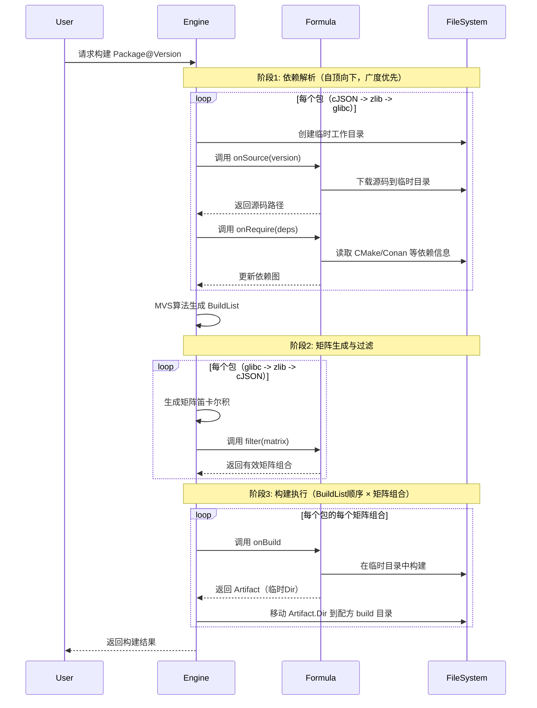
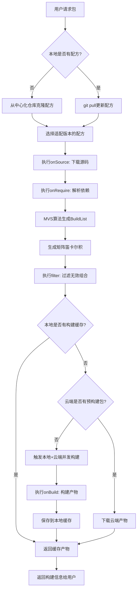

# LLAR 配方设计文档

## 1. 配方基本概念

### 1.1 什么是配方（Formula）

配方（Formula）是LLAR系统中的核心概念，用于告诉构建者如何完成包的构建。配方采用 XGO Classfile 语言编写，提供了一种声明式的方式来描述包的构建过程。

**配方的作用**：
- 定义包的基本信息（名称、版本、描述、主页）
- 声明构建矩阵（build matrix）
- 实现矩阵过滤逻辑（过滤无效组合）
- 实现源码下载逻辑
- 实现依赖管理逻辑
- 实现构建执行逻辑

### 1.2 为什么选择 XGO Classfile？

XGO Classfile 具有一切构建脚本需要的特性：

1. **系统命令调用**: XGO Classfile GSH 提供了调用 Bash 命令来完成编译和IO操作的功能
2. **抽象机制**: 基本上每个文件都是建立在抽象之上的，对于一般的抽象机制非常便捷
3. **语法简单**: 提供了极其丰富的 builtin 函数和极其简单语法集
4. **低心智负担**: 提供抽象和低开发心智均衡，特别的错误处理机制解决 Go 的 `if err != nil` 问题
5. **后端切换**: 提供便捷后端切换机制，允许引入 `LLGo` 进行跨语言处理

## 2. 配方文件结构

### 2.1 目录规范

#### 基本结构

```
{{owner}}/
└── {{repo}}/
    ├── deps.json                            # 依赖管理文件（必需，版本范围约束）
    ├── {{repo}}_version.gox                 # 版本管理文件（必需，onVersions + compare）
    ├── go.mod                               # Go依赖（可选）
    ├── go.sum                               # Go依赖（可选）
    └── {{repo}}_llar.gox                    # 配方文件（必需）
```

#### 多版本支持

当库的不同版本需要不同的构建配方时，可以按版本组织：

```
{{owner}}/
└── {{repo}}/
    ├── deps.json                            # 依赖管理文件（必需，放在根目录）
    ├── {{repo}}_version.gox                 # 版本管理文件（必需，放在根目录）
    ├── go.mod                               # Go依赖（可选，放在根目录）
    ├── go.sum                               # Go依赖（可选，放在根目录）
    ├── 1.x/
    │   └── {{repo}}_llar.gox                # 配方文件
    └── 2.x/
        └── {{repo}}_llar.gox                # 配方文件
```

**注意**：
- 目录名称（如 `1.x`, `2.x`）应该与配方中的 `fromVersion` 保持一致
- `deps.json` 和 `{{repo}}_version.gox` 必须放在包的根目录下，由所有版本的配方共享
- `go.mod` 和 `go.sum` 也必须放在包的根目录下

### 2.2 文件命名规范

**配方文件**:
- 格式: `{{repo}}_llar.gox`
- 示例: `DaveGamble/cJSON` → `cJSON_llar.gox`
- 说明: 使用 repo 名称 + `_llar.gox` 后缀

**版本管理文件**:
- 格式: `{{repo}}_version.gox`
- 示例: `DaveGamble/cJSON` → `cJSON_version.gox`
- 说明: 使用 repo 名称 + `_version.gox` 后缀

**依赖管理文件**:
- 固定名称: `deps.json`
- 所有包统一使用此名称

### 2.3 完整示例

**示例：DaveGamble/cJSON**

```
DaveGamble/
└── cJSON/
    ├── deps.json          # 依赖管理文件（版本范围约束）
    ├── cJSON_version.gox  # 版本管理文件（onVersions + compare）
    ├── go.mod             # Go 模块文件（可选）
    ├── go.sum             # Go 校验文件（可选）
    ├── 1.x/
    │   └── cJSON_llar.gox # 配方文件（处理 1.x 版本）
    └── 2.x/
        └── cJSON_llar.gox # 配方文件（处理 2.x 版本）
```

## 3. FormulaApp 基础设计

### 3.1 FormulaApp 基类

FormulaApp 是所有配方 Classfile 的基类，继承自 `gsh.App`，提供了配方编写所需的所有基础能力。

```go
type FormulaApp struct {
    gsh.App

    lastArtifact        *Artifact
    internalTempDir     fs.FS
    internalPackageName string
    internalDesc        string
    internalHomepage    string

    currentMatrix  matrix.Matrix
    declaredMatrix matrix.Matrix

    currentVersion      version.Version
    internalFromVersion version.Version

    onRequireFn func(deps.Graph)
    onBuildFn   func() (result Artifact, err error)
    onSourceFn  func(ver version.Version, lockSourceHash string) (sourceHash string, err error)
    onVersionFn func() []version.Version
}
```

### 3.2 FormulaApp 方法说明

#### 基础信息管理

```go
// 返回当前配方所在目录
func (f *FormulaApp) Dir() fs.FS

// 上一个产物信息（用于链接回调链）
func (f *FormulaApp) LastArtifact() *Artifact

// PackageName - 支持重载
func (f *FormulaApp) PackageName__0() string        // 返回当前PackageName
func (f *FormulaApp) PackageName__1(name string)    // 声明PackageName（格式：owner/repo）

// Desc - 支持重载
func (f *FormulaApp) Desc__0() string               // 返回当前描述
func (f *FormulaApp) Desc__1(desc string)           // 设置Package描述

// Homepage - 支持重载
func (f *FormulaApp) Homepage__0() string           // 返回当前Homepage URL
func (f *FormulaApp) Homepage__1(homepage string)   // 设置Homepage URL

// Matrix - 支持重载
func (f *FormulaApp) Matrix__0() matrix.Matrix      // 返回当前构建矩阵
func (f *FormulaApp) Matrix__1(mrx matrix.Matrix)   // 声明构建矩阵

// Version - 返回当前包的版本
func (f *FormulaApp) Version() version.Version

// FromVersion - 声明该配方能够处理的起始版本号
func (f *FormulaApp) FromVersion(v string)
```

#### 回调注册方法

XGO Classfile 的 `onXxx` 事件处理器在 Go 层面通过回调注册实现：

```go
// OnSource - 注册源码下载回调
// 参数: func(ver version.Version, lockSourceHash string) (sourceHash string, err error)
func (f *FormulaApp) OnSource(fn func(ver version.Version, lockSourceHash string) (sourceHash string, err error))

// OnRequire - 注册依赖管理回调
// 参数: func(deps.Graph)
func (f *FormulaApp) OnRequire(fn func(deps.Graph))

// OnBuild - 注册构建回调
// 参数: func() (Artifact, error)
func (f *FormulaApp) OnBuild(fn func() (Artifact, error))

// Filter - 注册矩阵过滤回调
// 参数: func(matrix.Matrix) bool
func (f *FormulaApp) Filter(fn func(m matrix.Matrix) bool)
```

### 3.3 XGO Classfile 中的使用

在 XGO Classfile 中，FormulaApp 的方法可以通过 XGO 的**自动属性**特性简化调用：

```javascript
// 在 XGO Classfile 中

// 声明包名（调用 PackageName__1）
packageName "DaveGamble/cJSON"

// 访问包名（调用 PackageName__0，通过自动属性简化）
echo packageName  // 自动调用 PackageName__0()

// 声明版本起始点
fromVersion "1.0.0"

// 事件处理器（自动注册为回调函数）
onSource (ver, lockSourceHash) => {
    // 实现源码下载逻辑
}

onRequire deps => {
    // 实现依赖管理逻辑（可选）
}

filter matrix => {
    // 实现矩阵过滤逻辑（可选）
}

onBuild => {
    // 实现构建逻辑
}
```

## 4. 配方回调函数详解

### 4.1 onSource - 源码下载

**功能**: 定义包的源码获取方式，并实现源码验证逻辑

**签名**: `onSource (ver, lockSourceHash) => { ... }`

**参数**：
- `ver`: 版本号
- `lockSourceHash`: 来自 versions-lock.json 的锁定源码 hash，如果没有 version-lock 则为空字符串

**返回值**：
- `sourceHash`: 实际下载的源码 hash（当 lockSourceHash 为空时需要返回）
- `err`: 错误信息

**能力**：
- 指定源码下载地址（从 GitHub releases、官方网站或其他源下载）
- 实现源码验证（使用 Hash 校验确保源码完整性和安全性）
- 支持多种下载方式（HTTP/HTTPS下载、Git克隆、本地文件等）
- 支持可重现构建（通过 lockSourceHash 验证）

**执行时机**: 在每个包的 `onRequire` **之前**执行

**执行环境**:
- 会切换到一个**临时工作目录**
- 源码下载到该临时目录
- 临时目录结构：`{{TempDir}}/{{PackageName}}/{{Version}}/source/`

**示例**：
```javascript
onSource (ver, lockSourceHash) => {
    // 从GitHub下载特定版本源码
    download("https://github.com/DaveGamble/cJSON/archive/v${ver.Version}.tar.gz")!

    // 读取源码包提供的 hash 文件
    actualHash := readHashFromFile("hash.txt")!

    // 如果有锁定 hash，验证是否匹配
    if lockSourceHash != "" {
        if actualHash != lockSourceHash {
            return "", errors.New("源码 hash 不匹配")
        }
    }

    // 返回实际 hash（用于生成 versions-lock.json）
    return actualHash, nil
}
```

### 4.2 onRequire - 自定义依赖管理（可选）

**功能**: 从源码中的构建系统文件（如 CMakeLists.txt）动态解析依赖关系

**文件位置**: `{{repo}}_llar.gox`（仅在构建时加载）

**是否必需**: **可选**。如果未实现，系统会回退到使用 deps.json

**签名**: `onRequire deps => { ... }`

**能力**：
- 从第三方构建系统读取依赖信息（CMake、Conan、Meson 等）
- 动态解析依赖并转换为精确版本
- 避免在 deps.json 中手动维护依赖关系

**执行时机**: 在 `onSource` **之后**执行（因为需要读取源码中的构建系统文件）

**执行顺序**: 按照依赖树的**自顶向下顺序**（广度优先遍历）
- 示例：假设 `cJSON` 依赖 `zlib`，`zlib` 依赖 `glibc`，则执行顺序为 `cJSON -> zlib -> glibc`
- 原因：必须先执行 cJSON 的 onRequire 才能知道它依赖 zlib，然后才能执行 zlib 的 onRequire

**应用场景**：
- 上游包使用 CMake/Conan/Meson 等构建系统，包含依赖信息
- 依赖关系经常变化，手动维护 deps.json 成本高
- 希望自动跟随上游依赖更新

**系统提供的接口**：

1. **resolve(libraryName string) string**: 将库名转换为完整的 packageName
   ```javascript
   packageName := resolve("re2c")  // 输出: "skvadrik/re2c"
   ```

2. **versionsOf(packageName string) VersionList**: 获取指定包的版本列表
   ```javascript
   versionList := versionsOf("skvadrik/re2c")  // 内部加载 re2c_version.gox 并调用 onVersions
   ```

3. **versionList.filter(constraint string) version.Version**: 根据版本约束过滤并选择版本
   ```javascript
   // 系统根据 -u 参数自动选择：
   // - 无 -u 参数：选择满足约束的最小版本（稳定优先）
   // - 有 -u 参数：选择满足约束的最大版本（最新优先）
   selectedVersion := versionList.filter(">=2.0")
   ```

4. **readFile(path string) string**: 读取文件内容
   ```javascript
   cmake := readFile("CMakeLists.txt")?
   ```

5. **deps.require(packageName, dependencies)**: 填入依赖到依赖图
   ```javascript
   deps.require("ninja-build/ninja", [{
       name: packageName,
       version: selectedVersion
   }])
   ```

**示例：从 CMake 解析依赖**：
```javascript
// ninja_llar.gox - 配方文件

onRequire deps => {
    // 1. 读取 CMakeLists.txt（onSource 已下载）
    cmake := readFile("CMakeLists.txt")?

    // 2. 解析所有 find_package 依赖声明（从构建系统文件中提取）
    // 这是一个黑盒过程，从 CMake/Conan 等构建系统解析依赖和版本
    // 示例：
    //   find_package(re2c 2.0 REQUIRED)  -> {name: "re2c", version: "2.0"}
    //   find_package(zlib REQUIRED)      -> {name: "zlib", version: ""}
    matches := parseFindPackage(cmake)  // 返回 [{name: "re2c", version: "2.0"}, {name: "zlib", version: ""}]

    // 3. 构建依赖列表
    dependencies := []
    for match in matches {
        // 4. 将库名解析为完整的 packageName
        packageName := resolve(match.name)  // "re2c" -> "skvadrik/re2c"

        // 5. 处理版本约束
        if match.version != "" {
            // 如果解析出了版本，使用解析出的版本约束
            selectedVersion := versionsOf(packageName).filter(">=" + match.version)
            dependencies <- {name: packageName, version: selectedVersion}
        } else {
            // 如果没有解析出版本，回退到 deps.json
            // 系统会从 deps.json 读取版本约束并自动选择版本
            dependencies <- {name: packageName}
        }
    }

    // 6. 填入依赖到依赖图
    deps.require(packageName, dependencies)
}
```

**说明**：
- onRequire 从第三方构建系统（CMake/Conan/Meson）**解析出依赖库名和版本约束**
- **如果解析出版本**：使用解析出的版本约束，通过 `versionsOf().filter()` 选择版本
- **如果没有解析出版本**：回退到 deps.json，系统自动读取版本约束并选择版本
- 版本选择根据 `-u` 参数决定：
  - 无 `-u`：选择满足约束的最小版本（稳定优先）
  - 有 `-u`：选择满足约束的最大版本（最新优先）

**配方之间的隔离**：
- Classfile 之间不直接依赖
- 通过 `versionsOf()` 获取其他包的版本信息
- 通过 `resolve()` 将库名转换为 packageName

**onRequire 版本处理机制**：
- **解析出版本**：使用 `versionsOf().filter()` 根据解析出的版本约束选择精确版本
- **未解析出版本**：回退到 deps.json，系统自动读取版本约束并选择版本
- 版本选择策略（通过 `-u` 参数控制）：
  - 无 `-u` 参数：选择满足约束的最小版本（稳定优先）
  - 有 `-u` 参数：选择满足约束的最大版本（最新优先）
- **首次构建**时会生成 `versions.json`，记录选定的精确版本

**deps.Graph 接口**：
```go
type Graph interface {
    // 修改 packageName 的依赖为 deps
    Require(packageName string, deps []Dependency)

    // 获取版本为 version 的 packageName 的依赖
    RequiredBy(packageName string, version version.Version) ([]Dependency, bool)

    // 强制替换依赖包的版本（仅用于运行时，不影响 versions.json）
    Replace(packageName string, version string)
}
```

### 4.3 onBuild - 构建执行

**功能**: 定义包的具体构建步骤和产物输出

**签名**: `onBuild => { ... }`

**能力**：
- 执行构建命令（调用 CMake、Make、编译器等构建工具）
- 处理构建矩阵（根据不同的构建配置执行不同的构建逻辑）
- 生成构建产物（返回包含头文件、库文件、链接参数等信息的 Artifact 结构）

**执行时机**: 所有依赖解析完成后，按照 MVS **BuildList 顺序**（拓扑排序，从底层依赖到上层）

**执行顺序**: BuildList 顺序（必须先构建底层依赖）
- 示例：假设 `cJSON` 依赖 `zlib`，`zlib` 依赖 `glibc`，则 BuildList 顺序为 `glibc -> zlib -> cJSON`

**执行环境**:
- 复用 `onSource` 下载的源码（同一个临时目录）
- 构建在临时目录中进行
- 返回的 `Artifact.Dir` 会被**移动**到最终的配方 build 目录：
  `{{UserCacheDir}}/.llar/formulas/{{owner}}/{{repo}}/build/{{Version}}/{{Matrix}}/`

**应用场景**：
- 执行跨平台构建（Linux、macOS、Windows）
- 处理多种工具链（GCC、Clang、MSVC）
- 生成不同类型的产物（静态库、动态库、Header-Only）

### 4.4 filter - 过滤无效矩阵组合（可选）

> **详细设计参见**：[matrix.md 第 8.2 节 - 过滤无效矩阵组合](matrix.md#过滤无效矩阵组合)

**功能**: 过滤掉矩阵笛卡尔积中无效的组合

**是否必需**: **可选**。如果未实现，系统将使用全部矩阵组合

**签名**: `filter matrix => { return true/false }`

**基本示例**：

```javascript
matrix {
    Require: {
        "arch": ["x86_64", "arm64", "mips"],
        "os": ["linux", "darwin", "windows"]
    }
}

// 过滤无效的矩阵组合
filter matrix => {
    // macOS 不支持 MIPS
    if matrix.require["os"] == "darwin" && matrix.require["arch"] == "mips" {
        return false  // 剔除该组合
    }
    return true  // 保留其他组合
}
```

**Filter 语义**：
- `return true`：保留该矩阵组合
- `return false`：剔除该矩阵组合

## 5. 回调函数调用流程

### 5.1 完整调用时序



### 5.2 目录变化示例

**onSource 执行时（临时目录）**：
```
/tmp/llar-build-xxx/
└── DaveGamble/
    └── cJSON/
        └── 1.7.18/
            └── source/
                ├── CMakeLists.txt
                ├── cJSON.c
                └── cJSON.h
```

**onBuild 执行后（最终目录）**：
```
{{UserCacheDir}}/.llar/formulas/DaveGamble/cJSON/build/1.7.18/x86_64-c-darwin/
├── .cache.json
├── include/
│   └── cjson/
│       └── cJSON.h
└── lib/
    ├── libcjson.a
    └── pkgconfig/
        └── cjson.pc
```

## 6. 构建产物设计

### 6.1 Artifact 结构

**BasicFormula 接口定义**：
```go
type BasicFormula interface {
    // 返回当前PackageName
    PackageName() string
    // 返回当前描述
    Desc() string
    // 返回当前Package Homepage URL
    Homepage() string
    // 返回当前Package的构建矩阵
    Matrix() matrix.Matrix
    // 返回当前Package的版本
    Version() version.Version
}
```

**运行时结构**（配方中使用）：
```go
type Artifact struct {
    // 配方需要填充的字段
    Dir      string   // 产物输出目录，必填
    LinkArgs []string // 链接参数，必填

    // 内部字段（系统自动填充）
    formula      BasicFormula  // 包的元信息，系统自动填入，只读
    dependencies []*Artifact   // 依赖的产物列表，系统自动填入
}

// Formula 方法 - 通过 XGO 自动属性访问
// 配方中使用: artifact.formula （自动调用 Formula()）
func (a *Artifact) Formula() BasicFormula

// ArtifactIter 迭代器
type ArtifactIter struct {
    // 迭代器内部字段
}

// Next 实现迭代器接口
func (iter *ArtifactIter) Next() (val *Artifact, ok bool)

// Gop_Enum 返回迭代器
// 用法：for dep in artifact { ... }
func (a *Artifact) Gop_Enum() *ArtifactIter
```

**持久化结构**（.cache.json 中存储）：
```go
type ArtifactCache struct {
    PackageName    string            `json:"packageName"`
    Version        string            `json:"version"`
    Matrix         string            `json:"matrix"`
    MatrixDetails  map[string]string `json:"matrixDetails"`
    BuildTime      string            `json:"buildTime"`
    BuildDuration  string            `json:"buildDuration"`
    Outputs        struct {
        Dir      string   `json:"dir"`
        LinkArgs []string `json:"linkArgs"`
    } `json:"outputs"`
    SourceHash     string `json:"sourceHash"`
    FormulaHash    string `json:"formulaHash"`
}
```

**说明**：
- `Artifact` 是运行时结构，配方只需填充 `Dir` 和 `LinkArgs` 字段
- `formula` 字段提供包的元信息（包名、版本、矩阵等），系统自动填入，只读
- 通过 XGO 自动属性访问：`artifact.formula` 自动调用 `Formula()` 方法
- `dependencies` 字段存储依赖的产物列表，系统根据 MVS BuildList 自动填入
- 通过 XGO 迭代器语法 `for dep in artifact { ... }` 遍历依赖
- `LinkArgs` 是字符串数组，包含编译链接所需的所有参数
- `ArtifactCache` 是序列化结构，直接存储 `linkArgs` 数组

### 6.2 配方中使用 Artifact

#### 6.2.1 访问依赖的元信息

通过 XGO 自动属性访问 BasicFormula：

```javascript
onBuild => {
    // 遍历所有依赖
    for dep in artifact {
        // 使用 XGO 自动属性访问 BasicFormula
        println "Dependency: ${dep.formula.packageName}"
        println "Version: ${dep.formula.version}"
        println "Matrix: ${dep.formula.matrix}"
        println "Dir: ${dep.Dir}"
    }

    // 执行构建...
    cmake "--build", "."

    // 返回构建产物（直接返回值类型）
    return {
        Dir: "/path/to/output",
        LinkArgs: ["-L/path/to/output/lib", "-lmylib"]
    }, nil
}
```

### 6.3 构建输出结构

一般 C/C++ 语言输出：
```
project/
├── include/         // 头文件
├── lib/             // 库文件（仅静态库 .a）
│   └── pkgconfig/   // PC文件
└── bin/             // 可执行二进制（可选）
```

### 6.4 静态链接要求与系统库例外

#### 6.4.1 静态链接要求

**重要限制**：LLAR 配方**默认只能输出静态库（.a 文件）**，不支持动态库（.so/.dylib/.dll）。

**设计原因**：

LLAR 需要提供一个**完全隔离的构建环境**，确保构建可重现性。为了实现这一目标：

1. **LLAR 提供完整的系统库**：
   - LLAR 会提供 glibc 等基础 libc 库
   - 所有依赖都由 LLAR 管理，与系统环境隔离

2. **动态链接的问题**：
   - **符号查找失败**：`ld.so` 动态链接器在运行时查找符号，容易因路径、版本不匹配导致失败
   - **版本冲突**：系统 glibc 与 LLAR 提供的 glibc 版本不一致，导致 ABI 不兼容
   - **环境依赖**：动态库依赖 `LD_LIBRARY_PATH`、`RPATH` 等环境变量，破坏隔离性
   - **不可重现**：不同机器上的系统库版本不同，无法保证构建可重现性

3. **静态链接的优势**：
   - **完全隔离**：所有符号在编译时解析，不依赖运行时环境
   - **可重现性**：构建产物包含所有依赖代码，在任何环境下都能运行
   - **无版本冲突**：不会与系统库产生版本冲突
   - **可移植性**：静态链接的二进制可以在不同系统上运行（相同架构）

4. **链接方式**：
   - 使用标准的 `-L` 和 `-l` 参数进行链接
   - 当只存在静态库（.a）时，链接器会自动选择静态链接
   - 这是编译器的标准行为，无需特殊指定

**配方编写要求（默认情况）**：

```javascript
onBuild => {
    args := []

    // 强制静态库构建
    args <- "-DBUILD_SHARED_LIBS=OFF"  // CMake 方式
    args <- "--enable-static"          // Autotools 方式
    args <- "--disable-shared"         // 禁用动态库

    cmake args
    cmake "--build" "."
    cmake "--install" "."

    // 返回静态库路径（使用标准链接参数）
    return {
        Dir: "./install",
        LinkArgs: [
            "-I./install/include",
            "-L./install/lib",
            "-lmylib"
        ]
    }, nil
}
```

**注意事项**：

- 使用标准的 `-L` 和 `-l` 链接参数，编译器会自动优先选择静态库（.a）
- 确保上游构建系统配置为只生成静态库，避免生成动态库（.so/.dylib/.dll）
- 当只有静态库存在时，链接器自然会链接静态库

#### 6.4.2 系统库例外：特殊版本号 `system`

**问题场景**：

对于**运行时动态加载插件**的特殊场景（如 Python、Lua、Ruby），必须允许动态库：

1. **典型场景**：
   - Python C 扩展模块（.so）
   - Lua 模块（.so）
   - Ruby 扩展（.so）
   - 插件系统（通过 `dlopen` 加载）

2. **技术限制**：
   - 这些运行时通过 `dlopen` 动态加载共享库
   - 静态库无法被 `dlopen` 加载
   - 动态库必须与系统的 libc 兼容（ld.so 特殊性）
   - 必须使用系统的 glibc，而不是 LLAR 提供的隔离 glibc

**解决方案：特殊版本号 `system`**

在 deps.json 或 onRequire 中，可以使用特殊版本号 `"system"` 来声明使用系统版本：

```json
{
  "libc": "system"
}
```

**`"libc": "system"` 的行为**：

1. **底层系统库使用系统的**：
   - 不使用 LLAR 提供的 glibc，改用系统的 glibc
   - 不使用 LLAR 提供的其他系统库（libm、libpthread、libdl 等）
   - 链接时会链接到系统的基础库

2. **依赖构建行为**：
   - **其他依赖仍然正常构建**：deps.json 和 onRequire 中的其他依赖会正常构建
   - **其他依赖使用 LLAR 环境**：这些依赖仍然使用 LLAR 提供的 glibc 和构建环境
   - **只有当前包链接系统库**：只有声明了 `"libc": "system"` 的包本身才链接到系统的 glibc
   - **原因**：这是由于 ld.so（动态链接器）的特殊性，动态库必须与系统的 libc 兼容

3. **输出产物**：
   - 生成动态库（.so/.dylib/.dll）而不是静态库（.a）
   - 动态库链接到系统的 glibc

**声明示例**：

在 deps.json 中声明：

```json
{
  "libc": "system",
  "zlib": "1.2.11",
  "openssl": "3.0.0"
}
```

或在 onRequire 中声明：

```javascript
onRequire deps => {
    // 解析其他依赖...
    dependencies := [
        {name: "zlib", version: "1.2.11"},
        {name: "openssl", version: "3.0.0"}
    ]

    // 声明使用系统 libc
    dependencies <- {name: "libc", version: "system"}

    deps.require(packageName, dependencies)
}
```

**完整配方示例（Python 扩展）**：

```javascript
packageName "org/python-numpy"
fromVersion "1.0.0"
desc "Python NumPy library"
homepage "https://numpy.org"

matrix {
    Require: {
        "os": ["linux", "darwin"],
        "arch": ["x86_64", "arm64"],
        "lang": ["c"]
    }
}

// deps.json 中声明：
// {
//   "libc": "system",
//   "python": "3.11.0",
//   "blas": "3.9.0"
// }

// 其他依赖（python, blas）仍然使用 LLAR 环境构建
// 只有当前包（python-numpy）才链接到系统的 glibc

onBuild => {
    args := []

    // 必须构建动态库（用于 Python 加载）
    args <- "-DBUILD_SHARED_LIBS=ON"
    args <- "."

    cmake args
    cmake "--build" "."
    cmake "--install" "."

    return {
        Dir: "./install",
        LinkArgs: [
            "-I./install/include",
            "-L./install/lib",
            "-lnumpy"
        ]
    }, nil
}
```

**代价与警告**：

1. **依赖系统基础库**：不同系统的 glibc 版本可能不同
2. **符号冲突风险**：系统 glibc 版本可能与预期不一致，导致 ABI 不兼容
3. **可重现性降低**：无法保证在不同机器上构建出完全相同的产物
4. **破坏隔离性**：底层依赖系统环境，不再完全隔离
5. **不推荐使用**：除非绝对必要（如 Python 扩展），否则应避免
6. **构建警告**：使用 `"libc": "system"` 会在构建日志中显示**明显警告**

**适用场景**：

仅适用于以下情况：
- Python/Lua/Ruby C 扩展模块（必须是 .so）
- 必须通过 `dlopen` 动态加载的插件
- 无法通过静态链接实现的场景

**注意事项**：

- `"libc": "system"` 只影响当前包，不影响其他依赖的构建
- 其他依赖（如 zlib、openssl）仍然使用 LLAR 提供的 glibc 构建
- 可能出现 glibc 版本不兼容的问题（如在新系统构建，旧系统运行）
- 尽可能避免使用，优先寻找静态链接的替代方案

**TODO**：

- **动态库路径重定位**：需要设计动态库路径占位符方案（类似 Conan 的 `@rpath`）
  - 问题：动态库的 rpath/install_name 在构建时是固定的，用户下载后需要重定位到实际路径
  - 可能方案：
    1. 构建时注入占位符（如 `@llar_prefix@`），安装时替换为实际路径
    2. 通过文件 magic number 自动检测哪些文件需要重定位（语言无关）
    3. 使用 `patchelf`/`install_name_tool` 等工具修改二进制文件
  - 设计目标：语言无关，不能依赖 C/C++ 特定概念（如 DynamicLibs 字段）

### 6.5 构建可重现性与 formulaHash

**formulaHash 的作用**：
- 记录配方仓库的 git commit hash
- 确保不同时间、不同环境使用相同的配方版本
- 通过 git 机制实现配方版本的精确控制

**工作流程**：

1. **构建时记录 formulaHash**：
   - 系统读取当前配方仓库的 git commit hash
   - 将 formulaHash 记录到 versions-lock.json 中
   - 示例：`"formulaHash": "abc123def456"`

2. **可复现构建时还原配方**：
   - 读取 versions-lock.json 中的 formulaHash
   - 执行 `git checkout <formulaHash>` 还原配方代码
   - 使用还原后的配方执行构建

## 7. 构建矩阵设计

> **详细设计参见**：[矩阵设计文档 (matrix.md)](matrix.md)

### 7.1 基本概念

构建矩阵用于表达一个包在不同构建配置下的所有可能产物组合。

**矩阵结构**：
```go
type PackageMatrix struct {
    Require map[string][]string `json:"require"`  // 必需参数，向下传播
    Options map[string][]string `json:"options"`  // 可选参数，仅限当前包
}
```

**核心特性**：
- 矩阵通过**笛卡尔积**生成所有可能的配置组合
- `require` 字段向下传播给依赖包
- `options` 字段仅限于当前包，不传播
- 组合格式：`x86_64-c-linux|zlibON`（require 用 `-` 连接，options 用 `|` 分隔）

**详细内容**：
- 笛卡尔积算法、组合生成规则 → 参见 [matrix.md 第 6 章](matrix.md#6-矩阵组合算法)
- 矩阵传播机制、冲突检测 → 参见 [matrix.md 第 7 章](matrix.md#7-矩阵传播机制)
- 矩阵测试策略、配对测试法 → 参见 [matrix.md 第 1.3 章](matrix.md#13-矩阵爆炸问题)

## 8. 配方存储与管理

### 8.1 本地存储位置

**配方存放目录**：`{{UserCacheDir}}/.llar/formulas/`

该目录通过 Git VCS 进行管理，LLAR 自动处理所有 Git 操作。

**跨平台路径**：

| 平台 | UserCacheDir | 完整路径示例 |
|------|--------------|--------------|
| macOS | `~/Library/Caches` | `/Users/user/Library/Caches/.llar/` |
| Linux | `~/.cache` | `/home/user/.cache/.llar/` |
| Windows | `%LocalAppData%` | `C:\Users\user\AppData\Local\.llar\` |

### 8.2 配方目录结构

```
{{UserCacheDir}}/.llar/
└── formulas/                    # 配方Git仓库（LLAR自动管理）
    ├── .git/                    # Git版本控制
    ├── DaveGamble/
    │   └── cJSON/
    │       ├── deps.json        # 依赖管理文件
    │       ├── cJSON_version.gox # 版本管理文件
    │       ├── go.mod
    │       ├── go.sum
    │       ├── 1.x/
    │       │   └── cJSON_llar.gox
    │       └── 2.x/
    │           └── cJSON_llar.gox
    └── madler/
        └── zlib/
            ├── deps.json
            ├── zlib_version.gox
            └── zlib_llar.gox
```

### 8.3 产物存储结构

**位置**：`{{UserCacheDir}}/.llar/formulas/{{owner}}/{{repo}}/build/{{Version}}/{{Matrix}}/`

**目录结构**：
```
{{UserCacheDir}}/.llar/formulas/DaveGamble/cJSON/build/
├── 1.7.18/                      # 版本号目录
│   ├── x86_64-c-darwin/         # 矩阵组合1
│   │   ├── .cache.json          # 构建缓存信息
│   │   ├── include/
│   │   │   └── cjson/
│   │   │       └── cJSON.h
│   │   └── lib/
│   │       ├── libcjson.a
│   │       └── pkgconfig/
│   │           └── cjson.pc
│   ├── arm64-c-darwin/          # 矩阵组合2
│   │   ├── .cache.json
│   │   ├── include/
│   │   └── lib/
│   └── x86_64-c-linux/          # 矩阵组合3
│       ├── .cache.json
│       ├── include/
│       └── lib/
└── 1.7.17/
    └── x86_64-c-darwin/
        ├── .cache.json
        ├── include/
        └── lib/
```

### 8.4 配方自动更新

LLAR 自动管理配方仓库的 Git 操作，用户无需手动执行任何 Git 命令。

**初始化**（首次运行时自动执行）：
```bash
# LLAR自动克隆中心化配方仓库
git clone https://github.com/llar-community/formulas.git {{UserCacheDir}}/.llar/formulas
```

**自动更新**：
每次执行 llar 命令时，LLAR 会自动执行 `git pull` 更新配方仓库。

**更新流程**：


## 9. 完整配方示例

### 9.1 配方文件示例

**cJSON_llar.gox** (DaveGamble/cJSON):

```javascript
// ============================================
// 1. 声明包的基本信息
// ============================================

// 当前配方仅兼容 1.0.0 后的版本
fromVersion "1.0.0"

// 当前 Package Name（格式：owner/repo）
packageName "DaveGamble/cJSON"

// Package 描述
desc "Ultralightweight JSON parser in ANSI C"

// Package 主页
homepage "https://github.com/DaveGamble/cJSON"

// ============================================
// 2. 声明构建矩阵
// ============================================

// 定义构建矩阵：require 会向下传播，options 仅限当前包
matrix {
    Require: {
        "os": ["linux", "darwin"],
        "arch": ["x86_64", "arm64"],
        "lang": ["c"]
    },
    Options: {
        "tests": ["ON", "OFF"]
    }
}

// ============================================
// 3. 事件处理器：源码下载
// ============================================

onSource (ver, lockSourceHash) => {
    // 从 GitHub 下载特定版本的源码
    url := "https://github.com/DaveGamble/cJSON/archive/v${ver.ver}.tar.gz"
    download(url)!

    // 读取源码包提供的 hash 文件
    actualHash := readHashFromFile("hash.txt")!

    // 如果有锁定 hash，验证是否匹配
    if lockSourceHash != "" {
        if actualHash != lockSourceHash {
            return "", errors.New("源码 hash 不匹配")
        }
    }

    // 返回实际 hash（用于生成 versions-lock.json）
    return actualHash, nil
}

// ============================================
// 4. 事件处理器：依赖管理（可选）
// ============================================

onRequire deps => {
    // 读取 CMakeLists.txt 检查依赖
    cmake := readFile("CMakeLists.txt")?

    // 解析 find_package 依赖声明
    // 示例：find_package(ZLIB 1.2 REQUIRED) -> {name: "ZLIB", version: "1.2"}
    //       find_package(BZip2 REQUIRED)     -> {name: "BZip2", version: ""}
    matches := parseFindPackage(cmake)

    // 构建依赖列表
    dependencies := []
    for match in matches {
        // 解析库名为完整 packageName
        pkgName := resolve(match.name)  // "ZLIB" -> "madler/zlib"

        // 处理版本约束
        if match.version != "" {
            // 如果解析出版本，使用解析出的版本约束
            selectedVersion := versionsOf(pkgName).filter(">=" + match.version)
            dependencies <- {name: pkgName, version: selectedVersion}
        } else {
            // 如果没有解析出版本，回退到 deps.json
            dependencies <- {name: pkgName}
        }
    }

    // 填入依赖到依赖图
    deps.require(packageName, dependencies)
}

// ============================================
// 5. 事件处理器：矩阵过滤（可选）
// ============================================

filter matrix => {
    // 过滤掉无效的矩阵组合
    // 例如：某些架构在某些操作系统上不支持
    if matrix.require["os"] == "darwin" && matrix.require["arch"] == "mips" {
        return false  // 剔除 macOS + MIPS 组合
    }

    return true  // 保留其他组合
}

// ============================================
// 6. 事件处理器：构建执行
// ============================================

onBuild => {
    // 构建参数数组
    args := []

    // 获取当前构建矩阵
    m := matrix

    // 根据操作系统设置参数
    if m.require["os"] == "darwin" {
        args <- "-DCMAKE_OSX_ARCHITECTURES=${m.require["arch"]}"
    }

    // 根据架构设置参数
    if m.require["arch"] == "arm64" {
        args <- "-DARCH=ARM64"
    }

    // 根据 options 设置构建类型
    if m.options["shared"] == "ON" {
        args <- "-DBUILD_SHARED_LIBS=ON"
    } else {
        args <- "-DBUILD_SHARED_LIBS=OFF"
    }

    // 设置安装路径
    buildDir := dir  // 当前工作目录（临时目录）
    installDir := "${buildDir}/install"
    args <- "-DCMAKE_INSTALL_PREFIX=${installDir}"
    args <- "."

    // 执行 CMake 配置
    cmake args

    // 执行构建
    cmake "--build", "."

    // 执行安装
    cmake "--install", "."

    // 构建链接参数（使用标准链接方式）
    linkArgs := []

    // 添加头文件路径
    linkArgs <- "-I${installDir}/include"

    // 添加库路径和库名（编译器会自动选择 .a 文件）
    linkArgs <- "-L${installDir}/lib"
    linkArgs <- "-lcjson"

    // 返回构建产物（返回值类型）
    return {
        Dir:      installDir,  // 产物目录
        LinkArgs: linkArgs,    // 链接参数
    }, nil
}
```

**关键点说明**：

1. **文件分离**：
   - `{{repo}}_version.gox`: 轻量级，包含 onVersions 和 compare
   - `deps.json`: 使用版本范围约束（如 `>=1.2.0 <2.0.0`）
   - `{{repo}}_llar.gox`: 重量级，包含 onSource、onRequire（可选）、filter（可选）、onBuild

2. **基本信息声明**：使用 `packageName`、`desc`、`homepage`、`fromVersion` 声明包信息

3. **构建矩阵**：通过 `matrix` 关键字声明，区分 `Require`（传播） 和 `Options`（本地）

4. **事件处理器**：
   - `onVersions`（{{repo}}_version.gox）：从上游获取所有可用版本
   - `onSource`（{{repo}}_llar.gox）：下载并验证源码
   - `onRequire`（{{repo}}_llar.gox，可选）：从第三方构建系统动态解析依赖，支持版本回退到 deps.json
   - `filter`（{{repo}}_llar.gox，可选）：过滤无效矩阵组合
   - `onBuild`（{{repo}}_llar.gox）：执行构建并返回 Artifact

5. **版本范围解析**：
   - deps.json 使用版本范围
   - 系统调用 onVersions 获取可用版本
   - 自动选择最大满足约束的版本
   - 首次构建时生成 versions.json（精确版本）

6. **错误处理**：使用 XGO 的 `!` 和 `?` 操作符简化错误处理

7. **链接参数**：直接构建 LinkArgs 数组，包含头文件路径和库文件路径

## 10. 配方编写最佳实践

### 10.1 源码验证

**总是使用 Hash 校验**：
```javascript
onSource (ver, lockSourceHash) => {
    download("https://github.com/owner/repo/archive/v${ver.Version}.tar.gz")!

    // 读取源码包提供的 hash 文件
    actualHash := readHashFromFile("hash.txt")!

    // 如果有锁定 hash，验证是否匹配
    if lockSourceHash != "" {
        if actualHash != lockSourceHash {
            return "", errors.New("源码 hash 不匹配")
        }
    }

    return actualHash, nil
}
```

### 10.2 构建矩阵处理

**根据矩阵参数条件编译**：
```javascript
onBuild => {
    args := []

    // 处理架构
    if matrix.require["arch"] == "arm64" {
        args <- "-DARCH=ARM64"
    }

    // 处理操作系统
    if matrix.require["os"] == "darwin" {
        args <- "-DCMAKE_OSX_ARCHITECTURES=${matrix.require["arch"]}"
    }

    // 处理可选配置
    if matrix.options["zlib"] == "zlibON" {
        args <- "-DWITH_ZLIB=ON"
    }

    cmake args
    cmake "--build" "."
    cmake "--install" "."

    // 返回构建产物
    return {
        Dir: "./install",
        LinkArgs: ["-I./install/include", "-L./install/lib", "-lmylib"]
    }, nil
}
```

### 10.3 过滤无效矩阵组合

> **详细说明参见**：[matrix.md 第 8.2 节 - 过滤无效矩阵组合](matrix.md#过滤无效矩阵组合)

使用 `filter` 函数过滤掉笛卡尔积中无效的矩阵组合（如 macOS 不支持 MIPS 架构）。详见第 4.4 节。

### 10.4 错误处理

**使用 `!` 操作符处理错误**：
```javascript
onSource (ver, lockSourceHash) => {
    // 下载失败会自动返回错误
    download("https://...")!

    // 读取 hash 文件失败会自动返回错误
    actualHash := readHashFromFile("hash.txt")!

    // hash 验证
    if lockSourceHash != "" && actualHash != lockSourceHash {
        return "", errors.New("hash 不匹配")
    }

    return actualHash, nil
}
```

### 10.5 版本管理

**遵循 fromVersion 规范**：
- 使用通配符版本号作为目录名（如 `1.x`, `2.x`）
- 在配方中明确声明 `fromVersion`
- 确保版本覆盖范围连续无间隙

## 11. 配方生命周期

### 11.1 完整生命周期



### 11.2 关键阶段说明

1. **配方获取阶段**：自动从中心化仓库克隆或更新配方
2. **版本选择阶段**：根据 `fromVersion` 选择适配的配方
3. **依赖解析阶段**：按自顶向下顺序（广度优先遍历）执行 `onSource` 和 `onRequire`，先执行根节点才能知道依赖关系
4. **矩阵过滤阶段**：生成矩阵笛卡尔积后，执行 `filter` 过滤无效组合
5. **构建执行阶段**：按 BuildList 拓扑顺序对每个有效矩阵组合执行 `onBuild`
6. **产物缓存阶段**：将构建产物移动到最终位置并生成缓存信息

---

*本文档整理自 LLAR 产品设计文档和技术设计文档，专注于配方系统的设计和实现。*
