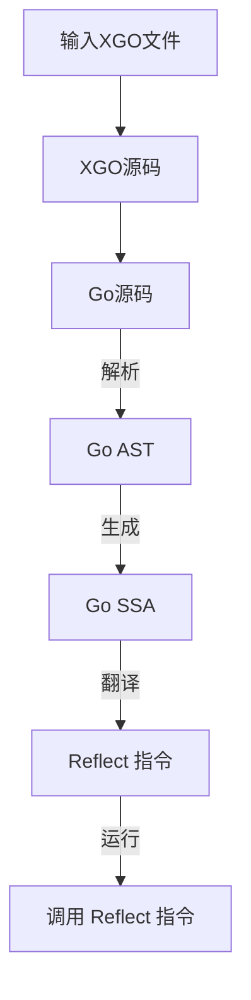
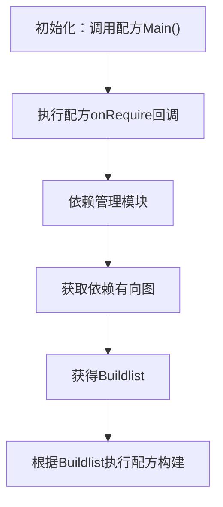

# LLAR ixgo运行模块调研文档

## 1. ixgo概述

### 1.1 定义
`ixgo`是XGO运行时解释器，与常规Go静态编译不一样，`ixgo`允许动态执行XGO语言。

### 1.2 在LLAR中的作用
ixgo运行模块是LLAR系统中负责执行配方脚本的核心组件，具有以下功能：
1. 自动配置xgo项目（RegisterProject)
2. 根据用户需求，找到需要的配方
3. 与依赖管理模块互动
4. 根据依赖管理模块，执行构建

## 2. 项目注册与初始化

### 2.1 XGO项目声明
类似于`gop.mod`，需要声明项目信息:

```go
xgobuild.RegisterProject(&modfile.Project{
    Ext:      "_llar.gox",
    Class:    "FormulaApp",
    Works:   nil,
    PkgPaths: nil,
    Import:  nil,
})
```

### 2.2 参数说明
- **`Ext`**: 文件扩展名，LLAR使用`_llar.gox`
- **`Class`**: 基类名称，LLAR配方继承`FormulaApp`
- **`Works`**: 如果不为空，一个Project里面会存在多个基类，以文件后缀进行区分
- **`PkgPaths`**: 主要是解决泛型问题，和ixgo实现有关系（ixgo通过`reflect`模块进行动态函数调用，但是`reflect`暂时不支持泛型）
- **`Import`**: 添加模块导入

## 3. 执行流程

### 3.1 完整执行代码
完成项目注册后，就可以添加相关文件进行执行：

```go
ctx := ixgo.NewContext(0)

// XGO 编译成Go 代码
source, err := xgobuild.BuildFSDir(ctx, fs, "")
if err != nil {
    panic(fmt.Errorf("Failed to build XGo source: %w", err))
}

// 生成解释器需要的SSA Package结构
pkg, err := ctx.LoadFile("main.go", source)
if err != nil {
    panic(fmt.Errorf("Failed to load XGo source: %w", err))
}

// 新建运行时解释器
interp, err := ctx.NewInterp(pkg)
if err != nil {
    panic(fmt.Errorf("Failed to create interp: %w", err))
}

// 执行，这个main.go只是名称，并不影响执行
code, err := ctx.RunInterp(interp, "main.go", source)
if err != nil {
    panic(fmt.Errorf("Failed to run XGo source (code %d): %w", code, err))
}
```

### 3.2 执行步骤详解
1. **创建上下文**: `ixgo.NewContext(0)` 创建执行上下文
2. **编译XGO**: 将XGO源码编译成Go源码
3. **加载包**: 将Go源码加载为SSA Package结构
4. **创建解释器**: 基于SSA Package创建运行时解释器
5. **执行代码**: 通过解释器执行编译后的代码

## 4. ixgo工作原理

### 4.1 整体架构
ixgo的原理就是通过Go的reflect模块。如果是XGO文件，会先编译成Go。解析Go AST后，完成SSA编译。得到SSA格式后，再对其进行reflect类型翻译，和修改函数调用。

### 4.2 具体流程



### 4.3 执行流程说明
1. **XGO编译**: 将XGO语法转换为标准Go语法
2. **AST解析**: 解析Go源码生成抽象语法树
3. **SSA生成**: 将AST转换为静态单赋值形式
4. **Reflect翻译**: 将SSA指令转换为reflect调用
5. **动态执行**: 通过reflect机制执行翻译后的指令

### 4.4 函数调用边界

分为`External`和`Builtin`两类：

#### External函数
- **特征**: 无法获取SSA的函数，例如cgo和ASM调用
- **处理方式**: 查找函数签名，并通过`reflect.Call`进行调用

#### Builtin函数
- **特征**: 通过Go编译器直接生成无具体实现的函数
- **处理方式**: 通过`reflect.Copy`类似的函数进行模拟

## 5. 高级功能

### 5.1 自定义模块查找

#### 功能说明
允许自定义模块查找逻辑，支持非标准的模块路径解析。

#### 使用方式
```go
ctx := ixgo.NewContext(0)
ctx.Lookup = func(root string, path string) (dir string, found bool) {
    // 传入当前project根目录和查找的Module Path
    // 返回Module Path所在的目录
    return customModulePath, true
}
```

#### 回退机制
如果自定义查找找不到，会自动回退到`Go Module`查找。

### 5.2 RegisterExternal - 外部函数注册

#### 功能说明
为声明函数注册具体实现，允许为XGO中声明但未实现的函数提供Go实现。

#### XGO代码示例
```go
package main

import "fmt";

type myint int
type point struct {
    x int
    y int
}

func mytest1(n myint, pt point) myint
func mytest2(n myint, pt *point) myint

func main() {
    n := mytest1(100, point{100,200})
    if n != 400 {
        panic(fmt.Errorf("error mytest1, must 400, have %v",n))
    }
    n = mytest2(100, &point{100,200})
    if n != 30000 {
        panic(fmt.Errorf("error mytest2, must 30000, have %v",n))
    }
}
```

#### ixgo实现代码
```go
ctx := ixgo.NewContext(0)
ixgo.RegisterExternal("main.mytest1", func(n int, pt struct {
    x int
    y int
}) int {
    return n + pt.x + pt.y
})
ctx.RegisterExternal("main.mytest2", func(n int, pt *struct {
    x int
    y int
}) int {
    return n * (pt.x + pt.y)
})
_, err := ctx.RunFile("main.go", src, nil)
if err != nil {
    t.Fatal(err)
}
```

#### 优先级
如果已经存在对应符号，那么ixgo优先查找`RegisterExternal`实现。

### 5.3 RegisterPatch - 包补丁

#### 功能说明
给指定package的特定函数进行patch操作，用于添加额外函数或修改现有包的行为。

#### XGO使用示例
```go
package main

import "fmt";

func main() {
    fmt.Println1(fmt.Pi, fmt.Patch)
    fmt.Println2("hello world")
}
```

#### ixgo补丁代码
```go
ctx := ixgo.NewContext(0)
err := ctx.RegisterPatch("fmt", `
package fmt

import (
    "fmt";
    "math";
)

const Pi = math.Pi

var (
    Patch = "v1.0";
)

func Println1(v ...interface{}) {
    fmt.Println(v...)
}
`)
if err != nil {
    t.Fatal(err)
}

err = ctx.RegisterPatch("fmt", `
package fmt
import "fmt";

func Println2(v ...interface{}) {
    fmt.Println(v...)
}
`)
```

#### 补丁机制
- 可以为现有包添加新的常量、变量和函数
- 支持多次patch同一个包
- 补丁内容会与原包内容合并

### 5.4 RegisterCustomBuiltin - 自定义内置函数

#### 功能说明
添加自定义Go Builtin函数，扩展XGO的内置函数集合。

#### XGO使用示例
```go
package main

import "fmt";

func main() {
    fmt.Println(typeof("hello"))
}
```

#### ixgo实现代码
```go
ixgo.RegisterCustomBuiltin("typeof", reflect.TypeOf)
```

#### 使用场景
- 添加调试辅助函数
- 扩展类型检查能力
- 提供运行时反射功能

### 5.5 RegisterPackage - 包注册

#### 功能说明
注册一个完整的Package，包含类型信息、函数、变量等。

#### Package结构
```go
type Package struct {
    // 类型信息
    Interfaces    map[string]reflect.Type
    NamedTypes    map[string]reflect.Type
    AliasTypes    map[string]reflect.Type
    Vars          map[string]reflect.Value
    Funcs         map[string]reflect.Value
    TypedConsts   map[string]TypedConst
    UntypedConsts map[string]UntypedConst

    // Package 依赖
    Deps          map[string]string // K->V: path -> name

    // Package ModuleName
    Name          string

    // Package ModulePath
    Path          string

    Source        string
}
```

#### 使用场景
- 批量注册包的所有导出内容
- 创建虚拟包
- 包装C库或其他语言的绑定

### 5.6 AddImport - 导入管理

#### 功能说明
为当前构建项目导入package，动态管理包的导入关系。

#### 使用方式
```go
ctx := ixgo.NewContext(0)
ctx.AddImport("custom/package", customPackage)
```

## 6. LLAR中的ixgo应用

### 6.1 依赖管理模块互动



### 6.2 配方执行流程
1. **配方加载**: 通过ixgo加载XGO配方文件
2. **依赖解析**: 执行onRequire回调，构建依赖图
3. **版本选择**: 基于Go MVS算法选择版本
4. **构建执行**: 按拓扑顺序执行构建

### 6.3 与其他模块的集成
- **FormulaApp基类**: 通过ixgo实例化配方对象
- **依赖管理**: 动态加载和执行依赖配方
- **构建系统**: 执行配方的onBuild回调
- **版本管理**: 调用配方的Compare函数

## 7. 性能考虑

### 7.1 执行性能
- **解释执行**: 相比编译执行有性能开销，但提供了动态性
- **反射开销**: reflect调用比直接调用慢，但在可接受范围内
- **缓存机制**: SSA结果可以缓存，避免重复编译

### 7.2 内存使用
- **AST缓存**: 解析后的AST可以复用
- **类型缓存**: reflect.Type对象的缓存
- **垃圾回收**: 及时释放不需要的中间结果

## 8. 错误处理

### 8.1 编译时错误
- **语法错误**: XGO语法不正确
- **类型错误**: 类型不匹配或未定义
- **导入错误**: 无法找到依赖的包

### 8.2 运行时错误
- **函数调用错误**: 参数类型或数量不匹配
- **空指针异常**: 访问未初始化的对象
- **资源访问错误**: 文件读写、网络访问失败

### 8.3 错误恢复机制
- **Panic处理**: 捕获并转换panic为error
- **上下文保存**: 保存错误发生时的执行状态
- **错误传播**: 将底层错误包装并向上传播

## 9. 调试支持

### 9.1 调试信息
- **源码映射**: XGO源码到Go源码的映射关系
- **执行跟踪**: 记录函数调用和变量变化
- **性能分析**: 执行时间和内存使用统计

### 9.2 开发工具集成
- **IDE支持**: 语法高亮、代码补全
- **断点调试**: 支持在XGO源码中设置断点
- **变量检查**: 运行时变量值检查

## 10. 未来发展方向

### 10.1 性能优化
- **JIT编译**: 热点代码即时编译优化
- **类型推断**: 减少运行时类型检查开销
- **并发优化**: 支持并发执行配方构建

### 10.2 功能扩展
- **更多内置函数**: 扩展XGO的标准库
- **插件系统**: 支持第三方扩展
- **远程执行**: 支持在远程节点执行配方

---

*本文档详细描述了LLAR项目中ixgo运行模块的设计与实现，为开发者提供了完整的技术参考。*
