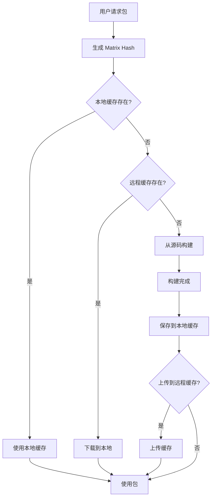

# 包管理器构建矩阵膨胀问题调研报告

## 1. 问题背景

构建矩阵膨胀是指当包管理器需要支持多个平台、多个架构、多个编译器版本时，需要预构建的二进制包数量呈指数级增长的问题。

**典型矩阵示例**:
- 操作系统: Ubuntu, Debian, RHEL, SUSE, macOS, Windows (6个)
- 架构: x86_64, ARM64, ARM32 (3个)
- 编译器: GCC 9/10/11/12/13, Clang 12/13/14/15 (9个)
- 构建类型: Debug, Release (2个)

理论上需要: 6 × 3 × 9 × 2 = **324 个不同的二进制包**

对于一个有 1000 个包的仓库，需要维护 **324,000 个预构建二进制**。

## 2. 现代包管理器的解决方案

### 2.1 Conan (C/C++)

**策略**: Package ID + 按需构建

**核心机制**:
1. **自动化 Package ID**: 为每个配置自动计算 hash (settings, options, dependencies)
2. **按需构建**: 当二进制不可用时，自动从源码构建
3. **build_id() 方法**: 允许跨配置复用构建产物
4. **conan-package-tools**: 自动生成构建矩阵

**关键特性**:
```python
# 复用同一个构建产物生成多个包
def build_id(self):
    # 所有 debug/release 共享同一个构建
    self.info.settings.build_type = "Any"
```

**优点**:
- 灵活的包复用策略
- 支持远程二进制缓存
- CI 友好的矩阵构建工具

**缺点**:
- 需要配置远程缓存服务器
- 初次构建仍需要大量时间

### 2.2 vcpkg (Microsoft C/C++)

**策略**: Triplet + Binary Caching + ABI Hash

**核心机制**:
1. **Triplet 系统**: 定义目标平台配置 (x64-windows, arm64-osx 等)
2. **ABI Hash**: 计算等价性，相同 ABI Hash 的包可以复用
3. **多层级缓存**: 本地文件夹 → NuGet → Azure Blob → GCS
4. **交叉编译支持**: Host Triplet + Target Triplet

**缓存配置**:
```bash
# 环境变量
VCPKG_BINARY_SOURCES=clear;files,/path/to/cache;nuget,https://nuget.org

# 支持的缓存后端
- files: 本地文件系统/网络共享
- nuget: NuGet feed (GitHub Packages, Azure Artifacts)
- azblob: Azure Blob Storage
- gcs: Google Cloud Storage
- aws: AWS S3
- http: HTTP/HTTPS 服务器
```

**优点**:
- 企业级缓存方案
- 多种缓存后端支持
- 良好的 CI/CD 集成

**缺点**:
- 需要维护缓存服务器基础设施
- Triplet 配置较复杂

### 2.3 Spack (HPC 科学计算)

**策略**: Rolling Binary Cache + 按需构建

**核心机制**:
1. **Rolling Cache**: 持续更新的二进制缓存，托管在 AWS
2. **智能 Fallback**: 缓存未命中时自动从源码构建
3. **依赖复用**: 复用可用的依赖包，只构建缺失部分
4. **跨 Linux 发行版**: 通过打包编译器运行时库实现

**性能**:
- 缓存命中: 安装速度提升 **20倍**
- 缓存未命中: 自动构建，透明 fallback

**优点**:
- 用户体验好，无需关心是否有预构建包
- 跨发行版二进制复用
- 云托管，无需自建基础设施

**缺点**:
- 缓存未命中时构建时间长
- 需要大量存储空间托管缓存

### 2.4 Nix/NixOS

**策略**: 内容寻址 + Binary Cache + Reproducible Builds

**核心机制**:
1. **加密 Hash**: 包名包含所有依赖的 hash，内容相同则 hash 相同
2. **Binary Cache**: cache.nixos.org 提供预构建二进制
3. **Hydra CI**: 持续构建所有包的多架构版本
4. **透明 Fallback**: 缓存未命中时从源码构建

**架构支持**:
- x86_64-linux
- aarch64-linux
- x86_64-darwin
- aarch64-darwin

**优点**:
- 真正的可重现构建
- 内容寻址保证一致性
- 隔离构建环境

**缺点**:
- 跨架构可重现性仍不完美
- 学习曲线陡峭
- 构建时间长

### 2.5 Homebrew (macOS/Linux)

**策略**: Bottles (预构建包) + 平台兼容性策略

**核心机制**:
1. **Bottle**: gzipped 压缩的预构建二进制
2. **兼容性策略**: 为最老版本构建，新版本可复用
3. **SHA-256 验证**: 每个平台/架构有独立 hash
4. **Relocation**: `:any_skip_relocation` 允许跨 Cellar 复用

**平台支持**:
- 主仓库: 最近 3 个 macOS 版本
- 架构: Intel (x86_64) + Apple Silicon (ARM64)

**Bottle 元数据**:
```ruby
bottle do
  sha256 cellar: :any, arm64_ventura: "abc123..."
  sha256 cellar: :any, arm64_monterey: "def456..."
  sha256 cellar: :any, ventura: "ghi789..."
  sha256 cellar: :any, monterey: "jkl012..."
end
```

**优点**:
- 简单直观
- 向下兼容策略减少构建数量
- 社区维护的大规模 bottle 仓库

**缺点**:
- 不支持交叉编译，需要原生构建
- 平台绑定强

### 2.6 Cargo + sccache (Rust)

**策略**: 编译缓存 + 远程存储

**核心机制**:
1. **编译器包装器**: sccache 作为 rustc 包装器
2. **缓存粒度**: 单个编译单元级别
3. **远程缓存**: S3, Redis, GCS, Azure, Memcached
4. **多语言支持**: Rust, C/C++, CUDA

**配置**:
```bash
export RUSTC_WRAPPER=sccache
# 或 Cargo 配置
[build]
rustc-wrapper = "sccache"
```

**性能**:
- 缓存命中: 构建时间减少约 **50%**
- 跨机器共享缓存

**限制**:
- 绝对路径必须匹配才能命中
- bin, dylib, cdylib, proc-macro 无法缓存
- 增量编译的 crate 无法缓存

**优点**:
- 细粒度缓存，复用率高
- 透明集成，无需修改项目
- 支持多种云存储后端

**缺点**:
- 路径依赖导致缓存命中率下降
- 链接阶段仍需重新执行

## 3. 解决方案对比

| 包管理器 | 核心策略 | 缓存粒度 | 按需构建 | 跨平台 | 存储需求 |
|---------|---------|---------|---------|-------|---------|
| Conan | Package ID + 远程缓存 | 包级别 | ✅ | ✅ | 高 |
| vcpkg | ABI Hash + 多层缓存 | 包级别 | ✅ | ✅ | 高 |
| Spack | Rolling Cache | 包级别 | ✅ | ✅ | 极高 |
| Nix | 内容寻址 + Binary Cache | 包级别 | ✅ | ✅ | 极高 |
| Homebrew | Bottle + 兼容性 | 包级别 | ⚠️ | ⚠️ | 中 |
| sccache | 编译缓存 | 编译单元 | N/A | ✅ | 高 |

## 4. 核心解决思路总结

### 4.1 不预构建所有组合

**现实**: 没有包管理器会预构建所有可能的矩阵组合

**策略**:
1. **主流配置优先**: 只为常用配置预构建 (Ubuntu LTS, macOS 最新版, Windows)
2. **按需构建**: 其他配置从源码构建
3. **用户贡献**: 用户构建后上传到缓存

### 4.2 二进制缓存系统

**所有现代包管理器的共同特征**:
1. 首先检查本地缓存
2. 检查远程二进制缓存
3. 缓存未命中时从源码构建
4. 构建完成后更新缓存

**缓存层级**:
```
用户本地缓存
    ↓ 未命中
团队/CI 共享缓存
    ↓ 未命中
公共二进制缓存
    ↓ 未命中
从源码构建
    ↓
更新缓存
```

### 4.3 配置标识与等价性

**关键技术**: 为每个配置计算唯一标识

**方法**:
- **Conan**: Package ID (hash of settings, options, deps)
- **vcpkg**: ABI Hash
- **Nix**: Content-addressed hash
- **Homebrew**: Platform + Architecture SHA-256

### 4.4 构建产物复用

**智能复用策略**:
1. **跨配置复用**: Debug/Release 共享同一构建
2. **跨版本复用**: Header-only 库跨编译器版本复用
3. **向下兼容**: 旧版本构建在新版本使用

### 4.5 CI/CD 自动化

**持续构建策略**:
1. **主动构建**: CI 持续构建常用配置 (Nix Hydra, Homebrew)
2. **触发式构建**: 用户请求时触发构建 (Conan, vcpkg)
3. **分布式构建**: 利用多台构建机并行

## 5. 对 LLAR 的建议

### 5.1 不要预构建所有矩阵

**原因**:
1. 存储成本极高
2. 构建时间极长
3. 大部分组合很少使用

**建议**:
- 只为主流配置提供预构建包
- 其他配置按需从源码构建

### 5.2 实现二进制缓存系统

**最小可行方案**:
```
1. 本地缓存: ~/.llar/cache/
2. 按需构建: 缓存未命中时构建
3. 缓存标识: Hash(PackageName + Version + Matrix)
```

**完整方案**:
```
1. 本地缓存
2. 团队共享缓存 (NFS/S3)
3. 公共缓存 CDN
4. 分布式构建
```

### 5.3 Matrix 标识设计

**推荐方案**: 内容寻址 Hash

```go
type Matrix struct {
    OS           string // darwin, linux, windows
    Arch         string // x86_64, arm64
    Compiler     string // clang, gcc, msvc
    CompilerVer  string // 14.0.0
    BuildType    string // debug, release
}

func (m Matrix) Hash() string {
    // 计算所有字段的 hash
    data := fmt.Sprintf("%s-%s-%s-%s-%s",
        m.OS, m.Arch, m.Compiler, m.CompilerVer, m.BuildType)
    return sha256(data)
}
```

### 5.4 按需构建流程



### 5.5 优先级策略

**阶段性实现**:

**Phase 1 (MVP)**:
- 本地缓存
- 按需源码构建
- 简单的 Matrix Hash

**Phase 2**:
- 远程缓存 (S3/HTTP)
- 缓存上传/下载
- 主流配置预构建

**Phase 3**:
- CI 自动构建
- 分布式缓存
- 构建集群

## 6. 矩阵正确性保证策略

### 6.1 核心问题

既然不预构建所有矩阵组合，如何保证未预构建的组合构建是正确的？

### 6.2 测试包（test_package）机制

**Conan 的 test_package**:
- 每个配方包含一个 `test_package` 子项目
- 这是一个小型独立的 Conan 项目，依赖被测试的包
- 包含简单的源码和构建脚本，验证包可以被正确链接和使用
- 不是单元测试或集成测试，而是"包级别测试"

**测试目的**:
1. 验证包正确创建
2. 验证消费者可以链接该包
3. 验证包可以被正确使用

**示例**:
```
mypackage/
├── conanfile.py          # 配方
├── src/                  # 源码
└── test_package/         # 测试包
    ├── conanfile.py
    ├── CMakeLists.txt
    └── example.cpp       # 使用该包的简单程序
```

### 6.3 CI 矩阵测试策略

**策略 1: 关键配置全量测试**

**Homebrew BrewTestBot**:
- PR 提交时自动触发构建
- 为每个支持的平台构建 bottle
- 所有平台构建成功后才允许合并
- 双重 SHA-256 验证：上传前和上传后
- 定时 cron job 测试已有 bottle 的可用性

**测试命令**:
```bash
brew test *.rb              # 测试功能
brew linkage --test *.rb    # 测试链接
```

**策略 2: 矩阵采样测试**

**GitHub Actions Matrix**:
```yaml
strategy:
  matrix:
    os: [ubuntu-latest, macos-latest, windows-latest]
    python: [3.9, 3.10, 3.11]
    include:
      - os: ubuntu-latest
        python: 3.12
    exclude:
      - os: windows-latest
        python: 3.9
```

**优化手段**:
- 动态矩阵：只测试受影响的配置
- 选择性测试：基于文件变更触发相关测试
- 环境缓存：避免重复下载依赖

**策略 3: 持续集成 + 多平台构建**

**Nix Hydra CI**:
- 持续构建整个包集合的多架构版本
- 可复现性测试：同一构建多次执行，比较结果
- 非确定性检测：构建结果不同则标记为 "non-deterministic"
- 多平台委托：无法本地构建时委托给其他架构机器

**统计数据**:
- NixOS 36,550 个构建步骤中
- 4,699 个 (12.8%) 被检测为非确定性
- 说明 87.2% 的构建是完全可复现的

### 6.4 Conan Package Tools 自动化矩阵

**自动生成矩阵**:
```python
from conan.packager import ConanMultiPackager

builder = ConanMultiPackager()
builder.add_common_builds()  # 自动添加常见配置组合
builder.run()
```

**CI 集成**:
- Travis CI / Appveyor / GitHub Actions
- 在不同虚拟机上并行构建不同配置
- 使用环境变量 `CONAN_CURRENT_PAGE` 分配任务
- 云端分布式构建不同配置

### 6.5 vcpkg CI 测试策略

**Azure Pipelines 集成**:
```yaml
- task: run-vcpkg@0
  with:
    vcpkgArguments: '@response_file.txt'
    vcpkgTriplet: 'x64-windows'
    vcpkgGitCommitId: '<commit-id>'
```

**多 Triplet 测试**:
- 使用 Job Templates 测试不同配置
- 参数化 triplet (x64-windows, x86-windows, x64-uwp 等)
- 参数化编译器版本 (VS 2017, 2019, 2022)
- 二进制缓存加速 CI 构建

**社区 Triplet 的问题**:
- `triplets\community` 文件夹中的 triplet 不被官方 CI 测试
- 需要用户自行测试自定义 triplet

### 6.6 向下兼容策略

**Homebrew Bottle 兼容性**:
- **关键策略**: 为最老的支持版本构建
- **原理**: 为 Core 2 CPU 构建的二进制可在新 CPU 上运行
- **好处**: 一个 bottle 可用于多个 OS 版本，减少构建数量

**示例**:
```ruby
# 只为 Monterey 构建
bottle do
  sha256 cellar: :any, monterey: "abc123..."
end
# Ventura 和 Sonoma 自动使用 Monterey bottle
```

### 6.7 渐进式验证

**策略**: 用户构建即验证

**Spack 模式**:
1. 用户请求未预构建的配置
2. 本地从源码构建
3. 构建成功证明该配置可行
4. （可选）用户上传构建结果到缓存
5. 后续用户直接使用缓存

**优点**:
- 真实用户场景验证
- 众包测试
- 覆盖面随使用增长

**缺点**:
- 首个用户承担构建时间
- 可能暴露之前未测试的问题

### 6.8 测试策略总结

| 包管理器 | 测试策略 | 覆盖范围 | 自动化程度 | 验证时机 |
|---------|---------|---------|-----------|---------|
| Homebrew | BrewTestBot PR 测试 | 所有支持平台 | 全自动 | PR 合并前 |
| Conan | test_package + CI 矩阵 | 采样或全量 | 高度自动 | 发布前 |
| Nix | Hydra 持续构建 | 所有架构 | 全自动 | 持续 |
| vcpkg | Azure Pipelines 矩阵 | 主流配置 | 高度自动 | PR 测试 |
| Spack | 用户构建验证 | 按需覆盖 | 半自动 | 使用时 |

### 6.9 对 LLAR 的建议

**测试分层策略**:

**Tier 1: 主流配置 (自动化全量测试)**
- x86_64-linux (Ubuntu LTS)
- x86_64-darwin (macOS latest)
- arm64-darwin (Apple Silicon)
- x86_64-windows

**Tier 2: 次要配置 (CI 采样测试)**
- arm64-linux
- 其他 Linux 发行版
- 旧版本 OS

**Tier 3: 长尾配置 (用户验证)**
- 特殊编译器版本
- 非主流架构
- 自定义 options 组合

**实现方案**:

**阶段 1: test_package 机制**
```javascript
// 在配方中添加测试
onTest matrix => {
    // 编译一个使用该包的简单程序
    compile "test.c" "-L${LLAR_PKG_LIB}" "-I${LLAR_PKG_INCLUDE}" "-lcjson"

    // 运行测试程序
    run "./test"

    return success
}
```

**阶段 2: CI 矩阵测试**
```yaml
# GitHub Actions
strategy:
  matrix:
    os: [ubuntu-latest, macos-latest]
    arch: [x86_64, arm64]
    include:
      - os: ubuntu-latest
        arch: x86_64
        test: tier1  # 全量测试
      - os: macos-latest
        arch: arm64
        test: tier1
      - os: ubuntu-latest
        arch: arm64
        test: tier2  # 采样测试
```

**阶段 3: 用户反馈机制**
```bash
# 构建成功后询问用户
llar build completed successfully for x86_64-c-freebsd
Would you like to share this build result? (y/n)

# 收集构建数据
- Matrix: x86_64-c-freebsd
- Success: true
- Build Time: 45s
- Test Result: passed
```

## 7. 关键结论

### 现状

1. **没有银弹**: 所有包管理器都面临构建矩阵膨胀问题
2. **共识方案**: 按需构建 + 二进制缓存
3. **工业实践**: 主流配置预构建 + 长尾配置源码构建

### 技术要点

1. **缓存标识**: 使用 Hash 唯一标识配置
2. **透明 Fallback**: 自动从源码构建
3. **多层缓存**: 本地 → 共享 → 公共
4. **增量更新**: 只构建变化的部分

### 实现建议

对于 LLAR:
1. ✅ **立即实现**: 本地缓存 + 按需构建
2. ⏱️ **中期实现**: 远程缓存 + 主流配置预构建
3. 🔮 **长期实现**: 分布式构建 + 自动化 CI

**核心原则**: 让用户感觉不到矩阵膨胀的存在，自动选择最优策略。
