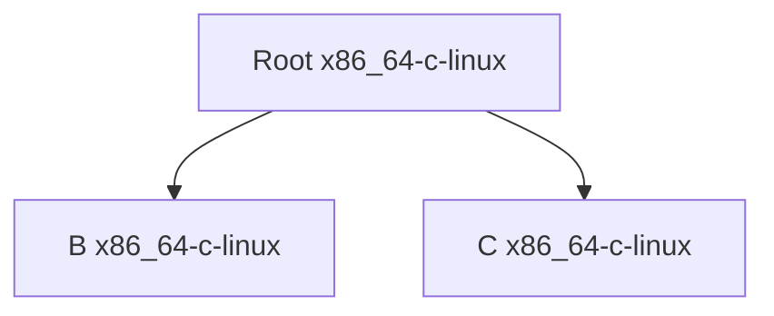
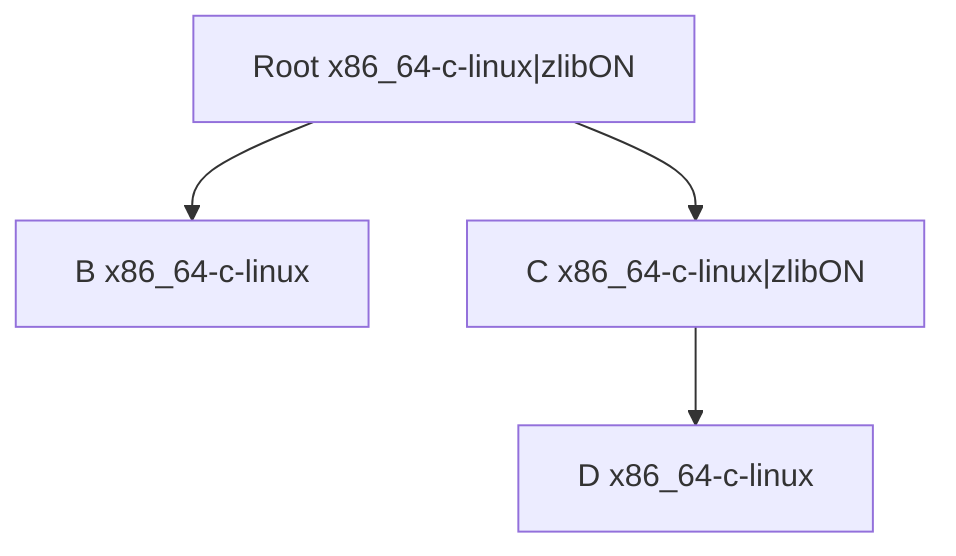
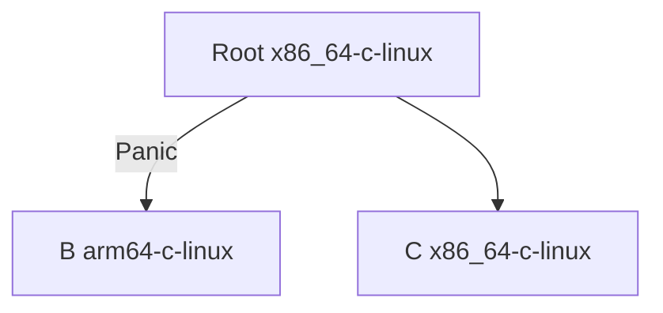
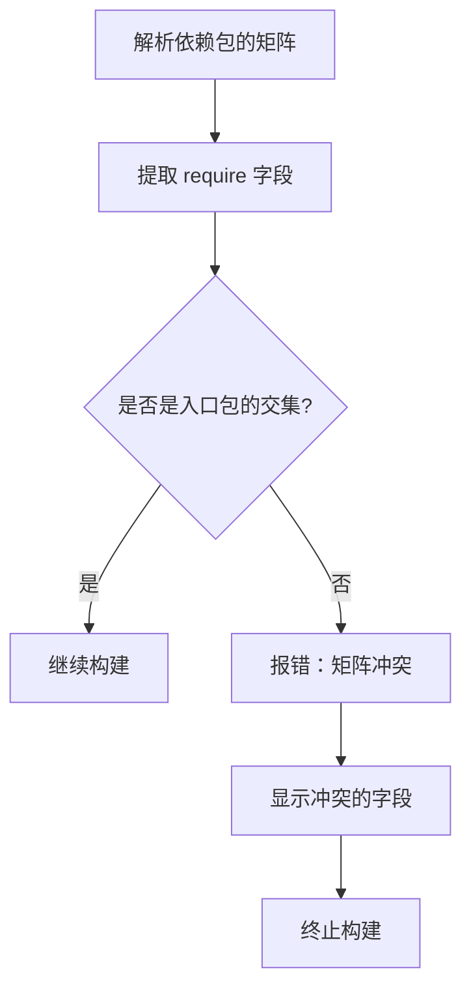
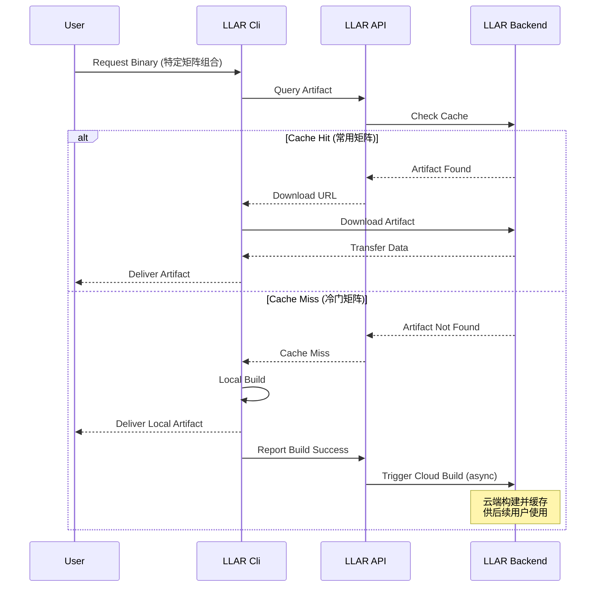

# LLAR 构建矩阵设计文档

## 1. 背景与动机

### 1.1 问题定义

LLAR 的出发点是为了解决构建产物难题，即当构建配置无限进行膨胀时的管理问题。

**核心问题**：
- 一个包可能只存在一种配方，但因为外部需求的变化会导致多种产物
- 不同的库或 Module 存在大量可选编译配置
- 有大量编译组合，通常更换一个配置或换个构建平台，就需要重头把这些库构建一遍

### 1.2 现有方案的局限

**Conan 的方案**：
- 提出了类似的构建配置概念
- 将用户构建配置分为两部分：
  - **settings**：会向下传播的编译需要参数
  - **options**：仅限于当前 package，不会向下传播的配置
- 但是 Conan 并没有"构建矩阵"这个明确的概念

### 1.3 矩阵爆炸问题

构建矩阵的组合数量随着参数增加呈指数级增长，这会导致以下两个核心问题：

#### 问题1：无法进行全量测试

当构建矩阵组合数量过多时，对所有组合进行全量测试变得不现实。

**真实案例：Conan 的 Boost 库**

Boost 是 C++ 中最常用的库之一，在 Conan 中配置了 **59 个 options**：

```
Boost Conan Package 的部分 options：
- fPIC: [True, False]
- shared: [True, False]
- header_only: [True, False]
- multithreading: [True, False]
- lzma: [True, False]
- zlib: [True, False]
- bzip2: [True, False]
- zstd: [True, False]
- without_filesystem: [True, False]
- without_thread: [True, False]
- without_regex: [True, False]
- without_test: [True, False]
- without_log: [True, False]
- without_locale: [True, False]
- without_python: [True, False]
- without_iostreams: [True, False]
- without_serialization: [True, False]
- without_coroutine: [True, False]
- without_program_options: [True, False]
... 还有 40 个类似的 options
```

**组合爆炸计算**：

假设：
- require: arch [3] × os [3] × compiler [3] = 27 种
- options: 59 个选项，大部分是布尔值（True/False）

```
options 组合数 = 2^59 = 576,460,752,303,423,488
                       （约 576 千万亿种组合）

总组合数 = 27 × 2^59 = 15,564,440,312,192,434,176
                        （约 1556 万亿亿种组合）
```

**测试时间估算**（假设每个组合构建+测试需要 5 分钟）：

```
总时间 = 15,564,440,312,192,434,176 × 5 分钟
      = 77,822,201,560,962,170,880 分钟
      ≈ 147,985,050,000 年
      ≈ 1480 亿年（是宇宙年龄 138 亿年的 10.7 倍）
```

**问题严重性**：
- 即使动用全人类的所有计算资源和财富
- 也无法在宇宙寿命内完成 Boost 的全量测试
- **必须采用配对测试等策略减少测试组合数**

#### 问题2：预构建产物趋于无限（已解决）

如果预先构建所有矩阵组合，产物数量会爆炸式增长，占用大量存储空间。

**解决方案**：通过**按需构建机制**（惰性构建），仅构建用户实际请求的矩阵组合，避免预先构建所有可能的组合。

#### 针对问题1的解决方案

针对"无法进行全量测试"问题，LLAR 提供两种解决方案：

##### 方案1：严格限制矩阵数量

直接限制 `options` 字段的数量或每个选项的值数量，从源头控制矩阵爆炸。

**限制规则**：
- `options` 字段最多 **3 个**
- 每个 option 最多 **3 个值**
- 总 options 组合数不超过 **27 个**（3³）

**示例配置**：
```go
matrix {
    Require: {
        "arch": ["x86_64"],
        "lang": ["c"],
        "os": ["linux"]
    },
    Options: {
        "zlib": ["zlibON", "zlibOFF"],
        "ssl": ["sslON", "sslOFF"],
        "debug": ["debugON", "debugOFF"]
    }
}
```

**组合计算**：
```
require 组合：1 种（x86_64-c-linux）
options 组合：2 × 2 × 2 = 8 种
总组合数：1 × 8 = 8 种

测试时间：8 × 5分钟 = 40分钟（可接受）
```

**适用场景**：
- 小型库或工具
- 配置选项较少的项目
- 需要完整测试覆盖的项目

##### 方案2：默认矩阵 + 配对测试法

提供一个默认矩阵组合进行全量测试，非默认组合根据数量决定测试策略。

**测试策略分级**：

1. **完整矩阵组合 < 5000 种**：
   - 对所有组合进行全量测试
   - 测试成本可接受，无需配对测试

2. **完整矩阵组合 ≥ 5000 种**：
   - 对默认矩阵组合进行全量测试
   - 对非默认组合采用**配对测试法（Pairwise Testing）**

**配对测试核心思想**：
- 配对测试法确保任意两个参数的所有组合至少被测试一次
- 研究表明 **70-95% 的缺陷由两个参数交互引起**
- 大幅减少测试用例数量，同时保持高缺陷检测率

**默认矩阵定义**：

在配方文件（formula.gox）中定义构建矩阵：

```go
// 声明构建矩阵
matrix {
    Require: {
        "arch": ["x86_64", "arm64"],
        "lang": ["c", "cpp"],
        "os": ["linux", "darwin"]
    },
    Options: {
        "zlib": ["zlibON", "zlibOFF"],
        "ssl": ["sslON", "sslOFF"],
        "debug": ["debugON", "debugOFF"]
    },
    Default: {
        "arch": ["x86_64", "arm64"],    // 默认测试两个主流架构
        "lang": ["c"],                   // 默认只测试 C 语言
        "os": ["linux"],                 // 默认只测试 Linux
        "zlib": ["zlibOFF"],            // 默认只测试关闭状态
        "ssl": ["sslOFF"],
        "debug": ["debugOFF"]
    }
}
```

**Default 字段说明**：
- 采用与 Require/Options 相同的数组结构，但组合数量有限
- 定义最常用、最稳定的配置组合子集
- 上例中 Default 组合数：2 × 1 × 1 × 1 × 1 × 1 = **2 种组合**
  - `x86_64-c-linux|zlibOFF-sslOFF-debugOFF`
  - `arm64-c-linux|zlibOFF-sslOFF-debugOFF`
- 这些默认组合始终进行**全量测试**，确保核心功能稳定
- 其他非默认组合的测试策略：
  - 完整矩阵 < 5000 种：全量测试
  - 完整矩阵 ≥ 5000 种：配对测试

**测试策略**：

1. **默认组合（Full Testing）**：
   ```
   默认矩阵组合（2 种）：
   - x86_64-c-linux|zlibOFF-sslOFF-debugOFF
   - arm64-c-linux|zlibOFF-sslOFF-debugOFF
   ```
   对所有默认组合进行完整的功能测试、集成测试、性能测试。

2. **非默认组合测试策略**：

   完整矩阵组合数：2 × 2 × 2 × 2 × 2 × 2 = **64 种组合**
   默认矩阵组合数：2 × 1 × 1 × 1 × 1 × 1 = **2 种组合**（全量测试）
   剩余组合：**62 种组合**

   **判断**：62 < 5000，对剩余 62 种组合进行**全量测试**

   总测试数：**64 种组合**（全部全量测试）

**配对测试示例**：

假设有以下参数：
- `arch`: [x86_64, arm64]
- `os`: [linux, darwin]
- `zlib`: [zlibON, zlibOFF]
- `ssl`: [sslON, sslOFF]

完全组合需要测试：2 × 2 × 2 × 2 = **16 种组合**

配对测试只需：**6-8 种组合** 即可覆盖所有两两配对：

```
测试组合：
1. x86_64-c-linux|zlibON-sslON
2. x86_64-c-darwin|zlibOFF-sslOFF
3. arm64-c-linux|zlibOFF-sslON
4. arm64-c-darwin|zlibON-sslOFF
5. x86_64-c-linux|zlibOFF-sslON
6. arm64-c-linux|zlibON-sslON
```

**覆盖率分析**：
- 测试覆盖率从 16 组减少到 6 组，**节省 62.5% 测试资源**
- 仍能发现大部分参数交互问题

**配对覆盖表**：

| 配对参数 | 组合1 | 组合2 | 组合3 | 组合4 | 组合5 | 组合6 |
|---------|------|------|------|------|------|------|
| **(arch, os)** | x86_64, linux | x86_64, darwin | arm64, linux | arm64, darwin | x86_64, linux | arm64, linux |
| **(arch, zlib)** | x86_64, ON | x86_64, OFF | arm64, OFF | arm64, ON | x86_64, OFF | arm64, ON |
| **(arch, ssl)** | x86_64, ON | x86_64, OFF | arm64, ON | arm64, OFF | x86_64, ON | arm64, ON |
| **(os, zlib)** | linux, ON | darwin, OFF | linux, OFF | darwin, ON | linux, OFF | linux, ON |
| **(os, ssl)** | linux, ON | darwin, OFF | linux, ON | darwin, OFF | linux, ON | linux, ON |
| **(zlib, ssl)** | ON, ON | OFF, OFF | OFF, ON | ON, OFF | OFF, ON | ON, ON |

**配对测试组合生成方法**：

配对测试的核心目标是：**确保任意两个参数的所有值组合至少被测试一次**。

**需要覆盖的配对**：

对于 4 个参数 (arch, os, zlib, ssl)，有 6 种两两配对：
- (arch, os)
- (arch, zlib)
- (arch, ssl)
- (os, zlib)
- (os, ssl)
- (zlib, ssl)

每种配对有 2×2 = 4 种值组合，总共需要覆盖 6×4 = **24 个配对值组合**。

**组合生成示例**：

通过精心选择 6 个测试组合，可以覆盖所有 24 个配对值组合：

| 测试组合 | arch | os | zlib | ssl | 覆盖的关键配对 |
|---------|------|-------|------|-----|-------------|
| **组合1** | x86_64 | linux | ON | ON | (x86_64,linux), (x86_64,ON), (linux,ON), (ON,ON) |
| **组合2** | x86_64 | darwin | OFF | OFF | (x86_64,darwin), (x86_64,OFF), (darwin,OFF), (OFF,OFF) |
| **组合3** | arm64 | linux | OFF | ON | (arm64,linux), (arm64,OFF), (linux,OFF), (OFF,ON) |
| **组合4** | arm64 | darwin | ON | OFF | (arm64,darwin), (arm64,ON), (darwin,ON), (ON,OFF) |
| **组合5** | x86_64 | linux | OFF | ON | 补充覆盖遗漏的配对 |
| **组合6** | arm64 | linux | ON | ON | 补充覆盖遗漏的配对 |

**覆盖验证**：

验证所有配对的 4 种值组合都被测试到：

```
(arch, os) 的 4 种组合：
  ✓ (x86_64, linux)  → 组合1, 5
  ✓ (x86_64, darwin) → 组合2
  ✓ (arm64, linux)   → 组合3, 6
  ✓ (arm64, darwin)  → 组合4

(arch, zlib) 的 4 种组合：
  ✓ (x86_64, ON)     → 组合1
  ✓ (x86_64, OFF)    → 组合2, 5
  ✓ (arm64, ON)      → 组合4, 6
  ✓ (arm64, OFF)     → 组合3

... 其他 4 种配对同理，全部覆盖 ✓
```

**效果对比**：
- 完全组合测试：2×2×2×2 = **16 种组合**
- 配对测试：**6 种组合**
- 节省比例：**(16-6)/16 = 62.5%**

**工具支持**：

LLAR 可以使用现成的配对测试工具（如 PICT、ACTS）自动生成最优的测试组合，无需手动计算。

**超过 5000 种组合的示例（需配对测试）**：

假设一个复杂库（如 Boost）有以下配置：
```go
matrix {
    Require: {
        "arch": ["x86_64", "arm64", "x86"],
        "os": ["linux", "darwin", "windows"],
        "compiler": ["gcc", "clang", "msvc"]
    },
    Options: {
        "shared": ["static", "dynamic"],
        "zlib": ["ON", "OFF"],
        "bzip2": ["ON", "OFF"],
        "lzma": ["ON", "OFF"],
        "zstd": ["ON", "OFF"],
        "icu": ["ON", "OFF"],
        "python": ["ON", "OFF"],
        "iostreams": ["ON", "OFF"],
        "serialization": ["ON", "OFF"],
        "filesystem": ["ON", "OFF"]
        // ... 共 10 个 options
    },
    Default: {
        "arch": ["x86_64", "arm64"],
        "os": ["linux"],
        "compiler": ["gcc"],
        "shared": ["static"],
        "zlib": ["OFF"],
        "bzip2": ["OFF"],
        "lzma": ["OFF"],
        "zstd": ["OFF"],
        "icu": ["OFF"],
        "python": ["OFF"],
        "iostreams": ["OFF"],
        "serialization": ["OFF"],
        "filesystem": ["OFF"]
    }
}

完整矩阵：3 × 3 × 3 × 2^10 = 27 × 1024 = 27,648 种组合
默认矩阵：2 × 1 × 1 × 1^10 = 2 种组合
```

**测试策略**：
```
完整矩阵组合数：27,648 种
判断：27,648 > 5000，需要采用配对测试

默认组合（全量测试）：2 个组合
  - x86_64-linux-gcc|static-OFF-OFF-OFF-OFF-OFF-OFF-OFF-OFF-OFF
  - arm64-linux-gcc|static-OFF-OFF-OFF-OFF-OFF-OFF-OFF-OFF-OFF

非默认组合（配对测试）：27,646 种组合
  配对测试只需：约 100-150 个组合

总测试数：约 102-152 个组合
节省比例：(27,648 - 152) / 27,648 = 99.45%
```

**配对测试工具**：

LLAR 系统可以集成现有的配对测试工具生成测试组合：
- **PICT** (Microsoft)：命令行配对测试工具
- **ACTS** (NIST)：高级组合测试系统
- **AllPairs** (Python)：Python 配对测试库

**适用场景**：
- 大型库或复杂系统
- 配置选项多的项目（完整矩阵组合 ≥ 5000 种时配对测试才生效）
- 需要在灵活性和测试成本间平衡的项目

##### 方案对比

| 维度 | 方案1：严格限制 | 方案2：默认矩阵 + 分级测试 |
|-----|---------------|----------------|
| **实现复杂度** | 简单 | 中等（需要判断阈值和配对算法） |
| **配置灵活性** | 低（限制 options 数量） | 高（支持大量 options） |
| **测试覆盖率** | 100%（全量测试） | < 5000: 100%；≥ 5000: 70-95% |
| **测试用例数** | 小（< 27个组合） | < 5000: 全量；≥ 5000: 配对测试 |
| **维护成本** | 低 | 中等（需要管理默认配置） |
| **适用项目规模** | 小型项目（< 27 组合） | 中大型项目（27-无限组合） |

##### 方案选择决策树

```
完整矩阵组合数量？
    ├─ < 27 种 → 使用方案1：严格限制矩阵数量
    │             - 限制 options 数量 ≤ 3
    │             - 每个 option 值数量 ≤ 3
    │             - 进行全量测试
    │
    └─ ≥ 27 种 → 使用方案2：默认矩阵 + 分级测试
                  - 定义默认矩阵（核心测试组合）
                  - 完整矩阵 < 5000 种：全量测试
                  - 完整矩阵 ≥ 5000 种：
                    - 默认矩阵：全量测试
                    - 非默认矩阵：配对测试
```

### 1.4 我们的目标

- 通过一种标准化的方案去表达这些构建配置
- 提供自动完成构建配置选择的能力
- 解决矩阵爆炸导致的测试和存储问题

## 2. 设计目标

1. **标准化**：能够提供一种标准化的构建配置解决方案
2. **自动化**：能够自动完成构建配置选择
3. **可扩展**：支持任意数量和类型的构建参数
4. **传播控制**：精确控制配置参数的传播范围

## 3. 核心概念

### 3.1 构建矩阵（Matrix）

构建矩阵用于表达一个包在不同构建配置下的所有可能产物组合。

**构成要素**：
- 由于一个包可能只存在一种配方
- 但这一种配方因为外部需求的变化会导致多种产物
- 为了代表这类变化，我们使用一个构建矩阵表达

**示例**：
```
一个 C 库可能需要支持：
- 多个平台：x86_64, arm64
- 多个操作系统：Linux, macOS, Windows
- 多个编译器：GCC, Clang, MSVC
- 多个可选特性：zlib 支持开启/关闭

这些组合会产生数十甚至上百种不同的构建产物
```

### 3.2 require 和 options 的概念

类似于 Conan，构建矩阵由两部分组成：

**require（必需参数）**：
- 类似于 Conan 的 `settings`
- 默认向下传播给所有依赖包
- 代表构建环境的必需配置
- 例如：arch（架构）、os（操作系统）、toolchain（工具链）

**options（可选参数）**：
- 类似于 Conan 的 `options`
- 不会向下传播，仅限于当前 package
- 代表包特定的可选特性
- 例如：是否启用 zlib、是否编译测试代码

### 3.3 为什么需要 require 和 options 概念？

在构建矩阵第一版设计中，是不存在这个区分的，默认参数都会从最上层的包一层一层进行传播。

**问题发现**：

经过讨论后发现以下事实：

1. **底层依赖的矩阵膨胀问题**：
   - 如果一层一层传播，最底层的依赖会得到一个巨大的构建矩阵
   - 很多字段其实并不需要

2. **复杂情况分析**（A 依赖 B）：
   - **Case 1**：A 有 B 不需要的字段，A 传导给了 B
     - 这个问题不大，B 可以忽略不需要的字段
   - **Case 2**：B 有 A 不存在的字段
     - 这个往往出现在 optional 的参数
     - 但这个参数没有值，那么此时该参数要不要往下继续传播？
     - 因为我们不能确定下一个依赖是否依赖了该参数

**解决方案**：

引入 `require` 和 `options` 概念后，Case 2 所导致的复杂问题可以被简单解决：
- `options` 默认不会被传播
- 只能接受来自最上层的传入
- 避免了中间层参数传播的不确定性

## 4. 矩阵结构设计

### 4.1 基本结构

在配方文件（formula.gox）中声明构建矩阵：

```go
// 声明构建矩阵
matrix {
    Require: {
        "arch": ["amd64", "arm64"],
        "lang": ["c", "cpp"],
        "os": ["linux", "darwin"],
        "key1": ["value 1", "value 2", ... "value n"],
        "key2": ["value 1", "value 2", ... "value n"],
        ...
        "keyn": ["value 1", "value 2", ... "value n"]
    },
    Options: {
        "zlib": ["zlibON", "zlibOFF"],
        "key1": ["value 1", "value 2", ... "value n"]
    }
}
```

### 4.2 结构化定义

```go
type PackageMatrix struct {
    Require map[string][]string `json:"require"`
    Options map[string][]string `json:"options"`
}
```

### 4.3 字段说明

**require 字段**：
- key：配置项名称（如 arch、os、lang）
- value：该配置项的所有可能取值数组

**options 字段**：
- key：可选特性名称（如 zlib、tests）
- value：该特性的所有可能取值数组

## 5. 必需字段与可选字段

### 5.1 必需字段

以下字段在 `require` 中是必需的：

#### arch（架构）

**说明**：代表编译平台架构

**常见取值**：
- `x86_64` / `amd64`：64位 x86 架构
- `arm64` / `aarch64`：64位 ARM 架构
- `x86` / `i386`：32位 x86 架构
- `arm`：32位 ARM 架构

**示例**：
```go
matrix {
    Require: {
        "arch": ["x86_64", "arm64"]
    }
}
```

#### lang（语言）

**说明**：代表该包的语言

**常见取值**：
- `c`：C 语言
- `cpp` / `cxx`：C++ 语言
- `py` / `python`：Python 语言

**示例**：
```go
matrix {
    Require: {
        "lang": ["c", "cpp"]
    }
}
```

### 5.2 特殊可选字段

以下字段在 `require` 中是可选的，但具有特殊含义：

#### os（操作系统）

**说明**：代表目标操作系统

**为什么是可选的**：
- 有些包可能允许在裸机环境下运行
- 不是所有包都依赖操作系统

**常见取值**：
- `linux`：Linux 系统
- `darwin`：macOS 系统
- `windows`：Windows 系统
- `freebsd`：FreeBSD 系统

**示例**：
```go
matrix {
    Require: {
        "os": ["linux", "darwin", "windows"]
    }
}
```

#### toolchain（工具链）

**说明**：代表编译工具链

**常见取值**：
- `gcc`：GNU Compiler Collection
- `clang`：LLVM Clang
- `msvc`：Microsoft Visual C++

**示例**：
```go
matrix {
    Require: {
        "toolchain": ["gcc", "clang"]
    }
}
```

### 5.3 自定义字段

除了标准字段外，可以定义自定义字段：

**字段命名规范**：
- key 必须代表某种编译集成配置
- 例如：`sse2` 应该代表该包全部组件启用 `sse2`，而不是某个部分

**示例**：
```go
matrix {
    Require: {
        "arch": ["x86_64"],
        "simd": ["sse2", "avx2", "neon"]
    },
    Options: {
        "debug": ["on", "off"],
        "tests": ["enabled", "disabled"]
    }
}
```

## 6. 矩阵组合算法

### 6.1 组合生成规则

由于 JSON Object 在 RFC 规范中定义是无序组合，因此我们需要对其 Object key 进行按字母排序，然后从排序顺序前至后进行排序组合。

**算法步骤**：
1. 对 `require` 的所有 key 进行字母排序
2. 按层序顺序进行组合（第一层和第二层组合，其结果再和第三层组合，依次递归）
3. 用 `-` 连接 `require` 的值
4. 如果存在 `options`，用 `|` 连接 `options` 的值

### 6.2 组合生成示例

#### 基本示例

**输入**：
```json
{
    "matrix": {
        "require": {
            "os": ["linux", "darwin"],
            "arch": ["x86_64", "arm64"],
            "lang": ["c", "cpp"]
        }
    }
}
```

**计算过程**：
1. 排序得到 key 顺序：`arch`, `lang`, `os`
2. 进行组合：
   - `arch` 与 `lang` 组合：`x86_64-c`, `arm64-c`, `x86_64-cpp`, `arm64-cpp`
   - 其结果与 `os` 组合得到完整结果

**输出**：
```
x86_64-c-linux
x86_64-c-darwin
arm64-c-linux
arm64-c-darwin
x86_64-cpp-linux
x86_64-cpp-darwin
arm64-cpp-linux
arm64-cpp-darwin
```

#### 包含 options 的示例

**输入**：
```json
{
    "matrix": {
        "require": {
            "arch": ["x86_64", "arm64"],
            "lang": ["c"],
            "os": ["linux", "darwin"]
        },
        "options": {
            "zlib": ["zlibON", "zlibOFF"]
        }
    }
}
```

**计算过程**：
1. 先完成 `require` 字段组合：
   ```
   x86_64-c-linux
   x86_64-c-darwin
   arm64-c-linux
   arm64-c-darwin
   ```
2. 再进行 `options` 组合（用 `|` 连接）

**输出**：
```
x86_64-c-linux|zlibON
x86_64-c-linux|zlibOFF
x86_64-c-darwin|zlibON
x86_64-c-darwin|zlibOFF
arm64-c-linux|zlibON
arm64-c-linux|zlibOFF
arm64-c-darwin|zlibON
arm64-c-darwin|zlibOFF
```

### 6.3 矩阵组合表示格式

**格式规范**：
- `require` 组合：用 `-` 连接，按字母排序
- `options` 组合：用 `|` 分隔
- 完整格式：`{{require组合}}|{{options组合}}`

**示例**：
- 仅 require：`x86_64-c-linux`
- 包含 options：`x86_64-c-linux|zlibON`
- 多个 options：`x86_64-c-linux|debug-on-zlibON`

## 7. 矩阵传播机制

### 7.1 传播规则

**require 字段**：
- **必须向下传播**
- 所有依赖包的 `require` 必须是入口包的交集
- 如果依赖包的 `require` 不是入口包的交集，系统会终止并报错

**options 字段**：
- **不向下传播**
- 仅在声明了该 option 的包中生效
- 只接受来自最上层的传入

### 7.2 传播示例

#### 示例 1：无 options



**说明**：
- Root 的 `require` 配置 `x86_64-c-linux` 向下传播
- 所有依赖包使用相同的 `require` 配置

#### 示例 2：仅 C 有 options



**说明**：
- Root 的 `require` 配置 `x86_64-c-linux` 向下传播给所有依赖
- Root 的 `options` 配置 `zlibON` 只传播给声明了 `zlib` option 的包 C
- B 和 D 没有声明 `zlib` option，不受影响

#### 示例 3：非交集情况（错误）



**说明**：
- Root 要求 `x86_64-c-linux`
- 但 B 要求 `arm64-c-linux`
- 这是非交集情况，系统会终止并报错

### 7.3 传播规则的意义

**为什么 require 必须是交集**：
- `require` 代表构建环境的基本要求
- 如果出现了某个配方接受到了不预期的 `require`，往往只有一种结果：该包无法编译出该平台或该配置
- 此时应该强制 panic 以让配方编写者知道问题

**为什么 options 不传播**：
- `options` 是包特定的可选特性
- 不是所有依赖都需要相同的可选特性
- 只有声明了该 option 的包才处理对应的配置

## 8. 矩阵的选择与使用

### 8.1 哈希表实现

构建矩阵在实现上可以使用哈希表进行实现。

**优势**：
- 选择过程就变成了使用哈希进行交集匹配
- 可以忽略顺序问题
- 类似于 Go BuildTags

**实现机制**：
- 一个配方只需要取其适合的配置信息
- 忽视掉不需要的配置项

### 8.2 配方中使用矩阵

#### 声明矩阵

```javascript
matrix {
    Require: {
        "os": ["linux", "darwin"],
        "arch": ["amd64", "arm64"],
        "lang": ["c"]
    },
    Options: {
        "zlib": ["zlibON", "zlibOFF"]
    }
}
```

#### 在 onBuild 中使用矩阵

```javascript
onBuild matrix => {
    args := []

    // 根据构建矩阵选择工具链
    if matrix["toolchain"].contains "clang" {
        args <- "-DTOOLCHAIN=clang"
    }

    // 根据架构设置编译参数
    if matrix["arch"] == "arm64" {
        args <- "-DARCH=ARM64"
    }

    // 根据操作系统设置编译参数
    if matrix["os"] == "darwin" {
        args <- "-DCMAKE_OSX_ARCHITECTURES=arm64"
    }

    // 处理可选配置
    if matrix["zlib"] == "zlibON" {
        args <- "-DWITH_ZLIB=ON"
    }

    args <- "."

    // 执行CMake配置和构建
    cmake args
    cmake "--build" "."

    return artifact, nil
}
```

### 8.3 矩阵访问接口

**matrix 对象提供的方法**：

```go
// 获取 require 字段的值
matrix["arch"]          // 返回 "x86_64" 或 "arm64"
matrix.require["arch"]  // 明确从 require 获取

// 获取 options 字段的值
matrix["zlib"]          // 返回 "zlibON" 或 "zlibOFF"
matrix.options["zlib"]  // 明确从 options 获取

// 检查是否包含某个值
matrix["toolchain"].contains "clang"  // 返回 true/false

// 判断相等
matrix["arch"] == "arm64"
```

## 9. 产物存储与矩阵

### 9.1 产物目录结构

产物按照矩阵组合进行存储：

**路径格式**：
```
{{UserCacheDir}}/.llar/formulas/{{owner}}/{{repo}}/build/{{Version}}/{{Matrix}}/
```

**目录示例**：
```
{{UserCacheDir}}/.llar/formulas/DaveGamble/cJSON/build/
├── 1.7.18/                      # 版本号目录
│   ├── x86_64-c-darwin/         # 矩阵组合1
│   │   ├── .cache.json
│   │   ├── include/
│   │   └── lib/
│   ├── arm64-c-darwin/          # 矩阵组合2
│   │   ├── .cache.json
│   │   ├── include/
│   │   └── lib/
│   ├── x86_64-c-linux/          # 矩阵组合3
│   │   ├── .cache.json
│   │   ├── include/
│   │   └── lib/
│   └── x86_64-c-linux|zlibON/   # 矩阵组合4（包含options）
│       ├── .cache.json
│       ├── include/
│       └── lib/
└── 1.7.17/
    └── x86_64-c-darwin/
        ├── .cache.json
        ├── include/
        └── lib/
```

### 9.2 缓存信息中的矩阵

**.cache.json 示例**：
```json
{
    "packageName": "DaveGamble/cJSON",
    "version": "1.7.18",
    "matrix": "x86_64-c-darwin",
    "matrixDetails": {
        "arch": "x86_64",
        "lang": "c",
        "os": "darwin"
    },
    "buildTime": "2025-01-17T10:30:00Z",
    "buildDuration": "45.2s",
    "outputs": {
        "dir": "/Users/user/Library/Caches/.llar/formulas/DaveGamble/cJSON/build/1.7.18/x86_64-c-darwin",
        "linkArgs": "-L.../lib -lcjson -I.../include"
    },
    "sourceHash": "sha256:aaaabbbbccccdddd...",
    "formulaHash": "sha256:1111222233334444..."
}
```

**字段说明**：
- `matrix`：矩阵组合字符串（如 `x86_64-c-darwin`）
- `matrixDetails`：矩阵详细信息，拆分成各个字段

## 10. 矩阵冲突检测

### 10.1 冲突场景

当依赖包的 `require` 不是入口包的交集时，会产生矩阵冲突。

**示例场景**：
```
入口包：要求 x86_64-c-linux
依赖包：要求 arm64-c-linux

冲突：arch 字段不匹配（x86_64 vs arm64）
```

### 10.2 冲突检测流程



### 10.3 错误信息示例

```
Error: Build matrix conflict detected

Entry package requires:
  arch: x86_64
  lang: c
  os: linux

Dependency 'madler/zlib' requires:
  arch: arm64
  lang: c
  os: linux

Conflict in field: arch (x86_64 vs arm64)

The dependency cannot be built for the target platform.
Please check the build matrix configuration.
```

## 11. 完整配方示例

### 11.1 基本配方

```javascript
// 声明相关信息
fromVersion "1.0.0"
packageName "DaveGamble/cJSON"
desc "Ultralightweight JSON parser in ANSI C"
homepage "https://github.com/DaveGamble/cJSON"

// 声明构建矩阵
matrix {
    Require: {
        "os": ["linux", "darwin"],
        "arch": ["amd64", "arm64"],
        "lang": ["c"]
    },
    Options: {
        "zlib": ["zlibON", "zlibOFF"]
    }
}

// 构建回调
onBuild matrix => {
    args := []

    // 根据语言选择工具链
    if matrix.require["lang"] == "c" {
        args <- "-DTOOLCHAIN=clang"
    }

    // 根据架构设置编译参数
    if matrix.require["arch"] == "arm64" {
        args <- "-DARCH=ARM64"
    }

    // 根据操作系统设置编译参数
    if matrix.require["os"] == "darwin" {
        args <- "-DCMAKE_SYSTEM_NAME=Darwin"
    }

    // 处理可选配置
    if matrix.options["zlib"] == "zlibON" {
        args <- "-DWITH_ZLIB=ON"
    }

    args <- "."

    cmake args
    cmake "--build" "."

    return {
        Info: {
            BuildResults: [
                {LDFlags, "/xxx/cjson.so"},
                {CFlags, "-I/xxx/cjson/include"},
            ]
        }
    }, nil
}

// 源码下载回调
onSource ver => {
    sourceDir := download("https://github.com/DaveGamble/cJSON/releases/tag/v${ver.Version}")!
    err := hashDirAndCompare(sourceDir, "aaaabbbbccccddddeee")
    return sourceDir, err
}

// 版本列表回调
onVersions => {
    tags := fetchTagsFromGitHub("DaveGamble/cJSON")!
    return githubTagsToVersion("v1", tags)
}
```

### 11.2 复杂矩阵配方

```javascript
fromVersion "2.0.0"
packageName "example/complex-lib"
desc "A complex library with multiple build options"
homepage "https://github.com/example/complex-lib"

// 声明复杂构建矩阵
matrix {
    Require: {
        "os": ["linux", "darwin", "windows"],
        "arch": ["x86_64", "arm64", "x86"],
        "lang": ["cpp"],
        "toolchain": ["gcc", "clang", "msvc"]
    },
    Options: {
        "debug": ["on", "off"],
        "tests": ["enabled", "disabled"],
        "shared": ["static", "dynamic"],
        "simd": ["sse2", "avx2", "neon", "none"]
    }
}

onBuild matrix => {
    args := []

    // 处理操作系统
    switch matrix.require["os"] {
        case "windows":
            args <- "-G" "Visual Studio 16 2019"
        case "darwin":
            args <- "-G" "Xcode"
        default:
            args <- "-G" "Unix Makefiles"
    }

    // 处理架构
    switch matrix.require["arch"] {
        case "x86_64":
            args <- "-DCMAKE_SYSTEM_PROCESSOR=x86_64"
        case "arm64":
            args <- "-DCMAKE_SYSTEM_PROCESSOR=aarch64"
        case "x86":
            args <- "-DCMAKE_SYSTEM_PROCESSOR=i686"
    }

    // 处理工具链
    switch matrix.require["toolchain"] {
        case "gcc":
            args <- "-DCMAKE_C_COMPILER=gcc"
            args <- "-DCMAKE_CXX_COMPILER=g++"
        case "clang":
            args <- "-DCMAKE_C_COMPILER=clang"
            args <- "-DCMAKE_CXX_COMPILER=clang++"
        case "msvc":
            args <- "-DCMAKE_C_COMPILER=cl"
            args <- "-DCMAKE_CXX_COMPILER=cl"
    }

    // 处理调试选项
    if matrix.options["debug"] == "on" {
        args <- "-DCMAKE_BUILD_TYPE=Debug"
    } else {
        args <- "-DCMAKE_BUILD_TYPE=Release"
    }

    // 处理测试选项
    if matrix.options["tests"] == "enabled" {
        args <- "-DBUILD_TESTING=ON"
    } else {
        args <- "-DBUILD_TESTING=OFF"
    }

    // 处理库类型
    if matrix.options["shared"] == "dynamic" {
        args <- "-DBUILD_SHARED_LIBS=ON"
    } else {
        args <- "-DBUILD_SHARED_LIBS=OFF"
    }

    // 处理 SIMD 选项
    switch matrix.options["simd"] {
        case "sse2":
            args <- "-DENABLE_SSE2=ON"
        case "avx2":
            args <- "-DENABLE_AVX2=ON"
        case "neon":
            args <- "-DENABLE_NEON=ON"
        case "none":
            args <- "-DENABLE_SIMD=OFF"
    }

    args <- "."

    cmake args
    cmake "--build" "." "--config" "Release"

    return artifact, nil
}
```

## 12. 矩阵设计最佳实践

### 12.1 配方维护者

#### 矩阵设计原则

1. **最小化原则**：
   - 只包含必要的构建配置
   - 避免过度细化导致矩阵膨胀

2. **语义清晰**：
   - 字段名称应该清晰表达含义
   - 取值应该是自解释的

3. **合理使用 require 和 options**：
   - 环境相关的配置放在 `require`（如 arch、os）
   - 包特定的特性放在 `options`（如 debug、tests）

#### 矩阵配置示例

**好的设计**：
```json
{
    "require": {
        "arch": ["x86_64", "arm64"],
        "os": ["linux", "darwin"],
        "lang": ["c"]
    },
    "options": {
        "zlib": ["enabled", "disabled"],
        "tests": ["on", "off"]
    }
}
```

**不好的设计**：
```json
{
    "require": {
        "arch": ["x86_64", "arm64"],
        "os": ["linux", "darwin"],
        "lang": ["c"],
        "zlib": ["enabled", "disabled"],      // zlib 应该放在 options
        "compiler_version": ["9", "10", "11"] // 过度细化
    }
}
```

### 12.2 矩阵冲突处理

**场景 1：依赖包需要特定架构**

如果依赖包只支持特定架构，应该在配方中明确声明：

```javascript
matrix {
    Require: {
        "arch": ["x86_64"],  // 只支持 x86_64
        "os": ["linux"],
        "lang": ["c"]
    }
}
```

**场景 2：条件编译**

根据矩阵参数条件编译：

```javascript
onBuild matrix => {
    args := []

    // 只在 Linux 上启用某些特性
    if matrix.require["os"] == "linux" {
        args <- "-DLINUX_SPECIFIC_FEATURE=ON"
    }

    // ARM64 需要特殊处理
    if matrix.require["arch"] == "arm64" {
        args <- "-DENABLE_ARM_OPTIMIZATIONS=ON"
    }

    cmake args
    cmake "--build" "."

    return artifact, nil
}
```

### 12.3 矩阵测试

**测试策略**：

1. **全量测试**（小规模矩阵）：
   - 当矩阵组合数量较少时（< 20 个组合）
   - 测试所有矩阵组合

2. **抽样测试**（大规模矩阵）：
   - 当矩阵组合数量巨大时（> 20 个组合）
   - 随机抽样 1/10 的组合进行测试

3. **重点测试**：
   - 主流平台组合（如 x86_64-linux, arm64-darwin）
   - 极端配置组合（如全部 options 开启/关闭）

## 13. 惰性构建与矩阵

### 13.1 惰性构建的必要性

由于我们的出发点基于一个包存在巨额构建产物的前提之下，因此不可能一次性就能完成所有构建产物的构建。

#### 矩阵组合爆炸问题

**简单公式**：
```
总组合数 = 选项1个数 × 选项2个数 × 选项3个数 × ...
```

**例子**：假设有 50 个构建选项，每个选项 2 种可能
```
2 × 2 × 2 × ... × 2 (50个2) = 2⁵⁰ = 1,125,899,906,842,624
```
**约 1125 万亿种组合** —— 预构建所有组合是不可能的。

**学术公式**：
```
Lₙ = ∏ᵢ₌₁ⁿ |Vᵢ|
```
当所有 `|Vᵢ| = k` 时：`Lₙ = kⁿ`

#### 问题分析

- 一个包的矩阵组合可能有数十甚至上百种
- 预先构建所有组合需要巨大的计算和存储资源
- 大部分组合可能永远不会被用户使用

### 13.2 惰性构建机制

**构建策略**：

| 矩阵类型 | 构建方式 | 说明 |
|----------|----------|------|
| 常用矩阵 | 预构建 + 抽样测试 | 云端预先构建主流组合 |
| 冷门矩阵 | 用户构建 → 触发云端构建 | 用户成功后通知云端缓存 |

**流程**：



### 13.3 矩阵分类

**常用矩阵（预构建 + 抽样测试）**：
- 主流平台：x86_64-linux、x86_64-darwin、arm64-linux、arm64-darwin
- 主流编译器：gcc、clang 最新稳定版
- 抽样测试验证配方正确性

**冷门矩阵（用户触发）**：
- 旧版本编译器、小众架构、特殊 options
- 用户本地构建成功后，触发云端构建
- 云端缓存后，后续用户可直接下载

**优势**：
- 用户无需等待云端，本地优先
- 云端资源集中于常用组合
- 冷门组合按需扩展缓存覆盖

## 14. CLI 与矩阵

### 14.1 指定矩阵参数

用户可以通过 CLI 参数指定构建矩阵：

```bash
# 指定 require 参数
llar download DaveGamble/cJSON@1.7.18 --arch=x86_64 --os=linux --lang=c

# 指定 options 参数
llar download DaveGamble/cJSON@1.7.18 --arch=x86_64 --os=linux --lang=c --zlib=zlibON

# 使用当前平台默认值
llar download DaveGamble/cJSON@1.7.18
```
