# LLAR MVS 算法设计

## 1. 概述

MVS（Minimal Version Selection）算法是 Go 模块系统采用的依赖解析算法，LLAR 采用相同的算法来解决依赖冲突并生成构建顺序。

## 2. MVS 算法原理

### 2.1 核心思想

**最小版本选择**: 在满足所有约束的前提下，选择每个依赖的**最小可用版本**。

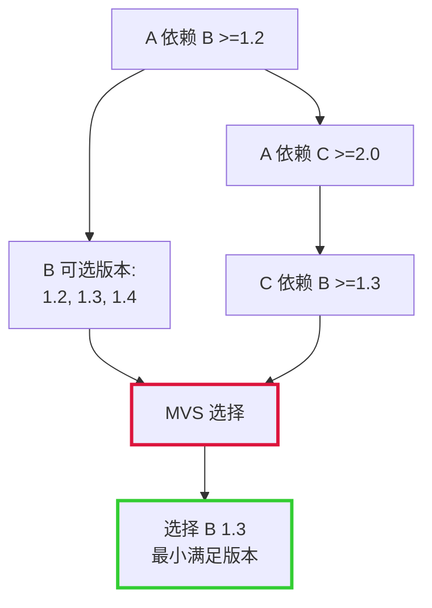

**为什么选择最小版本**:
- 保守策略，减少不兼容风险
- 更稳定，经过更多测试
- 避免引入不必要的新功能

### 2.2 MVS vs 其他算法

| 特性 | MVS | 最新版本选择 | SAT 求解器 |
|------|-----|-------------|-----------|
| 选择策略 | 最小可用版本 | 最新版本 | 满足约束的任意版本 |
| 可预测性 | 高 | 低 | 中 |
| 稳定性 | 高 | 低 | 中 |
| 复杂度 | 低 | 低 | 高 |
| Go 采用 | 是 | 否 | 否 |

## 3. LLAR 的 MVS 实现

### 3.1 Module Path 设计

在 Go MVS 中，Module Path 用于标识模块。在 LLAR 中：

**Module Path = PackageName**

示例：
- `madler/zlib` - Module Path
- `DaveGamble/cJSON` - Module Path

**说明**:
- 直接使用 PackageName 作为 Module Path
- 不使用 `{{PackageName}}/{{FromVersion}}` 格式
- 简化设计，与 Go 保持一致

### 3.2 MVS 算法输入

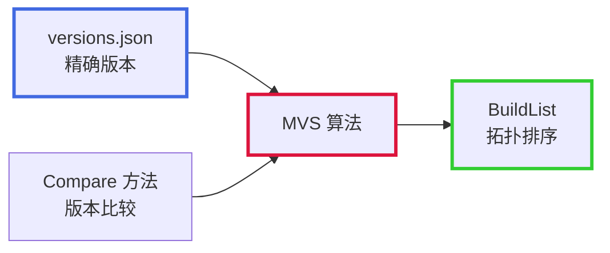

**输入要求**:
1. **精确版本**: versions.json 中的确切依赖版本（非版本范围）
2. **Compare 方法**: 用于版本大小比较
3. **依赖图**: 所有包的依赖关系

**注意**: 版本范围解析在 MVS 之前完成。

### 3.3 MVS 核心方法

#### 3.3.1 BuildList 方法

**作用**: 生成构建所需的所有依赖包列表（拓扑排序）

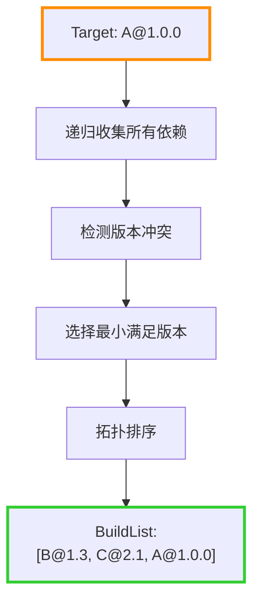

**示例**:
```
输入: A@1.0.0
A 依赖: B@1.2, C@2.0
C 依赖: B@1.3

MVS 过程:
1. 收集 A 的直接依赖: B@1.2, C@2.0
2. 收集 C 的依赖: B@1.3
3. 检测 B 的冲突: 1.2 vs 1.3
4. 选择更大版本: B@1.3
5. 拓扑排序: [B@1.3, C@2.0, A@1.0.0]

输出: BuildList = [B@1.3, C@2.0, A@1.0.0]
```

#### 3.3.2 Require 方法

**作用**: 查询指定包的直接依赖

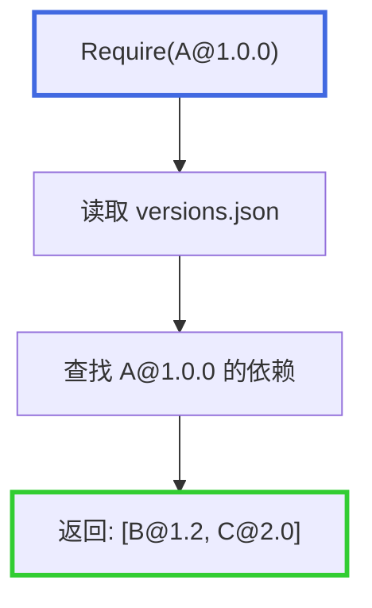

**示例**:
```
输入: A@1.0.0
versions.json 内容:
{
    "versions": {
        "1.0.0": [
            {"name": "B", "version": "1.2"},
            {"name": "C", "version": "2.0"}
        ]
    }
}

输出: [B@1.2, C@2.0]
```

## 4. MVS 算法详细流程

### 4.1 依赖收集

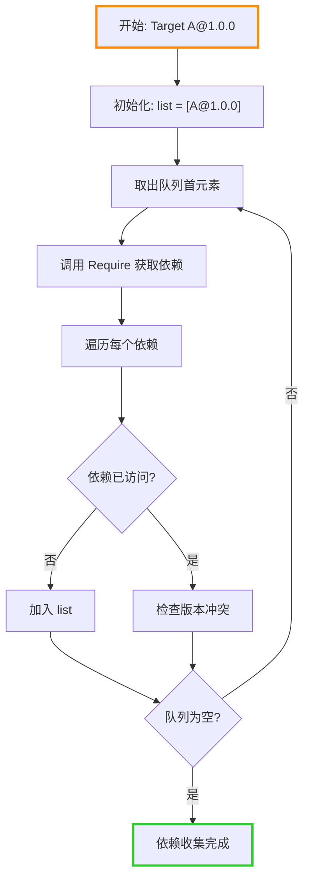

### 4.2 版本冲突解决

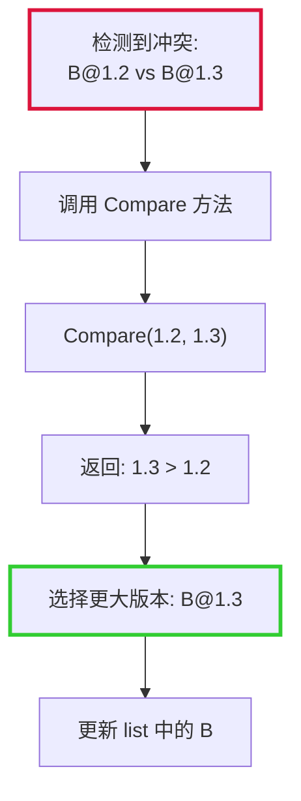

**算法**:
```
对于同一个包的多个版本要求:
1. 收集所有版本: [v1, v2, v3, ...]
2. 使用 Compare 方法两两比较
3. 选择最大版本
4. 验证最大版本满足所有约束
```

### 4.3 拓扑排序

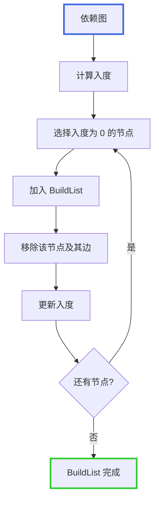

**目的**: 确保依赖在使用者之前构建

**示例**:
```
依赖关系:
A → B
A → C
C → B

拓扑排序结果:
[B, C, A]

构建顺序:
1. 先构建 B
2. 再构建 C（C 依赖 B）
3. 最后构建 A（A 依赖 B 和 C）
```

## 5. MVS 与版本范围的集成

### 5.1 整体流程

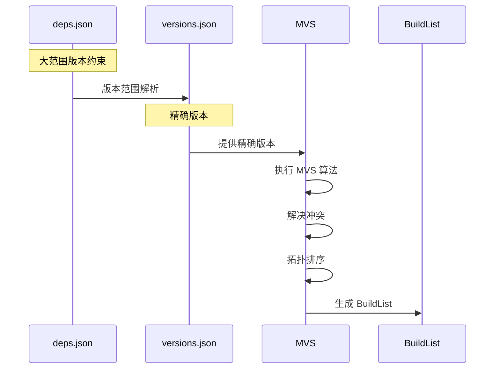

**关键点**:
- deps.json 使用版本范围
- 版本范围解析后得到精确版本
- MVS 算法基于精确版本执行
- MVS 输入是精确版本，输出是 BuildList

### 5.2 版本范围解析 vs MVS

| 阶段 | 输入 | 输出 | 作用 |
|------|------|------|------|
| 版本范围解析 | deps.json（范围） | versions.json（精确） | 选择最大版本 |
| MVS 算法 | versions.json（精确） | BuildList（拓扑） | 解决冲突，排序 |

**示例**:
```
阶段 1: 版本范围解析
输入: deps.json → B: >=1.2.0 <2.0.0
输出: versions.json → B: 1.3.0

阶段 2: MVS 算法
输入: versions.json → B: 1.3.0, C: 2.0.0
输出: BuildList → [B@1.3.0, C@2.0.0, A@1.0.0]
```

## 6. 完整示例

### 6.1 依赖关系

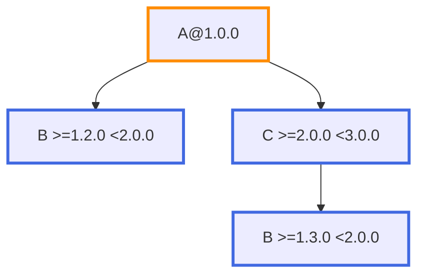

### 6.2 解析过程

**步骤 1: 版本范围解析**

```
A@1.0.0 依赖 B >=1.2.0 <2.0.0
- 调用 B 的 onVersions
- 获取: [1.2.11, 1.2.13, 1.3.0, 1.4.0]
- 过滤 >=1.2.0 <2.0.0: [1.2.11, 1.2.13, 1.3.0, 1.4.0]
- 选择最大: 1.4.0

A@1.0.0 依赖 C >=2.0.0 <3.0.0
- 调用 C 的 onVersions
- 选择最大: 2.1.0

C@2.1.0 依赖 B >=1.3.0 <2.0.0
- 调用 B 的 onVersions
- 过滤 >=1.3.0 <2.0.0: [1.3.0, 1.4.0]
- 选择最大: 1.4.0
```

**步骤 2: 生成 versions.json**

```json
{
    "name": "A",
    "versions": {
        "1.0.0": [
            {"name": "B", "version": "1.4.0"},
            {"name": "C", "version": "2.1.0"}
        ]
    }
}
```

**步骤 3: MVS 算法**

```
收集依赖:
- A@1.0.0 → [B@1.4.0, C@2.1.0]
- C@2.1.0 → [B@1.4.0]

检测冲突:
- B: 1.4.0 vs 1.4.0 → 无冲突

拓扑排序:
- B 无依赖，先构建
- C 依赖 B，次之
- A 依赖 B 和 C，最后

BuildList: [B@1.4.0, C@2.1.0, A@1.0.0]
```

### 6.3 最终结果

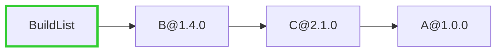

## 7. Compare 方法集成

### 7.1 Compare 方法的作用

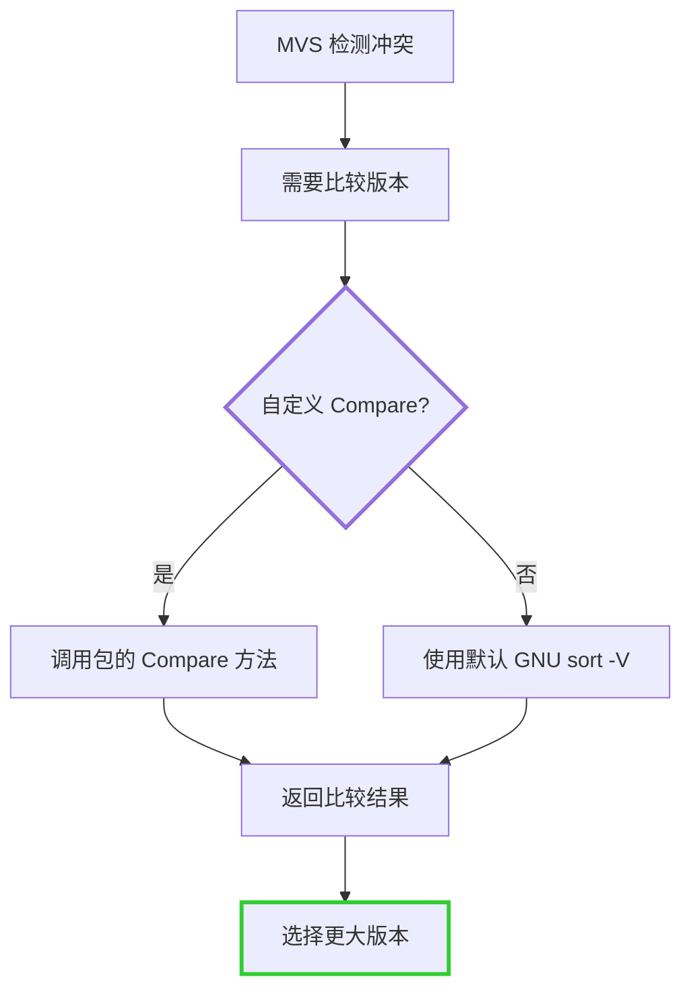

### 7.2 Compare 方法接口

```go
type VersionComparator func(v1, v2 string) int

// 返回值:
//  < 0: v1 < v2
//  = 0: v1 = v2
//  > 0: v1 > v2
```

### 7.3 使用场景

MVS 算法在以下情况调用 Compare:
1. 检测版本冲突时，比较多个版本
2. 选择最小满足版本时，找出最大版本
3. 验证版本约束时，判断版本大小

## 8. BuildList 的使用

### 8.1 构建执行

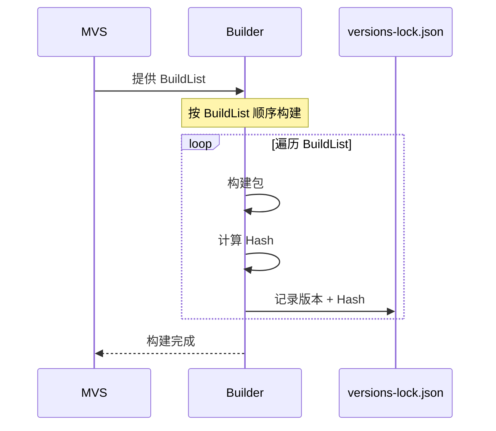

### 8.2 BuildList 特性

**拓扑排序保证**:
- 依赖在使用者之前构建
- 没有循环依赖
- 构建顺序确定

**示例**:
```
BuildList: [B@1.3, C@2.1, A@1.0]

构建顺序:
1. 构建 B@1.3
2. 构建 C@2.1（可以使用 B）
3. 构建 A@1.0（可以使用 B 和 C）
```

## 9. 与 Go MVS 的对比

| 特性 | Go MVS | LLAR MVS |
|------|--------|----------|
| 算法原理 | Minimal Version Selection | 相同 |
| Module Path | go.mod 中的 module path | PackageName |
| 版本格式 | semver | 自定义（支持 Compare） |
| 版本比较 | semver 规则 | Compare 方法 + GNU sort -V |
| 输入 | go.mod（精确版本） | versions.json（精确版本） |
| 输出 | BuildList | BuildList |
| replace 支持 | 是 | 是（在 versions.json 中） |

## 10. 参考

- [Go MVS 算法](https://research.swtch.com/vgo-mvs)
- [version-management-overview.md](version-management-overview.md) - 版本管理总览
- [version-range-design.md](version-range-design.md) - 版本范围设计
- [version-comparison-design.md](version-comparison-design.md) - 版本比较设计
