# LLAR MVS 算法设计

## 1. 概述

MVS（Minimal Version Selection）算法是 Go 模块系统采用的依赖解析算法，LLAR 采用相同的算法来解决依赖冲突并生成构建顺序。

### 1.1 为什么选择 MVS

**1. 经过生产环境验证的可靠性**

MVS 算法自 2018 年被引入 Go 模块系统以来，已在大规模生产环境中经过充分验证。Go 生态系统的广泛应用证明了该算法在处理复杂依赖关系时的稳定性和可预测性，这为 LLAR 采用 MVS 提供了坚实的信心基础。

**2. 语义化版本的前提假设**

LLAR 主要面向具有一定影响力的成熟开源项目，这些项目通常遵循语义化版本规范（Semantic Versioning）或其他有意义的版本命名约定。在此前提下，版本号能够可靠地反映代码变更的性质（主版本号变更表示不兼容、次版本号变更表示向前兼容的功能增加、补丁版本号变更表示向前兼容的问题修复）。

**3. 版本冲突解决的理论基础**

当 MVS 遇到依赖冲突时，会选择满足所有约束的**最大版本号**。这一策略在语义化版本的前提下具有合理性：

**情况 A：库遵循向前兼容承诺**
- 较新版本保持了 API 的向前兼容性
- 选择最大版本可以同时满足所有依赖方的需求
- **结果**：构建成功，依赖冲突得到解决

**情况 B：库引入了破坏性变更**
- 较新版本引入了不兼容的 API 变更
- 不同依赖方分别依赖了互不兼容的 API
- **结果**：编译失败，这是**正确的行为**——因为存在两个互斥的需求，本质上无解
- 此时需要人工介入：升级依赖方代码适配新 API，或降级到兼容版本

**情况 C：版本号升级但未使用新 API**
- 某依赖方声明依赖较新版本，但实际未使用新增 API
- 只要 API 签名未变更，使用最大版本理论上不会产生兼容性问题
- 若 API 签名发生变更，则退化为情况 B（互斥需求）

**核心优势**：MVS 的"快速失败"特性能够在构建阶段暴露真正的依赖冲突问题，避免将问题延迟到运行时，这对于 C/C++ 这类静态编译语言尤为重要。

### 1.2 LLAR 版本选择策略

LLAR 在 MVS 算法中实现了**保守的最小版本选择**策略：

**默认行为（llar install）**:
- deps.json 中的版本范围约束（如 `>=1.2.0 <2.0.0`）是指导版本
- 默认选择满足约束的**最小版本**（通常是约束下界 `1.2.0`）
- **原因**: 最小版本在配方提交时已通过 CI 测试，确保稳定可用
- **好处**: 避免使用未经配方测试的新版本，降低构建失败风险

**升级模式（llar install -u）**:
- 使用 `-u` (upgrade) 参数时，选择满足约束的**最大版本**
- 适用场景：用户主动希望升级到最新版本获取新功能或修复

**示例**:
```
deps.json: ">=1.2.0 <2.0.0"
onVersions 返回: [1.2.0, 1.2.5, 1.3.0, 1.4.0]

默认: llar install → 1.2.0 (配方测试通过)
升级: llar install -u → 1.4.0 (最新版本)
```

## 2. MVS 算法原理

### 2.1 核心思想

**最小版本选择**: 在满足所有约束的前提下，选择每个依赖的**最小可用版本**。

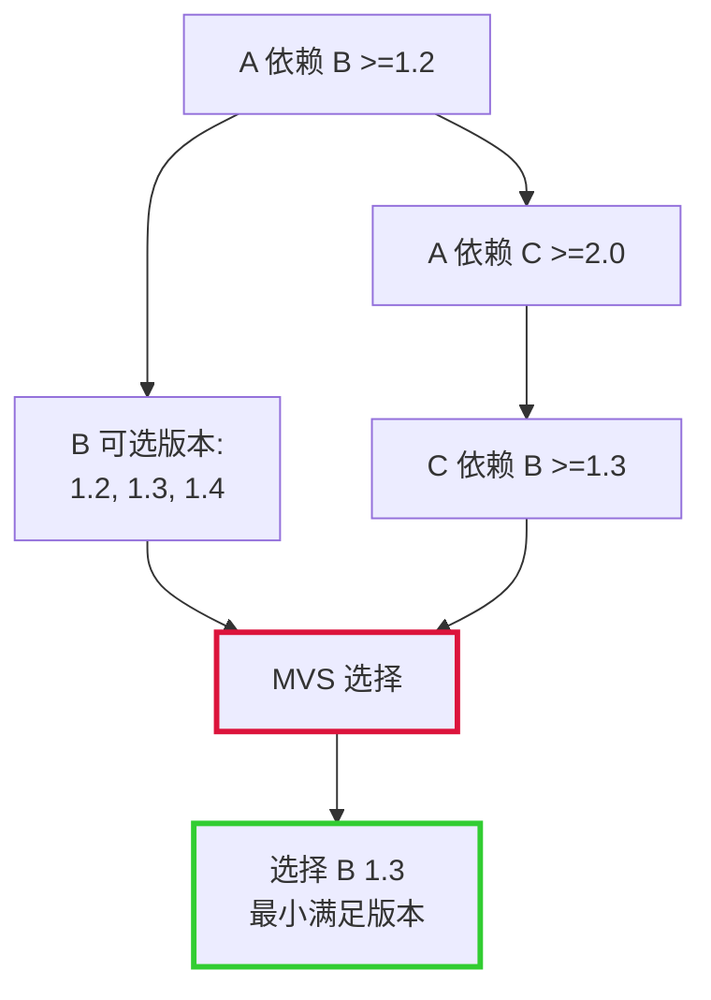

**为什么选择最小版本**:
- 保守策略，减少不兼容风险
- 更稳定，经过更多测试
- 避免引入不必要的新功能

### 2.2 MVS vs 其他算法

| 特性 | MVS | 最新版本选择 | SAT 求解器 |
|------|-----|-------------|-----------|
| 选择策略 | 最小可用版本 | 最新版本 | 满足约束的任意版本 |
| 可预测性 | 高 | 低 | 中 |
| 稳定性 | 高 | 低 | 中 |
| 复杂度 | 低 | 低 | 高 |
| Go 采用 | 是 | 否 | 否 |

## 3. LLAR 的 MVS 实现

### 3.1 Module Path 设计

在 Go MVS 中，Module Path 用于标识模块。在 LLAR 中：

**Module Path = PackageName**

示例：
- `madler/zlib` - Module Path
- `DaveGamble/cJSON` - Module Path

**说明**:
- 直接使用 PackageName 作为 Module Path
- 不使用 `{{PackageName}}/{{FromVersion}}` 格式
- 简化设计，与 Go 保持一致

### 3.2 MVS 算法输入输出

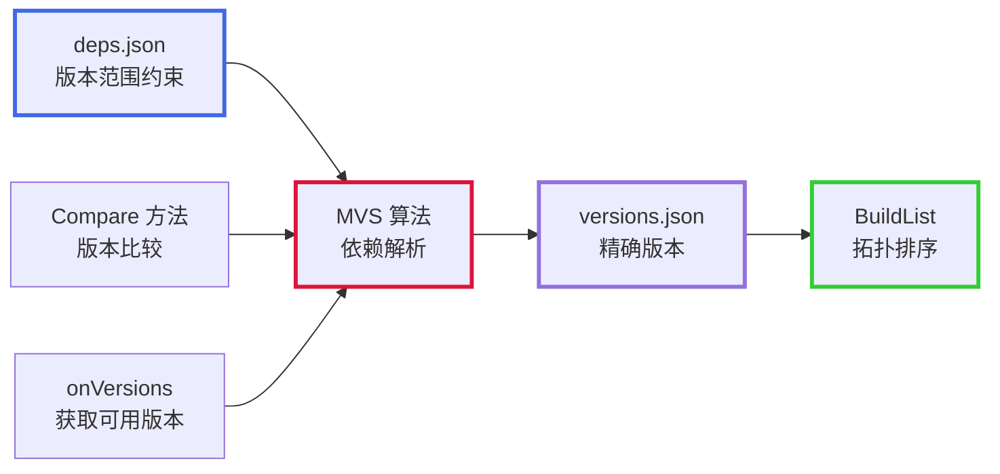

**输入**:
1. **deps.json**: 包含版本范围约束的依赖声明
2. **Compare 方法**: 用于版本大小比较
3. **onVersions**: 获取包的所有可用版本列表

**输出**:
1. **versions.json**: MVS 计算后确定的精确版本
2. **BuildList**: 基于 versions.json 生成的拓扑排序构建列表

### 3.3 MVS 核心方法

#### 3.3.1 BuildList 方法

**作用**: MVS 算法的核心方法，完成依赖解析并生成构建列表

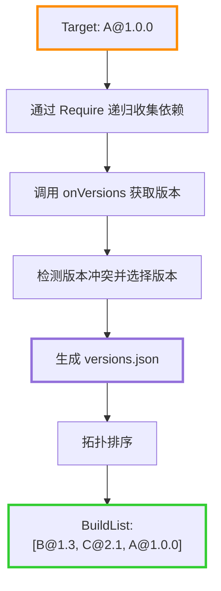

**示例**:
```
输入: A@1.0.0 的 deps.json
deps.json:
  A 依赖: B >=1.2 <2.0, C >=2.0 <3.0
  C 依赖: B >=1.3 <2.0

MVS 过程:
1. Require(A@1.0.0):
   - 读取 deps.json: B >=1.2 <2.0
   - onVersions(B) → [1.2, 1.3, 1.4]
   - 选择 B@1.4

2. Require(C@2.0):
   - 读取 deps.json: B >=1.3 <2.0
   - onVersions(B) → [1.2, 1.3, 1.4]
   - 选择 B@1.4

3. 检测 B 的冲突: 1.4 vs 1.4 → 无冲突

4. 生成 versions.json（精确版本）

5. 拓扑排序: [B@1.4, C@2.0, A@1.0.0]

输出:
  - versions.json（精确版本）
  - BuildList = [B@1.4, C@2.0, A@1.0.0]
```

#### 3.3.2 Require 方法

**作用**: 查询指定包的直接依赖，解析版本范围并选择版本，处理传递依赖

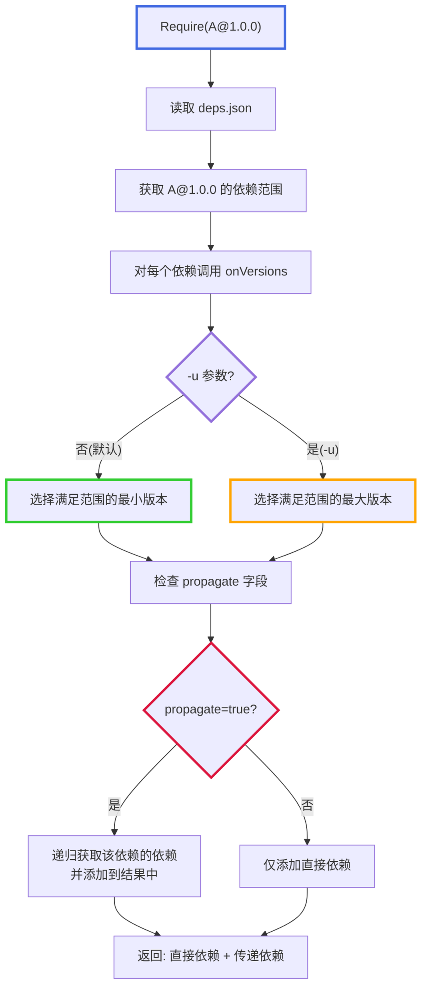

**示例**:
```
输入: A@1.0.0
deps.json 内容:
{
    "versions": {
        "1.0.0": {
            "deps": [
                {"name": "B", "version": ">=1.2.0 <2.0.0"},
                {"name": "C", "version": ">=2.0.0 <3.0.0"}
            ]
        }
    }
}

处理过程（默认模式）:
1. B: onVersions 返回 [1.2.0, 1.2.11, 1.2.13, 1.3.0, 1.4.0]
   - 过滤 >=1.2.0 <2.0.0: [1.2.0, 1.2.11, 1.2.13, 1.3.0, 1.4.0]
   - 默认选择最小: 1.2.0 (配方测试通过的版本)

2. C: onVersions 返回 [2.0.0, 2.1.0]
   - 过滤 >=2.0.0 <3.0.0: [2.0.0, 2.1.0]
   - 默认选择最小: 2.0.0 (配方测试通过的版本)

输出(默认): [B@1.2.0, C@2.0.0]

处理过程（升级模式 -u）:
1. B: 选择最大: 1.4.0
2. C: 选择最大: 2.1.0

输出(-u): [B@1.4.0, C@2.1.0]
```

#### 3.3.3 传递依赖处理

**propagate 字段**: 控制依赖是否向上传递

**示例场景**:
```
包结构:
- A 依赖 B (propagate: true)
- B 依赖 C

deps.json 配置:
{
    "name": "A",
    "deps": {
        "1.0.0": [{
            "name": "B",
            "version": ">=1.0.0",
            "propagate": true
        }]
    }
}

{
    "name": "B",
    "deps": {
        "1.0.0": [{
            "name": "C",
            "version": ">=1.0.0"
        }]
    }
}
```

**处理流程**:
```
1. Require(A@1.0.0):
   - 读取 deps.json: B >=1.0.0, propagate=true
   - 选择 B@1.0.0
   - 检测 propagate=true
   - 递归调用 Require(B@1.0.0):
     - 返回 [C@1.0.0]
   - 将 C@1.0.0 添加到 A 的依赖列表
   - 最终返回: [B@1.0.0, C@1.0.0]

2. 结果:
   - A 的直接依赖: [B@1.0.0, C@1.0.0]
   - C 通过 propagate 机制被提升为 A 的直接依赖
```

**传递依赖规则**:
1. 当依赖标记为 `propagate: true` 时，该依赖的所有依赖会被添加到当前包的依赖列表
2. 传递是递归的：如果 B 的依赖 C 也标记为 `propagate: true`，则 C 的依赖也会传递
3. 传递的依赖视为直接依赖，参与 MVS 版本冲突解决
4. 默认 `propagate: false`，依赖不传递

**使用场景**:
- **propagate: true**: 头文件依赖、接口依赖、必须暴露给上层的库
- **propagate: false**: 内部实现依赖、静态链接库、运行时依赖

## 4. MVS 算法详细流程

### 4.1 依赖收集（广度优先）

**重要**: 依赖收集采用**广度优先顺序**，从根节点（目标包）开始，逐层展开：
1. 先调用根节点的 Require/onRequire，获取第一层依赖
2. 再依次调用第一层依赖的 Require/onRequire，获取第二层依赖
3. 以此类推，直到所有依赖收集完成

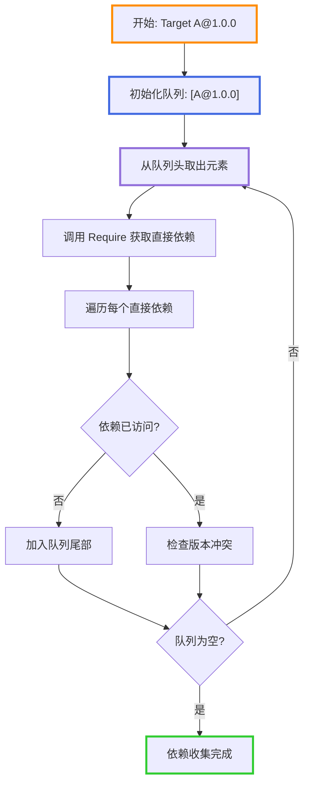

**示例**:
```
cJSON (根节点)
├── zlib
└── openssl
    └── crypto

收集顺序（广度优先）:
1. 调用 cJSON 的 Require → 得到 [zlib, openssl]
2. 调用 zlib 的 Require → 得到它的依赖
3. 调用 openssl 的 Require → 得到 [crypto]
4. 调用 crypto 的 Require → 得到它的依赖
```

### 4.2 版本冲突解决

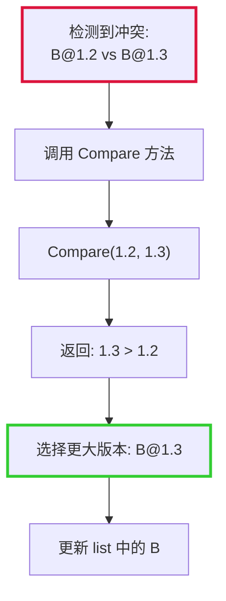

**算法**:
```
对于同一个包的多个版本要求:
1. 收集所有版本: [v1, v2, v3, ...]
2. 使用 Compare 方法两两比较
3. 选择最大版本
4. 验证最大版本满足所有约束
```

### 4.3 拓扑排序（构建顺序）

**目的**: 确保依赖在使用者之前构建（从叶子节点到根节点）

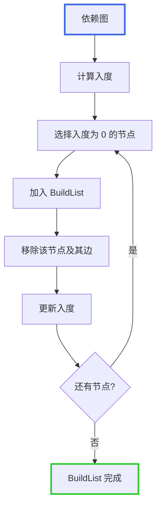

**示例**:
```
依赖关系:
cJSON (根节点)
├── zlib
└── openssl
    └── crypto

构建顺序（拓扑排序，从下到上）:
BuildList = [crypto, zlib, openssl, cJSON]

1. 先构建 crypto（叶子节点，无依赖）
2. 再构建 zlib（叶子节点，无依赖）
3. 然后构建 openssl（依赖 crypto，crypto 已构建）
4. 最后构建 cJSON（依赖 zlib 和 openssl，都已构建）
```

**重要对比**:
- **依赖收集顺序**（调用 Require/onRequire）: 广度优先，从上到下
  - `cJSON → zlib → openssl → crypto`
- **构建执行顺序**（BuildList）: 拓扑排序，从下到上
  - `crypto → zlib → openssl → cJSON`

## 5. MVS 作为依赖解析器

### 5.1 整体流程

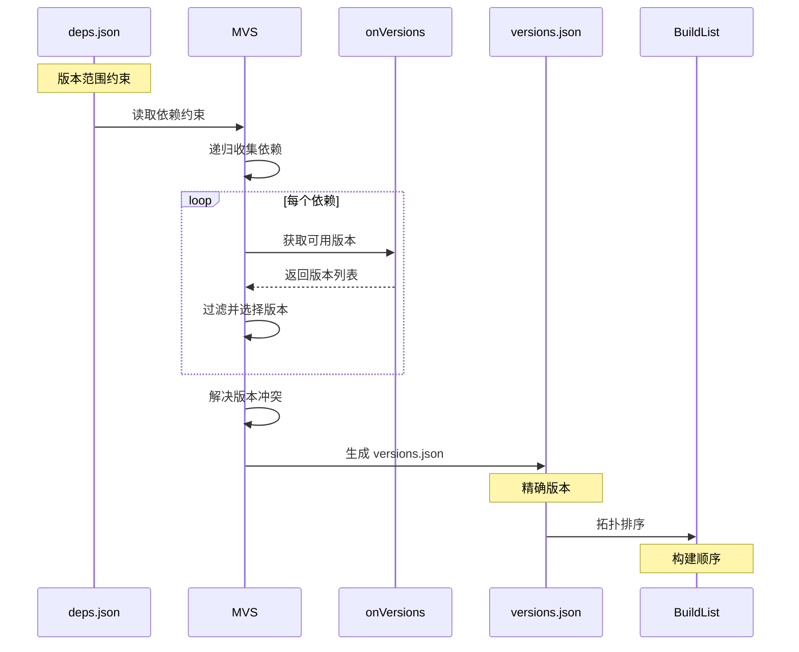

**关键点**:
- MVS 是依赖解析器，负责将版本范围解析为精确版本
- 输入是 deps.json（版本范围约束）
- 通过 onVersions 获取可用版本列表
- 使用 Compare 方法比较版本并选择合适版本
- 输出是 versions.json（精确版本）
- 最后基于 versions.json 生成 BuildList

### 5.2 MVS 依赖解析过程

| 阶段 | 输入 | 处理 | 输出 | 作用 |
|------|------|------|------|------|
| 依赖解析 | deps.json（范围） | MVS + onVersions | versions.json（精确） | 选择版本，解决冲突 |
| 构建排序 | versions.json（精确） | 拓扑排序 | BuildList（拓扑） | 确定构建顺序 |

**示例**:
```
阶段 1: MVS 依赖解析
输入: deps.json → A 依赖 B: >=1.2.0 <2.0.0
处理:
  - 调用 onVersions 获取 B 的版本: [1.2.11, 1.2.13, 1.3.0, 1.4.0]
  - 过滤满足约束的版本: [1.2.11, 1.2.13, 1.3.0, 1.4.0]
  - 选择最大版本: 1.4.0
  - 检查 C 的依赖也需要 B: >=1.3.0 <2.0.0
  - B 的 1.4.0 同时满足两个约束
输出: versions.json → B: 1.4.0, C: 2.1.0

阶段 2: 构建排序
输入: versions.json → B: 1.4.0, C: 2.1.0
输出: BuildList → [B@1.4.0, C@2.1.0, A@1.0.0]
```

## 6. 完整示例

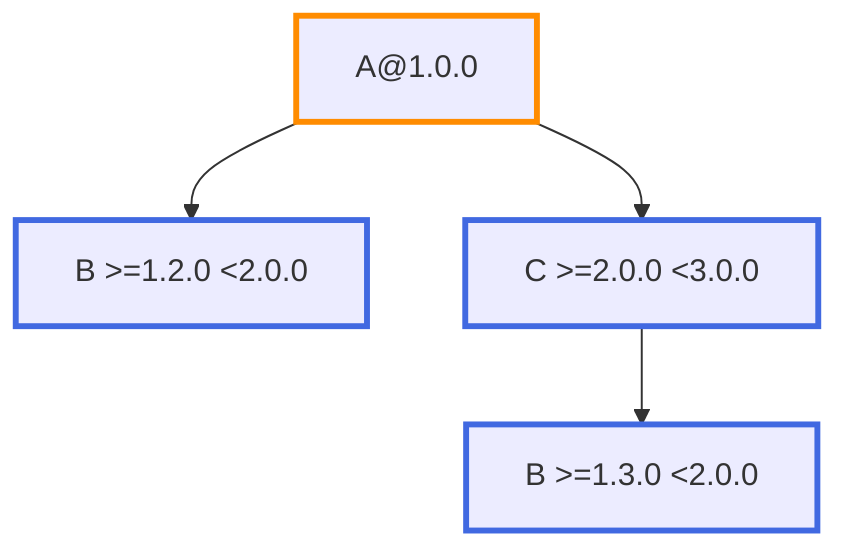

**解析过程**:
1. A 依赖 B `>=1.2.0 <2.0.0` 和 C `>=2.0.0 <3.0.0`
2. C 依赖 B `>=1.3.0 <2.0.0`
3. MVS 选择 B@1.4.0（同时满足两个约束）和 C@2.1.0
4. 拓扑排序：BuildList = `[B@1.4.0, C@2.1.0, A@1.0.0]`

## 7. Compare 方法集成

### 7.1 Compare 方法的作用

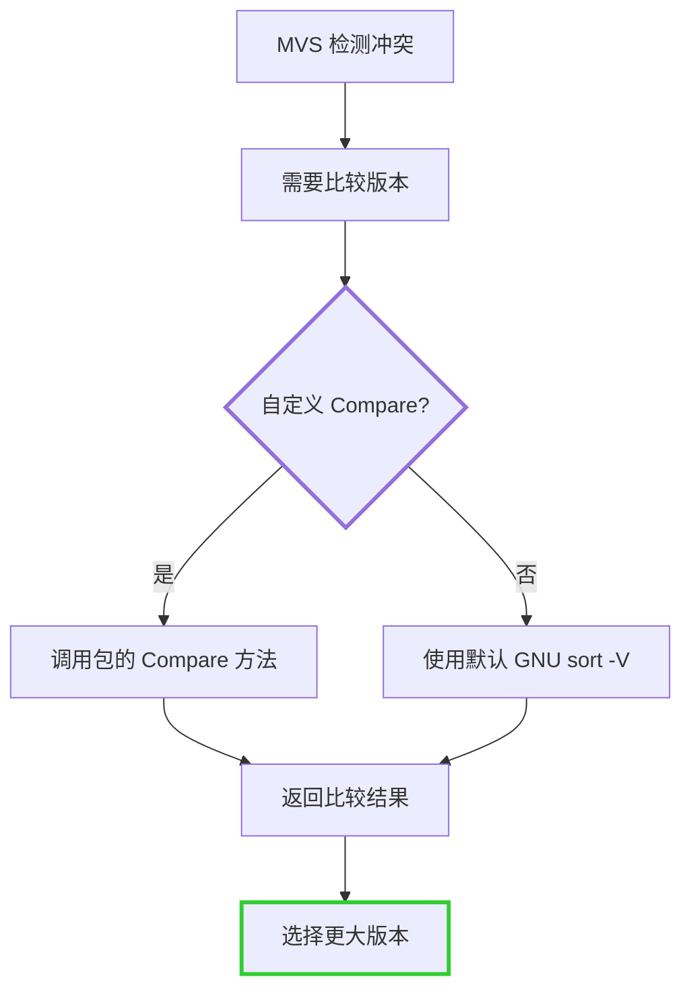

### 7.2 Compare 方法接口

```go
type VersionComparator func(v1, v2 string) int

// 返回值:
//  < 0: v1 < v2
//  = 0: v1 = v2
//  > 0: v1 > v2
```

### 7.3 使用场景

MVS 算法在以下情况调用 Compare:
1. 检测版本冲突时，比较多个版本
2. 选择最小满足版本时，找出最大版本
3. 验证版本约束时，判断版本大小

## 8. BuildList 的使用

### 8.1 构建执行

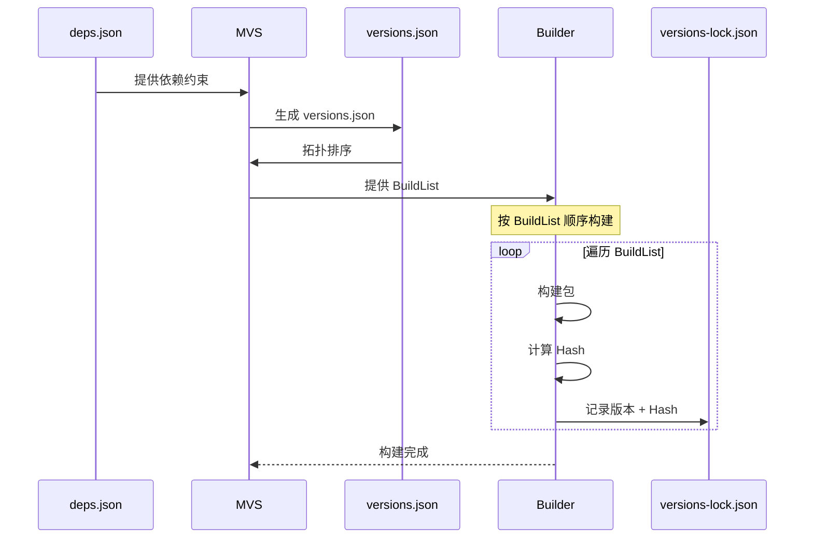

### 8.2 BuildList 特性

**拓扑排序保证**:
- 依赖在使用者之前构建
- 没有循环依赖
- 构建顺序确定

**示例**:
```
BuildList: [B@1.3, C@2.1, A@1.0]

构建顺序:
1. 构建 B@1.3
2. 构建 C@2.1（可以使用 B）
3. 构建 A@1.0（可以使用 B 和 C）
```

## 9. 与 Go MVS 的对比

| 特性 | Go MVS | LLAR MVS |
|------|--------|----------|
| 算法原理 | Minimal Version Selection | 相同 |
| Module Path | go.mod 中的 module path | PackageName |
| 版本格式 | semver | 自定义（支持 Compare） |
| 版本比较 | semver 规则 | Compare 方法 + GNU sort -V |
| 输入 | go.mod（版本约束）+ go.sum | deps.json（版本范围） |
| 中间产物 | - | versions.json（精确版本） |
| 输出 | BuildList | versions.json + BuildList |
| 版本获取 | GOPROXY | onVersions 回调 |
| replace 支持 | 是 | 是（在 deps.json 中） |

## 10. 参考

- [Go MVS 算法](https://research.swtch.com/vgo-mvs)
- [version-management-overview.md](version-management-overview.md) - 版本管理总览
- [version-range-design.md](version-range-design.md) - 版本范围设计
- [version-comparison-design.md](version-comparison-design.md) - 版本比较设计
