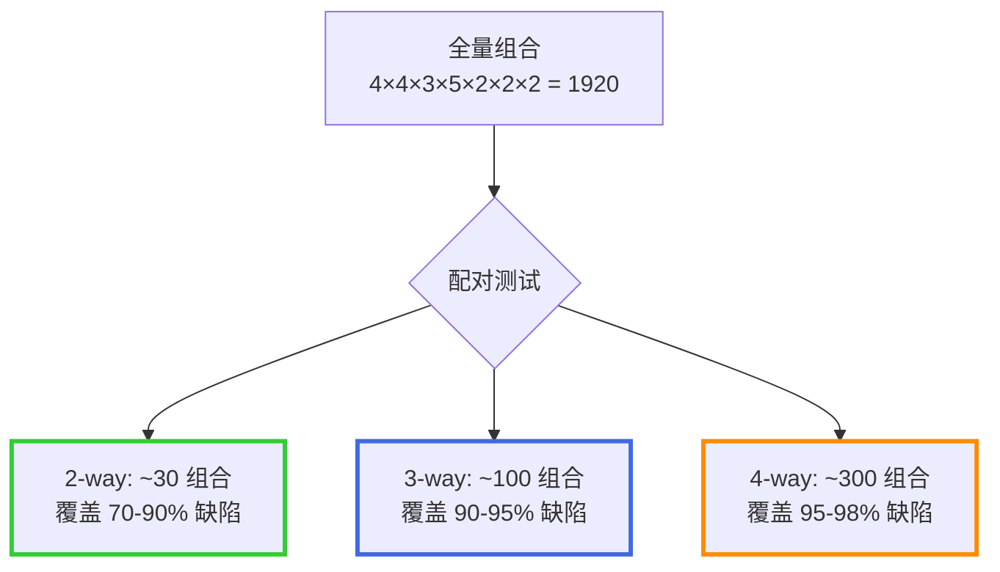
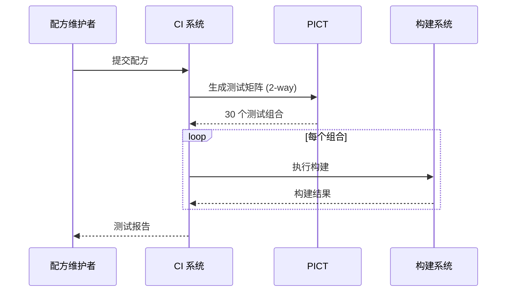

# LLAR 构建矩阵配对测试设计

> 参考：Jacek Czerwonka (Microsoft), "Pairwise Testing in Real World", 2006

## 1. 问题背景

### 1.1 矩阵组合爆炸

```
总组合数 = 选项1个数 × 选项2个数 × ... × 选项n个数
```

**示例**：50 个选项，每个 2 种值
```
2⁵⁰ = 1,125,899,906,842,624 (约 1125 万亿)
```

全量测试不可行。

### 1.2 解决方案：配对测试 (Pairwise Testing)

配对测试基于一个关键观察：**大多数缺陷由单个参数或两个参数的交互引起**。

## 2. t-way 组合测试

### 2.1 核心概念

**t-way 覆盖**：确保任意 **t 个参数**的所有值组合至少被测试一次。

| 术语 | 含义 | 说明 |
|------|------|------|
| **1-way** | 每个参数的每个值至少出现一次 | 最简单，用例最少 |
| **2-way** | 任意两个参数的所有组合至少出现一次 | **= 配对测试 (pairwise)** |
| **3-way** | 任意三个参数的所有组合至少出现一次 | 三元组测试 |
| **N-way** | 所有参数的所有组合 | = 全量测试（穷举） |

### 2.2 为什么有效：一个用例覆盖多个配对

**示例**：3 个参数 A, B, C 各有 2 个值

2-way 需要覆盖的配对：
- AB: (0,0), (0,1), (1,0), (1,1) — 4 个
- AC: (0,0), (0,1), (1,0), (1,1) — 4 个
- BC: (0,0), (0,1), (1,0), (1,1) — 4 个

**关键洞察**：一个测试用例可同时覆盖多个配对！

```
测试用例 (A=0, B=0, C=0) 同时覆盖：
- AB=(0,0) ✓
- AC=(0,0) ✓
- BC=(0,0) ✓
```

因此 **4 个测试用例**就能覆盖全部 12 个配对，而非 8 个全组合。

### 2.3 效率对比（PICT 论文 Figure 2）

| 场景 | 全组合 | 2-way (PICT) | 压缩比 |
|------|--------|--------------|--------|
| 3⁴ | 81 | 9 | 89% |
| 3¹³ | 159 万 | 18 | ~100% |
| 4¹⁵ × 3¹⁷ × 2²⁹ | 巨大 | 37 | ~100% |
| 2¹⁰⁰ | 2¹⁰⁰ | 15 | ~100% |
| **10²⁰** | **10²⁰** | **210** | **~100%** |

### 2.4 简单示例

**参数**：
- arch: [x86_64, arm64]
- os: [linux, darwin]
- compiler: [gcc, clang]

**全组合**: 2 × 2 × 2 = 8 种

**配对测试**: 只需 4 种即可覆盖所有两两组合

| # | arch | os | compiler | 覆盖的配对 |
|---|------|------|----------|-----------|
| 1 | x86_64 | linux | gcc | (arch,os), (arch,compiler), (os,compiler) |
| 2 | x86_64 | darwin | clang | (arch,os), (arch,compiler), (os,compiler) |
| 3 | arm64 | linux | clang | (arch,os), (arch,compiler), (os,compiler) |
| 4 | arm64 | darwin | gcc | (arch,os), (arch,compiler), (os,compiler) |

验证：每对参数的所有值组合都至少出现一次。

## 3. PICT 算法机制

> PICT 自 2000 年起在 Microsoft 内部使用，设计目标：速度、易用性、可扩展性。

### 3.1 两阶段架构

```
┌─────────────┐     ┌─────────────┐
│  准备阶段    │ ──▶ │  生成阶段    │
│ Preparation │     │ Generation  │
└─────────────┘     └─────────────┘
```

### 3.2 准备阶段：参数交互结构

对于参数 A={0,1}, B={0,1}, C={0,1,2}，建立交互表：

```
       AB    AC    BC
      ────  ────  ────
       00    00    00
       01    01    01
       10    02    02
       11    10    10
             11    11
             12    12
```

每个槽位状态：
- **uncovered**: 未覆盖（需要测试）
- **covered**: 已覆盖
- **excluded**: 排除（约束导致的无效组合）

### 3.3 生成阶段：贪心启发式算法

```
While 存在未覆盖的槽位:
    创建新测试用例 r

    If r 为空:
        选择未覆盖槽位最多的参数交互
        选取第一个未覆盖组合
    Else:
        选择能覆盖最多未覆盖组合的值
        且不违反任何排除约束

    将选中的值加入 r
    标记相关槽位为 covered
```

**特点**：
- 确定性算法（相同输入产生相同输出）
- 局部最优（贪心策略）
- 不产生候选测试（比 AETG 更快）

## 4. NIST 研究结论

### 4.1 缺陷发现率

| 覆盖强度 | 缺陷发现率 | 说明 |
|----------|-----------|------|
| 2-way | 70-90% | 配对测试 |
| 3-way | 90-95% | 三元组测试 |
| 4-way | 95-98% | 四元组测试 |
| 6-way | ~100% | NIST 观察到的最大交互度 |

### 4.2 关键结论

> "Most failures are induced by single factor faults or by the joint combinatorial effect of two factors."
> — NIST Combinatorial Testing Research

- 大多数缺陷由 1-2 个参数交互引起
- 实际观察到的最大交互度为 6
- 4-way 覆盖通常足以发现几乎所有缺陷

## 5. PICT 实用特性

> 论文核心贡献：让配对测试从理论变得**实际可用**。

### 5.1 约束 (Constraints)

**问题**：现实中参数并非独立，某些组合无效（如 msvc 只能在 Windows）。

**解决**：用 IF-THEN 规则排除无效组合。

```
IF [File system] = "FAT"   THEN [Size] <= 4096;
IF [File system] = "FAT32" THEN [Size] <= 32000;
IF [compiler] = "msvc"     THEN [os] = "windows";
```

**机制**：约束被转换为排除组合，在参数交互结构中标记为 `excluded`，生成时自动跳过。

### 5.2 混合强度 (Mixed-Strength)

**问题**：某些参数交互更"敏感"，需要更高覆盖；但全局提高 t 会产生过多用例。

**解决**：对关键参数子集使用更高的 t。

```
A:      0, 1
B @ 3:  0, 1      # B, C, D 之间使用 3-way
C @ 3:  0, 1
D @ 3:  0, 1
E:      0, 1
```

**效果**：B, C, D 的所有三元组被覆盖，其他参数仍使用 2-way。

### 5.3 子模型 / 参数层次 (Sub-Modeling)

**问题**：环境参数（硬件、OS）切换成本高，希望尽量减少环境组合数。

**解决**：将参数分层，底层先组合，结果作为上层的一个"复合参数"。

```
# 输入参数
Type:        Single, Spanned, Striped
Size:        10, 100, 1000
File system: FAT, FAT32, NTFS

# 环境参数（子模型）
{ Platform, CPUs, RAM } @ 2
```

**效果**：
- 无子模型：31 个测试，17 种环境组合
- 有子模型：54 个测试，仅 9 种环境组合

### 5.4 种子 (Seeding)

**用途 1**：确保"重要"组合一定出现在结果中。

```
# seed.txt - 必须包含的组合
Single  100  Quick  NTFS  4096  Off
Mirror       Slow   FAT32            # 部分种子也可以
```

**用途 2**：模型变更时复用旧测试用例，减少硬件配置重建成本。

### 5.5 负值测试 (Negative Testing)

**问题**：需要测试无效输入，但多个无效值同时出现会导致**输入掩盖**（第一个错误阻止后续检测）。

**解决**：用 `*` 标记无效值，PICT 确保每个测试用例最多包含一个无效值。

```
A: *LessThanZero, Zero, GreaterThanZero
B: *LessThanZero, Zero, GreaterThanZero
```

**输出**：
```
Zero             GreaterThanZero  (正向测试)
*LessThanZero    GreaterThanZero  (负向测试 - 只有一个无效值)
Zero             *LessThanZero    (负向测试 - 只有一个无效值)
```

### 5.6 权重 (Weights)

**问题**：某些值更常用（如默认选项），希望测试更多涉及这些值。

**解决**：为值设置权重，影响选择优先级。

```
Type:        Single (5), Spanned (2), Striped (2), Mirror (2), RAID-5 (1)
Format:      Quick (5), Slow (1)
File system: FAT (1), FAT32 (1), NTFS (5)
Compression: On (1), Off (10)
```

**注意**：权重仅在覆盖效果相同时生效，不会牺牲覆盖率。

## 6. 应用于 LLAR 构建矩阵

### 6.1 具体示例

**参数定义**：
```
arch:     x86_64, arm64
os:       linux, darwin, windows
compiler: gcc, clang, msvc
shared:   ON, OFF
```

**全组合**: 2 × 3 × 3 × 2 = **36 种**

**2-way 配对测试**: 只需约 **9 种**

#### 需要覆盖的配对

| 参数对 | 组合数 | 示例 |
|--------|--------|------|
| arch × os | 6 | x86_64-linux, arm64-darwin, ... |
| arch × compiler | 6 | x86_64-gcc, arm64-clang, ... |
| arch × shared | 4 | x86_64-ON, arm64-OFF, ... |
| os × compiler | 9 | linux-gcc, darwin-clang, windows-msvc, ... |
| os × shared | 6 | linux-ON, darwin-OFF, ... |
| compiler × shared | 6 | gcc-ON, clang-OFF, ... |
| **总计** | **37** | |

#### 配对测试结果

| # | arch | os | compiler | shared |
|---|------|--------|----------|--------|
| 1 | x86_64 | linux | gcc | ON |
| 2 | x86_64 | darwin | clang | OFF |
| 3 | x86_64 | windows | msvc | ON |
| 4 | arm64 | linux | clang | OFF |
| 5 | arm64 | darwin | gcc | ON |
| 6 | arm64 | windows | msvc | OFF |
| 7 | x86_64 | linux | msvc | OFF |
| 8 | arm64 | darwin | clang | ON |
| 9 | x86_64 | windows | clang | OFF |

**验证 `os × compiler` 覆盖**：

```
linux-gcc     ✓ (#1)      darwin-gcc   ✓ (#5)      windows-gcc   —
linux-clang   ✓ (#4)      darwin-clang ✓ (#2,#8)   windows-clang ✓ (#9)
linux-msvc    ✓ (#7)      darwin-msvc  —           windows-msvc  ✓ (#3,#6)
```

#### 加入约束

```
IF [compiler] = "msvc"  THEN [os] = "windows";   # msvc 只在 Windows
IF [os] = "darwin"      THEN [compiler] <> "msvc"; # darwin 无 msvc
```

约束排除了无效组合（darwin-msvc、linux-msvc），配对数减少，**最终 7-8 个用例**即可。

#### 效果对比

| 方案 | 测试数 | 压缩比 |
|------|--------|--------|
| 全组合 | 36 | — |
| 2-way（无约束）| 9-10 | 72% |
| 2-way（有约束）| 7-8 | 78% |

### 6.2 完整参数定义

```
LLAR 构建矩阵参数：
- arch: [x86_64, arm64, arm32, riscv64]
- os: [linux, darwin, windows, android]
- compiler: [gcc, clang, msvc]
- compiler_version: [11, 12, 13, 14, 15]
- lang: [c, cpp]
- shared: [ON, OFF]
- debug: [ON, OFF]
```

### 6.3 测试策略



### 6.4 分层测试策略

| 层级 | 覆盖强度 | 测试数量 | 应用场景 |
|------|----------|----------|----------|
| 基础 | 2-way | ~30 | 每次配方提交 |
| 标准 | 3-way | ~100 | 每日构建 |
| 完整 | 4-way | ~300 | 发布前测试 |

## 7. 工具选型

### 7.1 PICT (Microsoft)

**优点**：
- 开源，MIT 协议
- 支持约束、混合强度、子模型、种子、权重等高级特性
- 命令行工具，易于集成
- Microsoft 内部广泛使用，经过实战验证

**使用示例**：
```
# model.txt
arch: x86_64, arm64, arm32
os: linux, darwin, windows
compiler: gcc, clang, msvc
shared: ON, OFF

# 约束: msvc 只在 windows 上
IF [compiler] = "msvc" THEN [os] = "windows";
```

```bash
pict model.txt
```

**输出**：
```
arch      os       compiler  shared
x86_64    linux    gcc       ON
arm64     darwin   clang     OFF
arm32     windows  msvc      ON
x86_64    darwin   clang     ON
...
```

### 7.2 ACTS (NIST)

**优点**：
- NIST 官方工具
- 支持更高覆盖强度
- 支持复杂约束
- Java 实现，跨平台

### 7.3 推荐选择

**推荐 PICT**：
- 更轻量，易于集成到 CI
- 满足 2-way 到 4-way 需求
- 活跃维护（Microsoft 官方）

## 8. 实施方案

### 8.1 配方测试流程



### 8.2 配置文件设计

```yaml
# .llar/test-matrix.yml
parameters:
  arch: [x86_64, arm64]
  os: [linux, darwin]
  compiler: [gcc, clang]
  shared: [ON, OFF]

constraints:
  # clang 在 darwin 上优先
  - if: { os: darwin }
    then: { compiler: clang }
    weight: high

coverage:
  default: 2-way      # 配方提交
  nightly: 3-way      # 每日构建
  release: 4-way      # 发布测试
```

### 8.3 集成到 LLAR

```go
// 生成测试矩阵
func GenerateTestMatrix(params MatrixParams, strength int) []MatrixCombination {
    // 调用 PICT 生成配对测试组合
    model := generatePICTModel(params)
    combinations := runPICT(model, strength)
    return combinations
}

// 执行配对测试
func RunPairwiseTests(formula Formula, strength int) TestReport {
    combinations := GenerateTestMatrix(formula.Matrix, strength)

    var results []TestResult
    for _, combo := range combinations {
        result := buildAndTest(formula, combo)
        results = append(results, result)
    }

    return generateReport(results)
}
```

## 9. 预期效果

### 9.1 测试效率

| 指标 | 全量测试 | 配对测试 (2-way) | 提升 |
|------|----------|------------------|------|
| 测试用例数 | 1920 | 30 | 64x |
| 测试时间 | 32 小时 | 30 分钟 | 64x |
| 缺陷发现率 | 100% | 70-90% | 可接受 |

### 9.2 与惰性构建结合

```
配对测试 (预构建)    →  覆盖 70-90% 常用组合
用户触发构建         →  覆盖剩余冷门组合
云端缓存             →  逐步扩大覆盖
```

## 10. 下一步

1. [ ] 集成 PICT 到 LLAR CI
2. [ ] 设计 test-matrix.yml 配置格式
3. [ ] 实现测试报告生成
4. [ ] 与现有惰性构建策略整合

## 11. 参考资料

- Jacek Czerwonka, "Pairwise Testing in Real World", Microsoft, 2006
- [PICT - Microsoft](https://github.com/microsoft/pict)
- [NIST Combinatorial Testing](https://csrc.nist.gov/projects/automated-combinatorial-testing-for-software)
- [NIST SP 800-142: Practical Combinatorial Testing](https://nvlpubs.nist.gov/nistpubs/legacy/sp/nistspecialpublication800-142.pdf)
- [All-pairs Testing - Wikipedia](https://en.wikipedia.org/wiki/All-pairs_testing)
