# LLAR 产品设计文档（完整版）

## 1. 项目背景与出发点

### 1.1 问题定义

在C/C++开发中，我们经常会遇到这样一类问题：不同的库或者Module存在大量可选编译配置，以及有大量编译组合，通常更换一个配置或者换个构建平台，我们只能重头把这些库构建一遍。

这样行为其实相当浪费时间，因为这样重复的构建往往是没有意义的。

于是为了节约时间，有许多包管理器都提出了"预构建"包选项，例如著名的 Homebrew，Conan和APT等。

然而这些包管理器，为了节省空间，往往不对所有可能的选项进行构建，依然要用户本地构建。

同时，我们注意到，不只有C/C++存在这类问题，例如Python，WASM也有对应的问题。

### 1.2 LLAR的设计出发点

LLAR 虽然有反复造轮子的意味，但是LLAR设计出发点与conan，homebrew，xmake等工具是不同的。

Conan和Xmake都在关注C/C++生态编译，在这方面做了大量的工作，而Homebrew，APT等工具目标仅仅是为了提供能用的预构建包。虽然Conan尝试做预构建与编译方面的平衡，想要打造一款全能的构建工具，然而，Conan在这方面努力显然是不足的，因为他们管理不够完整，仅提供了部分的管理。这个问题出现的原因不言而喻--Conan其本身定位是构建工具，并非预构建下载。另一个Xmake，也有同样问题，虽然他们提供了Xrepo，但是Xrepo更多是Xmake扩展，而并非是Xmake关心的，他们更多也是关注在编译构建工具方面。

然而单独从编译构建工具来说，已经有太多太多成熟的工具了，GNU工具链，Ninja，Cmake.....我们没有必要再额外造一个编译构建工具。Conan的成功正是因为它不仅仅是一款构建工具，更重要的是，他为开发者提供了成熟的资产管理方案。

因此，LLAR出发点就是，我们想创造一款，既有完整资产管理方案（为预构建包提供在线编译管理需求），又可以提供便捷编译配置的包管理工具。换句话说，我们想追求的是二者的平衡。

### 1.3 名称含义

LLAR 名称来源是：`LL` + `AR`，AR为Archive缩写，C/C++的库打包后称为Archive，`LL`意思是它为`LLGo`类似的编译器设计，只不过它可以独立于`LLGo`

## 2. 竞品调研与机会分析

### 2.1 竞品分析

**Conan**: 通过 `Recipe` 定义包信息，根据环境设置查询远程仓库，优先下载预构建的二进制包，缺失时自动从源码构建，同时缓存结果供后续重用。而Recipe则使用Python进行编写。

**Homebrew**: 通过名为 `Formula` 的 Ruby 脚本来定义软件的编译规则与依赖关系；在用户执行安装命令时，它会优先从`Bottles`（预编译的二进制包）直接下载安装以提升效率，若没有对应平台的Bottles则自动在本地从源码编译。

**Xmake**: 类似于 `Conan` 和 `Homebrew`，只不过在二者基础上添加了多种自定义源，它可以从Conan或者VCPkgs下载包并进行安装

### 2.2 机会与意义

现有包管理工具无法预构建巨量的构建产物，多数都采取了云端预构建与用户自构建结合做法，即当不存在预构建产物时候就要求用户自行构建。

这样做法对于用户体验而言，是极其失败的，因为：

1. 由于用户不同需求，产生的构建产物无法被满足，多数情况下，所谓"通用"的预构建产物形同虚设，举个例子，当一个macOS x86_64平台经常缺少预构建包，大多数包管理器认为这个平台用户不够多而被忽略
2. 反复构建相同产物，极其浪费时间，这些产物可以被云端缓存起来

LLAR 是第一个尝试完全解决预构建产物问题的平台

## 3. 产品需求与设计目标

### 3.1 核心需求

1. 满足一个包多种构建产物带来的巨额产物云构建，存储需求
2. 提供一种规范化，标准化的包构建，管理方案

### 3.2 基本概念

#### 包 Package
我们将LLAR一个独立的库单位称之为包，之所以称之为包，是因为其包含以下几部分：

1. 构建信息
2. 版本信息

而构建信息又包含以下两部分：
1. 构建配方
2. 构建矩阵

#### 构建配方 Formula
构建配方，用于告诉构建者该包如何完成构建。

#### 构建矩阵 Matrix
构建矩阵，由于一个包可能只存在一种配方，但是这一种配方因为外部需求的变化会导致多种产物，为了代表这类变化，我们使用一个构建矩阵表达

#### 惰性构建 Lazy Build
由于我们出发点基于一个包存在巨额构建产物前提之下，因此不可能一次性就能完成所有构建产物的构建。我们提出了"惰性编译"方案以缓解这一点，
"惰性构建"并不是类似于常见包管理预构建和用户构建结合，而是：不存在的预构建包，用户和云端并发构建，构建完毕则无需用户构建，直接拉取云端缓存。

#### 中心化配方管理仓库 Formula Repository
配方仓库用于存放和管理构建配方，一般来说是基于GitHub之类的git协议管理平台

## 4. 用户故事与用户画像

### 4.1 用户画像
**目标用户**：使用模块拆分编译类语言（如C/C++），且对编译速度有追求的用户

### 4.2 用户故事

#### 用户（开发者）

用户可以：
- **安装包到本地**：通过 `LLAR Cli` 从中心化配方管理仓库获得需要包的配方，并通过`xgo run`执行配方，使用"惰性构建"设计，如果云端不存在预构建包，则触发云端和用户本地构建，否则直接下载云端预构建包
- **获取包的相关信息**，如构建信息，版本信息
- **仅下载预构建包**
- **仅下载包源码**

其流程图如下：

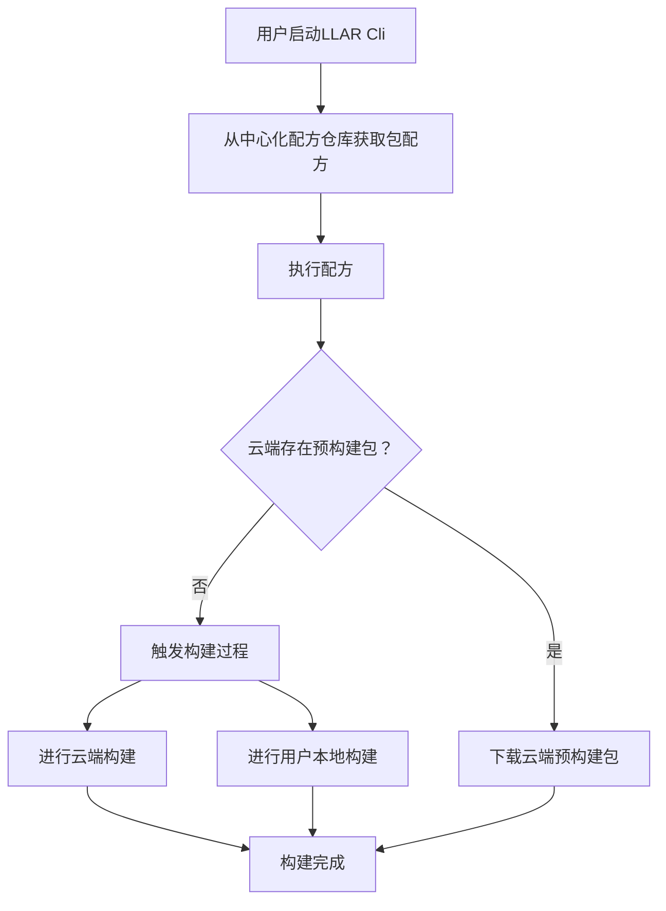

#### 维护者

维护者可以（通过Pull Request）：
- **提交相关配方**至中心化配方管理仓库
- **更新中心化配方管理仓库的配方**

流程图如下：

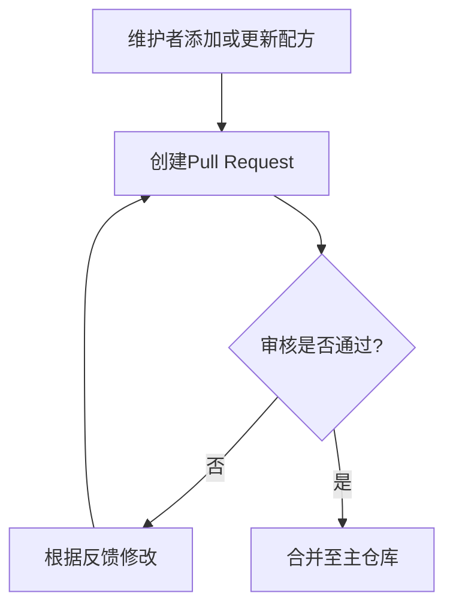

## 5. 包设计

包是我们定义的一个抽象的概念，其实现载体为配方(Formula)。

一个包存在以下核心属性：
- **Package Name**（包名）
- **Version**（版本）
- **Desc**（描述）
- **Homepage**（原库主页）
- **Build Matrix**（构建矩阵）
- **Dependencies**（依赖关系）

### 5.1 LLAR Package Name

格式：`Owner/Repo`

这个一般取自源库来源

我们举个例子，`github.com/DaveGamble/cJSON`

其LLAR Package Name应该为: `DaveGamble/cJSON`

Package Name很重要的一个用途就是将该package以人类可阅读的形式展示给用户，并不用于标识符使用

#### 限制
Package Name唯一限制就是要求必须是ASCII中的可打印字符，不允许其他字符。

这个限制主要是因为，Package Name作为给用户展示的字符，不应该存在一些看起来乱码的字符

**注意**: Package Name 也被用作 Go MVS 算法中的 Module Path，因此必须保持唯一性和稳定性

### 5.2 版本管理

#### 版本结构
```go
type PackageVersion {
    Version string  // 原版本号，保持上游格式
}
```

#### 版本比较机制

**默认比较算法**：LLAR使用GNU Coreutils的`sort -V`算法（来源于Debian版本比较），这是一种尽可能通用的版本比较算法。

**自定义比较**：对于有特殊版本规则的包，维护者可以通过`_version.gox`文件提供自定义比较逻辑：

```
DaveGamble/
└── cJSON/
    ├── versions.json
    ├── cJSON_version.gox   # 版本管理（onVersions + compare）
    ├── 1.x/
    │   └── cJSON_llar.gox
    └── 2.x/
        └── cJSON_llar.gox
```

**比较示例**：
```javascript
import (
    semver "github.com/Masterminds/semver/v3"
)

compare (a, b) => {
    v1 := semver.NewVersion(a.Ver)!
    v2 := semver.NewVersion(b.Ver)!
    return v1.Compare(v2)
}
```

### 5.3 构建矩阵（Build Matrix）

构建矩阵用于表达一个包在不同构建配置下的所有可能产物组合。

#### 矩阵结构

矩阵由两部分组成：
- **require**：必需的编译参数，会向下传播给依赖包（类似Conan的settings）
- **options**：可选的编译参数，仅限于当前包，不向下传播（类似Conan的options）

```json
{
    "matrix": {
        "require": {
            "arch": ["x86_64", "arm64"],
            "lang": ["c", "cpp"],
            "os": ["linux", "darwin"]
        },
        "options": {
            "zlib": ["zlibON", "zlibOFF"]
        }
    }
}
```

#### 必需字段
- **arch**：编译平台（如 x86_64, arm64）
- **lang**：包的语言（如 c, cpp, py）

#### 可选字段
- **os**：操作系统（如 linux, darwin, windows）
- **toolchain**：工具链（如 gcc, clang, msvc）

#### 矩阵组合表示

矩阵组合通过按字母排序的key值，用`-`连接：
- `require` 组合：`x86_64-c-linux`
- 加上 `options`：`x86_64-c-linux|zlibON`

**示例**：上述矩阵将产生以下组合：
```
x86_64-c-linux
x86_64-c-darwin
arm64-c-linux
arm64-c-darwin
x86_64-cpp-linux
x86_64-cpp-darwin
arm64-cpp-linux
arm64-cpp-darwin
```

如果包含options字段，每个组合会进一步扩展：
```
x86_64-c-linux|zlibON
x86_64-c-linux|zlibOFF
...
```

#### 矩阵传播规则

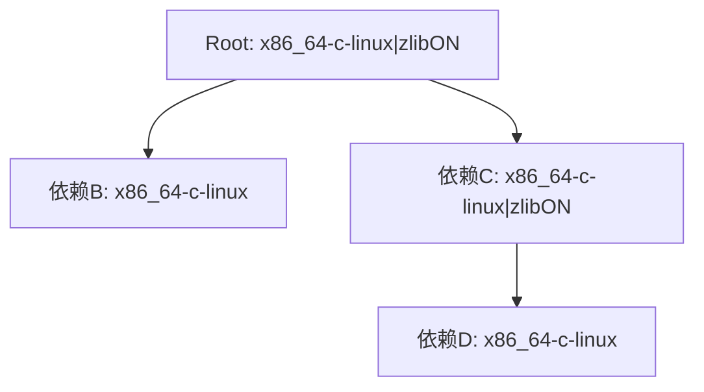

**说明**：
- `require` 字段必须向下传播，所有依赖包的 `require` 必须是入口包的交集
- `options` 字段仅在声明了该option的包中生效
- 如果依赖包的 `require` 不是入口包的交集，系统会终止并报错

### 5.4 包的依赖关系

#### 依赖声明方式

**静态依赖**（通过 `versions.json`）：
```json
{
    "name": "DaveGamble/cJSON",
    "deps": {
        "1.0.0": [{
            "name": "madler/zlib",
            "version": "1.2.1"
        }],
        "1.2.0": [{
            "name": "madler/zlib",
            "version": "1.2.3"
        }]
    },
    "replace": {
        "1.0.0": {
            "madler/zlib": "1.2.13"
        }
    }
}
```

**说明**：
- `deps` 对象的 key（如 `"1.0.0"`）表示 `fromVersion`，即从该版本开始使用对应的依赖配置
- 查询某个版本的依赖时，会选择小于等于该版本的最大 `fromVersion` 的依赖列表
- `replace` 对象（可选）也按 `fromVersion` 组织，用于强制替换依赖版本

**动态依赖**（通过 `onRequire` 回调）：
```javascript
onRequire deps => {
    // 从Ninja构建文件读取依赖图
    graph := readDepsFromNinja()?

    // 更新LLAR依赖系统
    graph.visit((parent, dep) => {
        deps.require(parent, dep)
    })

    // 强制替换依赖版本（类似 go.mod 的 replace）
    deps.replace("madler/zlib", "1.2.13")
}
```

**应用场景**：
- 包已有成熟的依赖管理工具（如Conan、vcpkg、CMake）
- 依赖关系需要根据构建配置动态变化
- 需要与现有构建系统集成

#### 依赖解析顺序

依赖解析采用**深度优先遍历**：

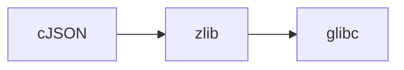

遍历顺序：`cJSON -> zlib -> glibc`

每个包的处理流程：
1. 执行 `onSource`（下载源码到临时目录）
2. 执行 `onRequire`（解析依赖关系）

### 5.5 包的版本选择

#### MVS算法

LLAR采用Go MVS（Minimal Version Selection）算法进行版本选择，确保：
- **高保真构建**：相同输入产生相同输出
- **自动冲突解决**：遇到版本冲突时自动选择最新版本

#### 版本冲突解决示例

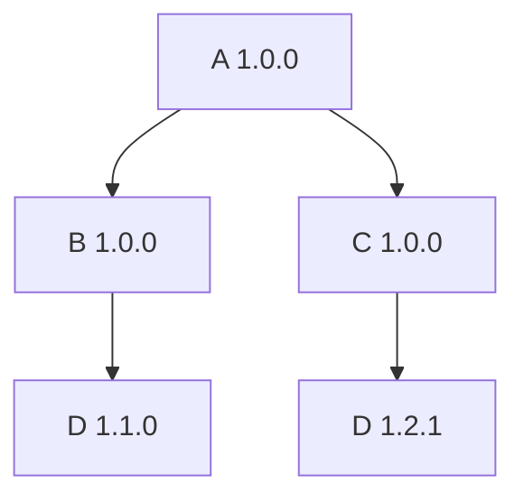

**解决过程**：
1. 检测到依赖D存在两个版本：1.1.0 和 1.2.1
2. 使用D包的 `Compare` 方法比较版本
3. 自动选择较新的版本 1.2.1

**解决后的依赖图**：
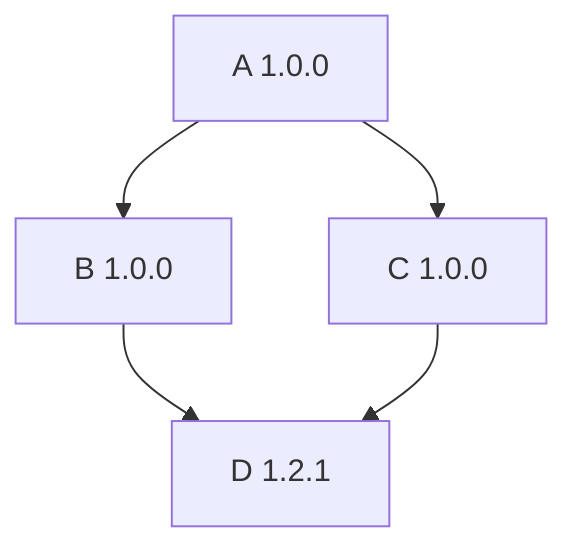

### 5.6 包的存储结构

#### 配方存储

**位置**：`{{UserCacheDir}}/.llar/formulas/`（Git仓库，LLAR自动管理）

**目录结构**：
```
{{UserCacheDir}}/.llar/formulas/
├── .git/                        # Git版本控制
├── DaveGamble/
│   └── cJSON/
│       ├── versions.json        # 依赖管理文件
│       ├── cJSON_version.gox    # 版本管理（onVersions + compare）
│       ├── go.mod               # 可选：Go依赖（如果配方需要import）
│       ├── go.sum
│       ├── 1.x/
│       │   └── CJSON_llar.gox
│       └── 2.x/
│           └── CJSON_llar.gox
└── madler/
    └── zlib/
        ├── versions.json
        └── ZLIB_llar.gox
```

#### 产物存储

**位置**：`{{UserCacheDir}}/.llar/formulas/{{owner}}/{{repo}}/build/{{Version}}/{{Matrix}}/`

**目录结构**：
```
{{UserCacheDir}}/.llar/formulas/DaveGamble/cJSON/build/
├── 1.7.18/                      # 版本号目录
│   ├── x86_64-c-darwin/         # 矩阵组合1
│   │   ├── .cache.json          # 构建缓存信息
│   │   ├── include/
│   │   │   └── cjson/
│   │   │       └── cJSON.h
│   │   └── lib/
│   │       ├── libcjson.a
│   │       └── pkgconfig/
│   │           └── cjson.pc
│   ├── arm64-c-darwin/          # 矩阵组合2
│   │   ├── .cache.json
│   │   ├── include/
│   │   └── lib/
│   └── x86_64-c-linux/          # 矩阵组合3
│       ├── .cache.json
│       ├── include/
│       └── lib/
└── 1.7.17/
    └── x86_64-c-darwin/
        ├── .cache.json
        ├── include/
        └── lib/
```

#### 构建缓存信息

每个构建产物目录下包含两个元数据文件：

**`.cache.json`** - 构建产物信息：
```json
{
    "packageName": "DaveGamble/cJSON",
    "version": "1.7.18",
    "matrix": "x86_64-c-darwin",
    "matrixDetails": {
        "arch": "x86_64",
        "lang": "c",
        "os": "darwin"
    },
    "buildTime": "2025-01-17T10:30:00Z",
    "buildDuration": "45.2s",
    "outputs": {
        "dir": "/Users/user/Library/Caches/.llar/formulas/DaveGamble/cJSON/build/1.7.18/x86_64-c-darwin",
        "linkArgs": "-L.../lib -lcjson -I.../include"
    },
    "sourceHash": "sha256:aaaabbbbccccdddd...",
    "formulaHash": "sha256:1111222233334444..."
}
```

**`.deps-lock.json`** - 依赖锁定信息：
```json
{
    "dependencies": [
        {
            "name": "madler/zlib",
            "version": "1.2.13",
            "sourceHash": "sha256:eeeeffff11112222...",
            "formulaHash": "sha256:33334444aaaabbbb..."
        }
    ]
}
```

**字段说明**：
- `.cache.json` 记录当前包的构建产物信息
- `.deps-lock.json` 记录当前包构建时使用的所有依赖版本（MVS解析后的结果）及其 Hash，确保构建的可重现性

**Hash 来源说明**：
- `sourceHash`: 从源码计算得出（通常从 GitHub Release、官方下载包等源码文件计算 SHA256）
- `formulaHash`: 从配方文件计算得出（对所有 `.gox` 文件和 `versions.json` 文件内容计算 SHA256）

### 5.7 包的完整生命周期

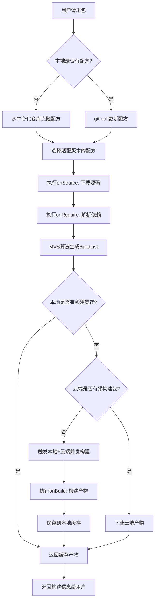

**说明**：
- `onVersions` 回调仅在 `llar list` 命令时被调用，用于列出包的所有可用版本
- `onSource` 会在下载源码时自动检查版本是否存在，如果版本不存在会直接报错
- 正常构建流程不需要单独的版本检查步骤

## 6. 构建流程设计

### 6.1 惰性构建流程

LLAR 采用 "惰性编译" 策略。这意味着当配方被合并时，系统并不会预先为所有可能的配置构建二进制包。相反，当用户请求一个二进制包时，LLAR Cli会通过 LLAR API查询 LLAR Backend。

如果请求的制品在后端已经存在，则会直接为用户下载。
如果未找到该制品，用户的请求会被提交给 LLAR Backend，以在云端触发一个新的构建任务。同时，为防止用户等待，系统会启动一个后备方案：在用户本地机器上也同时发起构建过程。

#### Cache Hit
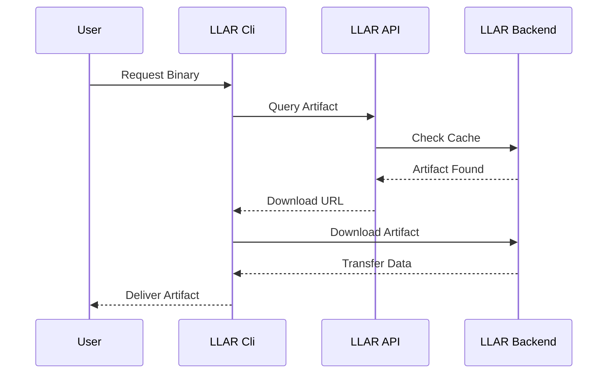

#### Cache Miss
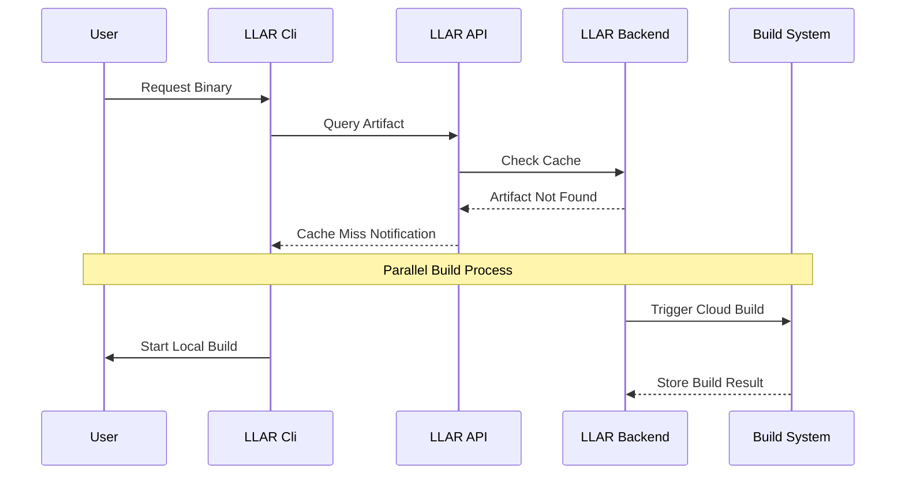

### 6.2 构建配方需求

#### 需求
- 为用户提供便捷的，简单环境来描述一个包构建方式
- 对包的依赖（版本和依赖）进行管理
- 为LLAR 用户API提供SDK

#### 基本概念

##### 源 Source
描述包的源码来源，一般为该项目源码的URL。但源并不局限于HTTP，它应该是一个通用的接口，允许用户使用非HTTP源。

##### 构建工具 Tool
虽然LLAR的构建配方可以作为构建工具使用，但对于许多C/C++项目来说，往往离不开传统的构建工具，例如CMake等。

#### 用户故事
用户可以：
- 描述构建过程
- 加载其他包构建配方，以实现依赖管理
- 自动解决版本冲突，解决构建矩阵冲突
- 自动解决工具链依赖(TODO)

#### 配方回调函数用户故事

配方维护者通过实现以下回调函数来定义包的构建行为：

##### onSource - 源码下载
**功能**：定义包的源码获取方式，并实现源码验证逻辑

用户可以：
- **指定源码下载地址**：从GitHub releases、官方网站或其他源下载特定版本的源码
- **实现源码验证**：使用Hash校验确保源码完整性和安全性
- **支持多种下载方式**：HTTP/HTTPS下载、Git克隆、本地文件等

**示例场景**：
```javascript
onSource ver => {
    // 从GitHub下载特定版本源码
    sourceDir := download("https://github.com/DaveGamble/cJSON/archive/v${ver.Version}.tar.gz")!

    // Hash校验确保源码未被篡改
    err := hashDirAndCompare(sourceDir, "aaaabbbbccccddddeee")

    return sourceDir, err
}
```

##### onVersions - 版本列表管理
**功能**：返回该包所有可用的版本列表

用户可以：
- **自动获取版本信息**：从GitHub tags、官方API或其他源自动获取版本列表
- **版本过滤和转换**：将上游版本格式转换为LLAR标准格式
- **支持多种版本源**：GitHub、GitLab、官方网站、自定义API等

**示例场景**：
```javascript
onVersions => {
    // 从GitHub获取所有tags
    tags := fetchTagsFromGitHub("DaveGamble/cJSON")!

    // 转换为版本列表（过滤出符合v1.x.x格式的版本）
    return githubTagsToVersion("v1", tags)
}
```

##### onRequire - 自定义依赖管理
**功能**：动态定义包的依赖关系，支持从第三方构建系统读取依赖信息

用户可以：
- **覆盖静态依赖配置**：动态修改versions.json中的依赖关系
- **集成第三方构建系统**：从Conan、Ninja、CMake等工具读取依赖信息
- **动态依赖解析**：根据构建矩阵、版本等条件动态调整依赖

**示例场景**：
```javascript
onRequire deps => {
    // 从Ninja构建文件读取依赖图
    graph := readDepsFromNinja()?

    // 遍历依赖图并更新到LLAR依赖系统
    graph.visit((parent, dep) => {
        deps.require(parent, dep)
    })
}
```

**应用场景**：
- 包已有成熟的依赖管理工具（如Conan、vcpkg）
- 依赖关系需要根据构建配置动态变化
- 需要与现有构建系统集成

##### onBuild - 构建执行
**功能**：定义包的具体构建步骤和产物输出

用户可以：
- **执行构建命令**：调用CMake、Make、编译器等构建工具
- **处理构建矩阵**：根据不同的构建配置（arch、os、toolchain等）执行不同的构建逻辑
- **生成构建产物**：返回包含头文件、库文件、链接参数等信息的Artifact结构

**示例场景**：
```javascript
onBuild matrix => {
    args := []

    // 根据构建矩阵选择工具链
    if matrix["toolchain"].contains "clang" {
        args <- "-DTOOLCHAIN=clang"
    }

    // 根据架构设置编译参数
    if matrix["arch"] == "arm64" {
        args <- "-DARCH=ARM64"
    }

    args <- "."

    // 执行CMake配置和构建
    cmake args
    cmake "--build" "."

    // 返回构建产物信息
    return {
        Info: {
            BuildResults: [
                {LDFlags, "-L/path/to/lib -lcjson"},
                {CFlags, "-I/path/to/include"},
            ]
        }
    }, nil
}
```

**应用场景**：
- 执行跨平台构建（Linux、macOS、Windows）
- 处理多种工具链（GCC、Clang、MSVC）
- 生成不同类型的产物（静态库、动态库、Header-Only）

#### 回调函数调用顺序说明

**重要**：`onRequire`、`onSource` 和 `onBuild` 的调用顺序和执行环境有所不同：

##### onRequire 调用顺序
- **顺序**：按照依赖树的**深度优先遍历顺序**
- **示例**：假设依赖关系为 `cJSON` 依赖 `zlib`，`zlib` 依赖 `glibc`，则遍历顺序为：`cJSON -> zlib -> glibc`
- **目的**：收集所有包的依赖关系信息

##### onSource 调用时机
- **时机**：在每个包的 `onRequire` **之前**执行
- **原因**：`onRequire` 可能需要解析 CMake、Conan 等构建系统的依赖信息，需要先下载源码
- **执行环境**：
  - 会切换到一个**临时工作目录**
  - 源码下载到该临时目录
  - 临时目录结构：`{{TempDir}}/{{PackageName}}/{{Version}}/source/`

##### onBuild 调用顺序
- **顺序**：按照 MVS **BuildList 顺序**（拓扑排序后的构建顺序，从底层依赖到上层）
- **示例**：假设依赖关系为 `cJSON` 依赖 `zlib`，`zlib` 依赖 `glibc`，则 BuildList 顺序为：`glibc -> zlib -> cJSON`（必须先构建底层依赖）
- **执行环境**：
  - 复用 `onSource` 下载的源码（同一个临时目录）
  - 构建在临时目录中进行
  - 返回的 `Artifact.Dir` 会被**移动**到最终的配方 build 目录：
    `{{UserCacheDir}}/.llar/formulas/{{owner}}/{{repo}}/build/{{Version}}/{{Matrix}}/`

##### 完整调用流程

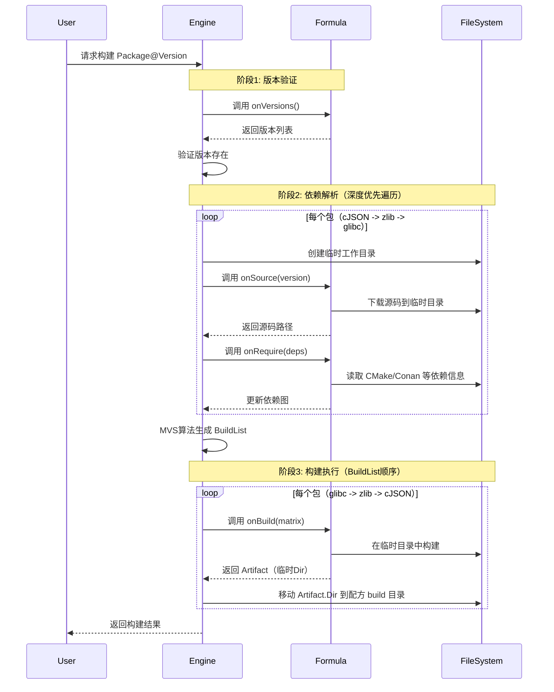

##### 目录变化示例

**onSource 执行时**（临时目录）：
```
/tmp/llar-build-xxx/
└── DaveGamble/
    └── cJSON/
        └── 1.7.18/
            └── source/
                ├── CMakeLists.txt
                ├── cJSON.c
                └── cJSON.h
```

**onBuild 执行后**（最终目录）：
```
{{UserCacheDir}}/.llar/formulas/DaveGamble/cJSON/build/1.7.18/x86_64-c-darwin/
├── .cache.json
├── include/
│   └── cjson/
│       └── cJSON.h
└── lib/
    ├── libcjson.a
    └── pkgconfig/
        └── cjson.pc
```

#### 构建流程
总的流程分为两部分：Build -> Test

##### Build
Build 为构建流程，在此过程，应该完成：

1. 从源中拉取代码
2. 使用构建工具对代码进行构建，得到构建配置
3. 对于静态语言而言：使用构建配置，得到二进制产物；对于动态语言而言：使用构建配置，对产物进行打包

##### Test
Test 为测试过程，对于静态语言而言，使用产物进行编译测试即可；对于动态而言，需要进行运行测试

##### 流程图

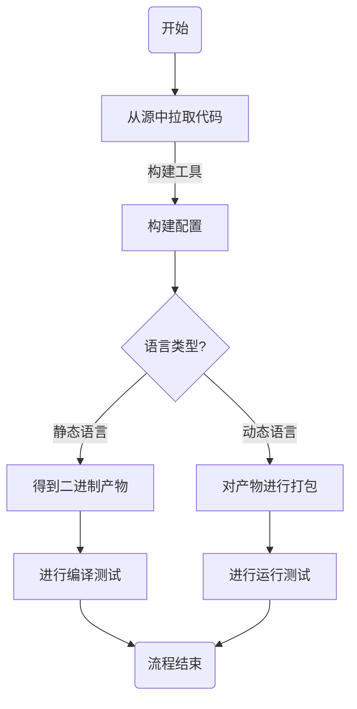

## 7. LLAR CLI设计

### 7.1 产品设计

#### 背景
LLAR Cli是将LLAR与用户连接的"门户"("Gateway")，用户通过LLAR Cli与LLAR进行互动

#### 需求
- 为用户提供统一的Cli接口用于LLAR管理
- 管理用户使用的配方脚本

#### 用户故事
用户可以：
- **获取已经编译或者打包好的Package**，以进行后续的编译操作
- **编译还没编译的Package**，以进行后续的编译操作
- **获取编译好或者未编译好的Package版本信息**，以了解目前有什么版本
- **获取编译好或者未编译好的Package构建信息**，以了解目前有什么依赖
- **下载Package源码**，但不进行编译
- **根据Package Name搜索Package**
- **从多个重名Package中**，提供具体信息让用户选择
- **执行配方**，生成配方
- **添加第三方源**（TODO）

### 7.2 具体设计

#### 下载并使用Package
```bash
llar download <package>[@version]
```

**功能**: 显式下载包并返回其构建信息，用于一次性获取包的链接参数

参数：
- `-s` / `--source`: 仅获取源码不需要二进制包（默认仅获取二进制)
- `-a` / `--all`: 不仅获取源码还获取二进制（同一个目录）
- `-json`: 以JSON格式输出(默认无格式，仅方便人类阅读和编译器处理)

输出内容：包的构建信息，例如`-lcjson`

例子：
```
-lcjson -L/xxxx/cjson -I/xxxx/cjson/include
```

JSON格式：
```json
{
    "LDFlags": "-L/xxxx/cjson -lcjson",
    "CFlags": "-I/xxxx/cjson/include"
}
```

内部流程图：
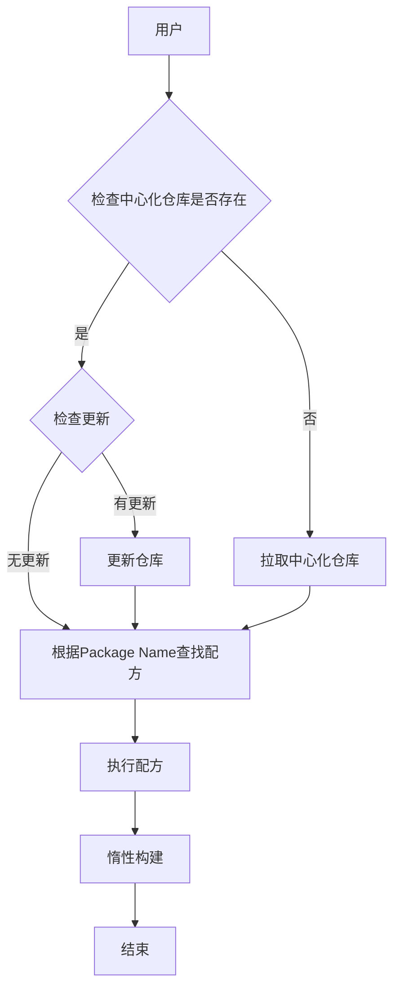

#### 获取Package版本信息
```bash
llar list <package>
```

`-json`: 以JSON格式输出(默认无格式，仅方便人类阅读和编译器处理)

输出内容：包的版本信息

例子：
```
1.7.18
1.7.17
```

JSON格式：
```json
[{
    "Version": "1.7.18"
},
{
    "Version": "1.7.17"
}]
```

#### 获取Package构建信息
```bash
llar info <PackageName>[@<PackageVersion>]
```

输出：返回 `.cache.json` 文件内容

参数：
- `-json`: 以JSON格式输出（默认格式化输出）

输出示例（格式化输出）：
```
Package: DaveGamble/cJSON
Version: 1.7.18
Matrix: x86_64-c-darwin
Build Time: 2025-01-17T10:30:00Z
Build Duration: 45.2s

Matrix Details:
  arch: x86_64
  lang: c
  os: darwin

Build Outputs:
  Dir: /Users/user/Library/Caches/.llar/formulas/DaveGamble/cJSON/build/1.7.18/x86_64-c-darwin
  LinkArgs: -L/Users/user/Library/Caches/.llar/formulas/DaveGamble/cJSON/build/1.7.18/x86_64-c-darwin/lib -lcjson -I/Users/user/Library/Caches/.llar/formulas/DaveGamble/cJSON/build/1.7.18/x86_64-c-darwin/include

Source Hash: sha256:aaaabbbbccccdddd...
Formula Hash: sha256:1111222233334444...
```

JSON格式输出（-json）：
```json
{
    "packageName": "DaveGamble/cJSON",
    "version": "1.7.18",
    "matrix": "x86_64-c-darwin",
    "matrixDetails": {
        "arch": "x86_64",
        "lang": "c",
        "os": "darwin"
    },
    "buildTime": "2025-01-17T10:30:00Z",
    "buildDuration": "45.2s",
    "outputs": {
        "dir": "/Users/user/Library/Caches/.llar/formulas/DaveGamble/cJSON/build/1.7.18/x86_64-c-darwin",
        "linkArgs": "-L/Users/user/Library/Caches/.llar/formulas/DaveGamble/cJSON/build/1.7.18/x86_64-c-darwin/lib -lcjson -I/Users/user/Library/Caches/.llar/formulas/DaveGamble/cJSON/build/1.7.18/x86_64-c-darwin/include"
    },
    "sourceHash": "sha256:aaaabbbbccccdddd...",
    "formulaHash": "sha256:1111222233334444..."
}
```

#### 依赖管理

##### 初始化Package
```bash
llar init
```

无输出

##### 为当前Package添加依赖
```bash
llar get <package>[@version]
```

缺省：latest

例子: `llar get madler/zlib@1.2.1`

##### 整理当前依赖
```bash
llar tidy
```

#### 搜索Package
用户可以通过Package Name来模糊搜索Package

```bash
llar search <keyword>
```

`-json`: 以JSON格式输出(默认无格式，仅方便人类阅读和编译器处理)

输出：
```
Dave/cJSON:
    Desc: fast cJSON
    Homepage: xxxx

John/cjson:
    Desc: ultra fast cJSON, faster than above one
    Homepage: xxxx
```

JSON格式：
```json
[{
    "PackageName": "Dave/cJSON",
    "Homepage": "xxxx"
},
{
    "PackageName": "John/cjson",
    "Homepage": "xxxx"
}]
```

## 8. 配方管理仓库设计

### 8.1 背景
LLAR需要为相关配方提供存储管理，于是我们需要为其设计一个存储的仓库

### 8.2 具体设计

我们选用了GitHub作为我们默认的中心化配方管理仓库

#### 为什么选用GitHub
1. 公开，透明
2. 自带GitHub Actions这类的检查工具，能够帮助我们做自动化检查

其目录结构如下：

```
{{owner}}/
└── {{repo}}/
    ├──  versions.json
    └── {{repo名称首字母大写}}_llar.gox
```

 `_llar.gox`, `versions.json` 为必须入库文件
`go.mod`, `go.sum` 可选，当配方需要`import`时候必须入库，没有也可以

当然，如果存在因为库版本导致配方发生变更，也可以写成这样：

```
{{owner}}/
└── {{repo}}/
    ├── 1.x/
    │   └── {{repo名称首字母大写}}_llar.gox
    └── 2.x/
        └── {{repo名称首字母大写}}_llar.gox
```

**示例：** `github.com/DaveGamble/cJSON`

对应的目录结构将是：

```
DaveGamble/
└── cJSON/
    └── CJSON_llar.gox
```

### 8.3 CI系统

#### 产品设计

##### 需求

提交侧(Pull Request)：
- 检查配方是否编写正确
    - 检查是否加载并继承`FormulaApp`
    - 检查Package Name和Package ID是否已经填写
    - 检查依赖图是否无法自动完成解决或者有构建矩阵的冲突
- 运行配方构建，得到产物后运行测试
    - 超过20种可能性就随机抽样1/10构建矩阵组合，因为如果产生大量构建矩阵组合，将无法全部测试

##### 用户故事
用户可以：
- 使用PR提交到中心化仓库

## 9. 模块划分

### 9.1 系统架构

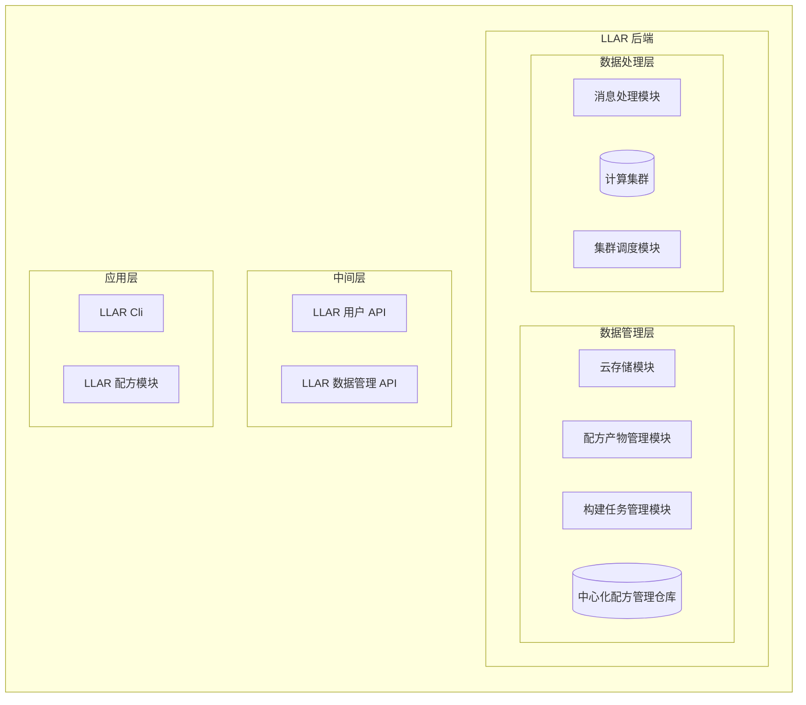

### 9.2 模块输入输出

#### 依赖管理模块
功能：
1. 增量添加依赖
2. 通过Go MVS算法计算依赖有向图
3. 解析`versions.json`

输入：`versions.json` 的`[]byte` 或者文件路径

#### LLAR Cli模块
提供用户交互界面

#### FormulaApp
提供配方执行环境

#### ixgo运行模块
功能：
1. 自动配置xgo项目（RegisterProject)
2. 根据用户需求，找到需要的配方
3. 与依赖管理模块互动
4. 根据依赖管理模块，执行构建

#### 依赖管理模块互动
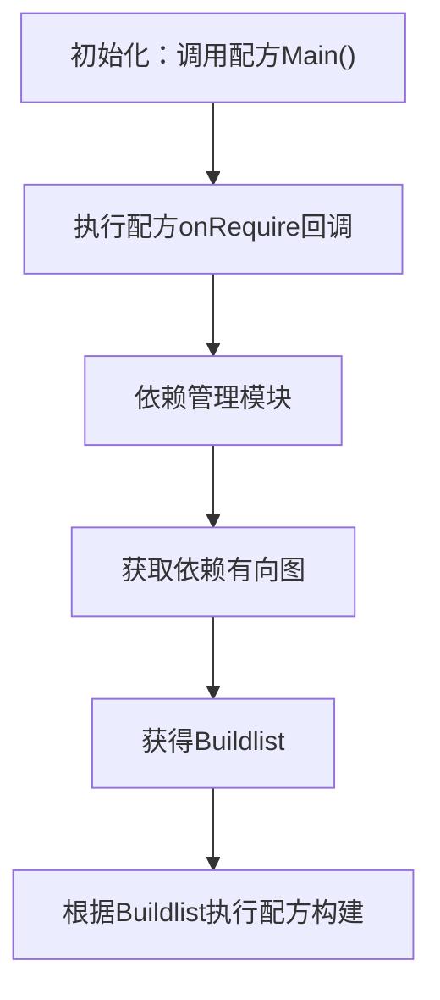

## 10. MVP实现现状

### 10.1 MVP发现的问题
基于Issue #26，MVP发现的问题：

1. ixgo export.go与源码导入混用有副作用
2. 配方如何管理（需要讨论）
3. 产物输出目录（需要讨论）
4. 由于`compare`和`onVersions`放在配方中会导致性能问题，所以单独拆分出了`_version.gox`文件（轻量级）用于版本管理
5. 产物信息传递

MVP：https://github.com/MeteorsLiu/llar-mvp
配方仓库：https://github.com/MeteorsLiu/llarformula

## 11. 业务价值与意义

### 11.1 解决的核心问题
1. **时间节约**：避免重复构建相同配置的包，大幅提升开发效率
2. **资源优化**：云端集中构建，减少本地资源消耗
3. **完整覆盖**：第一个尝试完全解决预构建产物问题的平台
4. **标准化**：提供规范化的包管理和构建方案

### 11.2 商业价值
- 为Go+/XGO生态提供完整的包管理解决方案
- 降低C/C++开发的技术门槛
- 提升跨平台开发效率
- 建立开放的包管理生态

## 12. 风险与挑战

### 12.1 技术挑战
- 大规模构建产物的云端管理和存储
- 复杂依赖关系的自动解析
- 构建环境的一致性保证
- 系统的高可用性和可扩展性

### 12.2 生态挑战
- 用户接受度和迁移成本
- 维护者社区的建设
- 与现有工具链的兼容性
- 配方质量的保证机制

---

*本文档基于LLAR项目开放issues (#9, #11, #12, #14, #15, #17, #18, #21, #22, #23, #24, #25, #26) 的完整分析整理，全面反映了LLAR的产品设计思路和发展方向。*
