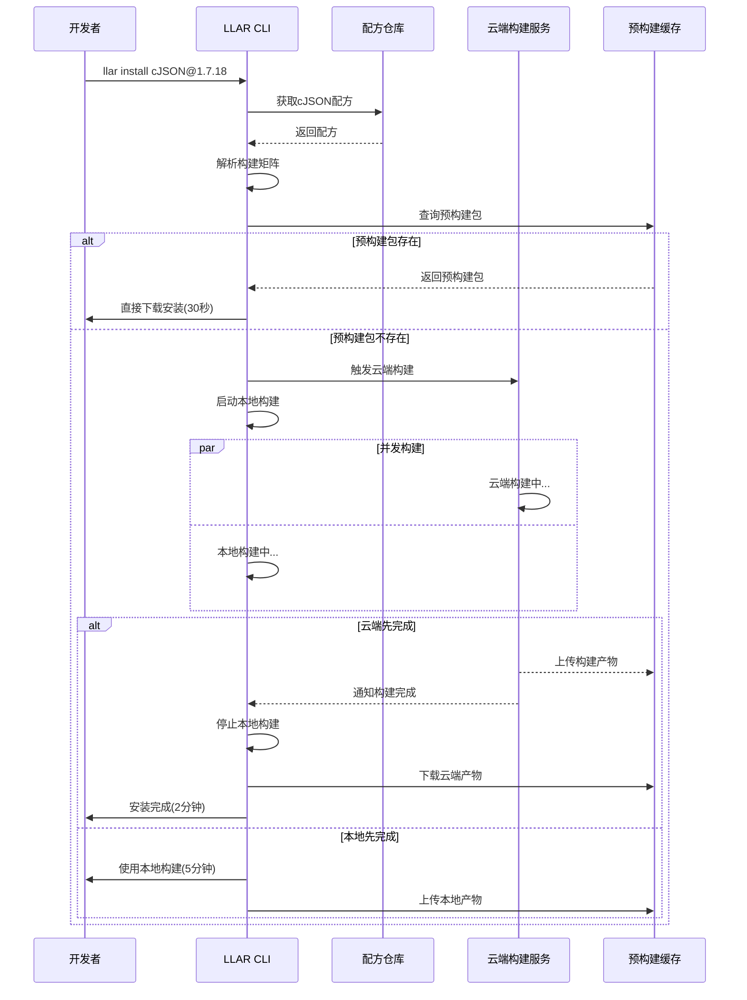
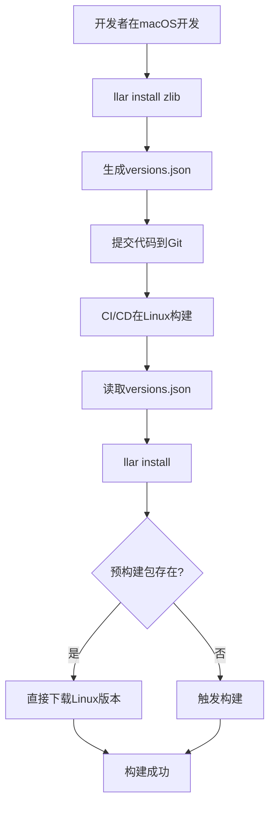
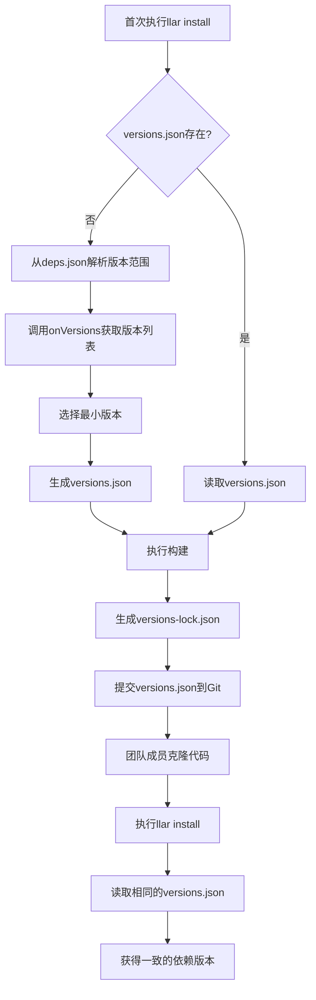
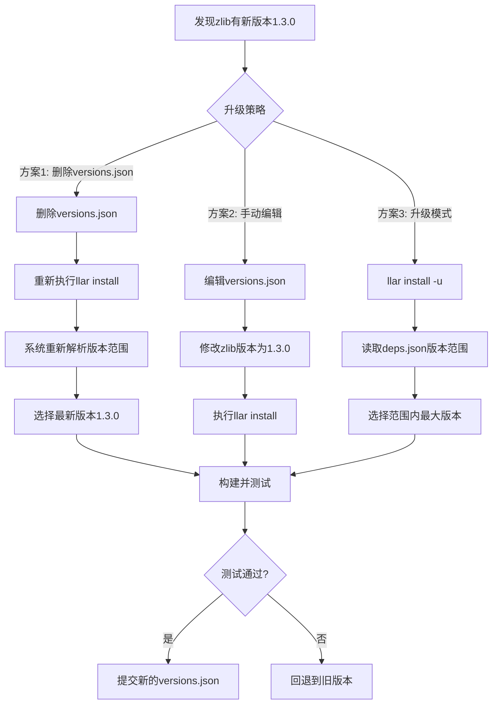
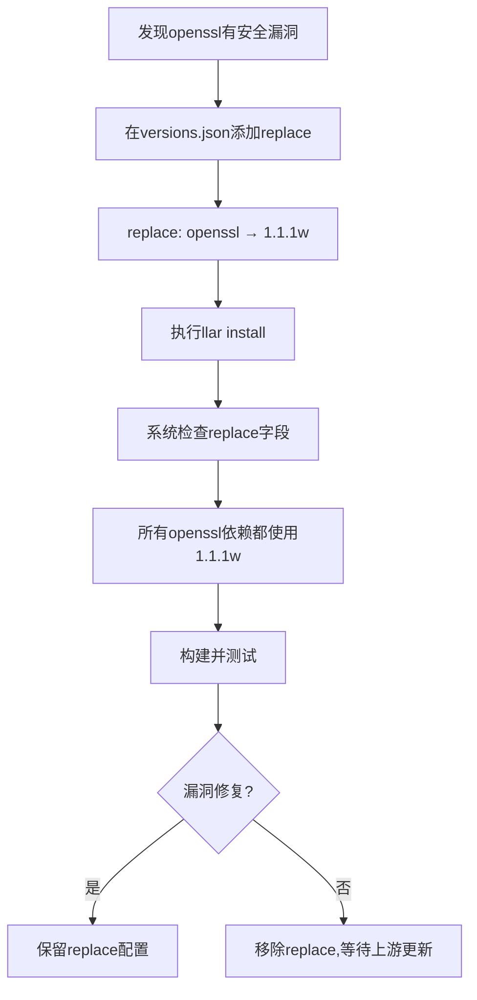
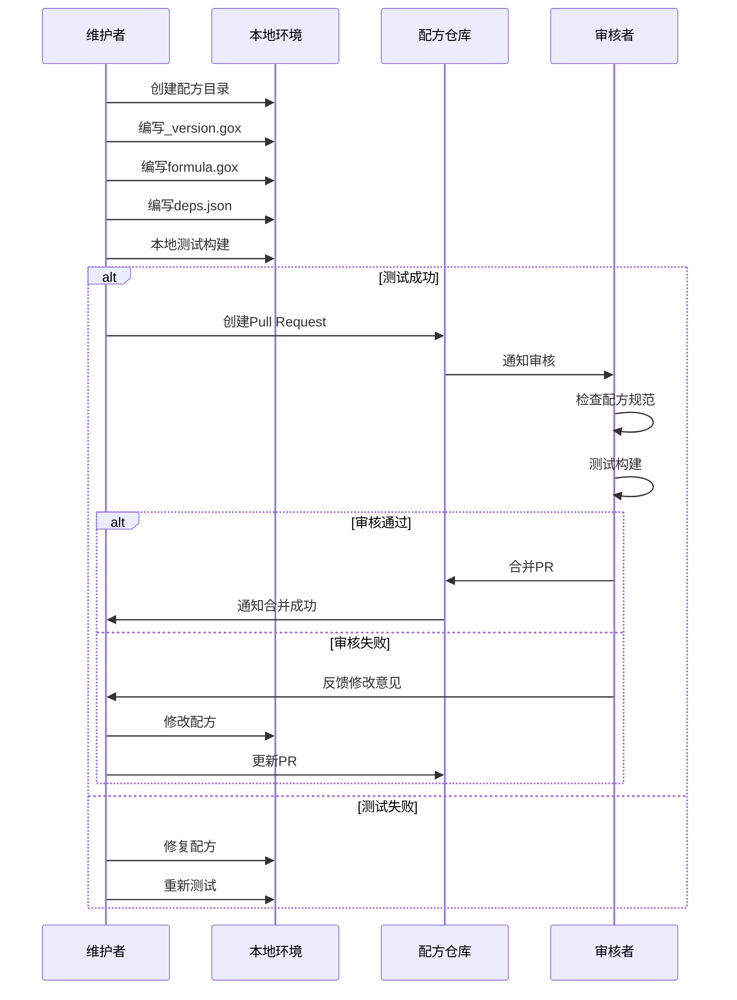
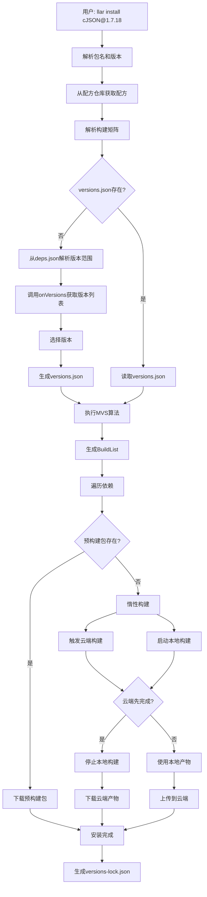
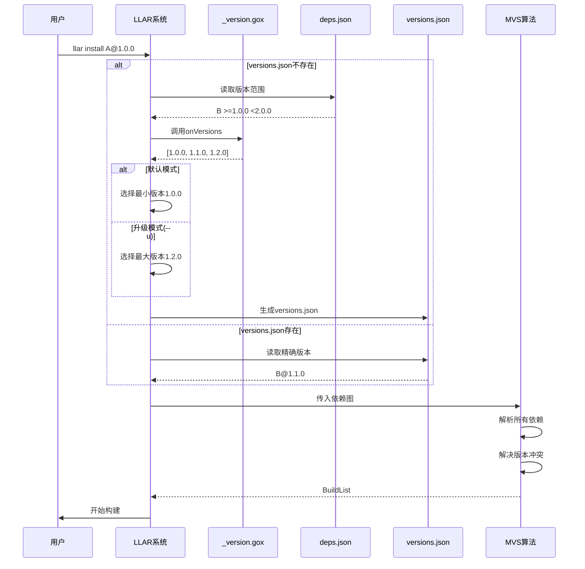
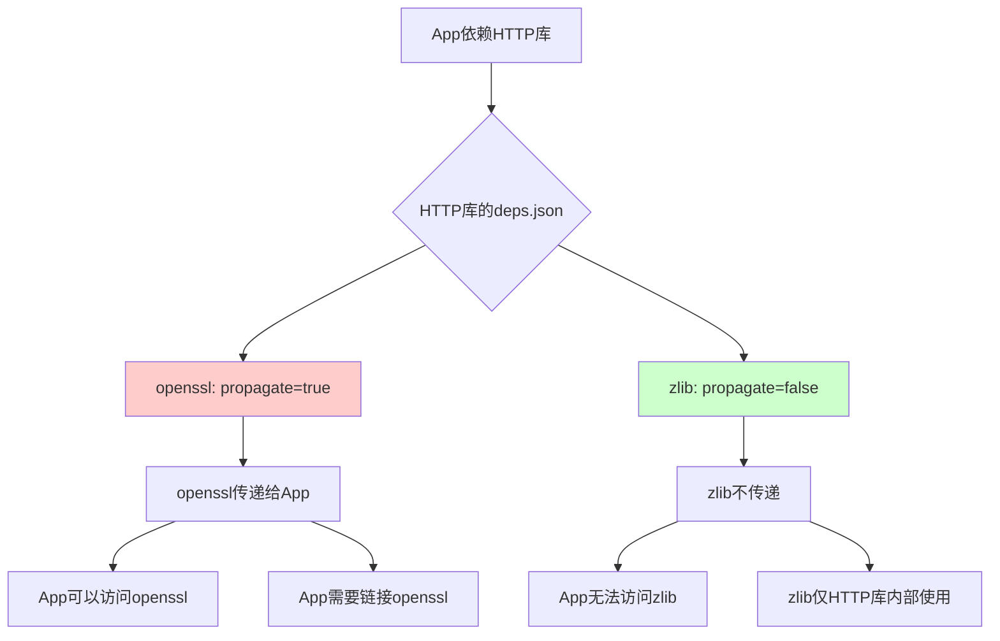
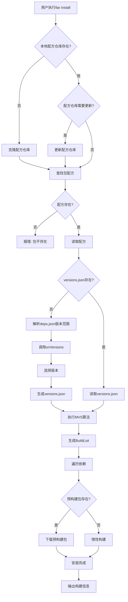

# LLAR 产品设计文档

## 1. 产品背景

### 1.1 核心问题

在模块拆分编译类语言(如C/C++、Python、WASM等)开发中,开发者经常遇到以下问题:

**问题场景**:
- 不同的库或Module存在大量可选编译配置,以及有大量编译组合
- 通常更换一个配置或者换个构建平台,开发者需要重头把这些库构建一遍
- 这样重复的构建往往是没有意义的,相当浪费时间

**现有解决方案的不足**:

为了节约时间,许多包管理器提出了"预构建"包选项,例如Homebrew、Conan、APT等。

然而这些包管理器为了节省空间,往往不对所有可能的选项进行构建,用户仍需本地构建。这导致:
- 多数情况下,"通用"的预构建产物无法满足用户需求
- 用户反复构建相同产物,极其浪费时间

**问题普遍性**:

不只有C/C++存在这类问题,Python、WASM等模块拆分编译类语言也有对应的问题。

### 1.2 设计目标与定位

**LLAR的设计出发点**:

现有工具的定位局限:
- **Conan/Xmake**: 关注C/C++生态编译,虽然Conan尝试做预构建与编译的平衡,但其定位是构建工具而非预构建资产管理,导致预构建管理不够完整。Xmake的Xrepo更多是扩展,而非核心关注点
- **Homebrew/APT**: 目标仅仅是提供能用的预构建包,缺乏完整的资产管理方案
- **winget**: 微软官方的Windows包管理器,聚焦于Windows生态的应用分发,主要通过manifest文件管理预构建包,但同样面临构建配置覆盖不全的问题
- **Nix**: 函数式包管理器,强调可重现构建和多版本共存。虽然Nix在可重现性方面做得很好,但其学习曲线陡峭(需要学习Nix表达式语言),且构建仍需本地执行,没有解决重复构建浪费时间的问题

**核心洞察**:

从编译构建工具来说,已经有太多成熟的工具(GNU工具链、Ninja、CMake等),没有必要再造轮子。Conan的成功正是因为它不仅是构建工具,更重要的是提供了成熟的资产管理方案。

**产品定位**:

LLAR致力于创造一款既有完整预构建资产管理方案(为预构建包提供在线编译管理需求),又能提供便捷编译配置的包管理工具。追求资产管理与编译配置的平衡。

**相比现有包管理器的核心差异化**:

1. **自动解决依赖冲突** - 借鉴Go的依赖管理哲学
   - 行业痛点: Conan/pip遇到版本冲突报错,要求用户手动override; Nix学习曲线陡峭
   - LLAR方案: 采用Go的MVS算法,自动计算满足所有约束的版本组合,用户无需干预
   - 用户价值: 告别"依赖地狱",执行 `llar install` 即可,像Go一样简单可靠

2. **惰性构建机制** - 云端和本地并发,谁快用谁
   - 行业痛点: Conan/Nix缺包时只能本地构建等待; Homebrew/APT覆盖配置有限
   - LLAR方案: 云端和本地同时构建,云端完成则停止本地; 智能缓存高频配置
   - 用户价值: 首次可能需要等待,但构建产物全网共享,不重复浪费时间

3. **跨语言统一管理** - 不局限于单一语言生态
   - 行业痛点: Conan服务C/C++,pip服务Python,cargo服务Rust,工具割裂混乱
   - LLAR方案: 设计之初支持C/C++、Python、WASM等模块拆分编译类语言
   - 用户价值: 一套工具管理所有依赖,versions.json统一记录,告别工具切换

4. **版本管理三层分离** - 职责清晰可控
   - 行业痛点: Conan的conanfile.py和conan.lock职责混杂; npm的package.json缺少配方层
   - LLAR方案: deps.json(配方约束) → versions.json(用户决策) → versions-lock.json(构建锁定)
   - 用户价值: 每层职责明确,replace机制简单清晰,用户可控性强

5. **配方智能化** - 降低维护成本,加速生态建设
   - 行业痛点: Conan/Homebrew配方需手动维护依赖,上游变化需人工同步
   - LLAR方案: onRequire自动从CMakeLists.txt等构建文件提取依赖
   - 维护者价值: 配方维护成本低,社区贡献门槛低,生态建设速度快

**技术实现方案**:

上述用户价值通过完善的资产管理方案实现,包含五大核心模块:

1. **依赖管理**: MVS算法自动解决冲突,propagate控制依赖传递
2. **版本管理**: 三层架构(deps.json → versions.json → versions-lock.json)
3. **配方管理**: 中心化仓库,onRequire自动提取依赖
4. **预构建产物管理**: 惰性构建,智能缓存
5. **构建矩阵管理**: Pairwise Testing优化组合爆炸

**设计目标**:
1. **用户侧**: 自动解决依赖冲突,提供开箱即用的包安装体验
2. **维护者侧**: 通过自动化(onRequire)减少配方维护成本,降低社区贡献门槛
3. **系统侧**: 在成本可控的前提下,通过智能缓存策略最大化资源利用效率

## 2. 基本概念

### 2.1 包 (Package)

LLAR中一个独立的库单位称之为包。一个包包含以下部分:

1. **构建信息**: 如何构建这个包
2. **版本信息**: 包的版本管理

构建信息包含:
- 构建配方 (Formula)
- 构建矩阵 (Matrix)

### 2.2 构建配方 (Formula)

构建配方用于告诉构建者该包如何完成构建。

配方使用XGO编写,包含以下回调函数:
- **onVersions**: 从上游获取版本列表
- **onSource**: 下载源码
- **onRequire**: 解析依赖关系(可选)
- **onBuild**: 执行构建

### 2.3 构建矩阵 (Matrix)

一个包可能只有一种配方,但因为外部需求的变化会导致多种产物。构建矩阵用于表达这类变化。

**示例**: 同一个包在不同平台、不同配置下会产生不同的构建产物:
- `x86_64-c-darwin` (macOS x86_64 + C语言)
- `arm64-c-linux` (Linux ARM64 + C语言)
- `x86_64-cpp-windows` (Windows x86_64 + C++)

构建矩阵 = require字段 × options字段的笛卡尔积

### 2.4 惰性构建 (Lazy Build)

由于一个包存在巨额构建产物,不可能一次性完成所有构建产物的构建。

**惰性构建机制**:
- 当预构建包不存在时,云端和本地并发构建
- 谁先完成就用谁的结果
- 构建完成后上传到云端,全网共享

**与传统方案的区别**:
- 传统方案: 预构建包缺失 → 用户本地构建
- LLAR方案: 预构建包缺失 → 云端和本地并发构建 → 云端缓存

### 2.5 中心化配方管理仓库 (Formula Repository)

配方仓库用于存放和管理构建配方,一般基于GitHub等git平台。

**特点**:
- 配方维护者通过Pull Request提交和更新配方
- 社区审核机制保证配方质量
- 配方通过git管理版本

### 2.6 版本管理文件

**三层架构**:

1. **deps.json** (配方仓库)
   - 位置: 配方仓库,与配方代码一起
   - 维护: 配方维护者
   - 内容: 版本范围约束(如 `>=1.2.0 <2.0.0`)

2. **versions.json** (用户项目)
   - 位置: 用户本地,不上传
   - 维护: 用户 + MVS算法
   - 内容: 精确版本 + replace配置

3. **versions-lock.json** (构建锁定)
   - 位置: 用户本地,不上传
   - 维护: 系统自动生成
   - 内容: 精确版本 + Hash(确保可重现)

## 3. 用户画像

### 3.1 核心用户: 模块拆分编译类语言开发者

**典型用户**: C/C++开发者、Python开发者、WASM开发者等

**用户特征**:
- 项目依赖多个第三方库,构建配置复杂
- 对编译/构建速度有强烈诉求
- 经常面临跨平台构建需求
- 不同构建配置产生大量构建组合

**核心痛点**:
- 从源码构建第三方库耗时长,严重影响开发效率
- 更换一个配置或平台,就需要重新构建所有依赖
- 包管理工具的预构建包经常缺失(如macOS x86_64等小众平台)
- 依赖版本管理复杂,容易产生版本冲突
- 重复构建相同产物,浪费大量时间和资源

### 3.2 次要用户: 配方维护者

**特征**:
- 熟悉特定开源库的构建过程
- 愿意为社区贡献
- 需要维护多个库版本的配方

**痛点**:
- 每次上游发布新版本都需要更新配方
- 依赖版本变化频繁,维护成本高
- 难以跟踪上游构建系统的变化

## 4. 核心用户故事

### 4.1 开发者: 快速安装依赖包

**作为** 开发者
**我希望** 快速安装项目需要的依赖包
**以便** 节省构建时间,专注于业务开发

**用户操作流程**:



**验收标准**:
- 如果预构建包存在,30秒内完成安装
- 如果预构建包不存在,云端和本地并发构建
- 云端构建完成后,自动停止本地构建并下载
- 本地构建完成后,将产物上传到云端缓存

### 3.2 开发者: 跨平台构建

**作为** 开发者
**我希望** 在不同平台(Linux/macOS/Windows)使用相同的依赖配置
**以便** 简化跨平台开发流程

**用户操作流程**:



**验收标准**:
- versions.json跨平台共享(不包含平台特定信息)
- LLAR自动根据当前平台选择对应预构建包
- 相同配置在不同平台产生一致的依赖树

### 3.3 开发者: 管理依赖版本

**作为** 开发者
**我希望** 能够锁定依赖版本,确保团队成员构建一致
**以便** 避免"在我机器上能跑"的问题

**用户操作流程**:



**验收标准**:
- 首次构建自动生成versions.json
- versions.json记录确切依赖版本
- versions-lock.json记录精确版本+Hash
- 团队成员使用相同versions.json获得一致构建

### 3.4 开发者: 升级依赖

**作为** 开发者
**我希望** 能够安全地升级依赖到新版本
**以便** 获取上游的bug修复和新功能

**用户操作流程**:



**验收标准**:
- 支持删除versions.json重新生成
- 支持手动编辑versions.json指定版本
- 支持`-u`参数升级到最新版本
- 升级后自动更新versions-lock.json

### 3.5 开发者: 替换依赖版本(replace)

**作为** 开发者
**我希望** 能够强制替换某个依赖的版本
**以便** 快速验证bug修复或使用fork版本

**用户操作流程**:



**验收标准**:
- 支持在versions.json顶层添加replace字段
- replace优先级最高,覆盖所有版本选择
- 构建时使用replace指定的版本
- versions-lock.json记录实际使用的版本(replace后)

### 3.6 配方维护者: 提交新配方

**作为** 配方维护者
**我希望** 能够为新库提交配方
**以便** 让社区用户使用该库

**用户操作流程**:



**验收标准**:
- 配方目录结构符合规范
- _version.gox实现onVersions回调
- formula.gox实现必要的构建回调
- deps.json定义依赖关系
- 本地测试构建成功
- 通过PR审核

### 3.7 配方维护者: 使用版本范围减少维护

**作为** 配方维护者
**我希望** 在deps.json中使用版本范围而非固定版本
**以便** 减少配方更新频率,让系统自动选择最新兼容版本

**场景对比**:

**旧方式(固定版本)**:
```json
{
    "name": "cJSON",
    "deps": {
        "1.7.18": [{
            "name": "zlib",
            "version": "1.2.13"
        }]
    }
}
```
- 问题: zlib发布1.2.14时,必须手动更新配方
- 维护成本: 高

**新方式(版本范围)**:
```json
{
    "name": "cJSON",
    "deps": {
        "1.7.18": [{
            "name": "zlib",
            "version": ">=1.2.3 <2.0.0"
        }]
    }
}
```
- 优势: zlib发布1.2.14时,系统自动使用新版本
- 维护成本: 低

**验收标准**:
- 支持版本范围语法(>=, <, 空格分隔)
- 系统调用onVersions获取可用版本
- 默认选择范围内最小版本
- -u模式选择范围内最大版本

### 3.8 配方维护者: 使用onRequire自动解析依赖

**作为** 配方维护者
**我希望** 实现onRequire回调从构建系统自动解析依赖
**以便** 自动跟踪上游依赖变化,无需手动维护deps.json

**场景: Ninja构建工具**

Ninja的CMakeLists.txt:
```cmake
find_package(re2c 2.0 REQUIRED)
```

**方案1: 手动维护deps.json**
```json
{
    "name": "ninja",
    "deps": {
        "1.11.0": [{
            "name": "re2c",
            "version": ">=2.0 <4.0"
        }]
    }
}
```
- 问题: 上游修改版本要求时,需要手动更新

**方案2: onRequire自动解析**
```go
onRequire deps => {
    cmake := readFile("CMakeLists.txt")?
    if cmake.contains("find_package(re2c 2.0") {
        packageName := resolve("re2c")  // "skvadrik/re2c"
        version := versionsOf(packageName).filter(">=2.0").min
        deps.require("ninja", [{
            name: packageName,
            version: version
        }])
    }
}
```
- 优势: 自动跟踪上游CMakeLists.txt变化

**验收标准**:
- onRequire可以读取构建系统文件
- 通过resolve()解析库名为packageName
- 通过versionsOf()获取版本列表
- 通过filter()过滤版本范围
- 通过deps.require()填入依赖图

## 5. 核心功能流程

### 5.1 包安装流程



### 5.2 版本解析流程



### 5.3 依赖传递流程(propagate)



**propagate使用场景**:

| 场景 | propagate | 原因 |
|------|-----------|------|
| HTTP库头文件使用SSL*类型 | true | 下游编译需要openssl头文件 |
| 图像库内部静态链接zlib | false | zlib已打包进库文件 |
| 模板库使用Boost | true | 下游编译需要Boost模板定义 |
| 插件动态加载 | false | 运行时加载,编译时无需依赖 |

## 6. LLAR CLI设计

### 6.1 核心命令

#### llar install - 安装包

**作为** 开发者
**我希望** 通过一条命令安装依赖包
**以便** 快速获取包及其构建信息

```bash
llar install <package>[@version]
```

**参数**:
- `-s` / `--source`: 仅获取源码,不需要二进制包
- `-a` / `--all`: 同时获取源码和二进制包
- `-u` / `--upgrade`: 升级模式,选择版本范围内最大版本
- `--json`: 以JSON格式输出构建信息

**输出**: 包的构建信息(编译参数)

示例:
```bash
# 安装最新版本
llar install DaveGamble/cJSON

# 安装指定版本
llar install DaveGamble/cJSON@1.7.18

# 升级模式
llar install DaveGamble/cJSON -u
```

输出示例:
```
-lcjson -L/Users/user/.llar/packages/DaveGamble/cJSON/1.7.18/lib -I/Users/user/.llar/packages/DaveGamble/cJSON/1.7.18/include
```

JSON格式:
```json
{
    "LDFlags": "-L/Users/user/.llar/packages/DaveGamble/cJSON/1.7.18/lib -lcjson",
    "CFlags": "-I/Users/user/.llar/packages/DaveGamble/cJSON/1.7.18/include"
}
```

#### llar info - 查看包信息

**作为** 开发者
**我希望** 查看包的详细构建信息
**以便** 了解包的版本、依赖、构建配置

```bash
llar info <package>[@version]
```

**参数**:
- `--json`: 以JSON格式输出

**输出**: 包的详细信息(.cache.json内容)

示例:
```bash
llar info DaveGamble/cJSON@1.7.18
```

输出示例:
```
Package: DaveGamble/cJSON
Version: 1.7.18
Matrix: x86_64-c-darwin
Build Time: 2025-01-17T10:30:00Z
Build Duration: 45.2s

Matrix Details:
  arch: x86_64
  lang: c
  os: darwin

Build Outputs:
  Dir: /Users/user/.llar/packages/DaveGamble/cJSON/1.7.18/x86_64-c-darwin
  LinkArgs: -L.../lib -lcjson -I.../include

Dependencies:
  - madler/zlib@1.2.13

Source Hash: sha256:aaaabbbbccccdddd...
Formula Hash: sha256:1111222233334444...
```

#### llar list - 列出可用版本

**作为** 开发者
**我希望** 查看包的所有可用版本
**以便** 选择合适的版本安装

```bash
llar list <package>
```

**参数**:
- `--json`: 以JSON格式输出

**输出**: 版本列表(按时间倒序)

示例:
```bash
llar list DaveGamble/cJSON
```

输出示例:
```
1.7.18
1.7.17
1.7.16
...
```

#### llar search - 搜索包

**作为** 开发者
**我希望** 通过关键词搜索包
**以便** 找到需要的库

```bash
llar search <keyword>
```

**参数**:
- `--json`: 以JSON格式输出

**输出**: 匹配的包列表

示例:
```bash
llar search json
```

输出示例:
```
DaveGamble/cJSON - Ultralightweight JSON parser in ANSI C
nlohmann/json - JSON for Modern C++
```

### 6.2 依赖管理命令

#### llar init - 初始化项目

**作为** 开发者
**我希望** 初始化LLAR项目配置
**以便** 开始管理依赖

```bash
llar init
```

**功能**: 创建versions.json文件

#### llar get - 添加依赖

**作为** 开发者
**我希望** 添加依赖到项目
**以便** 管理项目的所有依赖

```bash
llar get <package>[@version]
```

**功能**: 将依赖添加到versions.json并安装

示例:
```bash
llar get madler/zlib@1.2.13
```

#### llar tidy - 整理依赖

**作为** 开发者
**我希望** 清理未使用的依赖
**以便** 保持依赖配置整洁

```bash
llar tidy
```

**功能**: 移除versions.json中未使用的依赖

### 6.3 CLI操作流程



## 7. 功能优先级

### 7.1 MVP功能(P0)

**必须具备的核心功能**:

1. **基础包管理**
   - llar install: 安装包
   - llar info: 查看包信息
   - 从配方仓库获取配方
   - 解析构建矩阵

2. **版本管理**
   - versions.json: 依赖版本管理
   - versions-lock.json: 构建锁定
   - _version.gox: onVersions回调
   - 版本范围语法(>=, <)

3. **惰性构建**
   - 查询预构建包
   - 云端和本地并发构建
   - 构建产物缓存

4. **依赖解析**
   - deps.json: 依赖声明
   - MVS算法: 依赖解析
   - BuildList生成

### 7.2 重要功能(P1)

**显著提升体验,但非必须**:

1. **高级版本管理**
   - replace功能
   - 自定义compare回调
   - -u升级模式

2. **高级依赖管理**
   - onRequire回调(自动解析依赖)
   - propagate字段(依赖传递)
   - fromVersion机制(多版本配方)

3. **用户体验优化**
   - 构建进度显示
   - 缓存命中率统计
   - 错误提示优化

### 7.3 未来规划(P2)

**长期价值,暂不实现**:

1. **多语言支持**
   - Python包管理
   - WASM包管理

2. **高级功能**
   - 配方测试框架
   - Pairwise Testing自动化
   - 构建性能分析

3. **生态建设**
   - 配方市场
   - 贡献者激励
   - 使用统计分析

## 8. 业务价值

### 8.1 对开发者的价值

1. **节省时间**: 通过预构建包和惰性构建,大幅减少重复构建时间
2. **简化管理**: 统一的版本管理机制,避免依赖冲突
3. **提升体验**: 跨平台一致的包管理体验

### 8.2 对维护者的价值

1. **降低成本**: 版本范围和onRequire减少手动维护
2. **标准化**: 统一的配方格式,降低学习成本
3. **社区驱动**: 通过PR机制,共同维护配方仓库

### 8.3 对生态的价值

1. **资源共享**: 云端缓存减少重复构建,节省整体资源
2. **加速创新**: 降低包管理门槛,促进C/C++生态发展
3. **最佳实践**: 推广依赖管理最佳实践

## 9. 风险与挑战

### 9.1 技术风险

**风险1: 云端存储成本**
- 描述: 大量构建产物需要巨额存储空间
- 缓解: 使用对象存储+CDN,按需加载,冷数据归档

**风险2: 构建时间不可控**
- 描述: 复杂包的云端构建可能超时
- 缓解: 设置构建超时时间,优先使用本地构建结果

**风险3: 版本冲突**
- 描述: MVS算法可能选择不兼容的版本组合
- 缓解: 提供replace机制,允许用户手动覆盖

### 9.2 运营风险

**风险1: 配方质量参差不齐**
- 描述: 社区贡献的配方可能不规范
- 缓解: PR审核机制,自动化测试,贡献者指南

**风险2: 用户接受度**
- 描述: 用户习惯现有工具,迁移成本高
- 缓解: 提供迁移工具,与现有工具兼容,完善文档

**风险3: 社区维护可持续性**
- 描述: 配方仓库维护需要持续投入
- 缓解: 建立核心维护团队,激励贡献者,自动化维护任务

## 10. 成功指标

### 10.1 用户侧指标

- **安装时间**: 90%的包在2分钟内完成安装
- **缓存命中率**: 预构建包缓存命中率达到70%
- **用户留存**: 月活用户数持续增长

### 10.2 生态侧指标

- **配方数量**: 首年达到100+核心库配方
- **贡献者数量**: 活跃贡献者达到50+
- **社区活跃度**: 每月新增PR 20+

### 10.3 技术侧指标

- **云端构建成功率**: >95%
- **系统可用性**: >99.9%
- **平均响应时间**: <500ms

## 11. 附录: 相关文档

- [版本管理用户故事](version-management-user-stories.md)
- [配方设计](formulas.md)
- [构建矩阵设计](matrix.md)
- [版本范围设计](version-range-design.md)
- [MVS算法设计](mvs-algorithm-design.md)
- [版本管理概览](version-management-overview.md)
