# LLAR 技术设计文档（完整版）

## 1. 系统整体架构

### 1.1 四模块工厂架构设计

LLAR采用工厂模式的四模块架构，由Engine作为总控制器统筹协调，三个功能模块分别负责配方管理、依赖解析和构建执行。

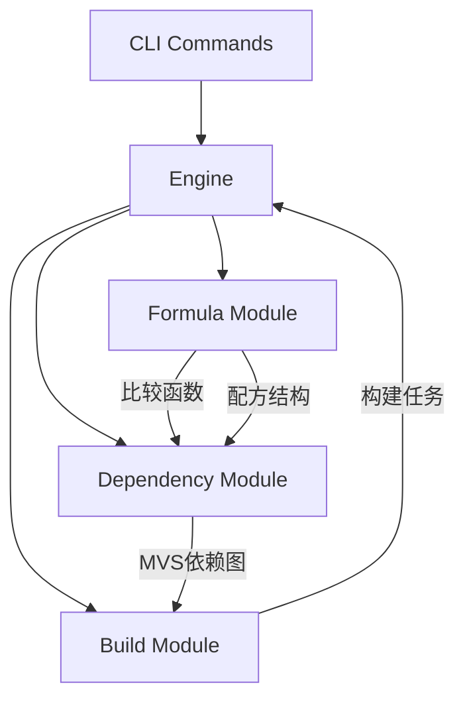

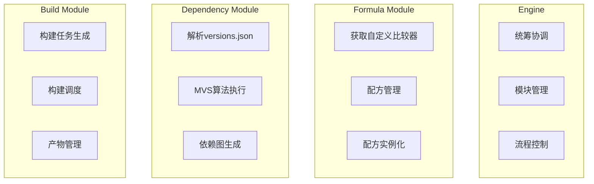

### 1.2 模块职责定义

**Engine（工厂模块）**
- 作为总控制器，负责统筹协调各模块
- 管理模块间的依赖关系和数据传递
- 控制整体构建流程和生命周期管理
- 提供统一的外部接口

**Formula Module（配方模块）**
- **功能1**: 获取自定义比较方式
  - 输入: PackageName
  - 输出: 版本比较函数
- **功能2**: 配方管理
  - 输入: PackageName + PackageVersion
  - 输出: 配方结构（含配方实例和方法）

**Dependency Module（依赖管理模块）**
- 输入: versions.json文件 + 比较函数
- 输出: MVS依赖图（Buildlist, Require）
- 实现Go MVS算法进行依赖解析

**Build Module（构建模块）**
- 输入: MVS依赖图
- 输出: 构建任务
- 负责构建任务的生成、调度和执行

### 1.3 模块依赖关系

```
Build Module --> Dependency Module --> Formula Module
        ↑                                    ↑
        └──────────────── Engine ────────────┘
```

### 1.4 核心接口设计

#### Engine
```go
type Engine interface {
    Initialize() error
    Build(packageName string, version string) (BuildResult, error)
    Shutdown() error

    Formula() Formula
    Dependency() Dependency
    Builder() Builder
}
```

#### Formula Module
```go
type Formula interface {
    // 获取自定义比较方式
    ComparatorOf(packageName string) (VersionComparator, error)

    // 配方管理
    Load(packageName string, version string) (FormulaStruct, error)
}

type FormulaStruct struct {
    Instance    FormulaPackage
    Metadata    FormulaMetadata
}

type VersionComparator func(v1, v2 string) int
```

#### Dependency Module
```go
type Dependency interface {
    // 输入: versions.json + 比较函数，输出: MVS依赖图
    Resolve(versionsFile string, comparators map[string]VersionComparator) (Graph, error)

    // MVS核心方法
    BuildList(target PackageVersion) ([]PackageVersion, error)
    Require(pkg PackageVersion) ([]PackageVersion, error)
}

type Graph struct {
    BuildList   []PackageVersion
    RequireMap  map[string][]PackageVersion
    Dependencies DependencyGraph
}
```

#### Build Module
```go
type Builder interface {
    // 输入: MVS依赖图，输出: 构建任务
    Plan(graph Graph) ([]Task, error)
    Execute(tasks []Task) (BuildResult, error)
}

type Task struct {
    Package     PackageVersion
    Formula     FormulaStruct
    Dependencies []PackageVersion
    BuildFunc   func() (BuildArtifact, error)
}
```

### 1.5 数据流向

1. CLI → Engine: 触发Build()
2. Engine → Formula: 获取比较器和配方结构
3. Engine → Dependency: 传入versions.json和比较器，获取MVS依赖图
4. Engine → Builder: 传入依赖图，生成构建任务
5. Engine → Builder: 执行构建任务，返回结果

## 2. 核心概念与数据结构

### 2.1 核心数据结构定义

#### PackageVersion
```go
type PackageVersion struct {
    PackageName string  // 包名，格式：owner/repo
    Version     string  // 版本号
}
```

表示一个特定版本的包，是LLAR系统中最基本的标识单位。

#### BuildResult
```go
type BuildResult struct {
    Artifact    *Artifact       // 构建产物
    Duration    time.Duration   // 构建耗时
    CacheHit    bool           // 是否命中缓存
    Error       error          // 构建错误
}
```

表示一次构建的完整结果，包含产物信息和构建元数据。

#### DependencyGraph


表示包之间的依赖关系图，用于拓扑排序和构建顺序确定。

### 2.2 模块间数据传递

#### Engine → Formula
- **输入**: PackageName
- **输出**: VersionComparator, FormulaStruct

#### Formula → Dependency
- **输入**: map[string]VersionComparator (所有包的比较器)
- **输出**: 无直接返回，比较器被Dependency模块使用

#### Dependency → Builder
- **输入**: Graph (MVS依赖图)
- **输出**: 无直接返回，依赖图被Builder使用

#### Builder → Engine
- **输入**: []Task (构建任务列表)
- **输出**: BuildResult

### 2.3 执行流程时序

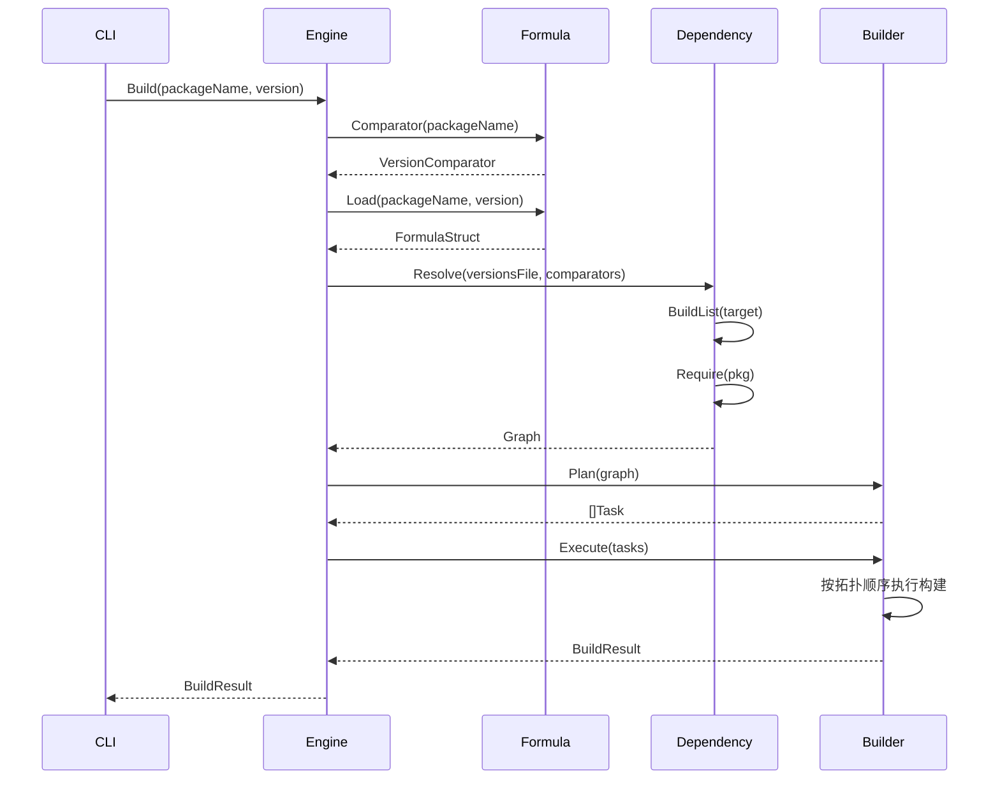

### 2.4 错误处理策略

#### 错误类型分类
1. **配方错误**: 配方文件不存在、解析失败、版本不匹配
2. **依赖错误**: 依赖循环、版本冲突无法解决、依赖包不存在
3. **构建错误**: 源码下载失败、编译失败、Hash校验失败
4. **系统错误**: 磁盘空间不足、网络错误、权限不足

#### 错误传递原则
- 各模块返回标准的Go error类型
- Engine层统一处理和格式化错误信息给用户

#### 错误恢复机制
- 构建失败自动重试（最多3次）
- 网络错误指数退避重试
- 部分依赖失败不影响其他独立分支

## 3. 配方系统设计

### 3.1 FormulaApp基础设计

#### 基类定义
```go
type FormulaApp struct {
    gsh.App
}

type FormulaPackage interface {
    // FormulaApp基类实现

    // 返回当前配方所在目录
    Dir() fs.FS

    // 上一个产物信息
    LastArtifact() *Artifact

    // 返回当前PackageName
    PackageName__0() string

    // 必填，声明当前LLAR Package Name，格式为：owner/repo
    PackageName__1(name string)

    // 返回当前描述
    Desc__0() string

    // 可选，添加Package Homepage页面
    Desc__1(desc string)

    // 返回当前Package Homepage URL
    Homepage__0() string

    // 可选，添加Package Homepage URL
    Homepage__1(homepage string)

    // 返回当前Package的构建矩阵
    Matrix__0() matrix.Matrix

    // 声明Package的构建矩阵
    Matrix__1(mrx matrix.Matrix)

    // 返回当前Package的版本
    Version() version.Version

    // 声明该Formula能够处理的起始版本号
    FromVersion(v string)

    OnRequire(fn func(deps.Graph))

    // 声明构建
    OnBuild(fn func() (*Artifact, error))

    // 提供该Package源码下载方法，并要求维护者实现相关源码验证逻辑
    OnSource(fn func(ver version.Version) (sourceDir string, err error))

    // 当前配方所有版本
    OnVersions(fn func() []version.Version)
}
```

#### 为什么选择XGO Classfile？

因为`XGO Classfile`具有一切构建脚本需要的东西：

1. **系统命令调用**: `XGO Classfile` GSH提供了调用Bash命令来完成编译和IO操作的功能
2. **抽象机制**: `XGO Classfile` 基本上每个文件都是建立在抽象之上的，对于一般的抽象机制非常便捷
3. **语法简单**: `XGO Classfile` 提供了极其丰富的builtin函数和极其简单语法集
4. **低心智负担**: 提供抽象和低开发心智均衡，特别的错误处理机制解决Go的 `if err != nil` 问题
5. **后端切换**: 提供便捷后端切换机制，允许引入`LLGo`进行跨语言处理

### 2.2 配方示例

#### 单个Package例子

`CJSON_llar.gox` (DaveGamble/cJSON):
```javascript
// 声明相关信息

// 当前配方仅兼容1.0.0后的版本
fromVersion "1.0.0";

// 当前Package Name
packageName "DaveGamble/cJSON";

// Package 描述
desc "Ultralightweight JSON parser in ANSI C";

// Package 主页
homepage "https://github.com/DaveGamble/cJSON";

matrix {
    Require: {
        "os": ["linux", "darwin"],
        "arch": ["amd64", "arm64"]
    },
    Options: {
        "zlib": ["zlibON", "zlibOFF"]
    }
}

onBuild => {
    args := []

    if matrix["toolchain"].contains "clang" {
        args <- "-DTOOLCHAIN=clang";
    }

    args <- ".";

    cmake args
    cmake "--build" ".";

    return {
        Info: {
            BuildResults: [
                {LDFlags, "/xxx/cjson.so"},
                {Custom, "-Map t.map"},
            ]
        }
    }, nil
}

onSource ver => {
    sourceDir := download("https://github.com/DaveGamble/cJSON/releases/tag/v${ver.Version}")!

    err := hashDirAndCompare(sourceDir, "aaaabbbbccccddddeee")

    return sourceDir, err
}

onVersions => {
    tags := fetchTagsFromGitHub("DaveGamble/cJSON")!
    return githubTagsToVersion("v1", tags)
}
```

### 2.3 配方调用机制

#### 依赖调用流程

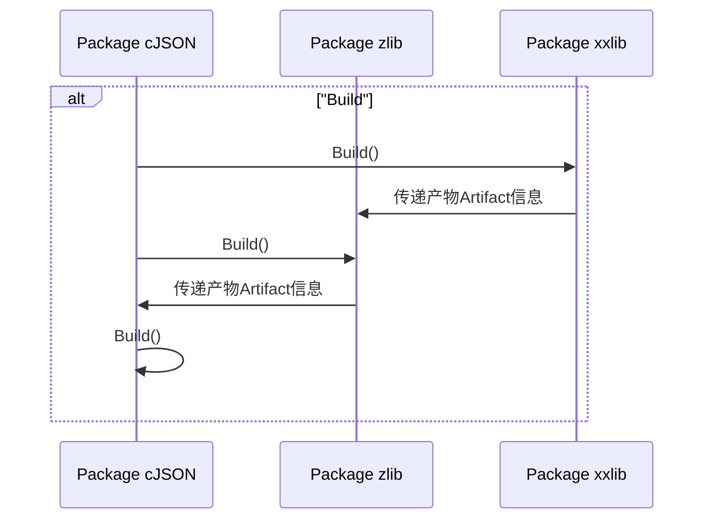

### 2.4 构建输出与产物传递

#### 构建输出结构
一般C/C++语言输出：
```
project/
├── include/         // 头文件
├── lib/         // 库文件
│   └── pkgconfig/         // PC文件
└── bin/         // 可执行二进制（可选）
```

#### 产物传递设计

**BasicFormula 接口定义**：
```go
type BasicFormula interface {
    // 返回当前PackageName
    PackageName__0() string
    // 声明当前LLAR Package Name，格式为：owner/repo
    PackageName__1(name string)
    // 返回当前描述
    Desc__0() string
    // 添加Package描述
    Desc__1(desc string)
    // 返回当前Package Homepage URL
    Homepage__0() string
    // 添加Package Homepage URL
    Homepage__1(homepage string)
    // 返回当前Package的构建矩阵
    Matrix__0() matrix.Matrix
    // 声明Package的构建矩阵
    Matrix__1(mrx matrix.Matrix)
    // 返回当前Package的版本
    Version() version.Version
}
```

**运行时结构**（配方中使用）：
```go
type Artifact struct {
    BasicFormula // 嵌入接口，包含包名、版本、矩阵等信息，构建时期自动填入
    Dir  string // 产物输出目录，必填
    Prev *Artifact // 上一个构建产物信息，选填，构建时期自动填入
    Link func(compileArgs []string) []string // 链接回调函数，必填
}
```

**持久化结构**（.cache.json 中存储）：
```go
type ArtifactCache struct {
    PackageName    string            `json:"packageName"`
    Version        string            `json:"version"`
    Matrix         string            `json:"matrix"`
    MatrixDetails  map[string]string `json:"matrixDetails"`
    BuildTime      string            `json:"buildTime"`
    BuildDuration  string            `json:"buildDuration"`
    Outputs        struct {
        Dir       string `json:"dir"`
        LinkArgs  string `json:"linkArgs"` // 通过 Link() 回调生成
    } `json:"outputs"`
    SourceHash     string `json:"sourceHash"`
    FormulaHash    string `json:"formulaHash"`
}
```

**说明**：
- `Artifact` 是运行时结构，`BasicFormula` 接口提供包的元信息（包名、版本、矩阵）
- `Link` 是动态函数，用于在运行时生成链接参数
- `ArtifactCache` 是序列化结构，`linkArgs` 是预先计算好的字符串
- 构建完成后，调用 `Link([]string{})` 生成 `linkArgs` 并保存到 `.cache.json`

#### 链接回调链机制
构建信息由构建列表从上往下传递，每构建完一个产物，会自动将回调函数进行连接：

```
B.Link() -> A.Link()
```

最终形成回调链条：
```
N.Link() -> ... -> B.Link() -> A.Link()
```

最终调用：
```
N.Link([]string{}) // 结果: -Innn ... -Ibbb -Iaaa
```

## 3. 版本管理系统设计

### 3.1 版本管理背景

我们为什么要重新建立一个版本管理系统？

答案是不可以直接复用别人的。因为，LLAR目标是任意语言的资产管理。

不同语言之间，往往管理体系不一样，甚至压根没有管理体系（C/C++），我们需要为他们提供一套统一，标准的版本管理方案。

这样我们才能彻底消除不同语言的隔阂，实现统一的包资产管理。

### 3.2 设计目标

1. 尽量不破坏原库版本管理体系前提下，为其引入LLAR版本管理
2. 统一，标准版本管理

### 3.3 版本结构设计

```go
type PackageVersion {
    // 原版本号
    Version string
}
```

### 3.4 自定义版本比较

#### 背景
默认情况下，LLAR使用GNU Coreutils的`sort -V`算法（GNU算法），其算法来源为Deb版本比较。

GNU的版本比较为我们提供了一套尽可能通用的版本比较算法，然而C/C++并无明确版本规范，GNU的算法仅仅是竭尽所能去比较（Best Effort），并不适合所有情况。

#### 解决方案
如果维护者发现该包需要自定义比较算法，我们为自定义比较设计了一套规则。

由于配方会因为上游版本号变动导致配方出现版本号问题，我们将比较逻辑重新拆出来一个独立文件，后缀为`_cmp.gox`，必须存在于当前包根目录下：

```
DaveGamble
   └── cJSON
       ├── versions.json        # 依赖管理文件（放在根目录）
       ├── cJSON_cmp.gox
       ├── go.mod
       ├── go.sum
       ├── 1.x
       │   └── cJSON_llar.gox
       ├── 1.5.x
       │   └── cJSON_llar.gox
       └── 2.x
           └── cJSON_llar.gox
```

#### 自定义比较接口
```go
type ComparableVersion interface {
    // 当 a > b，返回 1, a == b, 返回 0， a < b，返回 -1
    Compare(a, b PackageVersion) int
}
```

由于`XGO Classfile`最佳实践是避免用户写函数声明，使用闭包函数替代：
```go
type ComparableVersion interface {
    Compare(comparator func (a, b PackageVersion) int)
}
```

#### 比较示例
```javascript
import (
    semver "github.com/Masterminds/semver/v3";
)

compare (a, b) => {
    echo "a: ${a.Ver} b: ${b.Ver}";
    v1 := semver.NewVersion(a.Ver)!
    v2 := semver.NewVersion(b.Ver)!
    return v1.Compare(v2)
}
```

### 3.5 配方版本管理

#### 目录规范
```
DaveGamble/
└── cJSON/
    ├── versions.json            # 依赖管理文件（放在根目录）
    ├── go.mod
    ├── go.sum
    ├── 1.x/
    │   └── CJSON_llar.gox
    └── 2.x/
        └── CJSON_llar.gox
```

目录名称应该与配方`FromVersion`保持一致。

#### 为什么采用版本号为目录的方式

在LLPkg中，遇到了类似的问题，LLPkg的解决方案是使用Go Nested Module方式，然而这类解决方案看起来优雅，却有相当多的问题：

1. 对历史Formula进行维护会产生诸多问题
2. 版本映射问题
3. 容易产生大量的tags

我们吸取LLPkg教训后，决定不再采取Go Nested Module设计。

### 3.6 依赖管理文件

#### versions.json格式
```json
{
    "name": "DaveGamble/cJSON",
    "deps": {
        "1.0.0": [{
            "name": "madler/zlib",
            "version": "1.2.1"
        }],
        "1.2.0": [{
            "name": "madler/zlib",
            "version": "1.2.3"
        }]
    },
    "replace": {
        "1.0.0": {
            "madler/zlib": "1.2.13"
        }
    }
}
```

**说明**：
- `deps` 对象的 key 值（如 `"1.0.0"`, `"1.2.0"`）表示 `fromVersion`，即**从该版本开始**使用对应的依赖配置
- 当查询某个版本的依赖时，会选择小于等于该版本的最大 `fromVersion` 对应的依赖列表
- 例如：查询版本 `1.1.5` 时，会使用 `fromVersion = "1.0.0"` 的依赖配置；查询版本 `1.5.0` 时，会使用 `fromVersion = "1.2.0"` 的依赖配置
- `replace` 对象（可选）也按 `fromVersion` 组织，用于强制替换依赖版本

#### 结构化定义
```go
type Dependency struct {
    PackageName string `json:"name"`
    Version     string `json:"version"`
}

type PackageDependencies struct {
    PackageName  string                   `json:"name"`
    Dependencies map[string][]Dependency  `json:"deps"`    // key: fromVersion, value: 依赖列表
    Replace      map[string]map[string]string `json:"replace"` // key: fromVersion, value: {packageName: version}
}
```

#### 顺序
Package依赖顺序为有向图拓扑顺序摊平后的顺序，具体看MVS Buildlist。

### 3.7 配方版本选择

#### 选择流程
用户需要`DaveGamble/cJSON`的1.7.18版本时：

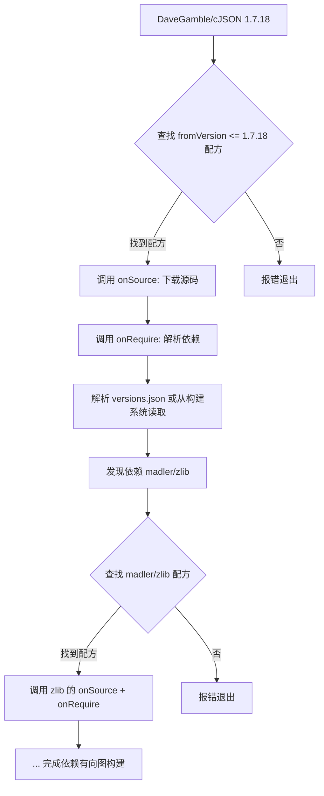

**说明**：
- 依赖解析阶段按照**正常顺序**遍历：`cJSON -> zlib -> ...`
- 每个包先执行 `onSource`（下载源码），再执行 `onRequire`（解析依赖）
- `onRequire` 可以从 versions.json 或从构建系统（CMake/Conan）读取依赖信息

#### 选择过程演示

假设目录结构：
```
DaveGamble
   └── cJSON
       ├── versions.json            # 依赖管理文件（放在根目录）
       ├── cJSON_cmp.gox
       ├── go.mod
       ├── go.sum
       ├── 1.0.x                    # fromVersion: 1.0.0
       │   └── CJSON_llar.gox
       ├── 1.5.x                    # fromVersion: 1.5.0
       │   └── CJSON_llar.gox
       └── 2.x                      # fromVersion: 2.0.0
           └── CJSON_llar.gox
```

选择过程：
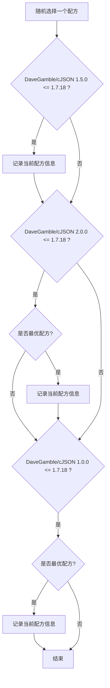

### 3.8 自定义依赖管理

#### 背景
在设计这套版本管理方案的时候，我们一开始太过于理想化，没有考虑到库本身自带版本依赖的问题。

例如该库原本使用了类似于conan，ninja类似包管理工具的时候，我们其实可以从这些工具中读取准确和最新的依赖信息。

#### onRequire使用方式
```javascript
onRequire deps => {
    graph := readDepsFromNinja()?

    graph.visit((parent, dep) => {
        deps.require(parent, dep)
    })
}
```

#### deps.Graph接口
```go
type Graph interface {
    // 修改 packageName 的 依赖 为 deps
    Require(packageName string, deps []Dependency)
    // 获取 版本为version的packageName 的依赖
    RequiredBy(packageName string, version version.Version) ([]Dependency, bool)
    // 强制替换依赖包的版本（类似 go.mod 的 replace）
    Replace(packageName string, version string)
}
```

## 4. 构建矩阵系统设计

### 4.1 背景

LLAR出发点是为了解决构建产物难题，即当构建配置无限进行膨胀。

而conan，并没有构建矩阵这个概念。但是conan提出了类似的构建配置，并将用户构建配置分为两部分：settings和options，其中settings是会向下传播的，编译需要的，options则仅限于当前package，不会向下传播的配置。

我们希望能够通过一种标准化的方案去表达这些构建配置。

### 4.2 设计目标

- 能够提供一种标准化的构建配置解决方案
- 能够自动完成构建配置选择

### 4.3 基本设计

类似于Conan，构建矩阵有两部分组成，分别是 `require` 和 `option`。 `require` 类似于conan `settings`，默认向下传播，而`options` 则不会向下传播，仅限于当前package。

#### 矩阵结构
```json
{
    "matrix": {
        "require": {
            "arch": ["amd64", "arm64"],
            "lang": ["c", "cpp"],
            "key1": ["value 1", "value 2", ... "value n"],
            "key2": ["value 1", "value 2", ... "value n"],
            ...
            "keyn": ["value 1", "value 2", ... "value n"]
        },
        "options": {
            "key1": ["value 1", "value 2", ... "value n"]
        }
    }
}
```

#### 结构化定义
```go
type PackageMatrix struct {
        Require map[string][]string `json:"require"`
        Options map[string][]string `json:"options"`
}
```

#### 必需字段
- `arch`: 代表编译平台
- `lang`: 代表该包的语言（可选值：c, cpp, py)

#### 特殊可选字段
- `os`: 代表OS
- `toolchain`: 工具链（可选值: gcc，clang）

`os`不是必须的情况是因为该包有可能允许在裸机环境下运行。

其次，key必须代表某种编译集成配置，例如说，`sse2`，那么应该代表着该包全部组件启用`sse2`，而不是某个部分。

### 4.4 为什么需要引入 require 和 options 概念？

在构建矩阵第一版设计中，是不存在的，默认参数都会又最上层的包一层一层进行传播。

但我们在经过讨论后发现以下事实：
1. 如果一层一层传播，最底层的依赖会得到一个巨大的构建矩阵，很多字段其实并不需要
2. 以及可能会出现以下复杂情况：

A 依赖 B 可能会出现：
1. A有B不需要的字段，A传导给了B（这个case问题不大）
2. B有A不存在的字段（这个往往出现在optional的参数。但这个参数没有值，那么此时该参数要不要往下继续传播呢，因为我们不能确定下一个依赖是否依赖了该参数）

为了解决第二个问题，引入 `require` 和 `options` 概念后，case 2所导致的复杂问题可以被简单解决，因为`options`默认不会被传播，只能接受来自最上层的传入。

### 4.5 构建矩阵的表现形式

#### 算法
由于JSON Object在RFC规范中定义是无序组合，因此我们需要对其Object key齐进行按字母排序，然后从排序顺序前至后进行排序组合（按层序顺序，第一层和第二层组合，其结果再和第三层组合，依次递归）

#### 示例
```json
{
    "matrix": {
        "require": {
            "os": ["linux", "darwin"],
            "arch": ["x86_64", "arm64"],
            "lang": ["c", "cpp"]
        }
    }
}
```

将产生以下组合：
`x86_64-c-linux`, `arm64-c-linux`, `x86_64-c-darwin`, `arm64-c-darwin`,
`x86_64-cpp-linux`, `arm64-cpp-linux`, `x86_64-cpp-darwin`, `arm64-cpp-darwin`

计算过程：
1. 排序得到key顺序：`arch`, `lang`, `os`
2. 进行组合：
   - `arch`与`lang`组合：`x86_64-c`, `arm64-c`, `x86_64-cpp`, `arm64-cpp`
   - 其结果与`os`组合得到完整结果

#### 有options字段
在完成`require`字段组合后，再进行`options`组合，最后用`|` 进行连接：
`x86_64-c-linux|zlibON`

### 4.6 矩阵的传播

#### 传播规则
默认情况下，`require` 要求所有包必须是入口`require`交集，而`options`则只接受来自最上层的传入。

#### 传播示例

无`options`:
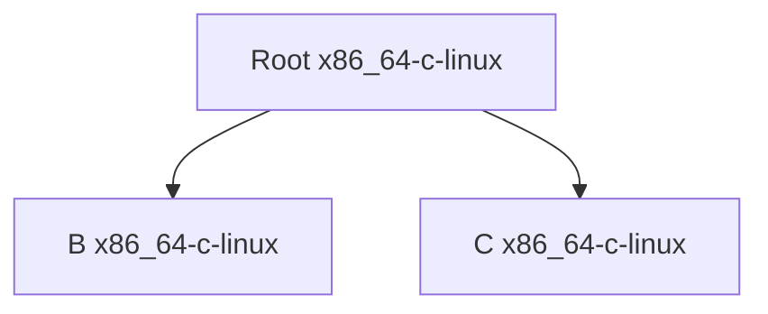

仅C有`options`:
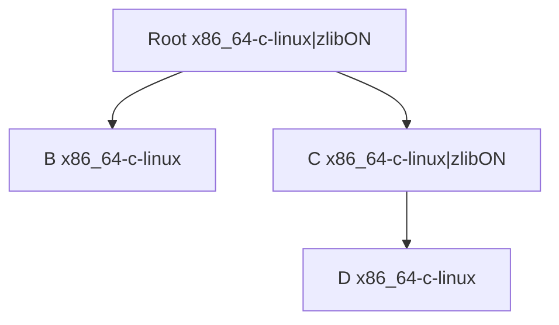

非交集：
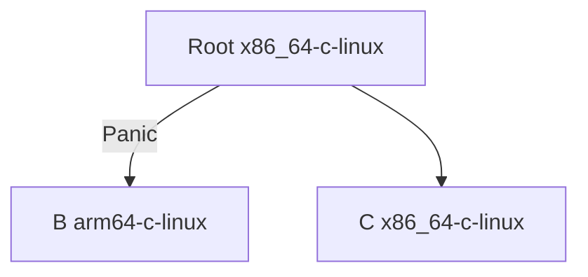

如果发现非交集情况，将会直接终止配方运行。

### 4.7 矩阵的选择与使用

构建矩阵在实现上可以使用哈希表进行实现。

因此其选择过程就变成了使用哈希进行交集匹配，可以忽略顺序问题，这一实现有点像Go BuildTags，即：一个配方只需要取其适合的配置信息，忽视掉不需要的。

但是，如果出现了某个配方接受到了不预期的`require`，往往只有一种结果：该包无法编译出该平台或者该配置的。此时应该强制panic以让配方编写者知道问题。

## 5. ixgo运行模块设计

ixgo运行模块是LLAR系统中的核心组件，负责执行XGO配方脚本。详细的ixgo设计和实现请参考：[ixgo设计文档](./ixgo-design.md)

### 5.1 核心功能
- 动态执行XGO语言配方
- 自动配置xgo项目（RegisterProject)
- 与依赖管理模块互动
- 根据依赖管理模块执行构建

### 5.2 依赖管理模块互动

#### 回调函数调用顺序

**重要说明**：回调函数的调用顺序和执行环境：

1. **onSource + onRequire 阶段**（依赖解析）
   - 按照依赖树的**深度优先遍历顺序**
   - 示例：假设 `cJSON` 依赖 `zlib`，`zlib` 依赖 `glibc`，则遍历顺序为 `cJSON -> zlib -> glibc`
   - 每个包先执行 `onSource`（下载源码到临时目录），再执行 `onRequire`（解析依赖）
   - 目的：`onRequire` 可能需要读取 CMake/Conan 等构建文件来获取依赖信息

2. **onBuild 阶段**（构建执行）
   - 按照 MVS **BuildList 顺序**（拓扑排序，从底层依赖到上层）
   - 示例：假设 `cJSON` 依赖 `zlib`，`zlib` 依赖 `glibc`，则 BuildList 顺序为 `glibc -> zlib -> cJSON`（必须先构建底层依赖）
   - 复用 onSource 下载的源码（临时目录）
   - 构建产物移动到配方 build 目录

#### 执行流程

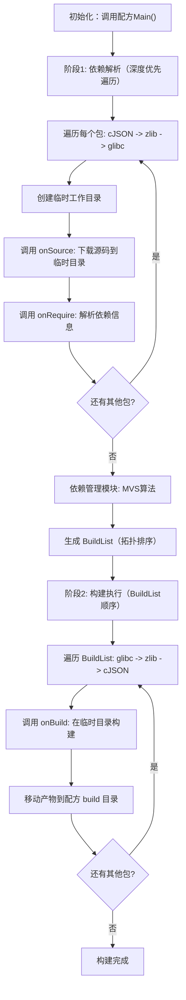

#### 工作目录说明

**临时目录**（onSource 和 onBuild 使用）：
```
/tmp/llar-build-xxx/
└── {{PackageName}}/
    └── {{Version}}/
        └── source/
            └── [源码文件]
```

**最终目录**（onBuild 产物移动到）：
```
{{UserCacheDir}}/.llar/formulas/{{owner}}/{{repo}}/build/{{Version}}/{{Matrix}}/
├── .cache.json
└── [构建产物]
```

### 5.3 技术特点
- 基于Go reflect机制实现动态执行
- 支持XGO到Go的无缝编译转换
- 提供丰富的扩展机制（RegisterExternal、RegisterPatch等）
- 完整的错误处理和调试支持

## 6. 配方仓库管理

### 6.0 本地存储设计

#### 6.0.1 配方存放目录

配方存放在用户缓存目录下的`.llar`文件夹中：

**位置**: `{{UserCacheDir}}/.llar/formulas/`

该目录通过Git VCS进行管理，LLAR自动处理所有Git操作。

**目录结构**：
```
{{UserCacheDir}}/.llar/
└── formulas/                    # 配方Git仓库（LLAR自动管理）
    ├── .git/                    # Git版本控制
    ├── DaveGamble/
    │   └── cJSON/
    │       ├── versions.json    # 依赖管理文件（放在根目录）
    │       ├── cJSON_cmp.gox    # 可选：自定义版本比较
    │       ├── go.mod
    │       ├── go.sum
    │       ├── 1.x/
    │       │   └── CJSON_llar.gox
    │       └── 2.x/
    │           └── CJSON_llar.gox
    └── madler/
        └── zlib/
            ├── versions.json
            └── ZLIB_llar.gox
```

#### 6.0.2 产物存放目录

构建产物存放在对应配方目录下的`build`子目录：

**格式**: `{{UserCacheDir}}/.llar/formulas/{{owner}}/{{repo}}/build/{{PackageVersion}}/{{Matrix}}/`

每个产物目录下包含`.cache.json`文件，记录构建信息。

**目录结构**：
```
{{UserCacheDir}}/.llar/formulas/DaveGamble/cJSON/
├── versions.json                # 依赖管理文件
├── 1.x/
│   └── CJSON_llar.gox
└── build/                       # 构建产物根目录
    ├── 1.7.18/                  # 版本号目录
    │   ├── x86_64-c-darwin/     # 矩阵组合1
    │   │   ├── .cache.json      # 构建缓存信息
    │   │   ├── include/
    │   │   │   └── cjson/
    │   │   │       └── cJSON.h
    │   │   └── lib/
    │   │       ├── libcjson.a
    │   │       └── pkgconfig/
    │   │           └── cjson.pc
    │   ├── arm64-c-darwin/      # 矩阵组合2
    │   │   ├── .cache.json
    │   │   ├── include/
    │   │   └── lib/
    │   └── x86_64-c-linux/      # 矩阵组合3
    │       ├── .cache.json
    │       ├── include/
    │       └── lib/
    └── 1.7.17/
        └── x86_64-c-darwin/
            ├── .cache.json
            ├── include/
            └── lib/
```

#### 6.0.3 构建缓存信息文件

**`.cache.json`格式**：
```json
{
    "packageName": "DaveGamble/cJSON",
    "version": "1.7.18",
    "matrix": "x86_64-c-darwin",
    "matrixDetails": {
        "arch": "x86_64",
        "lang": "c",
        "os": "darwin"
    },
    "buildTime": "2025-01-17T10:30:00Z",
    "buildDuration": "45.2s",
    "outputs": {
        "dir": "/Users/user/Library/Caches/.llar/formulas/DaveGamble/cJSON/build/1.7.18/x86_64-c-darwin",
        "linkArgs": "-L/Users/user/Library/Caches/.llar/formulas/DaveGamble/cJSON/build/1.7.18/x86_64-c-darwin/lib -lcjson -I/Users/user/Library/Caches/.llar/formulas/DaveGamble/cJSON/build/1.7.18/x86_64-c-darwin/include"
    },
    "sourceHash": "sha256:aaaabbbbccccdddd...",
    "formulaHash": "sha256:1111222233334444..."
}
```

**字段说明**：
- `packageName`: 包名
- `version`: 包版本
- `matrix`: 矩阵组合字符串
- `matrixDetails`: 矩阵详细信息
- `buildTime`: 构建时间
- `buildDuration`: 构建耗时
- `outputs`: 构建输出信息（对应 Artifact 结构体）
  - `dir`: 产物输出目录（对应 Artifact.Dir）
  - `linkArgs`: 链接参数，通过 Artifact.Link() 回调函数生成
- `sourceHash`: 源码Hash
- `formulaHash`: 配方Hash

**`.deps-lock.json`格式**：
```json
{
    "deps": [
        {
            "name": "madler/zlib",
            "version": "1.2.13",
            "sourceHash": "sha256:eeeeffff11112222...",
            "formulaHash": "sha256:33334444aaaabbbb..."
        }
    ]
}
```

**结构化定义**：
```go
type DependencyLock struct {
    Dependency          // 嵌入 Dependency 结构体
    SourceHash   string `json:"sourceHash"`
    FormulaHash  string `json:"formulaHash"`
}

type DependencyLockFile struct {
    Dependencies []DependencyLock `json:"deps"`
}
```

#### 6.0.4 完整示例

假设用户在macOS x86_64平台上构建`DaveGamble/cJSON@1.7.18`：

**配方路径**：
```
/Users/user/Library/Caches/.llar/formulas/DaveGamble/cJSON/1.x/CJSON_llar.gox
```

**产物路径**：
```
/Users/user/Library/Caches/.llar/formulas/DaveGamble/cJSON/build/1.7.18/x86_64-c-darwin/
├── .cache.json
├── include/
│   └── cjson/
│       └── cJSON.h
└── lib/
    ├── libcjson.a
    ├── libcjson.so
    └── pkgconfig/
        └── cjson.pc
```

**产物信息**（从.cache.json读取）：
- **Dir**: `/Users/user/Library/Caches/.llar/formulas/DaveGamble/cJSON/build/1.7.18/x86_64-c-darwin`
- **LinkArgs**: `-L/Users/user/Library/Caches/.llar/formulas/DaveGamble/cJSON/build/1.7.18/x86_64-c-darwin/lib -lcjson -I/Users/user/Library/Caches/.llar/formulas/DaveGamble/cJSON/build/1.7.18/x86_64-c-darwin/include`

#### 6.0.5 配方自动更新机制

LLAR自动管理配方仓库的Git操作，用户无需手动执行任何Git命令。

**初始化**（首次运行时自动执行）：
```bash
# LLAR自动克隆中心化配方仓库
git clone https://github.com/llar-community/formulas.git {{UserCacheDir}}/.llar/formulas
```

**自动更新**：
每次执行llar命令时，LLAR会自动执行`git pull`更新配方仓库。

**更新流程**：
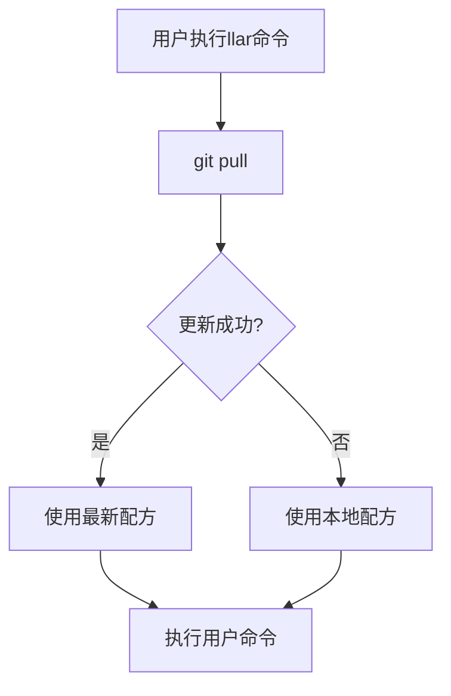

**关键特性**：
- **简单直接**: 每次运行直接git pull，保持配方最新
- **自动化**: 所有Git操作由LLAR自动完成，对用户透明
- **容错性**: 网络故障不影响LLAR正常使用
- **快速**: git pull仅传输增量数据，速度快

#### 6.0.6 跨平台路径处理

**UserCacheDir在不同平台的位置**：

| 平台 | UserCacheDir | 完整路径示例 |
|------|--------------|--------------|
| macOS | `~/Library/Caches` | `/Users/user/Library/Caches/.llar/` |
| Linux | `~/.cache` | `/home/user/.cache/.llar/` |
| Windows | `%LocalAppData%` | `C:\Users\user\AppData\Local\.llar\` |

LLAR使用Go标准库`os.UserCacheDir()`自动获取正确路径。

### 6.1 中心化仓库目录结构

#### Git仓库托管
```
{{owner}}/
└── {{repo}}/
    ├── versions.json                        # 依赖管理文件（放在根目录）
    └── {{repo名称首字母大写}}_llar.gox
```

**示例：** `github.com/DaveGamble/cJSON`

对应的目录结构：
```
DaveGamble/
└── cJSON/
    ├── versions.json
    └── CJSON_llar.gox
```

#### 版本管理结构
```
{{owner}}/
└── {{repo}}/
    ├── versions.json                        # 依赖管理文件（放在根目录）
    ├── 1.x/
    │   └── {{repo名称首字母大写}}_llar.gox
    └── 2.x/
        └── {{repo名称首字母大写}}_llar.gox
```

### 6.2 CI系统设计

#### 产品设计

##### 需求

提交侧(Pull Request)：
- **检查配方是否编写正确**
    - 检查是否加载并继承`FormulaApp`
    - 检查Package Name和Package ID是否已经填写
    - 检查依赖图是否无法自动完成解决或者有构建矩阵的冲突
- **运行配方构建，得到产物后运行测试**
    - 超过20种可能性就随机抽样1/10构建矩阵组合，因为如果产生大量构建矩阵组合，将无法全部测试

##### 用户故事

用户可以：
- 使用PR提交到中心化仓库

## 7. 版本选择设计

### 7.1 背景

现有包管理器版本选择往往是不够智能的，以conan为例，其版本选择仅是为包管理提供一种比较简单版本选择，例如依赖可以选择版本范围，这类功能使得维护者可以不那么频繁更新配方脚本，但对于版本冲突解决，conan往往需要人工手动解决，这对于具有一定复杂度的依赖是非常不友好的。

我们希望为LLAR引入一种类似于Go MVS具有High-Fidelity Builds（高保真构建），且足够通用能够自动解决版本冲突的版本选择方案。

### 7.2 设计目标

- 能够自动解决版本冲突，具有高保真构建特性
- 足够通用，适配所有

### 7.3 具体设计

#### 版本号相关问题
通常，多数语言一般都避免了C/C++没有版本规则带来的混乱，一般都会遵循一套特定的版本规则，例如NPM和Go都遵守Semver规范，Python也有类似Semver规范的规则。

因此我们只需要关心C/C++这类无版本规范的情况。

我们调研后发现，虽然版本形态不同，但是作为版本号，他们一般有一个清晰的特征：

> 单调递增的

#### 版本比较方案

针对我们观察到的信息，我们提出了两种方案：

- **方案一**：利用NLP算法分析出其版本号特征，并通过Semver进行标准化
- **方案二**：让维护者提供自定义版本比较规则

选择理由：

1. 配方维护者往往很容易就能找出这个版本的规律，并编写出该包的比较规则
2. 一般来说，多数库的版本规则不会发生改变。但如果发生改变，我们也可以进行灵活处理

### 7.4 算法设计

类似于Go MVS，我们将采用类似的方案。初步采用和Go MVS一样的算法。

当遇到版本号冲突时，算法将使用用户提供的 `Compare` 接口自动选择最新的版本。

例如：
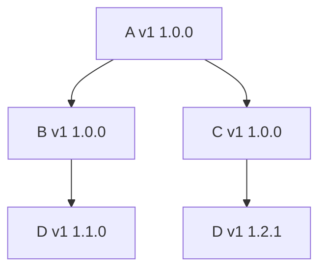

当遇到冲突`D`的时候，我们会找到D配方提供的`Compare` 方法，比较得出最新的版本号，进而我们能够得出以下选择

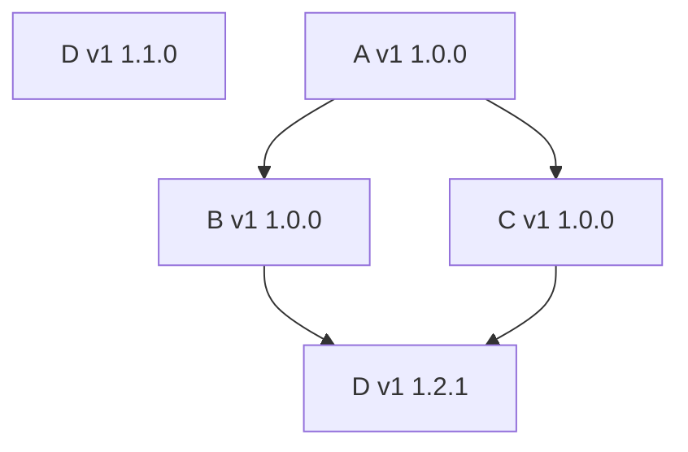

### 7.5 算法实现

由于我们采用Go MVS选择算法，算法要求提供：
1. 版本比较（已提供）
2. Module Path（使用 PackageName 作为 Module Path）

### 7.6 高保真保证

由于Go MVS已经实现了高保真比较，我们可以很顺利就实现了高保真版本选择

## 8. Build模块设计

### 8.1 Build的执行
为了保证虚拟环境安全，Build执行会被严格限制在某个目录下

像内置的`Download`函数都会默认下载到其指定目录

#### Build缓存
Build阶段，需要去检查Cache，这个Cache实现是一个接口

```go
type PackageCache interface {
        Get(pkg FormulaPackage) (buildInfo BuildInfo, ok bool)
        Put(pkg FormulaPackage, buildInfo BuildInfo) error
}
```

PackageCache检查本地存储，如果没有Cache则直接执行`Build()`

## 9. 开发计划

### 9.1 排期

| 任务 | 预期耗时 | 预期完成 |
|------|----------|----------|
| 建立中心化配方仓库和CI系统 | 2个星期 | +14 |
| 编写FormulaApp基类 | 2个星期 | +14 |
| 编写LLAR Cli | 2个星期 | +14 |

### 9.2 MVP现状

基于Issue #26，当前MVP实现：https://github.com/MeteorsLiu/llar-mvp

发现的问题：
1. ixgo export.go与源码导入混用有副作用
2. 配方如何管理（需要讨论）
3. 产物输出目录（需要讨论）
4. 由于`compare`放在配方中会导致其存在版本变化，所以单独拆分出了`_cmp.gox`配方放`compare`
5. 产物信息传递

配方仓库：https://github.com/MeteorsLiu/llarformula

## 10. 关键技术决策

### 10.1 为什么选择XGO Classfile作为配方语言

1. **系统命令支持**: GSH提供了调用Bash命令的能力
2. **抽象机制**: 每个文件都建立在抽象之上，便于实现配方接口
3. **语法简洁**: 提供丰富的builtin函数和简单语法集
4. **错误处理**: 特别的错误处理机制解决Go的冗余错误处理
5. **后端切换**: 支持LLGo后端，实现跨语言处理能力

### 10.2 为什么采用Go MVS算法

1. **高保真构建**: 确保相同输入产生相同输出
2. **自动冲突解决**: 通过算法自动选择兼容版本
3. **久经验证**: Go生态系统的成功实践
4. **可扩展性**: 支持自定义版本比较逻辑

### 10.3 为什么设计惰性构建

1. **资源效率**: 避免预构建所有可能组合的巨大开销
2. **用户体验**: 无需等待，本地和云端并发构建
3. **扩展性**: 支持任意数量的构建配置组合
4. **缓存利用**: 最大化利用已有构建结果

## 11. 安全性与可靠性设计

### 11.1 构建环境安全

#### 容器隔离
每个构建任务运行在独立容器中，确保：
- 构建过程互不影响
- 恶意代码无法影响宿主系统
- 资源使用受到严格限制

#### 源码验证
- 使用Hash校验确保源码完整性
- 支持多种Hash算法（SHA256等）
- 验证失败时终止构建过程

### 11.2 系统可靠性

#### 故障恢复
- 构建任务失败自动重试机制
- 完整的日志记录便于问题追踪

## 12. 性能优化策略

### 12.1 构建优化

#### 并发构建
- 依赖图并行构建（无依赖关系的包）
- 本地多任务并行处理

#### 缓存策略
- 本地缓存构建结果
- 增量构建支持
- 智能缓存失效策略

### 12.2 产物优化

#### 压缩优化
- 构建产物自动压缩
- 差分更新减少传输量

---

*本文档基于LLAR项目所有开放issues (#9, #11, #12, #14, #15, #17, #18, #21, #22, #23, #24, #25, #26) 的完整技术分析，全面反映了LLAR的技术架构设计和实现方案。*
