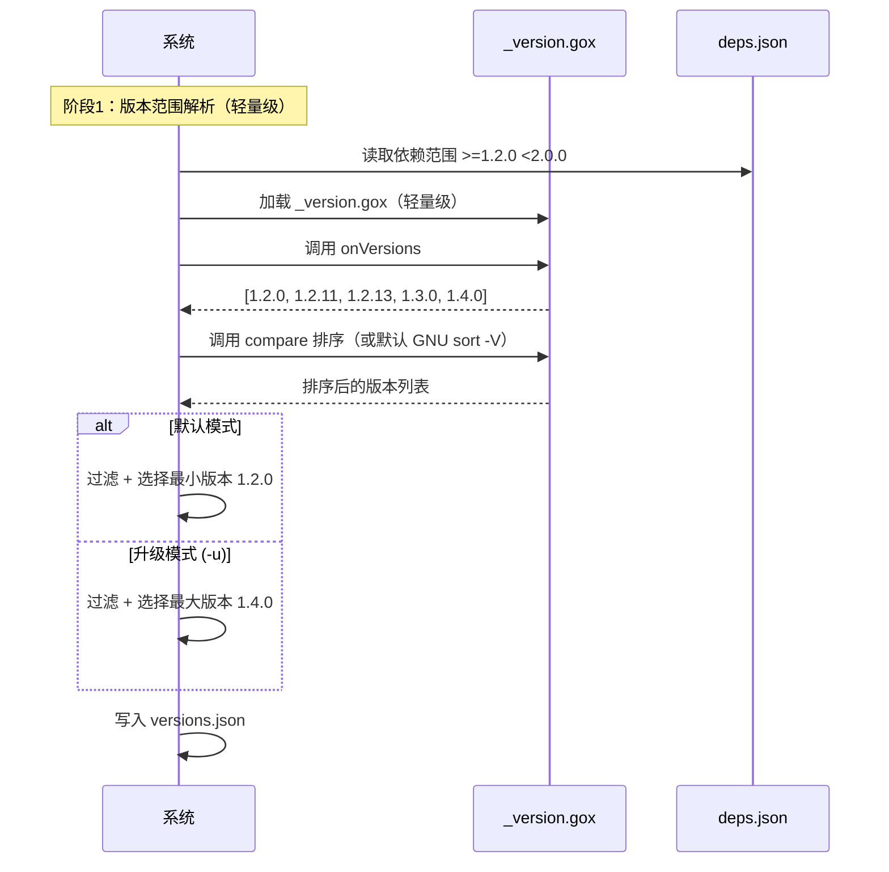
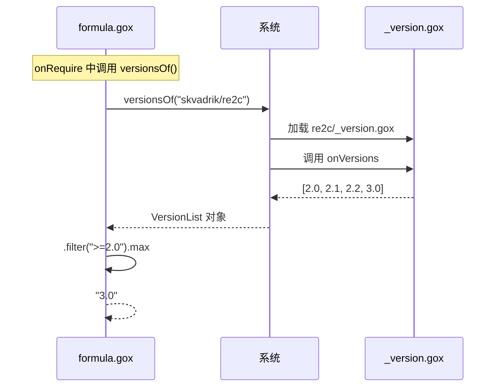
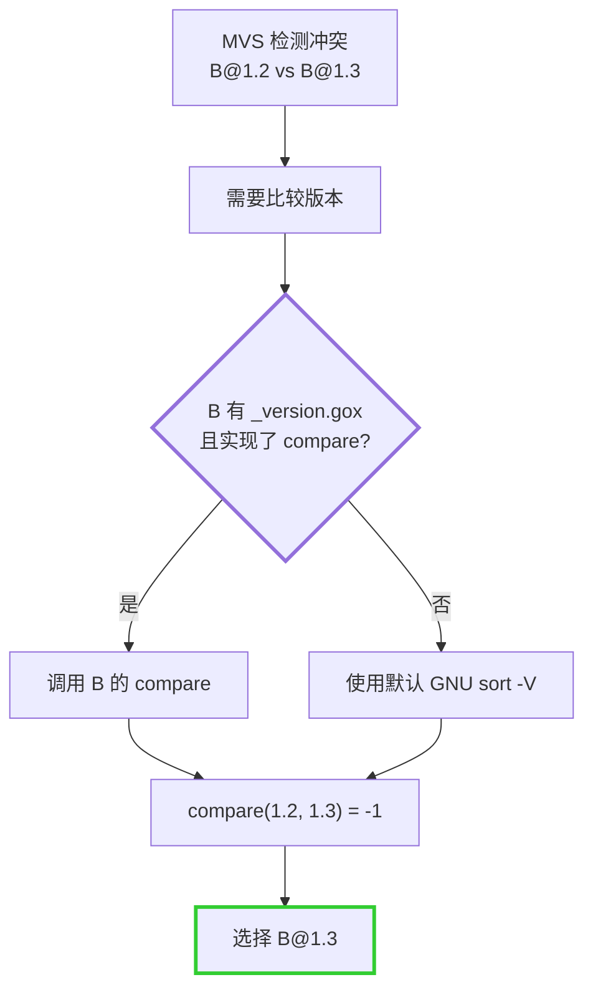
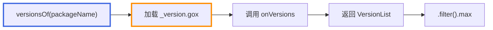
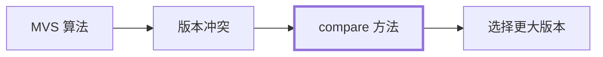

# LLAR _version.gox 文件设计

## 1. 概述

`_version.gox` 是 LLAR 的**版本管理文件**，是一个轻量级的 XGo Classfile，负责：

1. **onVersions**: 从上游获取所有可用版本列表
2. **compare**: 自定义版本比较逻辑（可选）

### 1.1 为什么需要 _version.gox

**职责分离**：
- `_version.gox`: 版本管理（获取版本 + 比较版本）
- `formula.gox`: 构建逻辑（onSource + onRequire + onBuild）

### 1.2 文件位置

```
{{owner}}/
└── {{repo}}/
    ├── versions.json           # 依赖管理文件
    ├── {{repo}}_version.gox    # 版本管理文件
    └── 1.x/
        └── {{Repo}}_llar.gox   # 配方文件
```

**命名规范**：`{{repo}}_version.gox`
- 示例：`DaveGamble/cJSON` → `cJSON_version.gox`

## 2. 文件接口

### 2.1 完整接口定义

```go
// {{repo}}_version.gox - XGo Classfile 语法

// onVersions 回调 - 获取所有可用版本（必需）
onVersions => {
    // 从上游获取版本列表
    return fetchGitHubTags("owner/repo")
}

// compare 回调 - 自定义版本比较（可选）
// 返回值:
//   < 0: v1 < v2
//   = 0: v1 = v2
//   > 0: v1 > v2
compare (v1, v2) => {
    // 自定义比较逻辑
    // 如不实现，使用默认 GNU sort -V
}
```

### 2.2 onVersions 回调

**作用**：返回包的所有可用版本列表

**调用时机**：
- 版本范围解析阶段
- 用户查询可用版本时
- `versionsOf()` 函数内部调用

**返回值**：`[]string` - 版本号列表

**示例**：
```go
onVersions => {
    // 从 GitHub 获取 tags
    return fetchGitHubTags("ninja-build/ninja")
}
```

```go
onVersions => {
    // 从自定义 API 获取
    resp := httpGet("https://api.example.com/versions")!
    return parseVersions(resp)
}
```

### 2.3 compare 回调

**作用**：比较两个版本字符串的大小

**是否必需**：可选。如不实现，使用默认 GNU sort -V 算法

**返回值**：
- `< 0`: v1 小于 v2
- `= 0`: v1 等于 v2
- `> 0`: v1 大于 v2

**默认算法**：GNU sort -V
- 来源于 Debian 版本比较
- 数字部分按数值比较
- 非数字部分按字典序比较
- 适用于大多数标准版本号

## 3. 调用流程

### 3.1 版本范围解析阶段



### 3.2 versionsOf() 调用



### 3.3 MVS 算法阶段



## 4. 默认算法：GNU sort -V

**特点**：
- 数字部分按数值比较
- 非数字部分按字典序比较
- 广泛使用，行为稳定

**示例**：
```
输入: 1.2.3, 1.2.10, 1.2.3-alpha
排序: 1.2.3-alpha < 1.2.3 < 1.2.10
```

**何时需要自定义 compare**：详见 [version-management-user-stories.md](version-management-user-stories.md) 故事 1.3

## 5. 实现指南

### 5.1 实现步骤

1. 创建 `{{repo}}_version.gox` 文件
2. 实现 `onVersions` 回调（必需）
3. 如果默认比较不满足需求，实现 `compare` 回调
4. 测试各种版本号组合

### 5.2 完整模板

```go
// {{repo}}_version.gox - XGo Classfile

import (
    "strings"
)

// onVersions - 获取所有可用版本
onVersions => {
    // TODO: 根据实际情况实现
    return fetchGitHubTags("owner/repo")
}

// compare - 自定义版本比较（可选）
// 如果默认 GNU sort -V 满足需求，可以不实现
compare (v1, v2) => {
    // TODO: 实现比较逻辑
    // 返回: < 0 (v1 < v2), = 0 (v1 == v2), > 0 (v1 > v2)

    if v1 < v2 {
        return -1
    } else if v1 > v2 {
        return 1
    }
    return 0
}
```

### 5.3 compare 实现要求

**必须满足**：
1. **反对称性**: `compare(a, b) = -compare(b, a)`
2. **传递性**: `a < b && b < c => a < c`
3. **一致性**: 相同输入返回相同结果

**性能要求**：
- compare 会被频繁调用
- 实现应该高效
- 避免复杂计算和 I/O 操作

### 5.4 测试用例

```go
// 建议测试的用例
compare("1.2.3", "1.2.4")      // 应返回 < 0
compare("1.2.3", "1.2.3")      // 应返回 = 0
compare("1.2.4", "1.2.3")      // 应返回 > 0
compare("1.2.3", "1.2.10")     // 应返回 < 0
compare("1.2.3-alpha", "1.2.3") // 应返回 < 0（如果支持预发布）
compare("2.0.0", "1.9.9")      // 应返回 > 0
```

## 6. 与其他模块的关系

### 6.1 与 formula.gox 的分离

| 文件 | 职责 | 加载时机 | 复杂度 |
|------|------|----------|--------|
| `_version.gox` | 版本管理 | 版本范围解析阶段 | 轻量级 |
| `formula.gox` | 构建逻辑 | 构建执行阶段 | 重量级 |

### 6.2 与 versionsOf() 的关系



### 6.3 与 MVS 算法的关系



## 7. 最佳实践

### 7.1 何时自定义 compare

**使用自定义**：
- 版本号格式特殊，默认排序不正确
- 有预发布版本（alpha, beta, rc）
- 版本号包含日期或构建号
- 上游有明确的版本比较规则

**使用默认**：
- 标准三段式版本号
- 简单的数字版本号

### 7.2 维护建议

1. **简单优先**: 能用默认就不自定义
2. **遵循上游**: 参考上游的版本规范
3. **充分测试**: 测试各种边界情况
4. **文档说明**: 注释版本号格式和比较逻辑

## 8. 参考

- [GNU sort -V 文档](https://www.gnu.org/software/coreutils/manual/html_node/Version-sort.html)
- [version-management-overview.md](version-management-overview.md) - 版本管理总览
- [version-range-design.md](version-range-design.md) - 版本范围设计
- [mvs-algorithm-design.md](mvs-algorithm-design.md) - MVS 算法
