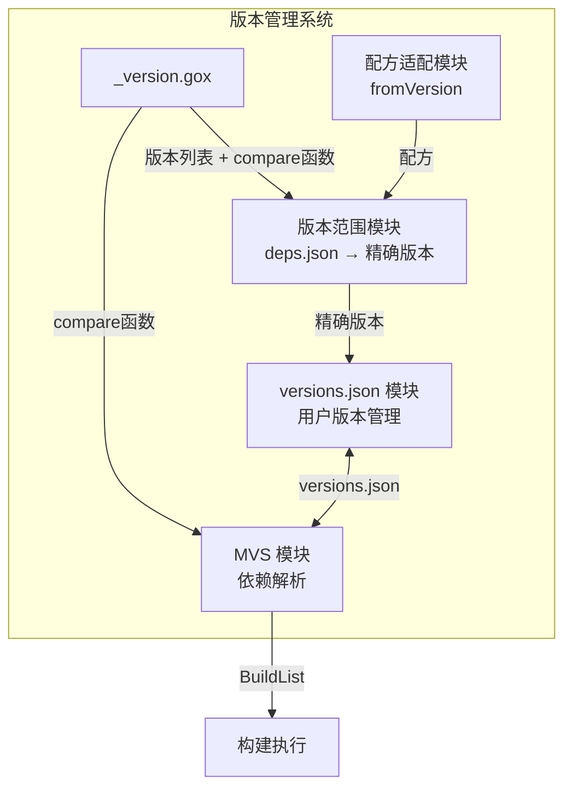
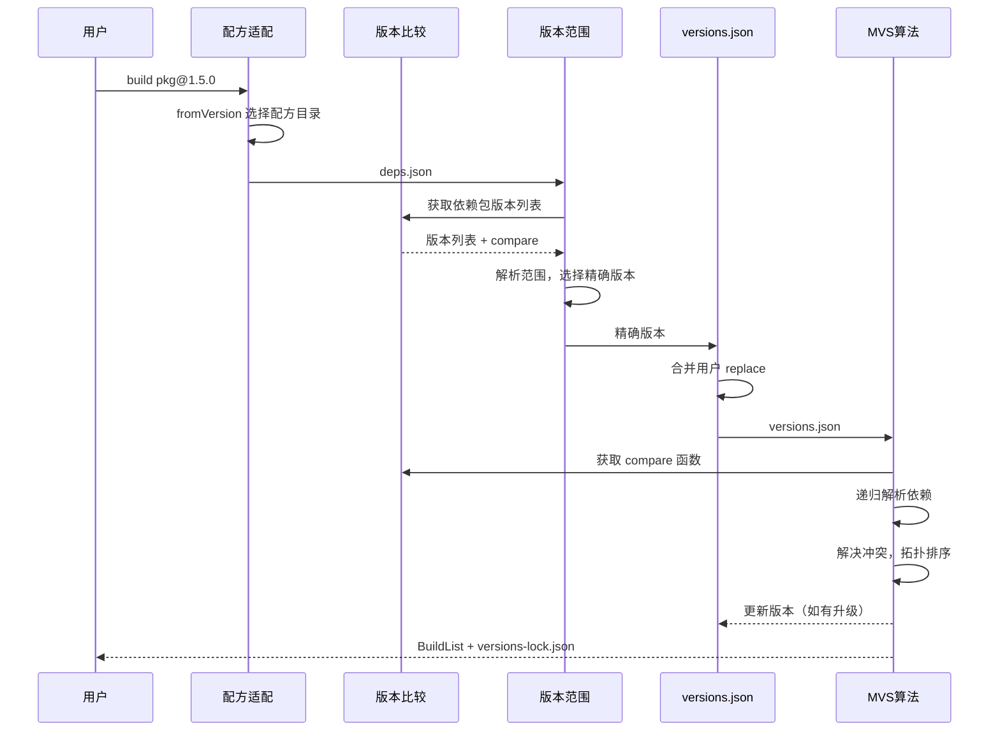

# LLAR 版本管理系统概览

## 1. 模块与输入输出



## 2. 模块详解

### 2.1 版本比较模块

**文档**: [version-comparison-design.md](version-comparison-design.md)

| 项目 | 说明 |
|------|------|
| **输入** | PackageName |
| **输出** | 版本列表 `[]string` + compare 函数 `func(v1, v2) int` |
| **实现** | `_version.gox` 文件（onVersions + compare） |

**职责**:
- `onVersions`: 从上游获取版本列表
- `compare`: 自定义版本比较（可选，默认 GNU sort -V）

---

### 2.2 配方适配模块

**文档**: [formula-version-design.md](formula-version-design.md)

| 项目 | 说明 |
|------|------|
| **输入** | PackageName + 目标包版本 |
| **输出** | 配方目录路径 + deps.json |
| **实现** | fromVersion 选择算法 |

**职责**:
- 根据目标包版本选择合适的配方目录
- 选择原则：`fromVersion <= 目标版本` 的最大值

**注意**: 配方没有独立版本号，通过 git commit 管理

---

### 2.3 版本范围模块

**文档**: [version-range-design.md](version-range-design.md)

| 项目 | 说明 |
|------|------|
| **输入** | deps.json（版本范围） + 版本列表 + compare 函数 + 模式参数 |
| **输出** | 精确版本 |
| **实现** | 版本范围解析 + 过滤 + 选择版本（默认最小，-u 最大） |

**职责**:
- 解析版本范围语法（>=, <, 组合）
- 调用 compare 函数过滤和排序
- 默认选择最小版本（已测试），升级模式选择最大版本
- 输出精确版本（不直接写 versions.json）

---

### 2.4 versions.json 模块

**文档**: [version-range-design.md](version-range-design.md)

| 项目 | 说明 |
|------|------|
| **输入** | 精确版本（来自版本范围模块） + 用户 replace 配置 |
| **输出** | versions.json 文件 |
| **联动** | 与 MVS 双向交互 |

**职责**:
- 管理用户项目的版本配置
- 支持 replace 覆盖依赖版本
- 合并版本范围模块的输出
- 接收 MVS 的版本升级结果

**与 MVS 的联动**:
```
versions.json ──读取──→ MVS
      ↑                   │
      └───写回更新────────┘
```

---

### 2.5 MVS 模块

**文档**: [mvs-algorithm-design.md](mvs-algorithm-design.md)

| 项目 | 说明 |
|------|------|
| **输入** | versions.json + compare 函数 |
| **输出** | BuildList + versions-lock.json |
| **联动** | 可更新 versions.json |

**职责**:
- 递归解析依赖图
- 解决版本冲突（选择最小可用版本）
- 生成 BuildList（拓扑排序）
- 生成 versions-lock.json（含 Hash）
- 可将升级后的版本写回 versions.json

---

## 3. 完整数据流



## 4. 三层文件架构

| 层级 | 文件 | 位置 | 维护者 | 内容 |
|------|------|------|--------|------|
| 1 | deps.json | 配方仓库 | 配方维护者 | 版本范围约束 + propagate 标记 |
| 2 | versions.json | 用户项目 | 用户 + MVS | 精确版本 + replace |
| 3 | versions-lock.json | 用户项目 | 系统生成 | 精确版本 + Hash |

### 4.1 deps.json 中的 propagate 字段

**用途**: 控制依赖是否向上传递到依赖链

```json
{
    "name": "mylib",
    "deps": {
        "1.0.0": [
            {
                "name": "openssl",
                "version": ">=1.1.0",
                "propagate": true
            },
            {
                "name": "zlib",
                "version": ">=1.2.0"
            }
        ]
    }
}
```

**效果**:
- `propagate: true` - 依赖的间接依赖会传递给当前包的依赖方
- `propagate: false` 或省略 - 依赖仅限当前包使用（默认值）

**示例**:
```
包 A 依赖 mylib
mylib 依赖 openssl (propagate: true) 和 zlib (省略 propagate)
openssl 依赖 crypto

结果:
- A 的实际依赖: [mylib, openssl, crypto]
- zlib 不传递给 A（因为省略了 propagate，默认不传递）
- crypto 通过 openssl 的 propagate 传递给 A
```

## 5. 模块间接口

### 5.1 版本比较模块接口

### 5.2 配方适配模块接口

### 5.3 版本范围模块接口

### 5.4 versions.json 模块接口

### 5.5 MVS 模块接口


## 6. 文档索引

```
docs/
├── version-management-overview.md      # 【本文档】总览与模块关系
├── version-comparison-design.md        # 版本比较模块
├── formula-version-design.md           # 配方适配模块
├── version-range-design.md             # 版本范围 + versions.json 模块
├── version-management-user-stories.md  # 用户故事
└── mvs-algorithm-design.md             # MVS 模块
```

## 7. 阅读建议

**按顺序阅读**:
1. 本文档 - 理解整体架构
2. [version-comparison-design.md](version-comparison-design.md) - 基础模块
3. [formula-version-design.md](formula-version-design.md) - 配方适配
4. [version-range-design.md](version-range-design.md) - 版本解析 + versions.json
5. [mvs-algorithm-design.md](mvs-algorithm-design.md) - 依赖解析
