# LLAR 版本范围与锁定机制产品设计与用户故事

## 1. 产品背景

### 1.1 核心问题

**问题**: 配方仓库更新不及时，用户无法及时获取依赖包的修复版本

**场景**:
- 包 A 依赖包 B 1.0.0（固定版本）
- B 发布了修复版本 1.2.0
- 配方仓库尚未更新
- 用户希望使用 B 1.2.0，但配方仓库是只读的，无法修改

### 1.2 设计目标

1. **配方维护者**: 减少维护工作量，使用大范围版本约束
2. **用户**: 自动获取最新兼容版本，同时保留手动控制能力
3. **系统**: 确保构建可重现性和安全性

## 2. 三层架构设计

### 2.1 架构概述

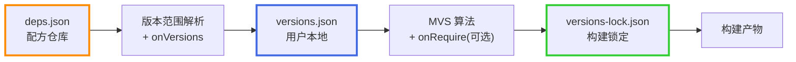

### 2.2 作用域详细说明

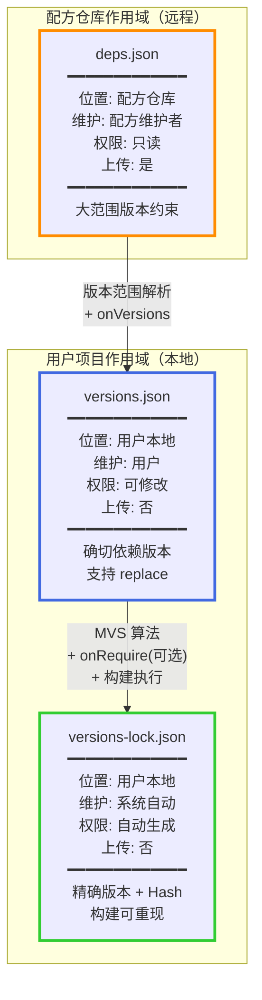

#### deps.json（配方仓库作用域）

**作用域特点**:
- 属于**配方仓库**，与配方代码一起分发
- 所有使用该配方的用户**共享相同**的 deps.json
- 用户从配方仓库**只读访问**，无法修改
- 随配方代码一起进行版本控制

**使用场景**:
- 配方维护者定义依赖的**大范围版本约束**（如 `>=1.2.0 <2.0.0`）
- 为不同配方版本定义不同的依赖要求
- 减少配方更新频率，让系统自动选择最新版本

**为什么需要这个作用域**:
- 配方仓库更新不及时，用户无法修改
- 使用大范围约束，让系统自动获取最新兼容版本
- 中心化维护，保证配方的一致性

#### versions.json（用户项目作用域）

**作用域特点**:
- 属于**用户项目本地**，每个用户独立维护
- 用户**完全可修改**，包括升级、降级、replace
- **不上传**到远程仓库（添加到 .gitignore）
- 记录用户对依赖版本的**决策**

**使用场景**:
- 首次构建时自动生成，记录从 deps.json 解析的确切版本
- 用户手动编辑实现依赖的升级/降级
- 用户使用 replace 强制指定特定版本（优先级最高）

**为什么需要这个作用域**:
- 不同用户可能需要不同的依赖版本
- 用户需要控制自己项目的依赖版本
- 提供偏离配方仓库建议的能力（通过 replace）

**与 deps.json 的关系**:
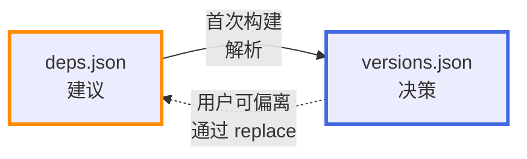

#### versions-lock.json（构建产物作用域）

**作用域特点**:
- 属于**构建产物**，每次构建自动生成/更新
- **系统自动维护**，用户一般不手动修改
- **不上传**到远程仓库（添加到 .gitignore）
- 记录**实际构建使用**的精确版本和 Hash

**使用场景**:
- 构建完成后自动生成
- 记录实际使用的版本（可能受 replace 影响）
- 记录源码和配方的 Hash 用于安全验证
- 后续构建验证 Hash 确保一致性

**为什么需要这个作用域**:
- 确保构建的可重现性
- 安全性验证，防止依赖被篡改
- 记录构建的"事实"而非"意图"

**与 versions.json 的区别**:
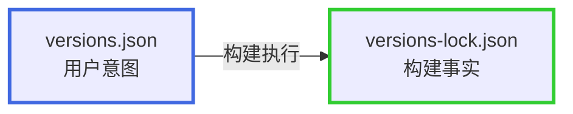

- versions.json: 用户的"意图"（想用什么版本）
- versions-lock.json: 构建的"事实"（实际用了什么版本）
- versions.json 可以有 replace，versions-lock.json 记录 replace 后的结果

### 2.3 三层作用域交互流程

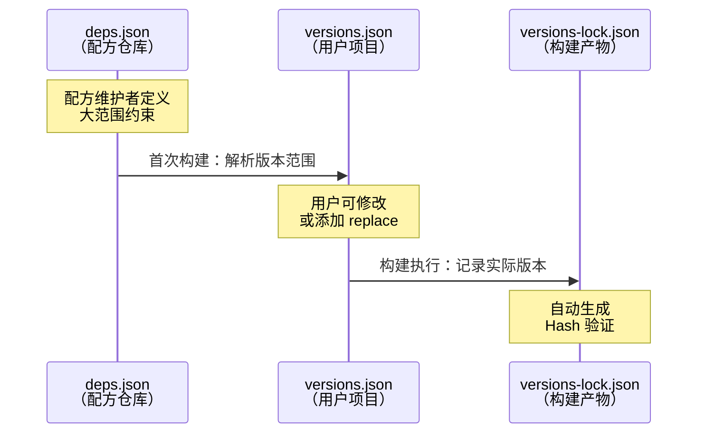

## 3. 用户故事

### 3.1 配方维护者故事

#### 故事 1.1: 使用版本范围减少维护工作

**作为** 配方维护者
**我希望** 在 deps.json 中使用版本范围而非固定版本
**以便** 减少配方更新频率，让系统自动选择最新兼容版本

**验收标准**:
- 可以在 deps.json 中使用 `>=1.2.0 <2.0.0` 等版本范围语法（空格分隔）
- 系统能够根据版本范围自动选择最新版本
- 用户无需等待配方更新即可获取新版本

**示例**:
```json
{
    "name": "DaveGamble/cJSON",
    "deps": {
        "1.7.18": [{
            "name": "madler/zlib",
            "version": ">=1.2.3 <2.0.0"
        }]
    }
}
```

#### 故事 1.2: 实现 onVersions 回调获取可用版本

**作为** 配方维护者
**我希望** 在 _version.gox 中提供 onVersions 回调函数从上游获取版本列表
**以便** 系统能够自动发现最新版本

**验收标准**:
- 可以在 _version.gox 中实现 onVersions 回调
- 函数从 GitHub API/自定义 API 获取版本列表
- 系统调用该函数获取所有可用版本
- 无需加载完整配方，轻量级解析

**示例场景**:
- madler/zlib 上游发布 1.3.0
- 系统读取 _version.gox，调用 onVersions
- onVersions 从 GitHub tags 获取 `["1.2.11", "1.2.13", "1.3.0"]`
- 系统自动选择 1.3.0（在范围 `>=1.2.3 <2.0.0` 内的最大版本）
- 整个过程不需要加载 formula.gox

#### 故事 1.3: 实现 compare 回调自定义版本比较（可选）

**作为** 配方维护者
**我希望** 在 _version.gox 中提供 compare 回调函数自定义版本比较逻辑
**以便** 正确排序非标准格式的版本号

**验收标准**:
- 可以在 _version.gox 中实现可选的 compare 回调
- compare 返回值：`< 0` (v1 < v2)、`= 0` (v1 == v2)、`> 0` (v1 > v2)
- 如果未实现 compare，系统使用默认 GNU sort -V 算法
- compare 用于版本范围过滤和 MVS 冲突解决

**何时需要自定义 compare**:

| 场景 | 版本号示例 | 问题 | 解决方案 |
|------|-----------|------|----------|
| 字母后缀 | `1.1.1w` (OpenSSL) | 默认字典序可能错误 | 自定义解析字母后缀 |
| 预发布版本 | `1.2.3-rc1`, `1.2.3` | rc 版本应小于正式版本 | 自定义识别 rc/alpha/beta |
| 日期版本 | `20240101` | 需要按日期排序 | 自定义日期解析 |
| 特殊格式 | `v1.2.3+build456` | 需要忽略 build metadata | 自定义解析规则 |

**示例场景 - OpenSSL**:

OpenSSL 使用字母后缀表示补丁版本：`1.1.1a` < `1.1.1b` < ... < `1.1.1w`

```go
// openssl_version.gox

onVersions => {
    return fetchGitHubTags("openssl/openssl")
}

compare (v1, v2) => {
    parts1 := parseVersion(v1)
    parts2 := parseVersion(v2)

    // 比较数字部分
    for i := 0; i < 3; i++ {
        if parts1[i] != parts2[i] {
            return parts1[i] - parts2[i]
        }
    }

    // 比较字母后缀
    return int(parts1[3]) - int(parts2[3])
}
```

**使用默认的场景**:
- 标准三段式版本号（如 `1.2.3`）
- 简单数字版本号（如 `1.2.10`）

#### 故事 1.4: 实现 onRequire 回调从构建系统解析依赖（可选）

**作为** 配方维护者
**我希望** 提供 onRequire 回调函数从源码的构建系统文件解析依赖关系
**以便** 自动同步上游依赖变化，减少手动维护 deps.json 的工作

**验收标准**:
- 可以在配方中实现可选的 onRequire 函数
- onSource 已完成源码下载到临时目录
- onRequire 通过系统接口获取依赖包的可用版本
- onRequire 根据版本约束过滤并选择精确版本
- 通过 `deps.require()` 填入精确版本号
- 如果未实现 onRequire，系统使用 versions.json 或 deps.json

**系统提供的接口**:
- `resolve(libraryName)`: 将库名转换为完整的 packageName（如 `"re2c"` → `"skvadrik/re2c"`）
- `versionsOf(packageName)`: 获取指定包的版本列表（内部加载 _version.gox 并调用 onVersions）
- `versionList.filter(constraint)`: 根据版本约束过滤版本（内部调用 _version.gox 的 compare）
- `versionList.max`: 获取最大版本（XGo 自动属性，编译为 `.Max()`）
- `deps.require(packageName, dependencies)`: 填入依赖到依赖图

**示例场景 - Ninja 构建工具**:

Ninja 使用 CMake 构建系统，CMakeLists.txt 声明了依赖：

```cmake
# CMakeLists.txt
find_package(re2c 2.0 REQUIRED)  # 要求 re2c >= 2.0
```

**配方实现**:

`_version.gox` - 版本管理（轻量级，独立解析）:
```go
// _version.gox - Ninja 版本管理

// onVersions 回调 - 从 GitHub API 获取版本列表
onVersions => {
    return fetchGitHubTags("ninja-build/ninja")
}

// compare 回调 - 使用默认 GNU sort -V（可选）
// 如果不实现，系统使用默认比较方法
```

`formula.gox` - 构建逻辑（仅在构建时加载）:
```go
// formula.gox - Ninja 配方主文件

// onSource 回调 - 下载源码
onSource version => {
    // 下载源码到临时目录
    url := "https://github.com/ninja-build/ninja/archive/v${version}.tar.gz"
    download(url)?
}

// onRequire 回调 - 从 CMakeLists.txt 解析依赖（可选）
onRequire deps => {
    // 1. 读取 CMakeLists.txt（使用 XGO 错误处理）
    cmake := readFile("CMakeLists.txt")?

    // 2. 解析依赖声明
    if cmake.contains("find_package(re2c 2.0") {
        // 3. 解析库名为完整 packageName
        packageName := resolve("re2c")  // 返回 "skvadrik/re2c"

        // 4. 获取版本列表，过滤并选择最大版本
        selectedVersion := versionsOf(packageName).filter(">=2.0").max

        // 5. 填入精确版本
        deps.require("ninja-build/ninja", [{
            name: packageName,
            version: selectedVersion
        }])
    }
}

// onBuild 回调 - 执行构建
onBuild matrix => {
    shell("cmake -Bbuild")?
    shell("cmake --build build")?
}
```

**完整流程**:
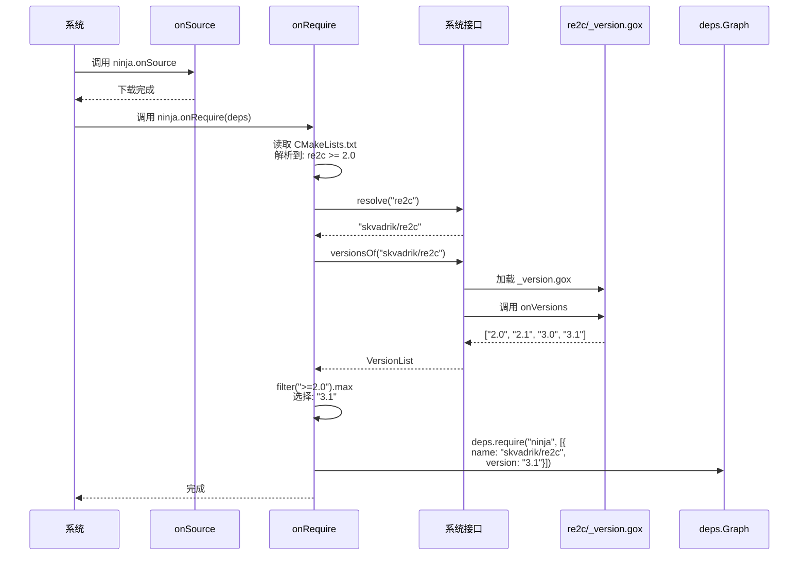

**关键点**:
- **版本管理分离**：`_version.gox` 独立于 `formula.gox`，轻量级解析
- **按需加载**：版本范围解析只需加载 `_version.gox`，无需加载完整配方
- onRequire **内部**完成版本约束到精确版本的转换
- 通过 `resolve()` 解析库名为 packageName
- 通过 `versionsOf()` 获取版本列表（内部自动加载 `_version.gox` 并调用 onVersions）
- 利用 XGo 自动属性：`max`（来自 `Max()`）
- `filter()` 方法内部调用 `_version.gox` 的 `compare()` 方法进行版本比较
- `deps.require()` 接收的是**精确版本号**

**优势**:
- 当上游更新 CMakeLists.txt 修改依赖时，配方无需修改
- 自动跟随构建系统的依赖声明
- 自动获取最新兼容版本

**对比 deps.json 方式**:

使用 deps.json（手动维护）:
```json
{
    "name": "ninja-build/ninja",
    "deps": {
        "1.11.0": [{
            "name": "skvadrik/re2c",
            "version": ">=2.0 <4.0"
        }]
    }
}
```
- key 是 fromVersion（从该版本开始使用此依赖配置）
- version 字段使用版本范围（空格分隔）
- 配方维护者需要手动更新

使用 onRequire（自动解析）:
- onRequire 从 CMakeLists.txt 读取版本要求
- 通过 `resolve()` 解析库名，通过 `versionsOf()` 获取版本列表
- 通过 `filter().max` 选择并填入精确版本
- 自动跟随上游依赖变化
- 性能优势：`versionsOf()` 只加载轻量级的 `_version.gox`，不加载完整配方

**其他构建系统示例**:
- **Conan**: 读取 `conanfile.txt` 中的 `re2c/[>=2.0]`，解析并转换为精确版本
- **Meson**: 读取 `meson.build` 中的 `dependency('re2c', version: '>=2.0')`
- **Autotools**: 读取 `configure.ac` 中的 `PKG_CHECK_MODULES([RE2C], [re2c >= 2.0])`

#### 故事 1.4: 针对不同包版本定义不同依赖范围

**作为** 配方维护者
**我希望** 为不同的包版本定义不同的依赖版本范围
**以便** 匹配不同版本的兼容性要求

**验收标准**:
- deps.json 的 key 是 fromVersion（单一版本号，表示起始点）
- 系统选择 `fromVersion <= 目标版本` 的最大 fromVersion

**示例**:
```json
{
    "name": "DaveGamble/cJSON",
    "deps": {
        "1.0.0": [{
            "name": "madler/zlib",
            "version": ">=1.2.1 <1.3.0"
        }],
        "1.2.0": [{
            "name": "madler/zlib",
            "version": ">=1.2.3 <2.0.0"
        }]
    }
}
```

### 3.2 用户故事

#### 故事 2.1: 首次构建自动生成 versions.json

**作为** 用户
**我希望** 首次构建时系统自动生成 versions.json
**以便** 无需手动配置即可开始使用

**验收标准**:
- 检测到 versions.json 不存在时，自动从 deps.json 解析
- 调用 onVersions 获取可用版本
- 根据版本范围选择最大版本
- 生成 versions.json 记录确切版本

**流程图**:
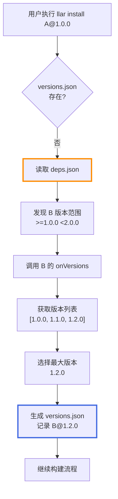

#### 故事 2.2: 手动升级依赖版本

**作为** 用户
**我希望** 能够手动升级特定依赖到更新版本
**以便** 及时获取上游的新功能和修复

**验收标准**:
- 可以删除 versions.json 中的特定依赖项
- 或删除整个 versions.json 文件
- 重新构建时系统重新解析版本范围并选择最新版本

**流程图**:
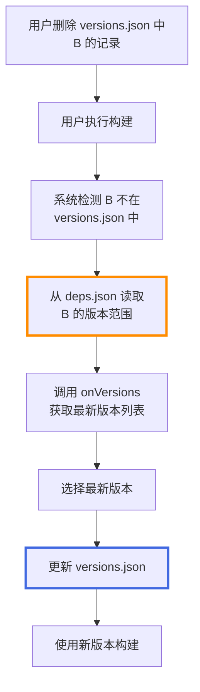

#### 故事 2.3: 手动降级依赖版本

**作为** 用户
**我希望** 能够手动降级特定依赖版本
**以便** 规避新版本的问题

**验收标准**:
- 可以直接编辑 versions.json 修改版本号
- 系统使用用户指定的版本进行构建

**流程图**:
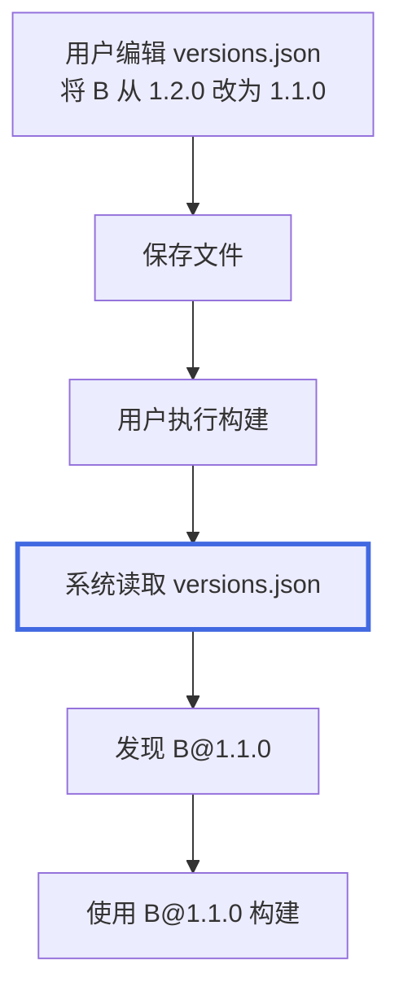

#### 故事 2.4: 使用 replace 强制替换依赖版本

**作为** 用户
**我希望** 使用 replace 功能强制指定依赖版本
**以便** 覆盖所有其他版本选择机制

**验收标准**:
- 可以在 versions.json 顶层添加 replace 字段
- replace 指定的版本优先级最高
- 即使 versions 数组中记录了不同版本，也使用 replace 指定的版本

**示例**:
```json
{
    "name": "A",
    "versions": {
        "1.0.0": [
            {
                "name": "B",
                "version": "1.2.0"
            }
        ]
    },
    "replace": {
        "B": "1.1.0"
    }
}
```

**流程图**:
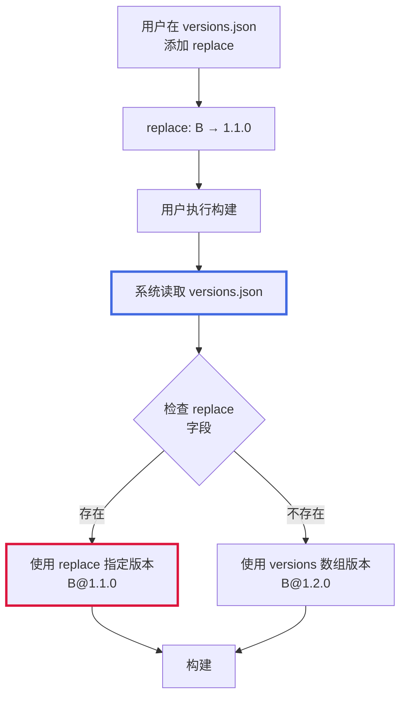

**场景**:
- versions 数组记录 B@1.2.0
- replace 指定 B@1.1.0
- 实际构建使用 B@1.1.0（replace 优先级最高）

#### 故事 2.5: 查看实际构建使用的版本

**作为** 用户
**我希望** 能够查看实际构建使用的精确版本和 Hash
**以便** 了解构建的确切依赖和确保可重现性

**验收标准**:
- 构建完成后自动生成/更新 versions-lock.json
- 文件记录实际使用的版本号
- 文件记录源码 Hash 和配方 Hash
- 文件不包含 replace（replace 仅在 versions.json 中）

**示例**:
```json
{
    "name": "DaveGamble/cJSON",
    "versions": {
        "1.7.18": [
            {
                "name": "madler/zlib",
                "version": "1.2.13",
                "sourceHash": "b095afb551dd4efb9ee43543cd547aeb179644d7a51c1f4d1d92b831b2ccd1469d419c7980a1428da66a95aaaa...",
                "formulaHash": "abc123def456789"
            },
            {
                "name": "other/package",
                "version": "2.1.0",
                "sourceHash": "e3b0c44298fc1c149afbf4c8996fb92427ae41e4649b934ca495991b7852b855...",
                "formulaHash": "fed456cba987321"
            }
        ]
    }
}
```

## 4. 版本范围语法规范

### 4.1 支持的语法

| 语法 | 含义 | 示例 |
|------|------|------|
| `1.2.3` | 精确版本 | `1.2.3` |
| `>=1.2.3` | 大于等于 | `>=1.2.3` |
| `>1.2.3` | 大于 | `>1.2.3` |
| `<=1.2.3` | 小于等于 | `<=1.2.3` |
| `<1.2.3` | 小于 | `<1.2.3` |
| `>=1.2.3 <2.0.0` | 范围组合（AND，空格分隔） | `>=1.2.3 <2.0.0` |

### 4.2 不支持的语法

- `^1.2.3`（semver 兼容语法）
- `~1.2.3`（semver 补丁语法）
- `*`（任意版本）
- `1.2.x`（通配符）

**原因**: LLAR 不基于 semver，使用自定义 Compare 方法或 GNU sort -V

## 5. 文件位置和上传策略

### 5.1 文件位置

```
项目根目录/
├── formula/                    # 配方代码
│   ├── deps.json              # 配方仓库文件（与配方代码一起）
│   └── formula.gox
├── versions.json              # 用户本地（不上传）
└── versions-lock.json         # 用户本地（不上传）
```

### 5.2 .gitignore 配置

```gitignore
# 用户本地版本管理文件，不上传到远程
versions.json
versions-lock.json
```

**原因**:
- versions.json: 用户个性化配置，不应上传
- versions-lock.json: 构建产物，不应上传
- deps.json: 配方仓库的一部分，应该上传

## 6. 典型工作流

### 6.1 工作流 1: 首次使用依赖包

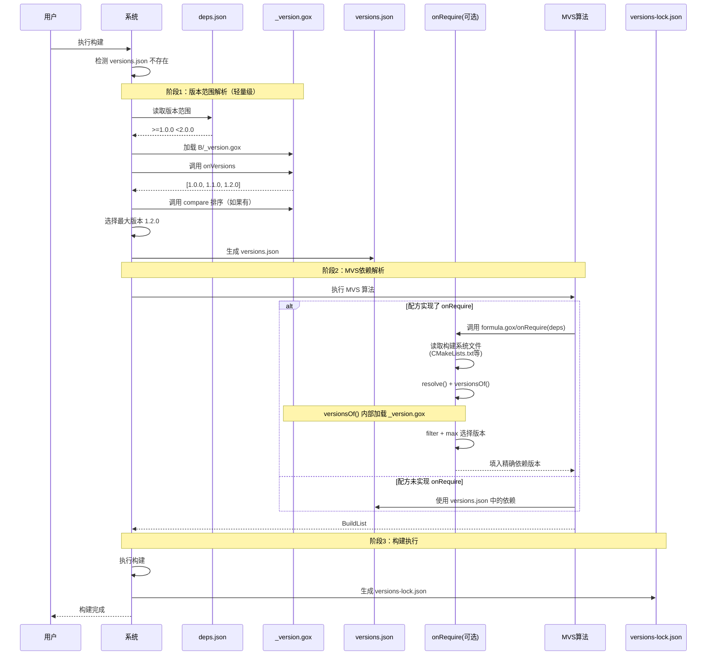

### 6.2 工作流 2: 升级特定依赖

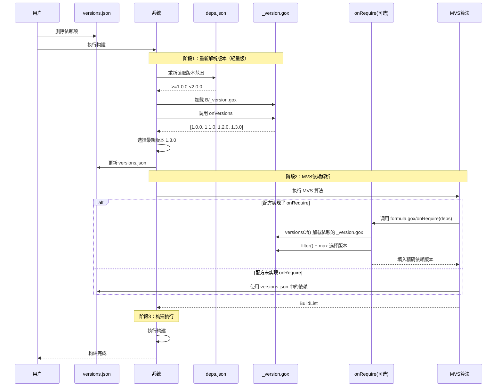

### 6.3 工作流 3: 降级或固定版本（使用 replace）

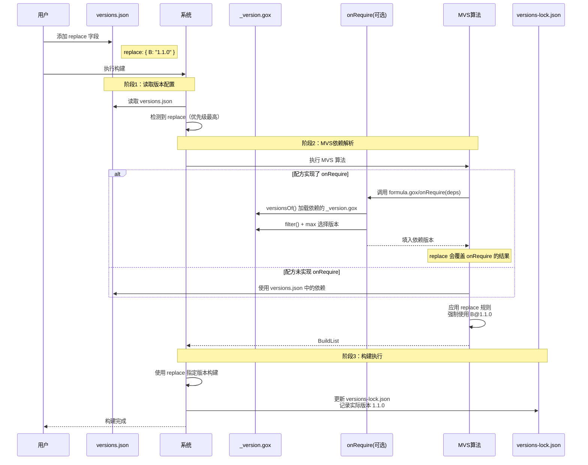

## 7. 与 Go 模块管理对比

| 特性 | Go | LLAR |
|------|-------|------|
| 配方仓库版本约束 | - | deps.json |
| 版本管理文件 | - | _version.gox（onVersions + compare） |
| 用户依赖声明 | go.mod | versions.json |
| 构建锁定 | go.sum | versions-lock.json |
| 版本范围语法 | semver | 比较操作符 |
| 获取可用版本 | 代理/注册表 | _version.gox/onVersions 回调 |
| 版本比较 | semver 规则 | _version.gox/compare 或 GNU sort -V |
| replace 功能 | go.mod | versions.json |
| 上传到远程 | go.mod 上传 | versions.json 不上传 |
| 性能优化 | - | 版本解析只需加载 _version.gox |

**核心差异**:
- Go 的 go.mod 会上传到远程，LLAR 的 versions.json 不上传
- LLAR 有三层架构（deps.json + versions.json + versions-lock.json）
- LLAR 不基于 semver，使用自定义比较
