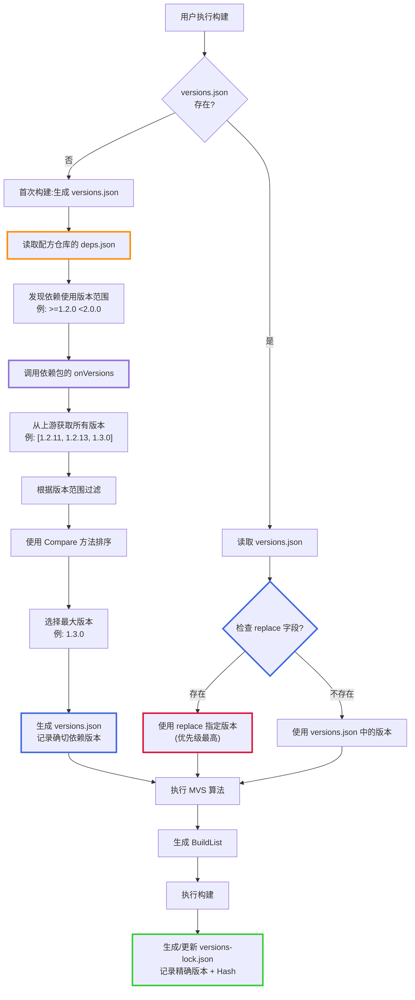
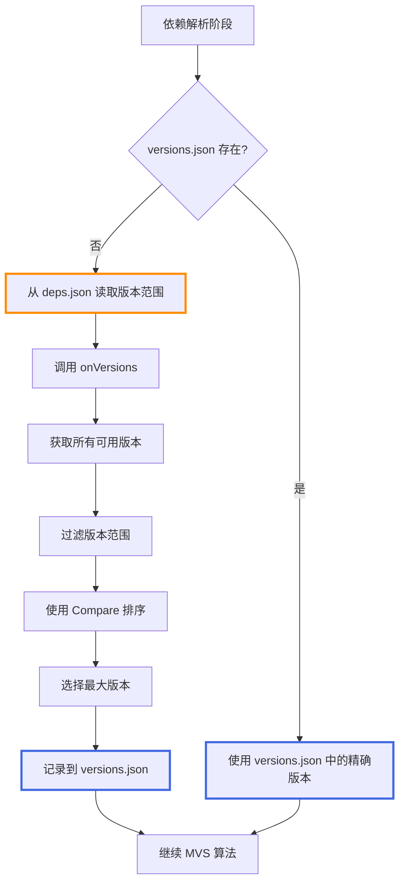
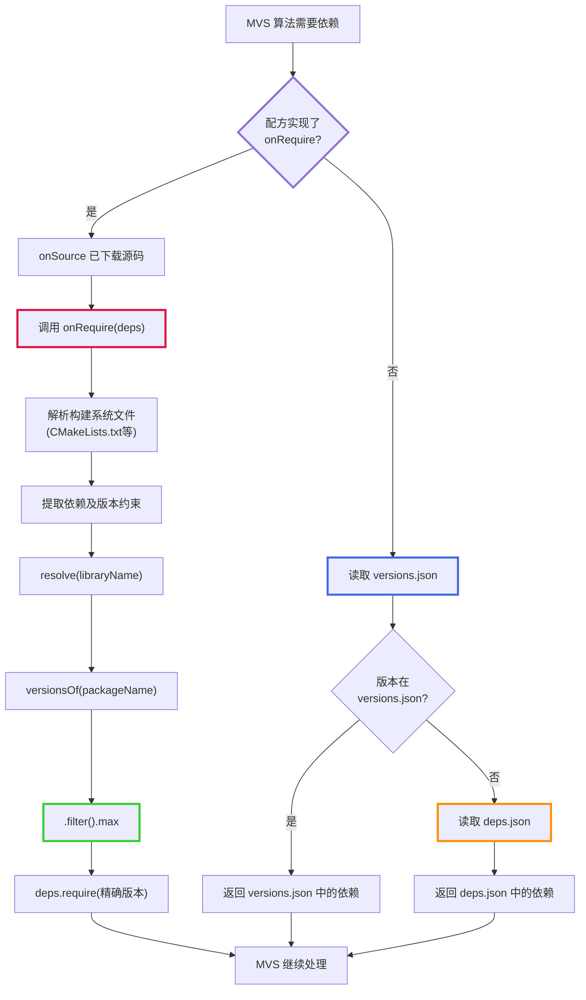
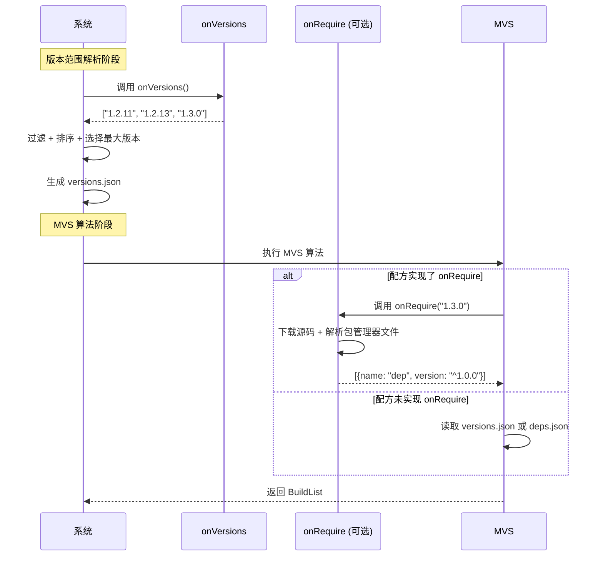

# LLAR 版本范围管理与版本锁定设计文档

## 1. 背景与问题

当前固定版本依赖方式存在以下问题:

**问题场景**:
- 包 A 依赖包 B
- A 版本为 1.0.0,依赖 B 1.0.0
- B 推出修复版本 1.2.0,但配方仓库未及时更新
- 用户希望及时更新到 B 1.2.0,但因为配方仓库是只读的无法修改

**根本原因**:
固定版本依赖缺乏版本范围表达能力,导致配方仓库更新不及时时,用户无法获取上游的修复版本。

## 2. 三层版本管理架构

### 2.1 架构概览


### 2.2 三层说明

| 特性 | deps.json | versions.json | versions-lock.json |
|------|-----------|---------------|-------------------|
| **位置** | 配方仓库 | 用户本地 | 用户本地 |
| **权限** | 只读 | 可修改 | 自动生成 |
| **上传远程** | 是 | 否（.gitignore） | 否（.gitignore） |
| **维护者** | 配方维护者 | 用户 | 系统自动 |
| **版本约束** | 大范围（>=1.0 <2.0） | 确切版本（1.2.3） | 精确版本 + Hash |
| **支持 replace** | 否 | 是 | 否 |
| **类比** | - | go.mod | go.sum |
| **目的** | 减少维护，自动更新 | 用户依赖管理 | 构建可重现 |
| **包含信息** | 版本范围、依赖关系 | 精确版本号 | 版本号 + sourceHash + **formulaHash** |

**versions-lock.json 特性**：
- **formulaHash**: 存储配方仓库的 git commit hash
- **可复现性**: 通过 git 还原配方快照，确保不同时间、环境的构建一致
- **团队协作**: 团队成员共享 versions-lock.json，使用完全相同的配方版本

## 3. 核心流程

### 3.1 完整依赖解析流程



### 3.2 版本选择优先级


### 3.3 可复现性构建：formulaHash 恢复机制

当存在 `versions-lock.json` 时，LLAR 会通过 `formulaHash` 还原配方至指定快照，确保构建的可复现性。


**流程说明**：

1. **检查锁定文件**：构建前检查是否存在 `versions-lock.json`

2. **恢复配方快照**：
   - 读取 `versions-lock.json` 中每个依赖的 `formulaHash`
   - 对每个依赖，使用 `git checkout <formulaHash>` 还原配方代码
   - 确保使用的配方与构建时完全一致

3. **构建执行**：使用还原后的配方执行构建

4. **验证一致性**：构建完成后验证生成的 Hash 与锁定文件中的一致

**示例场景**：

```
场景：团队协作，确保所有成员使用相同配方

开发者 A:
1. 首次构建 cJSON@1.7.18
2. 生成 versions-lock.json:
   {
       "name": "madler/zlib",
       "version": "1.2.13",
       "sourceHash": "b095afb551dd...",
       "formulaHash": "abc123def456"  # 配方 commit hash
   }
3. 提交 versions-lock.json 到项目仓库

开发者 B:
1. 拉取项目代码（包含 versions-lock.json）
2. 执行 llar install cJSON@1.7.18
3. LLAR 读取 formulaHash = "abc123def456"
4. LLAR 执行: git checkout abc123def456
5. 使用相同的配方版本构建
6. 得到完全相同的构建结果
```

**关键点**：
- **formulaHash** 是配方仓库的 git commit hash
- 通过 git 机制实现配方版本的精确控制
- 确保不同时间、不同环境的构建结果一致
- 即使配方仓库后续更新，也能还原到历史版本

## 4. 文件结构定义

### 4.1 deps.json（配方仓库）

#### 文件结构
```json
{
    "name": "DaveGamble/cJSON",
    "deps": {
        "1.0.0": [{
            "name": "madler/zlib",
            "version": ">=1.2.1 <1.3.0"
        }],
        "1.2.0": [{
            "name": "madler/zlib",
            "version": ">=1.2.3 <2.0.0"
        }]
    }
}
```

#### 结构化定义
```go
type Dependency struct {
    PackageName    string `json:"name"`
    VersionRange   string `json:"version"`  // 版本范围（空格分隔，参考 npm）
}

type PackageDependencies struct {
    PackageName  string                        `json:"name"`
    Dependencies map[string][]Dependency       `json:"deps"`     // key: fromVersion（起始版本号）
}
```

#### 说明
- **位置**: 配方仓库，与配方代码一起版本控制
- **权限**: 用户只读，无法修改
- **目的**: 减少配方维护工作量，使用大范围版本约束
- `deps` 的 key 是 **fromVersion**（单一版本号），表示从该版本开始使用此依赖配置
- 查询时选择 `fromVersion <= 目标版本` 的最大 fromVersion
- `deps` 的 `version` 字段使用版本范围表达式（如 `>=1.2.0 <2.0.0`，空格分隔）
- 不包含 `replace` 字段

### 4.2 versions.json（用户本地）

#### 文件结构
```json
{
    "name": "DaveGamble/cJSON",
    "versions": {
        "1.7.18": [
            {
                "name": "madler/zlib",
                "version": "1.2.13"
            },
            {
                "name": "other/package",
                "version": "2.1.0"
            }
        ],
        "1.7.17": [
            {
                "name": "madler/zlib",
                "version": "1.2.11"
            }
        ]
    },
    "replace": {
        "madler/zlib": "1.2.11"
    }
}
```

#### 结构化定义
```go
type Dependency struct {
    PackageName    string `json:"name"`
    Version        string `json:"version"`  // 精确版本号
}

type VersionsFile struct {
    PackageName   string                   `json:"name"`
    Versions      map[string][]Dependency  `json:"versions"` // key: 包版本号, value: 依赖数组
    Replace       map[string]string        `json:"replace,omitempty"` // key: PackageName, value: 精确版本号
}
```

#### 说明
- **位置**: 用户项目本地，不与配方代码一起版本控制
- **生成**: 首次构建时从 deps.json 解析生成
- **权限**: 用户可修改
- **上传策略**: 不上传到远程仓库（应添加到 .gitignore）
- **类比**: 类似 Go 的 go.mod
- `versions` 字段使用数组格式，每个元素包含 `name` 和 `version`
- `replace` 字段在顶层，允许用户替代特定依赖的版本（优先级最高）

### 4.3 versions-lock.json（构建锁定）

#### 文件结构
```json
{
    "name": "DaveGamble/cJSON",
    "versions": {
        "1.7.18": [
            {
                "name": "madler/zlib",
                "version": "1.2.13",
                "sourceHash": "b095afb551dd4efb9ee43543cd547aeb179644d7a51c1f4d1d92b831b2ccd1469d419c7980a1428da66a95aaaa...",
                "formulaHash": "abc123def456789"
            },
            {
                "name": "other/package",
                "version": "2.1.0",
                "sourceHash": "e3b0c44298fc1c149afbf4c8996fb92427ae41e4649b934ca495991b7852b855...",
                "formulaHash": "fed456cba987321"
            }
        ]
    }
}
```

#### 结构化定义
```go
type DependencyLock struct {
    PackageName   string `json:"name"`           // 包名
    Version       string `json:"version"`        // 锁定的版本号
    SourceHash    string `json:"sourceHash"`     // 源码 Hash (默认 sha256)
    FormulaHash   string `json:"formulaHash"`    // 配方 Git Commit Hash
}

type VersionLockFile struct {
    PackageName   string                      `json:"name"`
    Versions      map[string][]DependencyLock `json:"versions"` // key: 包版本号, value: 依赖数组（有序）
}
```

#### 说明
- **位置**: 用户项目本地，不与配方代码一起版本控制
- **生成**: 构建完成后自动生成或更新
- **权限**: 自动生成，用户一般不手动修改
- **上传策略**: 不上传到远程仓库（应添加到 .gitignore）
- **类比**: 类似 Go 的 go.sum
- **不包含** `replace` 字段（replace 在 versions.json 中）
- **用途**:
  - **构建可重现性**: 通过 `formulaHash` 还原配方快照（详见 [3.3 可复现性构建](#33-可复现性构建formulahash-恢复机制)）
  - **安全性验证**: 通过 `sourceHash` 验证源码完整性
  - **版本锁定**: 记录精确的依赖版本，防止意外更新
- **Hash 字段说明**:
  - `sourceHash`: 源码哈希值，默认使用 sha256 算法，存储纯哈希值（不含 "sha256:" 前缀）
  - `formulaHash`: 配方仓库的 git commit hash，存储 commit id（不含 "sha256:" 前缀）
  - 构建时通过 `git checkout <formulaHash>` 还原配方代码
  - 确保不同时间、不同环境使用相同的配方版本

## 5. 版本范围语法

版本范围采用基于比较操作符的约束语法（参考 npm，使用空格分隔）:

```
1.2.3            # 精确版本
>=1.2.3          # 大于等于 1.2.3
>1.2.3           # 大于 1.2.3
<=1.2.3          # 小于等于 1.2.3
<1.2.3           # 小于 1.2.3
>=1.2.3 <2.0.0   # 版本范围组合 (AND，空格分隔)
```

**说明**:
- LLAR 不基于 semver，因此不支持 `^` 和 `~` 等 semver 特有的语法
- 不支持 `*`（任意版本）和通配符语法
- 版本比较依赖包的自定义 Compare 方法或默认的 GNU sort -V 算法
- 使用**空格分隔**多个约束条件，表示 AND 关系（参考 npm）
- 不使用逗号分隔，避免歧义

## 6. 回调函数设计

### 6.1 onVersions 回调函数

#### 6.1.1 作用

`onVersions` 回调函数负责返回包的所有可用版本列表,供版本范围解析使用。

**场景示例**:
- 配方维护者在 `madler/zlib` 配方中实现 `onVersions` 函数
- 上游 GitHub 仓库发布了新版本 `1.3.0`
- 配方中的 `onVersions` 函数会从 GitHub API 获取所有 tags
- 当其他包依赖 `madler/zlib` 且使用版本范围 `>=1.2.0 <2.0.0` 时
- 系统自动调用 `onVersions` 获取版本列表 `["1.2.11", "1.2.13", "1.3.0"]`
- 系统过滤出符合范围的版本并选择最大版本 `1.3.0`
- 用户无需手动更新配方即可获得最新版本

#### 6.1.2 调用时机



### 6.2 onRequire 回调函数（可选）

#### 6.2.1 作用

`onRequire` 是一个**可选的**回调函数，用于从源码中的构建系统文件（如 CMakeLists.txt、conanfile.txt、configure.ac 等）解析出依赖关系。

**使用场景**:
- 上游包使用 CMake/Conan/Meson 等构建系统，包含依赖信息
- 配方维护者可以实现 onRequire 来自动解析这些依赖
- 避免在 deps.json 中手动维护依赖关系

**场景示例 - Ninja 构建工具**:
- Ninja 使用 CMake 构建系统，CMakeLists.txt 中声明了 `find_package(re2c 2.0)`
- 配方维护者为 Ninja 实现 `onRequire` 函数
- onSource 已下载源码到临时目录
- onRequire 解析 CMakeLists.txt，提取依赖 `re2c >= 2.0`
- 通过 `resolve("re2c")` 将库名转换为完整 packageName `skvadrik/re2c`
- 通过 `versionsOf(packageName).filter(">=2.0").max` 选择最大版本
- 填入精确版本到依赖图
- 当上游包更新 CMakeLists.txt 依赖时，配方无需修改即可自动适配

#### 6.2.2 工作流程



#### 6.2.3 系统提供的接口

**配方接口**:
- `resolve(libraryName string) string`: 将库名转换为完整的 packageName
  - 输入: `"re2c"`
  - 输出: `"skvadrik/re2c"`

- `versionsOf(packageName string) VersionList`: 获取指定包的版本列表
  - 输入: `"skvadrik/re2c"`
  - 输出: VersionList 对象（内部加载 _version.gox 并调用 onVersions）

- `versionList.filter(constraint string) VersionList`: 根据版本约束过滤版本
  - 内部调用配方的 `Compare()` 方法进行版本比较

- `versionList.max`: XGo 自动属性，获取最大版本（编译为 `.Max()`）

- `readFile(path string) string`: 读取文件内容

- `deps.require(packageName, dependencies)`: 填入依赖到依赖图

#### 6.2.4 示例：Ninja 包的 onRequire

```go
// ninja.gox 配方 - Classfile 语法

// onVersions 回调函数 - 获取所有可用版本
onVersions => {
    return fetchGitHubTags("ninja-build/ninja")
}

// Versions() 方法 - 系统会缓存结果
func Versions() VersionList {
    return VersionList{versions: onVersions()}
}

// onSource 回调函数 - 下载源码
onSource version => {
    // 下载源码到临时目录
    url := "https://github.com/ninja-build/ninja/archive/v${version}.tar.gz"
    download(url)?
}

// onRequire 回调函数 - 从 CMakeLists.txt 解析依赖
onRequire deps => {
    // 1. 读取 CMakeLists.txt（onSource 已下载）
    cmake := readFile("CMakeLists.txt")?

    // 2. 解析依赖声明
    if cmake.contains("find_package(re2c 2.0") {
        // 3. 解析库名为完整 packageName
        packageName := resolve("re2c")  // "skvadrik/re2c"

        // 4. 获取版本列表、过滤并选择最大版本
        selectedVersion := versionsOf(packageName).filter(">=2.0").max

        // 5. 填入精确版本
        deps.require("ninja-build/ninja", [{
            name: packageName,
            version: selectedVersion
        }])
    }
}
```

#### 6.2.5 与 onVersions 的区别

| 特性 | onVersions | onRequire |
|------|-----------|-----------|
| **是否必需** | 必需 | 可选 |
| **作用** | 获取包的所有可用版本 | 从源码构建系统解析依赖 |
| **输入** | 无参数 | deps 接口 |
| **输出** | 版本列表 `["1.2.11", "1.2.13", "1.3.0"]` | 通过 `deps.require()` 填入精确版本 |
| **调用阶段** | 版本范围解析阶段 | MVS 算法阶段 |
| **数据源** | 上游仓库（如 GitHub API） | 源码中的构建系统文件 |
| **使用场景** | 每个配方都需要 | 有构建系统文件的包可选实现 |
| **优势** | 获取最新版本 | 自动同步上游依赖变化 |
| **版本处理** | 返回版本列表 | 内部转换为精确版本 |

#### 6.2.6 何时使用 onRequire

**适合使用 onRequire**:
- 上游包有标准的构建系统文件（CMakeLists.txt、conanfile.txt、meson.build 等）
- 依赖关系经常变化，手动维护 deps.json 成本高
- 希望自动跟随上游依赖更新

**不适合使用 onRequire**:
- 上游包没有构建系统文件
- 依赖关系简单且稳定
- 需要对依赖进行精确控制

**注意**:
- 如果未实现 onRequire，系统会回退到使用 versions.json 或 deps.json
- onRequire 内部需要将版本约束转换为精确版本，通过 `versionsOf().filter().max` 完成
- 配方之间不直接依赖，通过 `versionsOf()` 获取版本信息

### 6.3 回调函数流程对比



## 7. 示例场景

### 7.1 场景一:配方更新不及时，系统自动选择最新版本

**问题**:
- 包 A 1.0.0 依赖包 B 1.0.0 (固定版本)
- B 推出修复版本 1.2.0
- 配方仓库未及时更新

**解决方案（三层架构）**:

**步骤1**: 配方维护者在 deps.json 中使用大范围约束
```json
{
    "name": "A",
    "deps": {
        "1.0.0": [{
            "name": "B",
            "version": ">=1.0.0 <2.0.0"
        }]
    }
}
```

**步骤2**: 用户首次构建时，系统自动生成 versions.json
- 系统读取 deps.json 中的版本范围 `>=1.0.0 <2.0.0`
- 调用 B 的 `onVersions` 获取所有可用版本
- 获取到 `[1.0.0, 1.1.0, 1.2.0]`
- 自动选择最大版本 1.2.0
- 生成 versions.json:

```json
{
    "name": "A",
    "versions": {
        "1.0.0": [
            {
                "name": "B",
                "version": "1.2.0"
            }
        ]
    }
}
```

**步骤3**: 构建完成后生成 versions-lock.json
```json
{
    "name": "A",
    "versions": {
        "1.0.0": [
            {
                "name": "B",
                "version": "1.2.0",
                "sourceHash": "b095afb551dd4efb...",
                "formulaHash": "abc123def456"
            }
        ]
    }
}
```

**结果**:
- 用户无需等待配方更新，即可自动使用 B 1.2.0
- versions.json 记录了用户项目使用的确切版本
- versions-lock.json 确保构建可重现

### 7.2 场景二:用户手动固定版本（使用 replace）

**需求**:用户发现 B 1.2.0 有问题，希望降级到 B 1.1.0

**操作步骤**:

**步骤1**: 用户手动编辑 versions.json，添加 replace 字段
```json
{
    "name": "A",
    "versions": {
        "1.0.0": [
            {
                "name": "B",
                "version": "1.2.0"
            }
        ]
    },
    "replace": {
        "B": "1.1.0"
    }
}
```

**步骤2**: 重新构建
- 系统读取 versions.json
- 发现 replace 字段，优先级最高
- 使用 B 1.1.0 替代 B 1.2.0

**步骤3**: 更新 versions-lock.json
```json
{
    "name": "A",
    "versions": {
        "1.0.0": [
            {
                "name": "B",
                "version": "1.1.0",
                "sourceHash": "e3b0c44298fc1c14...",
                "formulaHash": "fed456cba987321"
            }
        ]
    }
}
```

**结果**:
- 用户通过 versions.json 的 replace 功能实现了版本降级
- versions-lock.json 记录了实际构建使用的版本 1.1.0
- replace 仅存在于 versions.json，不存在于 versions-lock.json
