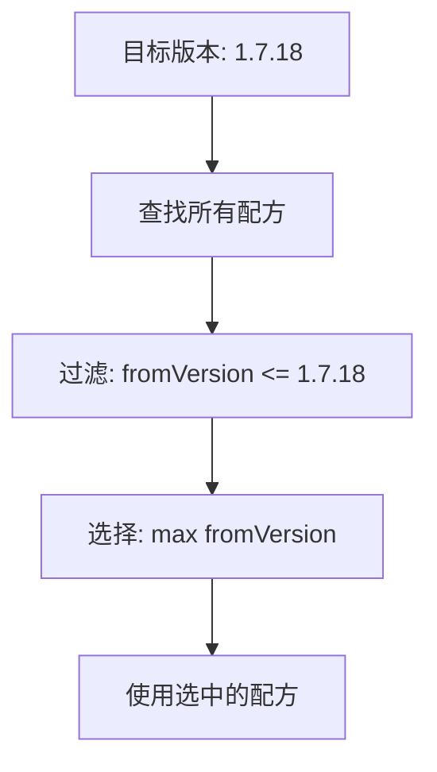
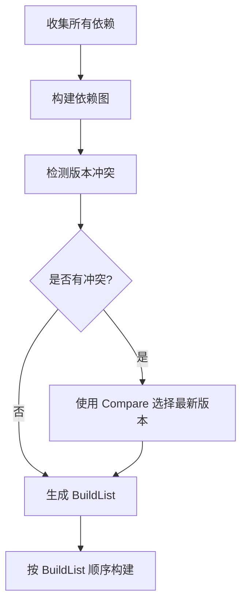
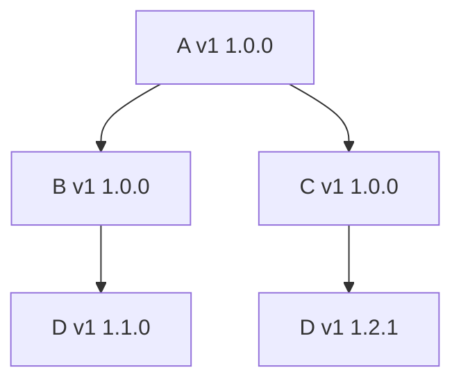
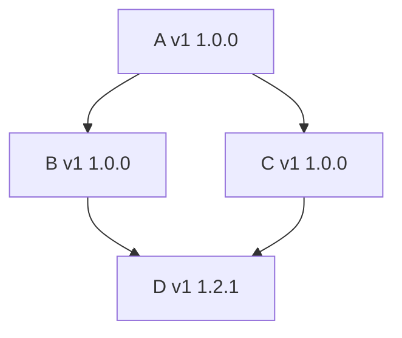
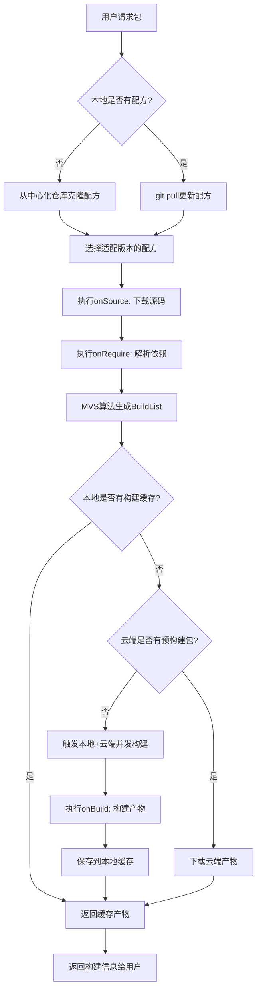
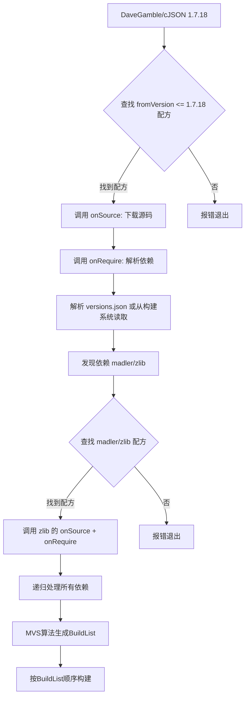

# LLAR 版本管理系统设计文档

## 1. 背景与动机

### 1.1 为什么需要重新设计版本管理系统？

我们为什么要重新建立一个版本管理系统？答案是不可以直接复用别人的。

**原因**：
- LLAR 目标是任意语言的资产管理
- 不同语言之间，往往管理体系不一样
- 有些语言甚至压根没有管理体系（如 C/C++）
- 我们需要为它们提供一套统一、标准的版本管理方案

这样我们才能彻底消除不同语言的隔阂，实现统一的包资产管理。

### 1.2 现有包管理器的问题

现有包管理器版本选择往往是不够智能的，以 Conan 为例：
- 版本选择仅提供简单的版本范围功能
- 版本冲突解决往往需要人工手动处理
- 对于具有一定复杂度的依赖非常不友好

我们希望为 LLAR 引入一种类似于 Go MVS 的方案：
- 具有 High-Fidelity Builds（高保真构建）
- 足够通用，能够自动解决版本冲突
- 适配所有语言生态

## 2. 设计目标

1. **尽量不破坏原库版本管理体系**：在不改变上游版本号的前提下，引入 LLAR 版本管理
2. **统一标准版本管理**：提供跨语言的统一版本管理方案
3. **自动冲突解决**：能够自动解决版本冲突，具有高保真构建特性
4. **通用性强**：足够通用，适配所有语言生态

## 3. 核心数据结构

### 3.1 PackageVersion 结构

```go
type PackageVersion struct {
    PackageName string  // 包名，格式：owner/repo
    Version     string  // 原版本号，保持上游格式
}
```

**设计说明**：
- `PackageName` 格式为 `owner/repo`（如 `DaveGamble/cJSON`）
- `Version` 保持上游原始版本号格式，不做转换
- 这样设计可以最大程度保持与上游的兼容性

### 3.2 PackageVersion 在系统中的作用

`PackageVersion` 是 LLAR 系统中最基本的标识单位，用于：
- 唯一标识一个特定版本的包
- 作为依赖关系图的节点
- 作为 MVS 算法的输入
- 作为构建任务的标识

## 4. 版本比较机制

### 4.1 版本号的特征分析

虽然不同语言的版本号形态不同，但它们一般有一个清晰的特征：

> **版本号是单调递增的**

这是我们进行版本比较的基础假设。

### 4.2 默认比较算法

**算法来源**：LLAR 使用 GNU Coreutils 的 `sort -V` 算法

**算法特点**：
- 来源于 Debian 版本比较算法
- 尽可能通用的版本比较算法
- Best Effort 方式处理各种版本格式

**适用场景**：
- 没有明确版本规范的包（如 C/C++ 项目）
- 使用常见版本格式的包（如 1.0.0, v2.3.4 等）

**局限性**：
- C/C++ 并无明确版本规范
- GNU 算法仅是竭尽所能去比较（Best Effort）
- 并不适合所有情况

### 4.3 自定义版本比较

#### 4.3.1 设计动机

对于有特殊版本规则的包，维护者可以提供自定义比较逻辑。

**为什么需要自定义比较**：
1. 配方维护者往往很容易就能找出版本的规律
2. 可以针对特定包编写精确的比较规则
3. 一般来说，多数库的版本规则不会发生改变
4. 即使发生改变，也可以灵活处理

#### 4.3.2 版本管理文件

**文件名称**：`{{repo}}_version.gox`

**文件位置**：必须存在于当前包根目录下

**目录结构示例**：
```
DaveGamble/
└── cJSON/
    ├── versions.json        # 依赖管理文件（放在根目录）
    ├── cJSON_version.gox    # 版本管理（onVersions + compare）
    ├── go.mod
    ├── go.sum
    ├── 1.x/
    │   └── cJSON_llar.gox
    └── 2.x/
        └── cJSON_llar.gox
```

**为什么单独拆分到 `_version.gox` 文件**：
- 由于配方会因为上游版本号变动导致配方出现版本号问题
- 版本管理逻辑（onVersions + compare）应该是轻量级的，不应该加载整个配方
- 将版本管理逻辑拆出来一个独立文件，提高性能并便于维护

#### 4.3.3 自定义比较接口

```go
type ComparableVersion interface {
    // 当 a > b，返回 1
    // 当 a == b，返回 0
    // 当 a < b，返回 -1
    Compare(comparator func(a, b PackageVersion) int)
}
```

**说明**：
- 由于 XGO Classfile 最佳实践是避免用户写函数声明
- 使用闭包函数替代传统的函数定义

#### 4.3.4 自定义比较示例

**示例 1：使用 Semver 库**

```javascript
import (
    semver "github.com/Masterminds/semver/v3"
)

compare (a, b) => {
    echo "a: ${a.Ver} b: ${b.Ver}"
    v1 := semver.NewVersion(a.Ver)!
    v2 := semver.NewVersion(b.Ver)!
    return v1.Compare(v2)
}
```

**示例 2：自定义比较逻辑**

```javascript
compare (a, b) => {
    // 解析版本号
    aParts := parseVersion(a.Ver)
    bParts := parseVersion(b.Ver)

    // 逐段比较
    for i := 0; i < len(aParts); i++ {
        if aParts[i] > bParts[i] {
            return 1
        } else if aParts[i] < bParts[i] {
            return -1
        }
    }

    return 0
}
```

## 5. 配方版本管理

### 5.1 配方的版本适配

一个包的不同版本可能需要不同的构建配方。LLAR 通过目录结构和 `fromVersion` 机制来管理配方的版本适配。

### 5.2 目录版本规范

#### 单配方结构

当所有版本使用相同配方时：

```
{{owner}}/
└── {{repo}}/
    ├── versions.json
    └── {{repo名称首字母大写}}_llar.gox
```

#### 多配方结构

当不同版本需要不同配方时：

```
{{owner}}/
└── {{repo}}/
    ├── versions.json            # 依赖管理文件（放在根目录）
    ├── go.mod
    ├── go.sum
    ├── 1.x/                     # 适配 1.x 版本
    │   └── {{repo名称首字母大写}}_llar.gox
    └── 2.x/                     # 适配 2.x 版本
        └── {{repo名称首字母大写}}_llar.gox
```

**目录命名规范**：
- 目录名称应该与配方 `fromVersion` 保持一致
- 使用通配符版本号（如 `1.x`, `2.x`, `1.0.x` 等）

### 5.3 fromVersion 机制

#### fromVersion 定义

在配方中声明该配方能够处理的起始版本号：

```javascript
// 当前配方仅兼容1.0.0后的版本
fromVersion "1.0.0"
```

#### fromVersion 选择算法

**选择原则**：选择小于等于目标版本的最大 `fromVersion` 对应的配方

**选择流程**：



**示例**：

假设目录结构：
```
DaveGamble/
└── cJSON/
    ├── versions.json
    ├── 1.0.x/                    # fromVersion: 1.0.0
    │   └── CJSON_llar.gox
    ├── 1.5.x/                    # fromVersion: 1.5.0
    │   └── CJSON_llar.gox
    └── 2.x/                      # fromVersion: 2.0.0
        └── CJSON_llar.gox
```

版本选择结果：
- 请求版本 `1.2.0` → 选择 `1.0.x/CJSON_llar.gox` (fromVersion: 1.0.0)
- 请求版本 `1.7.18` → 选择 `1.5.x/CJSON_llar.gox` (fromVersion: 1.5.0)
- 请求版本 `2.3.0` → 选择 `2.x/CJSON_llar.gox` (fromVersion: 2.0.0)

### 5.4 为什么采用版本号目录的方式

在 LLPkg 中，遇到了类似的问题。LLPkg 的解决方案是使用 Go Nested Module 方式，然而这类解决方案看起来优雅，却有相当多的问题：

**Go Nested Module 的问题**：
1. 对历史 Formula 进行维护会产生诸多问题
2. 版本映射问题
3. 容易产生大量的 tags

**LLAR 的解决方案**：
- 吸取 LLPkg 教训后，决定不再采取 Go Nested Module 设计
- 采用目录结构 + fromVersion 的方式
- 简单直观，易于维护

## 6. 版本选择算法（MVS）

### 6.1 算法背景

LLAR 采用 Go MVS（Minimal Version Selection）算法进行版本选择。

**为什么选择 Go MVS**：
1. **高保真构建**：确保相同输入产生相同输出
2. **自动冲突解决**：通过算法自动选择兼容版本
3. **久经验证**：Go 生态系统的成功实践
4. **可扩展性**：支持自定义版本比较逻辑

### 6.2 MVS 核心概念

#### Module Path

在 Go MVS 算法中，需要 Module Path 来标识不同的包。

**LLAR 的实现**：
- **使用 PackageName 作为 Module Path**
- PackageName 格式：`owner/repo`
- 示例：`DaveGamble/cJSON`

**注意**：PackageName 也被用作 Go MVS 算法中的 Module Path，因此必须保持唯一性和稳定性。

#### Version Comparator

版本比较函数，用于比较同一个包的不同版本。

```go
type VersionComparator func(v1, v2 string) int
```

**比较规则**：
- 返回 1：v1 > v2
- 返回 0：v1 == v2
- 返回 -1：v1 < v2

### 6.3 算法工作流程

#### 基本流程



#### 版本冲突解决示例

**场景**：



**冲突检测**：
- 依赖 D 存在两个版本：1.1.0 和 1.2.1

**解决过程**：
1. 检测到依赖 D 存在两个版本：1.1.0 和 1.2.1
2. 使用 D 包的 `Compare` 方法比较版本
3. 自动选择较新的版本 1.2.1

**解决后的依赖图**：



### 6.4 BuildList 生成

#### BuildList 定义

BuildList 是 MVS 算法输出的构建顺序列表，按拓扑排序排列。

**特点**：
- 从底层依赖到上层依赖
- 确保依赖在使用前已经构建完成
- 支持并行构建（无依赖关系的包可以并行）

#### BuildList 示例

假设依赖关系：
```
cJSON 依赖 zlib
zlib 依赖 glibc
```

**BuildList 顺序**：
```
glibc -> zlib -> cJSON
```

**说明**：
- 必须先构建 glibc，再构建 zlib，最后构建 cJSON
- 这与依赖解析顺序（深度优先遍历）相反

### 6.5 算法实现要求

由于我们采用 Go MVS 选择算法，算法要求提供：

1. **版本比较函数**：
   - 默认使用 GNU `sort -V` 算法
   - 可通过 `_version.gox` 自定义

2. **Module Path**：
   - 使用 PackageName 作为 Module Path
   - 格式：`owner/repo`

## 7. 版本验证与检查

### 7.1 版本存在性检查

#### onVersions 回调

配方通过 `onVersions` 回调返回所有可用版本：

```javascript
onVersions => {
    // 从GitHub获取所有tags
    tags := fetchTagsFromGitHub("DaveGamble/cJSON")!

    // 转换为版本列表
    return githubTagsToVersion("v1", tags)
}
```

#### 执行时机

- `onVersions` 回调仅在 `llar list` 命令时被调用
- 用于列出包的所有可用版本

#### 版本不存在处理

- `onSource` 会在下载源码时自动检查版本是否存在
- 如果版本不存在会直接报错
- 正常构建流程不需要单独的版本检查步骤

### 7.2 版本验证流程

```mermaid
graph TD
A[用户请求包@版本] --> B[选择适配版本的配方]
B --> C[执行 onSource]
C --> D{版本是否存在?}
D -- 否 --> E[报错退出]
D -- 是 --> F[下载源码]
F --> G[执行 onRequire]
G --> H[继续构建流程]
```

## 8. 依赖版本管理

### 8.1 versions.json 格式

#### 基本结构

```json
{
    "name": "DaveGamble/cJSON",
    "deps": {
        "1.0.0": [{
            "name": "madler/zlib",
            "version": "1.2.1"
        }],
        "1.2.0": [{
            "name": "madler/zlib",
            "version": "1.2.3"
        }]
    },
    "replace": {
        "1.0.0": {
            "madler/zlib": "1.2.13"
        }
    }
}
```

#### 字段说明

**deps 对象**：
- key 值（如 `"1.0.0"`, `"1.2.0"`）表示 `fromVersion`
- 即**从该版本开始**使用对应的依赖配置
- 查询某个版本的依赖时，会选择小于等于该版本的最大 `fromVersion` 的依赖列表

**replace 对象**（可选）：
- 也按 `fromVersion` 组织
- 用于强制替换依赖版本
- 类似 go.mod 的 replace 指令

#### 版本查询示例

假设 versions.json：
```json
{
    "deps": {
        "1.0.0": [{"name": "madler/zlib", "version": "1.2.1"}],
        "1.2.0": [{"name": "madler/zlib", "version": "1.2.3"}]
    }
}
```

查询结果：
- 查询版本 `1.1.5` → 使用 `fromVersion = "1.0.0"` 的依赖配置 → zlib 1.2.1
- 查询版本 `1.5.0` → 使用 `fromVersion = "1.2.0"` 的依赖配置 → zlib 1.2.3

### 8.2 结构化定义

```go
type Dependency struct {
    PackageName string `json:"name"`
    Version     string `json:"version"`
}

type PackageDependencies struct {
    PackageName  string                       `json:"name"`
    Dependencies map[string][]Dependency      `json:"deps"`    // key: fromVersion
    Replace      map[string]map[string]string `json:"replace"` // key: fromVersion
}
```

### 8.3 动态依赖管理

#### replace 功能

通过 `onRequire` 回调动态替换依赖版本：

```javascript
onRequire deps => {
    // 强制替换依赖版本（类似 go.mod 的 replace）
    deps.replace("madler/zlib", "1.2.13")
}
```

#### deps.Graph 接口

```go
type Graph interface {
    // 修改 packageName 的依赖为 deps
    Require(packageName string, deps []Dependency)

    // 获取版本为 version 的 packageName 的依赖
    RequiredBy(packageName string, version version.Version) ([]Dependency, bool)

    // 强制替换依赖包的版本（类似 go.mod 的 replace）
    Replace(packageName string, version string)
}
```

## 9. 版本与构建流程

### 9.1 完整生命周期



### 9.2 版本选择流程详解



### 9.3 依赖解析顺序

#### onRequire 调用顺序

- **顺序**：按照依赖树的**深度优先遍历顺序**
- **示例**：假设 `cJSON` 依赖 `zlib`，`zlib` 依赖 `glibc`
  - 遍历顺序：`cJSON -> zlib -> glibc`
- **目的**：收集所有包的依赖关系信息

#### onBuild 调用顺序

- **顺序**：按照 MVS **BuildList 顺序**（拓扑排序，从底层依赖到上层）
- **示例**：假设 `cJSON` 依赖 `zlib`，`zlib` 依赖 `glibc`
  - BuildList 顺序：`glibc -> zlib -> cJSON`
- **目的**：确保依赖在使用前已经构建完成

## 10. 版本缓存与产物管理

### 10.1 构建缓存信息

每个构建产物目录下包含元数据文件：

#### .cache.json

```json
{
    "packageName": "DaveGamble/cJSON",
    "version": "1.7.18",
    "matrix": "x86_64-c-darwin",
    "matrixDetails": {
        "arch": "x86_64",
        "lang": "c",
        "os": "darwin"
    },
    "buildTime": "2025-01-17T10:30:00Z",
    "buildDuration": "45.2s",
    "outputs": {
        "dir": "/Users/user/Library/Caches/.llar/formulas/DaveGamble/cJSON/build/1.7.18/x86_64-c-darwin",
        "linkArgs": "-L.../lib -lcjson -I.../include"
    },
    "sourceHash": "sha256:aaaabbbbccccdddd...",
    "formulaHash": "sha256:1111222233334444..."
}
```

#### .deps-lock.json

```json
{
    "dependencies": [
        {
            "name": "madler/zlib",
            "version": "1.2.13",
            "sourceHash": "sha256:eeeeffff11112222...",
            "formulaHash": "sha256:33334444aaaabbbb..."
        }
    ]
}
```

**字段说明**：
- `.cache.json` 记录当前包的构建产物信息
- `.deps-lock.json` 记录当前包构建时使用的所有依赖版本（MVS 解析后的结果）及其 Hash
- 确保构建的可重现性

### 10.2 Hash 来源

**sourceHash**：
- 从源码计算得出
- 通常从 GitHub Release、官方下载包等源码文件计算 SHA256

**formulaHash**：
- 从配方文件计算得出
- 对所有 `.gox` 文件和 `versions.json` 文件内容计算 SHA256

### 10.3 产物存储结构

**位置**：`{{UserCacheDir}}/.llar/formulas/{{owner}}/{{repo}}/build/{{Version}}/{{Matrix}}/`

**目录结构**：
```
{{UserCacheDir}}/.llar/formulas/DaveGamble/cJSON/build/
├── 1.7.18/                      # 版本号目录
│   ├── x86_64-c-darwin/         # 矩阵组合1
│   │   ├── .cache.json
│   │   ├── .deps-lock.json
│   │   ├── include/
│   │   └── lib/
│   ├── arm64-c-darwin/          # 矩阵组合2
│   │   ├── .cache.json
│   │   ├── .deps-lock.json
│   │   ├── include/
│   │   └── lib/
│   └── x86_64-c-linux/          # 矩阵组合3
│       ├── .cache.json
│       ├── .deps-lock.json
│       ├── include/
│       └── lib/
└── 1.7.17/
    └── x86_64-c-darwin/
        ├── .cache.json
        ├── .deps-lock.json
        ├── include/
        └── lib/
```

## 11. 版本相关 CLI 命令

### 11.1 列出包的所有版本

```bash
llar list <package>
```

**功能**：列出指定包的所有可用版本

**输出示例**：
```
1.7.18
1.7.17
1.7.16
```

**JSON 格式输出**（`-json` 参数）：
```json
[
    {"Version": "1.7.18"},
    {"Version": "1.7.17"},
    {"Version": "1.7.16"}
]
```

**内部实现**：
- 调用配方的 `onVersions` 回调
- 从 GitHub tags、官方 API 或其他源获取版本列表

### 11.2 获取包的构建信息

```bash
llar info <PackageName>[@<PackageVersion>]
```

**功能**：返回指定版本包的构建信息（`.cache.json` 文件内容）

**输出示例**（格式化输出）：
```
Package: DaveGamble/cJSON
Version: 1.7.18
Matrix: x86_64-c-darwin
Build Time: 2025-01-17T10:30:00Z
Build Duration: 45.2s

Matrix Details:
  arch: x86_64
  lang: c
  os: darwin

Build Outputs:
  Dir: /Users/user/Library/Caches/.llar/formulas/DaveGamble/cJSON/build/1.7.18/x86_64-c-darwin
  LinkArgs: -L.../lib -lcjson -I.../include

Source Hash: sha256:aaaabbbbccccdddd...
Formula Hash: sha256:1111222233334444...
```

### 11.3 下载并使用包

```bash
llar download <package>[@version]
```

**功能**：下载指定版本的包并返回其构建信息

**参数**：
- `-s` / `--source`：仅获取源码不需要二进制包
- `-a` / `--all`：不仅获取源码还获取二进制
- `-json`：以 JSON 格式输出

**版本选择规则**：
- 如果指定版本：使用指定版本
- 如果不指定版本：使用 latest（最新版本）

## 12. 高保真构建保证

### 12.1 什么是高保真构建

高保真构建（High-Fidelity Builds）是指：
- 相同的输入产生相同的输出
- 构建结果可重现
- 版本选择确定性

### 12.2 LLAR 的实现方式

#### 通过 MVS 算法

Go MVS 已经实现了高保真比较，我们可以很顺利就实现了高保真版本选择。

#### 通过依赖锁定

- `.deps-lock.json` 记录所有依赖的确切版本
- 包含源码和配方的 Hash
- 确保构建的可重现性

#### 通过 Hash 校验

- 源码下载时进行 Hash 校验
- 配方文件进行 Hash 校验
- 防止源码或配方被篡改

### 12.3 高保真构建的优势

1. **可重现性**：任何时候构建都能得到相同的结果
2. **可追溯性**：通过 Hash 可以追溯到具体的源码和配方版本
3. **安全性**：Hash 校验防止恶意篡改
4. **稳定性**：避免"在我机器上能运行"的问题

## 13. 版本管理最佳实践

### 13.1 配方维护者

#### 版本号管理

1. **保持上游版本号**：不要修改上游的版本号格式
2. **及时更新 versions.json**：当上游发布新版本时及时更新依赖信息
3. **提供自定义比较**：如果上游版本号不规范，提供 `_version.gox`

#### fromVersion 管理

1. **合理划分版本范围**：不要过细也不要过粗
2. **确保版本覆盖连续**：避免版本范围出现间隙
3. **使用通配符版本号**：目录名使用 `1.x`, `2.x` 等通配符形式

#### Hash 校验

1. **总是提供 Hash 校验**：在 `onSource` 中进行 Hash 校验
2. **使用 SHA256**：推荐使用 SHA256 算法
3. **从官方源获取 Hash**：从上游项目的官方发布页面获取 Hash 值

### 13.2 包使用者

#### 版本选择

1. **优先使用具体版本号**：避免使用 `latest` 等不确定的版本
2. **关注依赖版本冲突**：注意 LLAR 自动选择的版本是否符合预期
3. **查看 BuildList**：了解最终选择的依赖版本

#### 构建缓存

1. **利用本地缓存**：LLAR 会自动缓存构建结果
2. **清理过期缓存**：定期清理不再使用的版本
3. **检查 Hash**：通过 `.cache.json` 确认构建的源码和配方版本

## 14. 技术决策说明

### 14.1 为什么使用原始版本号

**决策**：保持上游原始版本号格式，不做转换

**理由**：
1. **最大兼容性**：不破坏上游的版本管理体系
2. **可读性**：用户可以直接识别版本号
3. **可维护性**：减少版本号转换带来的维护成本
4. **灵活性**：通过自定义比较函数适配各种版本格式

### 14.2 为什么采用 Go MVS 算法

**决策**：采用 Go MVS 算法进行版本选择

**理由**：
1. **久经验证**：Go 生态系统的成功实践
2. **自动冲突解决**：算法自动选择兼容版本
3. **高保真构建**：确保构建的可重现性
4. **简单直观**：算法逻辑清晰，易于理解

### 14.3 为什么分离 _version.gox

**决策**：将版本管理逻辑（onVersions + compare）单独放在 `_version.gox` 文件中

**理由**：
1. **性能优化**：版本范围解析只需加载轻量级的 `_version.gox`，无需加载整个配方
2. **稳定性**：比较逻辑不应该随配方版本变化
3. **可维护性**：便于单独维护和更新
4. **避免冲突**：避免配方版本变化导致比较逻辑失效
5. **清晰分离**：职责分离，逻辑更清晰

### 14.4 为什么使用 fromVersion 机制

**决策**：使用目录 + fromVersion 的方式管理配方版本

**理由**：
1. **简单直观**：目录结构清晰，易于理解
2. **易于维护**：不需要复杂的版本映射
3. **避免 tag 膨胀**：不像 Go Nested Module 会产生大量 tags
4. **历史兼容**：便于维护历史版本的配方

## 15. 未来扩展

### 15.1 版本约束支持

**计划**：支持类似 npm 的版本范围约束（如 `^1.2.0`, `~1.2.0`）

**实现方式**：
- 在 versions.json 中支持版本范围语法
- 扩展 MVS 算法支持范围选择

### 15.2 版本别名

**计划**：支持版本别名（如 `latest`, `stable`, `beta`）

**实现方式**：
- 在配方中定义别名映射
- CLI 命令支持别名解析

### 15.3 版本回退机制

**计划**：支持构建失败时自动尝试较旧版本

**实现方式**：
- 记录版本选择历史
- 失败时自动回退到上一个稳定版本

---

*本文档整理自 LLAR 产品设计文档和技术设计文档，专注于版本管理系统的设计和实现。*
